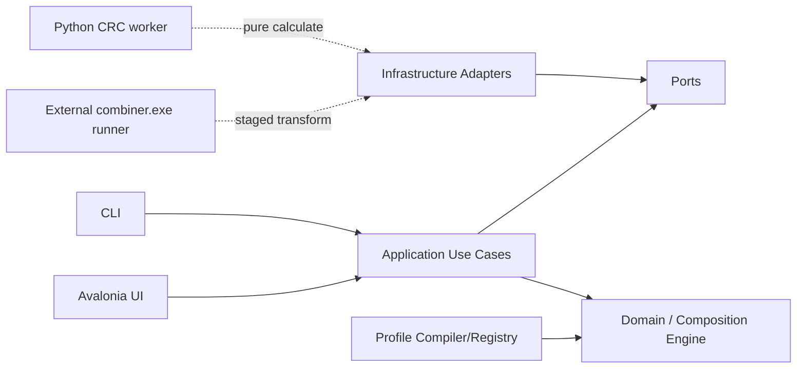

# NVT FW Combiner（NFC）實作規格

> 文件狀態：`0.9.10 performance-remediation stable release candidate`
> 文件版本：`0.9.10`
> 基準日期：`2026-07-19`
> 產品名稱：`NVT FW Combiner`
> 短名：`NFC`
> Repository：`Dennis40816/nvt_fw_combiner`
> 可見性：`Private`
> License：`MIT`（只涵蓋新 NFC 原創內容；`refcode/` 依個別來源與所有權處理）
> 本文件目的：鎖定產品、Composition 架構、資料契約、Codex 治理、CI/CD、里程碑與後續開發順序。

---

## 0. 文件使用原則

本文件 [`SPEC.md`](SPEC.md) 是 repository 內唯一的產品與高階工程規格來源。其他文件只補充特定範圍，不複製整份規格。

1. 架構決策寫入 `docs/adr/`；已核准 ADR 對其涵蓋議題優先。
2. 可執行契約以 JSON Schema、C#/Python 型別、測試、build properties 與 CI 為準。
3. root 與 nested `AGENTS.md` 只描述 agent 執行規則；不重複產品需求。
4. profile 與 golden regression 是 firmware 行為的可驗證依據；UI 顯示不能取代 byte-level 證據。
5. `refcode/` 是 immutable evidence，不可被 production project reference、編譯、執行或打包。
6. MIT scope 與 reference/third-party 邊界依 [`docs/governance/license-scope.md`](docs/governance/license-scope.md)。
7. Repository 名稱固定為 `nvt_fw_combiner`；solution/namespace 使用 `NvtFwCombiner`；產品 UI 使用 `NVT FW Combiner`。
8. `.NET SDK` 由 `global.json` pin，並由 `scripts/install-dotnet.ps1` / `.sh` 安裝。
9. `v0.1.0-dev.0` 是 init/bootstrap node；後續 tag 規則見 [`docs/governance/development-tags.md`](docs/governance/development-tags.md)。

本 baseline 不宣稱任何 IC 已達 production parity。Exact legacy `combiner.exe` version, invocation, fields, order, read ranges, write ranges, and golden evidence are supplied by the owner later. Codex must not infer CRC/header behavior from reference names alone.

## 0.1 Current owner priority

As of 2026-07-19, `0.9.10` completes the feature-frozen end-to-end performance and Change Report remediation candidate on stable `v0.9.9`. Automatic Build has one authoritative execution; Legacy Combiner keeps exact sequential commands while removing unevidenced intermediate full-image reads; report/history/inspection/editor paths are bounded; and typed progress plus a read-only Hex Diff keep the UI responsive and understandable. Firmware ranges, command semantics, golden verification, runtime availability, and product-support promotion remain separate evidence-gated concerns, so this release does not infer or promote unsupported IC shapes.

- AB Code architecture and evidence intake are reactivated. Executable AB behavior remains a separate R3 phase and no profile is promoted without its exact ranges, relocation fields, integrity contract, golden output, and firmware-owner approval.
- NT51919, NT51929, NT51932, NT51950, and NT51951 AB Merge must initialize from a full submitted DP_AB container before applying profile-declared TPA/TPB overlays. NT51919 may inherit the NT51929/NT51932 canonical AB facts only through owner-approved fact-scoped bindings and parity tests. This direction does not infer ranges, topology branches, CRC behavior, output sizes, or support promotion from Normal Merge.
- Firmware ranges, aliases, metadata locators, capability evidence, workflow profiles, and execution promotion must converge through the versioned family/profile bundle and one compiled composition boundary defined by ADR 0015. Migration preserves current promotion stages and blockers; map coverage never grants Build authority.
- Normal/Standard Merge includes NT51950 and NT51951 through the DP Perspective selected-container policy. Current owner golden cases are recorded; firmware-owner sign-off is still required before production promotion.
- CtrlRAM Replace requires legacy `combiner.exe` CRC/header recalculation after replacement. Combiner `1.13.0` is imported under `external-tools/legacy-combiner/1.13.0/` and is pinned by SHA-256 manifest.
- Owner-provided postbuild scripts are the behavioral truth for CtrlRAM Replace command order; mmap files explain offsets and sizes; TP Overview is the documentation baseline to correct when it conflicts with postbuild/mmap evidence.
- CtrlRAM postbuild command sequences must be generated as structured command/argv data and tested against the hsi Combiner guide, not assembled as one shell command string. NT51927 requires explicit single, 2IC, and 3IC Replace branches.
- FlashCode output naming uses the fixed `NT51xxx_FlashCode_DxxxxTxxxx_YYYYMMDD.bin` form and treats DP version as two contiguous bytes: main version byte followed by sub version byte. TP uses the validated FW version and FW sub-version bytes. The offsets are catalog-owned facts; UI must display decoded tokens or explicit unknown placeholders, never infer version bytes from file names.
- NT51950/NT51951 normal Merge and DP Replace should use the DP image as the base container and overlay/preserve the TP range. Standard Merge DP inputs are limited to the owner-confirmed DP Perspective sizes `0x40000`, `0x80000`, and `0x100000`; the Standard Merge output length follows the selected DP input length. DP Replace must derive its work length from the selected base firmware length, which must be one of `0x40000`, `0x80000`, or `0x100000`; never hard-code the maximum container as the base. The confirmed TP overlay range is `0x0A000-0x36FFF (len 0x2D000)`; `0x37000-0x37FFF (len 0x1000)` is customer info and must not be overwritten by the TP overlay.
- Other Standard Merge profiles extract only their declared DP source views. A DP artifact that
  reaches every required end offset may have an arbitrary total length; a non-map length is a report
  warning, not a build blocker. Every Standard Merge TP source must cover its declared views and be
  `<= 0x40000`; oversize is a build error. NT51950/NT51951 remain the exception because they paste a
  full DP container and require exact selected-map capacity.
- NT51917 follows NT51927. NT51919 follows NT51929. NT51928 non-NB follows NT51927, while NT51928 NB is a separate IC and must not inherit that profile unless explicitly approved.
- NT51930 currently has no `>13 IC` product target; map cascade to the `<=13 IC` DiffDLM branch (`0x2F200`, size `65024`) until owner data reactivates larger counts.
- FW Register ranges are first-class map evidence. REG Replace is represented as a pending capability over those regions, but remains without an executable profile or UI exposure until owner evidence is approved. Current executable Replace scope remains DP Replace, CtrlRAM Replace, and General Replace.
- Merge and Replace runs must produce a report modal after Preview/Build and persist run history. The report must show each operation step, input/output hashes, IC/IC-num context, normalized ranges, external Combiner command sequence, processor result, warnings, and final artifact path.
- Per-IC Merge/Replace flowcharts live in [`docs/architecture/ic-workflow-flowcharts.md`](docs/architecture/ic-workflow-flowcharts.md). Any change to built-in merge profiles, replace profiles, CtrlRAM postbuild catalog, 950/951 DP policy, or supported IC workflow matrix must update that reference in the same change.
- Real firmware golden evidence is still required before declaring end-to-end CtrlRAM Replace parity for a production IC profile.
- Replace UI must include an explicit IC num selector/input so users can bind the replace flow to the correct IC profile before region choices or processor readiness are shown. Profiles with only `single`/`cascade` choices should use text labels. Profiles with three or more concrete IC-count choices should use numeric selection, with room for an Other/custom option for future exceptions.

## 1. 背景與問題定義

目前有兩組重要 reference asset：

1. `ab_code_combiner` Python：具有 DP_AB、TPA、TPB 合併、TPB relocation、版本命名，以及部分 IC 的 CRC/header 線索。
2. `Dennis40816/NFCG` 私有 prototype：已驗證 profile-driven merge、logical view、operation、validation、preview/build、Excel/profile、hook、CLI/Web/Desktop 與 golden regression 概念。

新工具不是重寫單一 script，而是建立可擴充的 firmware image composition platform。架構鎖定：

- **Merge**：由指定容量與填充值建立 blank image，再從一或多個來源合成新 image。
- **Replace**：必須先載入完整 reference/base BIN，clone 成 mutable work image 後再修改。
- initializer 完成後，兩者共用同一個 `CompositionEngine`、planner、operation algebra、validation、processor pipeline、mutation report 與 atomic output writer。
- CRC/header processing is performed by approved external processors. Production CRC/header transforms may call versioned legacy `combiner.exe` tools such as `1.9` or `1.10`; the Python worker is only the current pure CRC calculation prototype and optional future adapter, not the sole production path.
- Every external transform receives only a host-created staging copy, such as `work.bin`, and host infrastructure must independently diff the result and reject changes outside declared write ranges.
- CRC/header applicability 以 `IC + mode + stage` 的 `IntegrityDisposition`、processor declaration、external tool binding 與 golden evidence 表達；`unknown` 絕不等同 `none`。

### 1.1 產品 Experience

Merge：

- `standard-merge`：固定 profile 的正常合併。Current priority covers normal DP/TP merge flows, including NT51930 flash-map evidence and NT51950/NT51951 DP Perspective golden cases, while support exposure remains gated by firmware-owner sign-off.
- `ab-merge`：固定 profile 的 A/B bank 合併、relocation 與 integrity stages。
- `general-merge`：一或多個 BIN，使用者以 memory map drag、mapping table 或精確手動輸入設定 source/target ranges。

Replace：

- `dp-replace`：DP whole 或 profile-declared partitions；LD replacement also belongs to DP Replace and may be modeled as a separate LD replacement BIN/slot from the DP BIN；不再提供獨立 TP persona replace 分類。
- `ctrlram-replace`：只操作 physical `owner = tp`、`kind = ctrlram` 的 named regions，或完全由
  這類 regions 組成的 approved groups。
- `general-replace`：required reference BIN 加上一或多個 replacement BIN；使用者自由建立多筆 explicit mappings，但仍受 protected ranges、alignment、overlap、processor dependency 與 Preview/Build validation 約束。Any mapping that touches a TP-classified range must compile with an approved legacy Combiner CRC/header refresh after the replacement mutation.
- `Hex Editor`（`0.9.0`）：由 Home 的 `Util Tools` 獨立入口開啟，是無 firmware 語意的 raw BIN 工具。它將最多 `0x800000` bytes 的來源讀取一次到私有記憶體，可 overwrite/fill、單筆或 bounded multi-byte insert、delete、undo/redo，並以確認後的 Save As 輸出新 BIN；不會讀取或修改 IC、profile、Flash Map、CRC、postbuild、General Replace 或 report。

Experience 只控制 catalog、UI authoring policy 與 profile compile constraints。Executor 不依 `experienceId` 寫 workflow-specific branch。

### 1.2 核心風險

真正風險是 address-space、range、offset basis、初始化來源、region ownership、atomicity、覆寫順序、processor authority、CRC/header 計算順序與 profile evolution。這些規則必須成為 typed domain model 與可驗證資料，不得散落在 UI handler、Python one-off script、legacy `combiner.exe` wrapper 或未受控 custom code。

## 2. 參考來源與整合定位

### 2.1 使用者提供的規格草案

原始規格已定義三個主要 workflow：Normal Merge、AB Code Merge、Replace，並要求 Settings、profile-driven memory model、preview、traceability 與 golden sample regression。

### 2.2 Standard merge Python reference

從 `Dennis40816/NFCG` 的 reference testdata 擷取唯一需要的 standard merge Python source snapshot：

```text
refcode/gen_flash_bin_v2/
```

定位：

- 作為 behavior evidence、golden parity 對照、range/offset 來源之一。
- 不作 production dependency。
- 不編譯、不執行、不打包。

### 2.3 AB combiner Python reference

從使用者提供與 `NFCG` reference testdata 擷取 AB combiner snapshot：

```text
refcode/ab_code_combiner/
```

定位：

- 作為 AB layout、TPB relocation、版本命名、既有 header/CRC 線索與 test evidence。
- 只在 reference/golden analysis 階段使用。
- Production runtime 以 C# CompositionEngine 與 approved external processor runners 執行。

### 2.4 不導入 TypeScript codebase

`flashcode` / `NFCG` TypeScript codebase 不放入 `refcode/`。可在文件中引用其 architectural lessons，但不得複製為 source snapshot，也不得在新 repo 形成 TS runtime dependency。

### 2.5 `refcode/` 最終允許內容

`refcode/` 只允許以下兩個 owner-approved Python evidence directories：

```text
gen_flash_bin_v2/
ab_code_combiner/
```

CI 必須拒絕未核准的頂層 snapshot、任何 `.ts/.tsx/.js`、firmware BIN、cache、venv 或 build output。IC FlashMap workbook/postbuild/mmap evidence belongs under `docs/references/ic-flashmap/`; approved runtime binaries belong under `external-tools/` and are pinned by manifest。

### 2.6 外部規範來源

Codex 與 agent governance 主要參考：

- OpenAI Codex `AGENTS.md` discovery 與 precedence。
- OpenAI Codex repository-scoped `.codex/config.toml`。
- OpenAI Agent Skills 與 `.agents/skills/<name>/SKILL.md`。
- `agents.md` 開放格式。
- `openai/codex`、`apache/airflow`、`temporalio/sdk-java` 的 AGENTS 實務。

原則不是複製任何大型 repository 的全部規則，而是抽取共同有效模式：可執行命令、明確邊界、就近覆寫、避免 context bloat、測試完成條件、reviewable change size 與安全禁區。

---

## 3. 產品目標

### 3.1 必須達成

1. 所有支援 IC/mode 的輸出可與核准 golden output byte-for-byte 相等。
2. 所有 range 使用明確的 half-open 語意 `[start, end)`，禁止混用 inclusive end。
3. Standard/AB/General Merge 與 DP/CtrlRAM/General Replace 共用同一套 composition primitives 與 executor。
4. Merge/Replace 的根本差異只由 `ImageInitialization` 表達：`blank` 或 `reference`。
5. UI、CLI、測試都呼叫同一個 application core；UI drag/drop 只建立 typed mappings，不直接修改 bytes。
6. 所有 byte mutation 都要有 operation id、operation provenance、來源/目標 address space、target range、原因、前後 hash 與 changed ranges。
7. External processors may transform only a host-created staging copy. The host owns executable resolution, SHA-256 verification, write-range policy, independent diff verification, and atomic promotion.
8. 每個 IC/mode/stage 都要明確宣告 integrity disposition、processor id、tool binding when applicable、read/write ranges and evidence；`unknown` 不得成為 supported profile。
9. production runtime 離線可用，不依賴網路、GitHub、系統 Python 或 package registry。
10. release 產物最小化、可重現、可驗證 SHA-256，且不含 private inputs、unmanifested firmware 或 generated firmware outputs；owner-approved golden fixture BINs may ship only under the manifest-declared `reference/` payload。
11. Codex 可從 root/nested AGENTS、repo skills、project config 與單一 verify command 得到一致規則；`polytail` 必須在完成與 review 前阻擋低品質 AI code。
12. 新增 IC/mode 時主要修改 profile、processor/tool declaration 與 golden test，不新增 one-off merge/replace script。規劃中的自動 IC 匯入只能產生待審核的 bundle 與驗證報告；不得從任意 BIN 推斷 range、CRC/header、alias 或 FW Config 規則，也不得自行提升 support/promotion。

### 3.2 品質目標

| 指標 | Beta Gate | 1.0 Gate |
| --- | ---: | ---: |
| Golden cases 通過率 | 100% 已宣告案例 | 100% 支援矩陣 |
| Domain/Application line coverage | ≥ 85% | ≥ 90% |
| External processor adapter coverage | ≥ 95% | ≥ 95% |
| Domain/Application branch coverage | ≥ 80% | ≥ 85% |
| 未處理 analyzer warning | 0 | 0 |
| 未說明的 output overlap | 0 | 0 |
| processor 範圍外寫入 | 0 | 0 |
| release smoke failure | 0 | 0 |
| P0/P1 known defects | 0 | 0 |

Coverage 不是正確性的替代品；golden regression、property test、contract test、architecture test、independent staging diff 與 human firmware review 同樣是 release gate。

### 3.3 非目標

第一階段不包含：

- Firmware compiler/linker。
- 線上 telemetry 或自動上傳 firmware。
- app 內任意 Python/script editor。
- 未受 schema 約束的 plugin marketplace。
- 將 Excel 當成 runtime merge engine。
- 允許 Python、`combiner.exe` 或任何 external processor 直接修改使用者原始 BIN、正式 output path 或 profile 未宣告的 range。
- 以「Custom」名義繞過 range、overlap、processor、golden 或 trace policy。

### 3.4 設計與交付流程

每個 feature、IC/mode 或 firmware semantic change 必須依序通過以下 stage；不得從 UI 直接跳到 byte mutation：

```text
Evidence inventory
  -> canonical memory/integrity/tool facts
  -> ADR/schema/profile proposal
  -> domain invariants and threat analysis
  -> synthetic/unit/property tests
  -> deterministic composition plan
  -> infrastructure/worker/tool adapter
  -> private golden parity
  -> UI/CLI rendering
  -> polytail audit
  -> package/security smoke
  -> human sign-off and release
```

| Stage | 主要輸入 | 必要輸出 | Gate |
| --- | --- | --- | --- |
| 1. Evidence | Python refs、legacy combiner versions、owner memory sheet、existing golden hashes | source/tool manifest、integrity matrix、uncertainty list | 來源/ownership 可追蹤 |
| 2. Canonical facts | legacy offsets、copy order、CRC/header facts | half-open range table、address space、atomicity、processor order | firmware owner review |
| 3. Contract design | facts + use case | ADR、JSON Schema/profile version、issue codes | architecture review |
| 4. Domain implementation | approved contract | immutable value objects、operation algebra、unit/property tests | architecture tests |
| 5. Orchestration | domain + ports | deterministic Preview/Build use cases、trace report | preview/build parity |
| 6. External adapters | port contracts | filesystem/process/profile/report/staging adapters | timeout/path/diff/security tests |
| 7. Parity | approved private vectors | byte equality、SHA-256、mutation report | golden sign-off |
| 8. Experience | stable application API | Avalonia/CLI flows、custom mapping editor、accessibility | UI/headless smoke |
| 9. Distribution | green protected CI | minimal package、SBOM、provenance、clean-machine smoke | release approval |

Change risk class：

- `R0`：純文件或無 runtime 影響的 tooling；1 位 reviewer。
- `R1`：一般 implementation，不變更 public/firmware contract；1 位 reviewer。
- `R2`：architecture、profile/schema、process protocol、tool manifest、dependency；至少 1 位 domain owner，必要時 ADR。
- `R3`：range/offset/patch/CRC/header/order/golden/security/release；2 位 human reviewers，必須有 byte-level evidence，禁止 agent auto-merge。

尚未確認的 firmware fact 不得以 placeholder 默默進 production profile；以 explicit `unknown` evidence state、open decision 或 unsupported catalog state保留。

## 4. 現有 `ab_code_combiner` 行為盤點

`ab_code_combiner` reference 的主要行為：

- output size：`0x80000`。
- B bank offset：`0x40000`。
- DP_AB source：`DP_AB/`，TPA source：`TPA/`，TPB source：`TPB/`。
- output 初始化：原 script 使用 `0x00`。
- DP_AB copy：複製到 output 起始。
- TPA copy：source `0x07000..0x40000` 到 target `0x07000..0x40000`。
- TPB relocation patch：`0x7164`、`0x7168`、`0x716C` little-endian u32 加 `0x40000`。
- TPB copy：source `0x07000..0x40000` 到 target `0x47000..0x80000`。
- version parsing：DP A/B offset `0x67/0x68`；reference TP FW version parsing used the last `NVT` + `T address - 0xFFF`.
- output naming：`{PROJECT_NAME}_Flashcode_A_{dpA}{tpA}_B_{dpB}{tpB}_{yyyyMMdd}.bin`。

### 4.1 必須 profile 化的 facts

| Fact | Profile / Contract location |
| --- | --- |
| output size | resolved firmware map capacity |
| fill byte | output/work `spaces[].initializer.fillByte` |
| DP_AB / split DP input mode | separate profile modes |
| logical views | `views[]` |
| copy order | `operations[].sequence` |
| TPB relocation | checked `transform-scalar` operations |
| CRC/header rewrite | `run-processor` + closed legacy-combiner stage and allowed views |
| output naming | `output` + metadata bindings/version extractors |
| expected compare policy | `validations[]` |

The reference's "last `NVT`" behavior is legacy evidence only. The canonical FWConfig Backup rule for
all executable profiles is exactly one complete `00 4E 56 54` marker, with the Backup start at its
terminal `T - 0xFFF`; zero or multiple markers fail closed.

### 4.2 Legacy combiner.exe CRC/Header path

Production CRC/header behavior may require multiple legacy `combiner.exe` versions. These are not modeled as Python worker source files and not as arbitrary user-selected commands.

Required model:

- v2 profile declares `run-processor` referencing a closed `legacy-combiner-v1` stage;
- the stage declares `toolBindingId`, registered `invocationProfileId`, read/write views, purpose,
  transform authority, integrity disposition, evidence, and fail-closed policy;
- tool manifest declares exact executable version, SHA-256, input mode, arguments, timeout, and platform;
- infrastructure materializes a host-owned temporary `work.bin`;
- legacy combiner reads/writes only inside the staging directory;
- host independently validates all resulting byte changes.

See [`docs/adr/0006-external-combiner-tool-runner.md`](docs/adr/0006-external-combiner-tool-runner.md), [`docs/contracts/external-combiner-tool-manifest-v1.md`](docs/contracts/external-combiner-tool-manifest-v1.md), and [`docs/architecture/external-combiner-tool-runner.md`](docs/architecture/external-combiner-tool-runner.md).

### 4.3 Known current reference risks

1. `patch_b_code` 直接修改輸入 `bytearray`；同一 instance 重跑會再次 relocation，非 idempotent。
2. CRC/header algorithm、legacy combiner version、read/write ranges、byte order 與 execution order 尚未形成完整 processor/tool contract。
3. Nullable CRC config 無法區分 `unknown`、`none`、verify-only 與 rewrite。
4. 若 external processor 直接取得使用者路徑，將繞過 operation trace、write-range policy 與 atomic output；必須改為 host-owned staging copy。
5. `version.py` 部分讀取缺少一致 bounds validation。
6. log 是 console text，缺少 machine-readable report 與 issue code。
7. output date 直接讀系統時間，測試必須額外控制 clock。
8. README/sample status 可能 drift；文件不可取代 executable evidence。
9. Standard/AB/Replace/General 若各自建立 executor，未來 IC 會產生平行語意與大規模重構。
10. external process timeout、relative-path confinement、symlink/reparse protection、stdout protocol、版本協商與 integrity check 尚未全部實作。

## 5. 技術選型

### 5.1 主程式

| 項目 | 選擇 | 規則 |
| --- | --- | --- |
| Language | C# | nullable、warnings as errors |
| Runtime | `.NET 10` LTS | `global.json` pin SDK patch；不跨 feature band |
| UI | Avalonia 12 | 首要 target Windows x64；保留跨平台能力 |
| UI pattern | MVVM | View 不含 composition/firmware semantics |
| DI/hosting | `Microsoft.Extensions.*` | Composition root 集中於 Bootstrap project |
| MVVM toolkit | `CommunityToolkit.Mvvm` | 不自製 notification framework |
| Serialization | `System.Text.Json` source generation | 禁止 dynamic JSON 作為 domain model |
| Tests | xUnit | 優先 hand-written fake，避免不必要 mocking framework |
| Architecture tests | ArchUnitNET 或等效 reflection test | 鎖定 dependency direction |
| Logging | structured logging provider | user log 與 machine report 分離 |

實際建庫時以 `global.json`、`Directory.Packages.props` 與 lock file 鎖定精確版本。

### 5.2 CRC/Header external processing

| Item | Baseline | Rule |
| --- | --- | --- |
| Production transform path | External processor runner | Supports approved legacy `combiner.exe` versions such as `1.9` and `1.10` |
| Pure CRC helper | `tools/crc-worker` Protocol 1.0 | stdin/stdout JSON calculation only |
| Tool manifest | JSON Schema | exact version string, executable name, SHA-256, argument template, timeout |
| Staging file | host-created `work.bin` | no user path, no original BIN mutation |
| Packaging | release manifest controlled | do not commit real executables unless owner explicitly approves |
| Test | fake combiner + golden fixtures | timeout/path/diff/security cases are mandatory |

The current Python worker is a constrained pure CRC calculation prototype. It is not the sole production CRC/Header system. Production rewrite behavior must go through the external processor/tool runner and host-side independent diff verification.

`polytail` 已正式定義為 repository skill：`.agents/skills/polytail/SKILL.md`。它用來防止 AI 產生 architecture drift、duplicate logic、fake tests、placeholder、silent error、broad suppression 與不可 review 的 code；不是第三方同名 package，也不是 Pylint 的別名。

### 5.3 Profile 與契約格式

- Current compatibility loader：JSON `composition-profile-v1`；accepted target authority is trusted
  `firmware-family-v1` + `composition-profile-v2` + `profile-bundle-v1`. V1 becomes migration
  evidence only after v2 production loading and parity gates pass.
- Schema：JSON Schema Draft 2020-12。
- Human authoring：第一階段直接編輯 JSON；後續可加入 Excel importer/compiler。
- Automated IC intake（規劃於 0.9.4）：輸入必須是宣告完整的 IC intake manifest 與其檔案；輸出只能是 candidate bundle、materialization/validation report 與待補 evidence 清單。它不得成為 runtime source of truth，不得掃描未宣告的目錄、網路或使用者 BIN，也不得直接變更已核准 profile、support catalog 或 promotion。
- General Merge / General Replace：UI 或 CLI 產生 typed mapping overlay，可保存成 versioned saved rule/profile fragment；不得產生 script、shell command 或 executable path。Saved-rule validation and General Merge CLI consumption must still compile back to normal explicit mappings.
- Processor/tool recipe：JSON/typed declaration，與 memory mapping 分離但由 profile 明確引用。
- Reports：JSON；UI 顯示由 typed report 轉換。
- Spec/ADR/guide：Markdown。
- CSV/Excel：只作 import/export，不作 runtime source of truth。

## 6. 架構風格

採用 Clean Architecture + Ports and Adapters；核心是單一 `CompositionEngine`。



### 6.1 Dependency direction

```text
NvtFwCombiner.Domain
  <- NvtFwCombiner.Contracts
  <- NvtFwCombiner.Application
  <- NvtFwCombiner.Infrastructure
  <- NvtFwCombiner.Presentation.Avalonia
  <- NvtFwCombiner.Cli
  <- NvtFwCombiner.Bootstrap
```

規則：

- `Domain` 不依賴 filesystem、process、UI、JSON serializer、Avalonia 或 logging implementation。
- `Application` 只依賴 Domain、Contracts 與 ports。
- `Infrastructure` 實作 filesystem、profile loading、report writer、staging workspace、external process、clock、hashing、diff verification。
- `Presentation`/`Cli` 只建立 typed request，不自行解讀或修改 firmware offsets。
- `Bootstrap` 是唯一 composition root。
- `refcode` 不可被任何 project reference。
- 不建立 `MergeExecutor`、`ReplaceExecutor`、`CustomExecutor` 三套 mutation engine；workflow family 只影響 initialization、catalog 與 UI convenience。

### 6.2 專案分層責任

| Project | 責任 | 禁止內容 |
| --- | --- | --- |
| `NvtFwCombiner.Domain` | range、address spaces、regions、operation algebra、plan、issue、trace | I/O、process、Avalonia |
| `NvtFwCombiner.Contracts` | serializable profile/request/report/protocol/tool DTO | composition execution |
| `NvtFwCombiner.Application` | preview/build orchestration、policy、ports、diff verdict | UI、direct filesystem/process |
| `NvtFwCombiner.Infrastructure` | file/profile/report/process/staging/tool adapters | 重複 firmware semantics |
| `NvtFwCombiner.Profiles` | schema compiler、built-in profiles、catalog | UI-specific behavior |
| `NvtFwCombiner.Presentation.Avalonia` | Views、ViewModels、mapping editor、state rendering | byte mutation |
| `NvtFwCombiner.Cli` | automation surface | 另一套 executor |
| `NvtFwCombiner.Bootstrap` | DI、startup、settings wiring | firmware rules |

### 6.3 Architecture test 必須驗證

- Domain 不 reference 其他 NFC project。
- Application 不 reference Infrastructure/Presentation/Avalonia。
- Infrastructure 不 reference Presentation。
- ViewModel 不直接使用 `File.*`、`Process.*` 或 binary mutation helper。
- 所有 workflow 都依賴同一 `ICompositionEngine`/use case。
- 所有 external processor invocation 都有 declared read/write ranges、target address space、tool binding when applicable。
- External processor adapter 不可接收 user-selected arbitrary executable/path。
- 所有 public application use case 回傳 structured result，不直接寫 console。

## 7. 核心 Domain Model

完整 variable catalog 見 [`docs/architecture/canonical-variable-model.md`](docs/architecture/canonical-variable-model.md)。核心模型刻意把「如何建立 image」、「使用者是誰」與「UI 有多少自由度」拆成正交維度。

### 7.1 Stable typed primitives

```text
ByteRange
  start
  length
  endExclusive

AddressSpace
  id
  kind: input-artifact | work-buffer | output-image
  capacity: resolved-map | fixed

MutableSpaceInitialization
  kind: blank | clone
  fillByte?
  sourceSlotId?

FirmwareRegion
  regionId
  parentRegionId?
  addressSpaceId
  range
  owner
  kind
  writeConstraint
  alignment

LogicalView
  viewId
  spaceId
  map region, region slice, or space-relative range

CompositionOperation
  operationId
  sequence
  kind: copy-range | replace-range | fill-range | patch-scalar |
        transform-scalar | run-processor
  sourceViewId?
  targetViewId?
  overlapPolicy
  reason

ProcessorStage
  kind: crc-worker-v1 | legacy-combiner-v1
  authority / integrityDisposition
  purpose
  allowedReadViewIds[] / allowedWriteViewIds[]
  registered calculation set OR trusted tool binding + invocation profile
  failurePolicy
```

### 7.2 Profile top-level model

```text
CompositionProfile
  schemaVersion: 2.0
  profileId
  profileVersion
  promotion
  compositionKind
  experience
  mapBinding
  inputSlots[]
  spaces[]
  views[]
  metadataBindings[]
  regionAccessRules[]
  operations[]
  validations[]
  processorStages[]
  output
  evidenceRefs[]

CompositionRequest
  runId
  compiledComposition
  immutableInputBindings{}
  outputOptions
  previewToken?

CompositionPlan
  initialization
  orderedOperations[]
  occupancySegments[]
  processorInvocations[]
  validations[]

CompositionResult
  status
  outputBytes/hash/name
  versionTokens[]
  issues[]
  mutations[]
  report
```

### 7.3 Address spaces and ownership

| Address space | Mutable | Owner |
| --- | --- | --- |
| `input-artifact` | No | artifact loader |
| `work-buffer` | Yes | one execution run |
| `output-image` | Yes | one execution run |
| `worker-staging-file` | Yes, isolated | infrastructure adapter |

Every range names its address space. Original input and reference base are immutable.

### 7.4 Canonical region classification

```text
FirmwareRegion
  regionId
  parentRegionId?
  addressSpaceId
  owner                     // system, dp, tp, ldc, register, customer, ...
  kind                      // code, header, command, ctrlram, customer-information, ...
  range
  writeConstraint: forbidden | whole-region | declared-subregions | explicit-range
  alignment
```

Experience-specific access is separate：

```text
RegionAccessRule
  regionId or approved selector
  access: hidden | read-only | whole | parts | explicit-range
  allowedPartIds[]
  reason
```

This avoids duplicating memory maps for DP/CtrlRAM/General Replace while keeping each UI constrained.

### 7.5 Detailed Authoring and Operation Rules

The supported Replace/Merge authoring policies, operation algebra, integrity authority, and range invariants are maintained in [Experience and Operation Rules](docs/specs/experience-and-operation-rules.md). This includes the ADR 0014 raw-BIN Hex Editor exception.

## 8. Profile Schema

The accepted target contracts are [firmware-family-v1](docs/contracts/firmware-family-v1.md),
[composition-profile-v2](docs/contracts/composition-profile-v2.md), and
[profile-bundle-v1](docs/contracts/profile-bundle-v1.md). The current v1 loader remains a compatibility
boundary until trusted loading and byte/name/trace parity pass. Product-level expectations are in
[Profile Schema Summary](docs/specs/profile-schema.md).

## 9. External Processor Protocols

The canonical CRC worker contracts are [Protocol 1](docs/contracts/crc-worker-v1.md) and the [staged transform draft](docs/contracts/crc-worker-transform-v2-draft.md). The product safety rules, host boundary, and acceptance expectations are in [External Processor Protocols](docs/specs/external-processor-protocols.md).

## 10. Unified Composition Pipeline

### 10.1 Shared stages

```text
Load profile and IC definition
→ bind artifacts
→ validate experience access and inputs
→ initialize blank/reference image
→ compile deterministic plan
→ execute ordered operations
→ run approved processors/tools
→ validate mutations and integrity
→ generate report/name/hash
→ atomically commit output
```

Preview executes through plan/validation and processor dry-run capability where available, but does not commit output.

### 10.2 Merge vs Replace

| Dimension | Merge | Replace |
| --- | --- | --- |
| `compositionKind` | `merge` | `replace` |
| initialization | blank capacity + fill byte | immutable reference BIN clone |
| required base | none | exactly one reference base |
| normal mutation | copy/fill/patch/process | replace/copy/patch/process |
| common engine | yes | yes |

### 10.2.1 Input size mismatch, padding, and truncation

Profile address spaces declare the expected input length used by range validation. A supplied BIN shorter than the declared address-space length is accepted only when the profile explicitly declares an input padding byte for that immutable source/replacement address space and the profile has no CRC/header/processor dependency. Runtime/request address spaces cannot declare padding or truncation policy. The engine pads only the transient execution buffer before copy/replace operations run; source BIN files are never modified. Unapproved oversized input still fails closed.

DP-only Replace flows that do not require CRC/header recalculation may use profile-declared padding.
CtrlRAM Replace flows cannot declare input padding for shorter input. Because owner evidence shows
CtrlRAM BINs commonly exceed the declared memory size, `ctrlram-replace` profiles may instead declare
oversized-input truncation on immutable CtrlRAM replacement/source spaces only when every affected
target resolves to a physical region with `owner = tp` and `kind = ctrlram`. Truncation keeps the
leading declared bytes, discards trailing bytes, and emits an
`input.address-space.truncated` report diagnostic so UI/CLI can show a prompt.

For reference-initialized Replace, the reference/base firmware address space must always be exact length and cannot declare input padding or truncation. Mutable work buffers also cannot declare input padding or truncation. Padding and truncation apply only to eligible immutable replacement source address spaces.

Preview and build reports must preserve the actual supplied input size and hash. Reports should also make padded/truncated byte counts visible once the report schema grows dedicated fields; until then, truncation uses a structured report issue.

### 10.3 Standard Merge

Fixed profile inputs and mappings. The user selects IC/mode and BINs; profile owns ranges, output naming and post-processing.

### 10.4 AB Merge

Fixed A/B bank model with explicit logical views, TPA/TPB work buffers, target banks, checked scalar
relocation, integrity stages, and comparisons. DP_AB and split DPA/DPB are distinct profile shapes,
not runtime guessing. The shared architecture is active; executable AB profiles remain R3-gated by
owner ranges, Combiner 1.13 B-code behavior, and golden evidence.

### 10.5 General Merge

General Merge is an advanced authoring surface, not a separate executor. User rows compile to
checked `copy-range` operations; fixed profile stages may add the other closed primitives. Dragging a
range in UI is equivalent to editing typed mapping data. Reviewed saved-rule fragments still compile
through the same profile/compiler/engine and report `saved-rule` provenance.

### 10.6 Replace experiences

- DP Replace：DP-focused; DP whole/declared-part access only. LD replacement is included in this experience and may be supplied as its own LD BIN。
- CtrlRAM Replace：只允許 physical `owner = tp`、`kind = ctrlram` regions 或完全由它們組成的
  approved groups。
- General：explicit mapping inside profile-approved envelope。

Current Replace implementation priority is DP Replace and CtrlRAM Replace workflows. CtrlRAM postbuild command core is implemented from IC FlashMap postbuild evidence for NT51917, NT51919, NT51920, NT51923, NT51926, NT51927, NT51928 non-NB, NT51929, NT51930, NT51931, NT51932, NT51950, and NT51951, including NT51917/NT51927/NT51928 single/2IC/3IC branches. NT51919 and NT51929 follow the NT51932 reference flow; NT51951 follows the NT51950 reference flow. Remaining production work is profile wiring, UI/report/history integration, and golden replace outputs.

### 10.7 Dev0 C# implementation milestone

`0.1.0-dev.0` implementation work starts with small, testable C# primitives:

1. `ByteRange` half-open range invariant。
2. `ByteDiff` compact changed-range detection。
3. `ChangedRangePolicy` for allowed write-range verdict。
4. `ExternalCombinerToolManifest` DTO and manifest validator。
5. Tests for range semantics, diff behavior, combiner version string handling, and manifest rejection cases。

The milestone intentionally does not claim real firmware copy/replace parity until owner-approved IC facts and golden evidence exist.

## 11. UI 設計

Initial UI shell must expose the workflow taxonomy without embedding firmware rules. Actual firmware operations are introduced after application core stabilizes.

### 11.1 Top-level navigation

Top-level navigation uses top tabs.

- Settings：profile/catalog/tool folders, strictness, theme, diagnostics entry。
- Merge。
- Replace。

Reports and diagnostics are secondary surfaces. Preview/Build reports and diagnostics open in a report modal; Settings may expose diagnostics configuration/export. Saved Rules is hidden in the first UI release until the saved-rule workflow is implemented and reviewed. CLI saved-rule validation and General Merge rule consumption do not create a first-level Saved Rules navigation entry. These surfaces are not first-level navigation entries unless explicitly expanded by the owner.

### 11.2 Merge page

 Must support Standard, AB, and General at the product taxonomy level, but current implementation priority is Standard/normal Merge. AB UI implementation is deferred. General mode provides mapping table + optional visual memory map editor. Every UI edit compiles to typed mapping override. Merge uses slot cards for firmware inputs and the same fixed-position Memory coverage before/after area as Replace. Memory coverage is visual-first; tables are supporting detail. NT51950 and NT51951 normal Merge profiles accept only DP sizes `0x40000`, `0x80000`, and `0x100000`, produce the selected DP length, and use the confirmed TP overlay range `0x0A000-0x36FFF (len 0x2D000)`.

### 11.3 Replace page

Replace page groups experiences by user mental model：

- DP Replace。
- CtrlRAM Replace。
- General Replace。

The UI must make atomicity visible: whole-only, declared-parts, or explicit-range. Replace uses slot cards for firmware inputs and the same fixed-position Memory coverage before/after area as Merge. DP Replace slot cards must allow profile-declared DP and LD payloads to be separate files when the profile requires it. Memory coverage is visual-first; tables are supporting detail. Replace must expose an explicit IC num selector/input before profile regions and processor readiness are shown. Current implementation priority is DP Replace and CtrlRAM Replace workflows. IC num mode is profile-declared: two-option profiles use text choices such as `single` and `cascade`; three-or-more concrete IC-count profiles use numeric count selection with future room for Other/custom exceptions.

### 11.4 Preview/Build separation

Build automatically runs the same validation path as Preview before committing output. Build remains disabled only when required UI inputs are missing; profile compile, input validation, range policy, processor/tool readiness, and integrity disposition failures must produce a Preview/Build report instead of relying on a stale manual Preview gate.

Preview/Build reports and diagnostics open in a report modal after the action completes or fails; they are not first-level pages. The UI must be structured for bilingual English/Chinese text resources rather than hard-coded display strings. The initial default language is English.

While Preview or Build is active, the shell shows one accessible typed lifecycle stepper and a
restrained indeterminate activity bar beside the selected IC/mode context. The current Application-
owned step and lifecycle ordinal are visible; it must not invent percentage completion when the
composition/external-tool contracts do not expose byte-level progress. A reduced-motion preference
keeps the same static step and accessible live status while removing the indeterminate animation.
CtrlRAM Replace remains one logical run across validation, replacement, and the approved Postbuild
sequence; approved external processes execute headlessly and never open user-visible console windows.

### 11.5 Typography and localization defaults

- Initial default language: English. Traditional Chinese is supported through the same text-resource architecture, not through duplicated XAML or ViewModel strings.
- Latin/English UI text: Inter. It is the primary app font because it is already bundled through `Avalonia.Fonts.Inter`, reads clearly in dense controls, and keeps numeric labels stable.
- Traditional Chinese UI text: Microsoft JhengHei UI on Windows, with Noto Sans CJK TC and Noto Sans TC as fallback families. This keeps CJK text clear in compact tool surfaces and avoids decorative display fonts.
- Technical fixed-width content such as addresses, hex bytes, CRC values, hashes, and terminal snippets should use Cascadia Mono, then Consolas as fallback.
- The general UI font stack is `fonts:Inter#Inter, Microsoft JhengHei UI, Noto Sans CJK TC, Noto Sans TC, Segoe UI` in Avalonia. Do not introduce additional decorative fonts in the product UI without owner approval.

## 12. Versioning, branching, and review

- `main` is the stable branch. Code progresses to `main` only through reviewed merge/PR。
- `0.1.0` is a development branch for bootstrap/core work。
- `v0.1.0-dev.0` is a bootstrap node tag, not a user release。
- Stable release tags use `vX.Y.Z` only。
- Risk class `R3` changes require human firmware review and byte evidence。

The owner requested review participation. Assistant/Codex review should focus on architecture boundaries, contract drift, fake tests, unsafe process execution, accidental original BIN mutation, and unsupported CRC/Header assumptions.

## 13. Dev0 Done Criteria

`0.1.0-dev.0` is acceptable when:

- Repository structure, AGENTS, skills, CI, installer scripts and release skeleton exist。
- Solution builds with pinned .NET 10 SDK。
- Avalonia shell and CLI doctor run。
- CRC worker Protocol 1 tests pass。
- Domain range/diff policy tests pass。
- External combiner runner contract and validator tests exist。
- No source file treats `combiner.exe` version as float。
- No production code references `refcode`。
- `python scripts/verify.py --all` passes in CI or equivalent environment。

## 14. Next Milestones

- `0.1.x–0.5.0`：bootstrap, composition core, Standard Merge parity, and DP/CtrlRAM Replace beta。
- `0.6.0–0.7.0`：unified workflow data model, General Merge/Replace, saved rules, and deferred AB work only after owner reactivation。
- `0.8.0`：packaging/performance。
- `0.9.0`：stable Util Tools raw-BIN Hex Editor milestone；後續 UAT 修正進入 `0.9.x`。
- `1.0.0`：signed-off support matrix。
