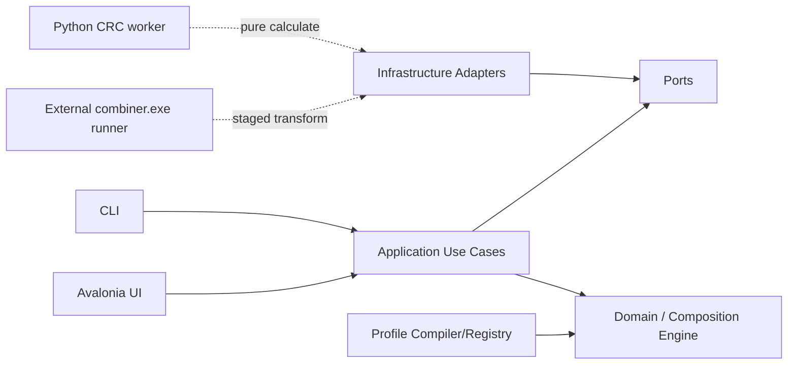

# NVT FW Combiner（NFC）實作規格

> 文件狀態：`0.10.0 maintainability-program planning release; v0.9.16 is the stable predecessor`
> 文件版本：`0.10.0`
> 基準日期：`2026-07-25`
> 產品名稱：`NVT FW Combiner`
> 短名：`NFC`
> Repository：`Dennis40816/nvt_fw_combiner`
> 可見性：`Public`（owner 於 2026-07-22 決定維持至 stable `v1.0.0` 完成；其後改為 `Private`）
> License：`MIT`（只涵蓋新 NFC 原創內容；`refcode/` 依個別來源與所有權處理）
> 本文件目的：鎖定產品、Composition 架構、資料契約、Codex 治理、CI/CD、里程碑與後續開發順序。

---

## 0. 文件使用原則

本文件 [`SPEC.md`](SPEC.md) 是 repository 內唯一的產品與高階工程規格來源。其他文件只補充特定範圍，不複製整份規格。

1. 架構決策寫入 `docs/adr/`；已核准 ADR 對其涵蓋議題優先。
2. 可執行契約以 JSON Schema、C#/Python 型別、測試、build properties 與 CI 為準。
3. root 與 nested `AGENTS.md` 只描述 agent 執行規則；不重複產品需求。
4. profile 與 golden regression 是 firmware 行為的可驗證依據；UI 顯示不能取代 byte-level 證據。
5. `refcode/` 是 immutable evidence，不可被 production project reference、編譯、執行或打包。
6. MIT scope 與 reference/third-party 邊界依 [`docs/governance/license-scope.md`](docs/governance/license-scope.md)。
7. Repository 名稱固定為 `nvt_fw_combiner`；solution/namespace 使用 `NvtFwCombiner`；產品 UI 使用 `NVT FW Combiner`。
8. `.NET SDK` 由 `global.json` pin，並由 `scripts/install-dotnet.ps1` / `.sh` 安裝。
9. `v0.1.0-dev.0` 是 init/bootstrap node；後續 tag 規則見 [`docs/governance/development-tags.md`](docs/governance/development-tags.md)。

本 baseline 不宣稱任何 IC 已達 production parity。Exact legacy `combiner.exe` version, invocation, fields, order, read ranges, write ranges, and golden evidence are supplied by the owner later. Codex must not infer CRC/header behavior from reference names alone.

## 0.1 Current owner priority

`0.9.16` is a focused hot-fix source derived from official `v0.9.15` peeled commit `008333a9c96ea65454a334824d349f3574373edd`. It authorizes only profile-classified Header/Header Copy and topology-applicable CtrlRAM/DLM CRC writes, corrects AB/Replace presentation state, and skips DP-only metadata inspection for TP firmware. Single-IC routes explicitly exclude cascade-only DiffDLM/DLM CRC words. Owner-supplied NT51929 single Normal CtrlRAM evidence locks the production route to four Header/Header Copy CRC words without promoting runtime support or release redistribution of the private evidence. The `0.9.15` AB function state and its certification debt otherwise remain unchanged. `0.10.0` owns architecture, terminology, evidence inventory, process, validation standards, and ticket dependency planning only. The later `0.10.x` sequence owns the dependency-allocated Support Matrix, error/report experience, clean-Windows UI-smoke closure, release-workflow annotated-tag newline hardening, and production-maintainability slices. The canonical future sequence is [NFC Roadmap](docs/architecture/nfc_roadmap.md). Publication is permitted only after independent review, firmware-owner approval, protected CI, package verification, and release-owner approval; an omitted external gate must remain explicit rather than being described as passing.

- `v0.9.11` is the accepted predecessor for `0.9.12`; no older performance or reconstruction branch may replace that lineage.
- NT51928 non-NB reuses NT51927 TP/CtrlRAM single/2-chip/3-chip authority inside a distinct 512 KiB image, while DP Replace independently requires DP `[0x3C000,0x40000)` and LDC `[0x40000,0x62000)`. NT51928 NB remains excluded.
- The approved `0.10.x` NT51950/NT51951 target exposes single and the
  owner-confirmed exact
  2-IC Cascade CtrlRAM plan with identical TP offsets. The Cascade record starts
  at `0x33200`, uses stride `0x1400`, writes only Diff CtrlRAM
  `[+0x000,+0x910)`, and preserves Diff NF `[+0x910,+0x1400)` from the
  immutable reference. The legacy outer envelope `[0x33200,0x34600)` is one
  complete record, not contiguous AE write authority. Their 256/512 KiB
  container capacities remain distinct, LDC is packaged inside DP, and AB stays
  separate.
- Common FW starts at `1.0.0`. NT51926 alone has two current runtime intervals; one-profile ICs do not block on missing or future informational version values. PID never selects a route.
- In the pre-retirement compatibility runtime, NT51930 exposes only single and
  `2–13`, while NT51927/NT51928 expose only single/2/3. The `0.10.x` target
  does not migrate NT51930; #221 removes it. For every admitted route, a decoded
  FWConfig chip count may cross-check the chosen plan and may require
  confirmation, but never silently chooses family or creates a plan.

- `v0.9.10` (`b0266f312a67d644475731153b1af82f7eadcc95`) is the only accepted predecessor for `0.9.11`. The premature `0.9.11.10` lineage is recovery evidence only and cannot be merged or released as-is.
- The measured startup lifecycle opens a meaningful Home screen first, warms immutable catalog projections on a worker thread, then materializes common page visual trees at background dispatcher priority. Warm-up cannot navigate, read user firmware, mutate a profile, launch an external processor, select support, or acquire Build authority.
- Main EXE at or below 70,000,000 bytes is a soft optimization target. Main EXE and complete release ZIP at or below 80,000,000 bytes are hard candidate ceilings; required safety, profiles, processors, evidence, accessibility, and self-contained runtime content cannot be removed to meet them.

- Post-commit background report preparation is an explicit `0.9.10` requirement. A successful Build publishes the atomically committed output identity as soon as the BIN is usable, while complete JSON, Hex Diff, and history projection continue off the dispatcher. Preview and uncommitted failures publish no artifact, and the run retains command ownership until the complete report is ready.

- AB Code architecture was re-admitted under ADR 0032 in `v0.9.14`. The `0.9.15` release scope exposes only the declared NT51919/NT51929/NT51932, NT51950 `1 IC`/`Cascade`, and selector-free NT51951 function-open profiles through the shared Application boundary. Typed profile authority, exact ranges, relocation/integrity contracts, direct golden evidence, and firmware-owner approval still gate support certification and release; metadata cannot admit, select, or promote a route.
- NT51919, NT51929, NT51932, NT51950, and NT51951 AB Merge must initialize from a full submitted DP_AB container before applying profile-declared TPA/TPB overlays. NT51919/NT51929/NT51932 consume one owner-declared perfect-like-family firmware definition; requested-member evidence and publication remain explicit. This direction does not infer NT51950/NT51951 ranges, topology branches, CRC behavior, output sizes, or support promotion from Normal Merge.
- The first `v0.9.14` AB pilot treats NT51919/NT51929/NT51932 as one owner-confirmed perfect-like family whose AB layout is version-independent and whose route does not depend on IC Number. Its required/expected 512 KiB DP_AB execution span exposes DP1 `[0x00000,0x40000)` and DP2 `[0x40000,0x80000)`; both banks reuse the same IC-owned three-byte CMI DP layout through separate typed views. TPA and TPB have independent required/expected 256 KiB execution spans, may use the same or different firmware versions, and must each expose its own decoded TP version. Version metadata is informational and cannot select or reject the route; unreadable metadata displays `Unknown` plus a non-blocking warning. A shorter input remains Build-blocking because it does not cover the compiled required end. An oversized input is accepted only through the profile-declared declared-prefix policy, emits a warning, preserves its actual identity in the report, and ignores trailing bytes without mutating the source.
- Firmware ranges, aliases, metadata locators, capability evidence, workflow profiles, and execution promotion must converge through the versioned family/profile bundle and one compiled composition boundary defined by ADR 0015. Migration preserves current promotion stages and blockers; map coverage never grants Build authority.
- Normal/Standard Merge includes NT51950 and NT51951 through the DP Perspective selected-container policy. Current owner golden cases are recorded; firmware-owner sign-off is still required before production promotion.
- CtrlRAM Replace requires legacy `combiner.exe` CRC/header recalculation after replacement. Combiner `1.13.0` is imported under `external-tools/legacy-combiner/1.13.0/` and is pinned by SHA-256 manifest.
- Owner-provided postbuild scripts are the behavioral truth for CtrlRAM Replace command order; mmap files explain offsets and sizes; TP Overview is the documentation baseline to correct when it conflicts with postbuild/mmap evidence.
- CtrlRAM postbuild command sequences must be generated as structured command/argv data and tested against the hsi Combiner guide, not assembled as one shell command string. NT51927 requires explicit single, 2IC, and 3IC Replace branches.
- Output naming is profile-owned and resolves the selected canonical IC plus accepted execution snapshots. AB follows ADR 0036's `NT519xx_FlashCode_A_DmmmmTvvvv_B_DmmmmTvvvv_yyyyMMdd.bin` form; its DP tokens use CMI Reg16h-18h facts and its TP tokens use validated FW version/sub-version bytes. Every mode uses the one UTC run-start date and the effective user override as its public output/report identity. An existing output may be atomically replaced only when it is not any selected input path. UI never infers version bytes from file names.
- NT51950/NT51951 normal Merge and DP Replace should use the DP image as the base container and overlay/preserve the TP range. Standard Merge DP inputs are limited to the owner-confirmed DP Perspective sizes `0x40000`, `0x80000`, and `0x100000`; the Standard Merge output length follows the selected DP input length. DP Replace must derive its work length from the selected base firmware length, which must be one of `0x40000`, `0x80000`, or `0x100000`; never hard-code the maximum container as the base. The confirmed TP overlay range is `0x0A000-0x36FFF (len 0x2D000)`; `0x37000-0x37FFF (len 0x1000)` is customer info and must not be overwritten by the TP overlay.
- Other Standard Merge profiles extract only their declared DP source views. A DP artifact that
  reaches every required end offset may have an arbitrary total length; a non-map length is a report
  warning, not a build blocker. Every Standard Merge TP source must cover its declared views and be
  `<= 0x40000`; oversize is a build error. NT51950/NT51951 remain the exception because they paste a
  full DP container and require exact selected-map capacity.
- NT51917 follows NT51927. NT51919 follows NT51929. NT51928 non-NB follows NT51927, while NT51928 NB is a separate IC and must not inherit that profile unless explicitly approved.
- The pre-retirement compatibility runtime has a trusted V2 DP Replace route
  for all 13 formerly selectable ICs. The `0.10.x` target retains only the
  non-retired profile set; #221 removes NT51920/NT51925/NT51930/NT51931 rather
  than migrating those routes. Retained Gen Flash routes clone an exact same-IC
  Standard/Normal Reference FlashCode and replace only the canonical DP
  partition; NT51928 non-NB additionally requires a separate full
  FlashCode-shaped LDC input for `[0x40000, 0x62000)`, distinct from DP
  `[0x3C000, 0x40000)`. Authoring availability does not by itself grant a public
  support claim.
- NT51920, NT51925, NT51930, and NT51931 are retired from the `0.10.x`
  production capability set by the owner-approved retirement contract. Their
  former DiffDLM ranges remain historical evidence only and cannot be migrated,
  inferred, or exposed by a compatibility fallback.
- The approved `0.10.x` DiffDLM Replace target treats an AE-provided DiffDLM
  artifact as full-stride records
  whose NF tails may contain invalid uniform filler, never as a contiguous
  replacement for an interleaved target envelope. Every DiffDLM declaration
  must bind both its writable DLM subranges
  and its preservation-mask subranges; the non-overlapping union must exactly
  cover each declared target record. A missing, `unknown`, overlapping, or
  incomplete preservation mask makes the route unavailable and cannot compile
  or Build. The compiled plan must scatter each declared source record only
  into its IC-owned Diff DLM subrange and preserve every masked byte from the
  immutable reference; source NF bytes are never mutation authority.
  NT51919/NT51929/NT51932 share the first owner-confirmed geometry: both source
  and target records have stride `0x1400`, Diff DLM
  `[recordBase, recordBase + 0x0B90)`, and preserved Diff NF
  `[recordBase + 0x0B90, recordBase + 0x1400)`. Cascade IC Count `N` requires
  exactly `N - 1` active DLM subranges, and every required `0x0B90` source
  subrange must contain more than one distinct byte; validation covers all
  required records, not only the first. With target record zero at
  `diffBase`, the active DiffDLM envelope is
  `[diffBase, diffBase + (N - 1) * 0x1400)`. Bytes in AE records after that
  active source prefix are inactive dummy content: they are not copied, do not
  gain mutation authority, and cannot enlarge the compiled DiffDLM source/read
  or scatter/write set. Every inactive target record remains byte-identical to
  the immutable reference except for a separately declared postbuild write.
  Only the NT51919/NT51929/NT51932 and NT51950/NT51951 families currently have
  owner-confirmed Cascade DiffDLM records containing a preserved Diff NF
  subrange. Those Cascade authoring routes must hide the independent NF CtrlRAM
  selector. This is an authoring safeguard, not removal of postbuild NF
  processing: the declared postbuild `NF_Ctrlram.bin` argument/stage remains
  active and must use its profile-resolved, non-user-selected staged source. No
  hidden or stale UI selection may feed it. Their Single plans, other IC
  families, and other non-Diff-NF plans retain their declared NF selector
  behavior. Future user-selectable NF0/NF1/... authoring and `DiffNFMerge.exe`
  remain separately owner-gated.
  The NT51919/NT51929/NT51932 pattern is named **Dynamic DiffDLM**:
  postbuild—not Replace scatter—owns
  placement of the FWConfig Backup. The runtime expected Backup start is
  `AlignUp(diffBase + (N - 1) * 0x1400, 0x1000)`. After an attempted
  Preview/Build, the host locates the unique NVT Backup and compares its actual
  start with that expected address. A different actual address inside the
  profile-declared bounded Backup-placement authority produces a Build Report
  warning; a missing/ambiguous Backup, out-of-bounds placement, or processor
  mutation outside declared authority still fails closed. Alignment never
  infers the Backup length, source range, or processor write envelope.
  NT51950/NT51951 use the same active-record/NF-preservation mechanism, but are
  **fixed-layout DiffDLM**, not Dynamic DiffDLM. Their independent geometry is
  target record zero `0x33200`, stride `0x1400`, writable Diff CtrlRAM
  `[+0x000,+0x910)`, and preserved Diff NF `[+0x910,+0x1400)`. Their map fixes
  the NVT End Flag at `0x36FFC`; its terminal `T` is `0x36FFF`, so the canonical
  FWConfig Backup start is always `0x36000`. Postbuild copies the primary
  FWConfig at `0x22200` into that fixed Backup; Replace does not relocate it.
  Their current Cascade applicability is exactly 2 IC. Wider counts and the
  NT51929-family count-derived Backup placement formula are not inferred.
- FW Register ranges are first-class map evidence. REG Replace is represented as a pending capability over those regions, but remains without an executable profile or UI exposure until owner evidence is approved. Current executable Replace scope remains DP Replace, CtrlRAM Replace, and General Replace.
- Merge and Replace runs must produce a report modal after Preview/Build and persist run history. The report must show each operation step, input/output hashes, IC/IC-num context, normalized ranges, external Combiner command sequence, processor result, warnings, and final artifact path.
- Per-IC Merge/Replace flowcharts live in [`docs/architecture/ic-workflow-flowcharts.md`](docs/architecture/ic-workflow-flowcharts.md). Any change to built-in merge profiles, replace profiles, CtrlRAM postbuild catalog, 950/951 DP policy, or supported IC workflow matrix must update that reference in the same change.
- Real firmware golden evidence is still required before declaring end-to-end CtrlRAM Replace parity for a production IC profile.
- Replace UI must include an explicit IC num selector/input so users can bind the replace flow to the correct IC profile before region choices or processor readiness are shown. Profiles with only `single`/`cascade` choices should use text labels. Profiles with three or more concrete IC-count choices should use numeric selection, with room for an Other/custom option for future exceptions.

## 1. 背景與問題定義

目前有兩組重要 reference asset：

1. `ab_code_combiner` Python：具有 DP_AB、TPA、TPB 合併、TPB relocation、版本命名，以及部分 IC 的 CRC/header 線索。
2. `Dennis40816/NFCG` 私有 prototype：已驗證 profile-driven merge、logical view、operation、validation、preview/build、Excel/profile、hook、CLI/Web/Desktop 與 golden regression 概念。

新工具不是重寫單一 script，而是建立可擴充的 firmware image composition platform。架構鎖定：

- **Merge**：由指定容量與填充值建立 blank image，再從一或多個來源合成新 image。
- **Replace**：必須先載入完整 reference/base BIN，clone 成 mutable work image 後再修改。
- initializer 完成後，兩者共用同一個 `CompositionEngine`、planner、operation algebra、validation、processor pipeline、mutation report 與 atomic output writer。
- CRC/header processing is performed by approved external processors. Production CRC/header transforms may call versioned legacy `combiner.exe` tools such as `1.9` or `1.10`; the Python worker is only the current pure CRC calculation prototype and optional future adapter, not the sole production path.
- Every external transform receives only a host-created staging copy, such as `work.bin`, and host infrastructure must independently diff the result and reject changes outside declared write ranges.
- CRC/header applicability 以 `IC + mode + stage` 的 `IntegrityDisposition`、processor declaration、external tool binding 與 golden evidence 表達；`unknown` 絕不等同 `none`。

### 1.1 產品 Experience

Merge：

- `standard-merge`：固定 profile 的正常合併。Current `0.10.x` priority covers retained normal DP/TP merge flows and NT51950/NT51951 DP Perspective golden cases. NT51930 flash-map data is pre-retirement evidence only; #221 removes its production route. Support exposure remains gated by firmware-owner sign-off.
- `ab-merge`：固定 profile 的 A/B bank 合併、relocation 與 integrity stages。
- `general-merge`：一或多個 BIN，使用者以 memory map drag、mapping table 或精確手動輸入設定 source/target ranges。

Replace：

- `dp-replace`：DP whole 或 profile-declared partitions；LD replacement also belongs to DP Replace and may be modeled as a separate LD replacement BIN/slot from the DP BIN；不再提供獨立 TP persona replace 分類。
- `ctrlram-replace`：只操作 physical `owner = tp`、`kind = ctrlram` 的 named regions，或完全由
  這類 regions 組成的 approved groups。
- `general-replace`：required reference BIN 加上一或多個 replacement BIN；使用者自由建立多筆 explicit mappings，但仍受 protected ranges、alignment、overlap、processor dependency 與 Preview/Build validation 約束。Any mapping that touches a TP-classified range must compile with an approved legacy Combiner CRC/header refresh after the replacement mutation.
- `Hex Editor`（`0.9.0`）：由 Home 的 `Util Tools` 獨立入口開啟，是無 firmware 語意的 raw BIN 工具。它將最多 `0x800000` bytes 的來源讀取一次到私有記憶體，可 overwrite/fill、單筆或 bounded multi-byte insert、delete、undo/redo，並以確認後的 Save As 輸出新 BIN；不會讀取或修改 IC、profile、Flash Map、CRC、postbuild、General Replace 或 report。

Experience 只控制 catalog、UI authoring policy 與 profile compile constraints。Executor 不依 `experienceId` 寫 workflow-specific branch。

### 1.2 核心風險

真正風險是 address-space、range、offset basis、初始化來源、region ownership、atomicity、覆寫順序、processor authority、CRC/header 計算順序與 profile evolution。這些規則必須成為 typed domain model 與可驗證資料，不得散落在 UI handler、Python one-off script、legacy `combiner.exe` wrapper 或未受控 custom code。

## 2. 參考來源與整合定位

### 2.1 使用者提供的規格草案

原始規格已定義三個主要 workflow：Normal Merge、AB Code Merge、Replace，並要求 Settings、profile-driven memory model、preview、traceability 與 golden sample regression。

### 2.2 Standard merge Python reference

從 `Dennis40816/NFCG` 的 reference testdata 擷取唯一需要的 standard merge Python source snapshot：

```text
refcode/gen_flash_bin_v2/
```

定位：

- 作為 behavior evidence、golden parity 對照、range/offset 來源之一。
- 不作 production dependency。
- 不編譯、不執行、不打包。

### 2.3 AB combiner Python reference

從使用者提供與 `NFCG` reference testdata 擷取 AB combiner snapshot：

```text
refcode/ab_code_combiner/
```

定位：

- 作為 AB layout、TPB relocation、版本命名、既有 header/CRC 線索與 test evidence。
- 只在 reference/golden analysis 階段使用。
- Production runtime 以 C# CompositionEngine 與 approved external processor runners 執行。

### 2.4 不導入 TypeScript codebase

`flashcode` / `NFCG` TypeScript codebase 不放入 `refcode/`。可在文件中引用其 architectural lessons，但不得複製為 source snapshot，也不得在新 repo 形成 TS runtime dependency。

### 2.5 `refcode/` 最終允許內容

`refcode/` 只允許以下兩個 owner-approved Python evidence directories：

```text
gen_flash_bin_v2/
ab_code_combiner/
```

CI 必須拒絕未核准的頂層 snapshot、任何 `.ts/.tsx/.js`、firmware BIN、cache、venv 或 build output。IC FlashMap workbook/postbuild/mmap evidence belongs under `docs/references/ic-flashmap/`; approved runtime binaries belong under `external-tools/` and are pinned by manifest。

### 2.6 外部規範來源

Codex 與 agent governance 主要參考：

- OpenAI Codex `AGENTS.md` discovery 與 precedence。
- OpenAI Codex repository-scoped `.codex/config.toml`。
- OpenAI Agent Skills 與 `.agents/skills/<name>/SKILL.md`。
- `agents.md` 開放格式。
- `openai/codex`、`apache/airflow`、`temporalio/sdk-java` 的 AGENTS 實務。

原則不是複製任何大型 repository 的全部規則，而是抽取共同有效模式：可執行命令、明確邊界、就近覆寫、避免 context bloat、測試完成條件、reviewable change size 與安全禁區。

---

## 3. 產品目標

### 3.1 必須達成

1. 所有支援 IC/mode 的輸出可與核准 golden output byte-for-byte 相等。
2. 所有 range 使用明確的 half-open 語意 `[start, end)`，禁止混用 inclusive end。
3. Standard/AB/General Merge 與 DP/CtrlRAM/General Replace 共用同一套 composition primitives 與 executor。
4. Merge/Replace 的根本差異只由 `ImageInitialization` 表達：`blank` 或 `reference`。
5. UI、CLI、測試都呼叫同一個 application core；UI drag/drop 只建立 typed mappings，不直接修改 bytes。
6. 所有 byte mutation 都要有 operation id、operation provenance、來源/目標 address space、target range、原因、前後 hash 與 changed ranges。
7. External processors may transform only a host-created staging copy. The host owns executable resolution, SHA-256 verification, write-range policy, independent diff verification, and atomic promotion.
8. 每個 IC/mode/stage 都要明確宣告 integrity disposition、processor id、tool binding when applicable、read/write ranges and evidence；`unknown` 不得成為 supported profile。
9. production runtime 離線可用，不依賴網路、GitHub、系統 Python 或 package registry。
10. release 產物最小化、可重現、可驗證 SHA-256，且不含 private inputs、unmanifested firmware 或 generated firmware outputs；owner-approved golden fixture BINs may ship only under the manifest-declared `reference/` payload。
11. Codex 可從 root/nested AGENTS、repo skills、project config 與單一 verify command 得到一致規則；`polytail` 必須在完成與 review 前阻擋低品質 AI code。
12. 新增 IC/mode 時主要修改 profile、processor/tool declaration 與 golden test，不新增 one-off merge/replace script。規劃中的自動 IC 匯入只能產生待審核的 bundle 與驗證報告；不得從任意 BIN 推斷 range、CRC/header、alias 或 FW Config 規則，也不得自行提升 support/promotion。

### 3.2 品質目標

| 指標 | Beta milestone target | 1.0 milestone target |
| --- | ---: | ---: |
| Golden cases 通過率 | 100% 已宣告案例 | 100% 支援矩陣 |
| Domain/Application line coverage | ≥ 85% | ≥ 90% |
| External processor adapter coverage | ≥ 95% | ≥ 95% |
| Domain/Application branch coverage | ≥ 80% | ≥ 85% |
| 未處理 analyzer warning | 0 | 0 |
| 未說明的 output overlap | 0 | 0 |
| processor 範圍外寫入 | 0 | 0 |
| release smoke failure | 0 | 0 |
| P0/P1 known defects | 0 | 0 |

The coverage percentages above are milestone targets, not currently enforced
.NET gates. Ticket #171 must first record executed .NET/Python line and branch
baselines, then make CI prevent overall regression and apply a non-decreasing
changed-module ratchet. Its reviewed target is `85%` line / `80%` branch for
new or substantially changed Domain/Application code. A repository-wide
fail-under is promoted only after its collector, baseline, exclusions, and
performance are reviewed. Coverage 不是正確性的替代品；golden regression、
property test、contract test、architecture test、independent staging diff 與
human firmware review 同樣是 release gate。

### 3.3 非目標

第一階段不包含：

- Firmware compiler/linker。
- 線上 telemetry 或自動上傳 firmware。
- app 內任意 Python/script editor。
- 未受 schema 約束的 plugin marketplace。
- 將 Excel 當成 runtime merge engine。
- 允許 Python、`combiner.exe` 或任何 external processor 直接修改使用者原始 BIN、正式 output path 或 profile 未宣告的 range。
- 以「Custom」名義繞過 range、overlap、processor、golden 或 trace policy。

### 3.4 設計與交付流程

每個 feature、IC/mode 或 firmware semantic change 必須依序通過以下 stage；不得從 UI 直接跳到 byte mutation：

```text
Evidence inventory
  -> canonical memory/integrity/tool facts
  -> ADR/schema/profile proposal
  -> domain invariants and threat analysis
  -> synthetic/unit/property tests
  -> deterministic composition plan
  -> infrastructure/worker/tool adapter
  -> private golden parity
  -> UI/CLI rendering
  -> polytail audit
  -> package/security smoke
  -> human sign-off and release
```

| Stage | 主要輸入 | 必要輸出 | Gate |
| --- | --- | --- | --- |
| 1. Evidence | Python refs、legacy combiner versions、owner memory sheet、existing golden hashes | source/tool manifest、integrity matrix、uncertainty list | 來源/ownership 可追蹤 |
| 2. Canonical facts | legacy offsets、copy order、CRC/header facts | half-open range table、address space、atomicity、processor order | firmware owner review |
| 3. Contract design | facts + use case | ADR、JSON Schema/profile version、issue codes | architecture review |
| 4. Domain implementation | approved contract | immutable value objects、operation algebra、unit/property tests | architecture tests |
| 5. Orchestration | domain + ports | deterministic Preview/Build use cases、trace report | preview/build parity |
| 6. External adapters | port contracts | filesystem/process/profile/report/staging adapters | timeout/path/diff/security tests |
| 7. Parity | approved private vectors | byte equality、SHA-256、mutation report | golden sign-off |
| 8. Experience | stable application API | Avalonia/CLI flows、custom mapping editor、accessibility | UI/headless smoke |
| 9. Distribution | green protected CI | minimal package、SBOM、provenance、clean-machine smoke | release approval |

Change risk class：

- `R0`：純文件或無 runtime 影響的 tooling；1 位 reviewer。
- `R1`：一般 implementation，不變更 public/firmware contract；1 位 reviewer。
- `R2`：architecture、profile/schema、process protocol、tool manifest、dependency；至少 1 位 domain owner，必要時 ADR。
- `R3`：range/offset/patch/CRC/header/order/golden/security/release；2 位 human reviewers，必須有 byte-level evidence，禁止 agent auto-merge。

尚未確認的 firmware fact 不得以 placeholder 默默進 production profile；以 explicit `unknown` evidence state、open decision 或 unsupported catalog state保留。

## 4. 現有 `ab_code_combiner` 行為盤點

`ab_code_combiner` reference 的主要行為：

- output size：`0x80000`。
- B bank offset：`0x40000`。
- DP_AB source：`DP_AB/`，TPA source：`TPA/`，TPB source：`TPB/`。
- output 初始化：原 script 使用 `0x00`。
- DP_AB copy：複製到 output 起始。
- TPA copy：source `0x07000..0x40000` 到 target `0x07000..0x40000`。
- TPB relocation patch：`0x7164`、`0x7168`、`0x716C` little-endian u32 加 `0x40000`。
- TPB copy：source `0x07000..0x40000` 到 target `0x47000..0x80000`。
- version parsing：DP A/B offset `0x67/0x68`；reference TP FW version parsing used the last `NVT` + `T address - 0xFFF`.
- output naming：`{PROJECT_NAME}_Flashcode_A_{dpA}{tpA}_B_{dpB}{tpB}_{yyyyMMdd}.bin`。

### 4.1 必須 profile 化的 facts

| Fact | Profile / Contract location |
| --- | --- |
| output size | resolved firmware map capacity |
| fill byte | output/work `spaces[].initializer.fillByte` |
| DP_AB / split DP input mode | separate profile modes |
| logical views | `views[]` |
| copy order | `operations[].sequence` |
| TPB relocation | checked `transform-scalar` operations |
| CRC/header rewrite | `run-processor` + closed legacy-combiner stage and allowed views |
| output naming | `output` + metadata bindings/version extractors |
| expected compare policy | `validations[]` |

The reference's "last `NVT`" behavior is legacy evidence only. The canonical
FWConfig Backup rule for all executable profiles is exactly one complete
`00 4E 56 54` marker, with the Backup start at its terminal `T - 0xFFF`.
Zero or multiple markers fail closed with
`Expected exactly one NVT marker (00 4E 56 54), but found {count}.`

For an NT51919/NT51929/NT51932 Cascade **Dynamic DiffDLM** run, the canonical
runtime postcondition additionally compares this marker-derived actual Backup start
with `AlignUp(diffBase + (IC Count - 1) * recordStride, 0x1000)`. Placement is
performed by the declared postbuild processor, never by the Replace scatter
plan. A mismatch inside the processor's bounded Backup-placement write
authority is a typed Build Report warning rather than an authoring/readiness
blocker; placement or mutation outside that authority remains a hard processor
  failure. NT51950/NT51951 have no count-derived placement formula: their
  declared End Flag `0x36FFC` fixes the marker-derived Backup start at
  `0x36000`. A different location is a fixed-map/postbuild contract violation,
  not the Dynamic DiffDLM warning case.

### 4.2 Legacy combiner.exe CRC/Header path

Production CRC/header behavior may require multiple legacy `combiner.exe` versions. These are not modeled as Python worker source files and not as arbitrary user-selected commands.

Required model:

- v2 profile declares `run-processor` referencing a closed `legacy-combiner-v1` stage;
- the stage declares `toolBindingId`, registered `invocationProfileId`, read/write views, purpose,
  transform authority, integrity disposition, evidence, and fail-closed policy;
- tool manifest declares exact executable version, SHA-256, input mode, arguments, timeout, and platform;
- infrastructure materializes a host-owned temporary `work.bin`;
- legacy combiner reads/writes only inside the staging directory;
- host independently validates all resulting byte changes.

See [`docs/adr/0006-external-combiner-tool-runner.md`](docs/adr/0006-external-combiner-tool-runner.md), [`docs/contracts/external-combiner-tool-manifest-v1.md`](docs/contracts/external-combiner-tool-manifest-v1.md), and [`docs/architecture/external-combiner-tool-runner.md`](docs/architecture/external-combiner-tool-runner.md).

### 4.3 Known current reference risks

1. `patch_b_code` 直接修改輸入 `bytearray`；同一 instance 重跑會再次 relocation，非 idempotent。
2. CRC/header algorithm、legacy combiner version、read/write ranges、byte order 與 execution order 尚未形成完整 processor/tool contract。
3. Nullable CRC config 無法區分 `unknown`、`none`、verify-only 與 rewrite。
4. 若 external processor 直接取得使用者路徑，將繞過 operation trace、write-range policy 與 atomic output；必須改為 host-owned staging copy。
5. `version.py` 部分讀取缺少一致 bounds validation。
6. log 是 console text，缺少 machine-readable report 與 issue code。
7. output date 直接讀系統時間，測試必須額外控制 clock。
8. README/sample status 可能 drift；文件不可取代 executable evidence。
9. Standard/AB/Replace/General 若各自建立 executor，未來 IC 會產生平行語意與大規模重構。
10. external process timeout、relative-path confinement、symlink/reparse protection、stdout protocol、版本協商與 integrity check 尚未全部實作。

## 5. 技術選型

### 5.1 主程式

| 項目 | 選擇 | 規則 |
| --- | --- | --- |
| Language | C# | nullable、warnings as errors |
| Runtime | `.NET 10` LTS | `global.json` pin SDK patch；不跨 feature band |
| UI | Avalonia 12 | 首要 target Windows x64；保留跨平台能力 |
| UI pattern | MVVM | View 不含 composition/firmware semantics |
| DI/hosting | `Microsoft.Extensions.*` | Composition root 集中於 Bootstrap project |
| MVVM toolkit | `CommunityToolkit.Mvvm` | 不自製 notification framework |
| Serialization | `System.Text.Json` source generation | 禁止 dynamic JSON 作為 domain model |
| Tests | xUnit | 優先 hand-written fake，避免不必要 mocking framework |
| Architecture tests | ArchUnitNET 或等效 reflection test | 鎖定 dependency direction |
| Logging | structured logging provider | user log 與 machine report 分離 |

實際建庫時以 `global.json`、`Directory.Packages.props` 與 lock file 鎖定精確版本。

### 5.2 CRC/Header external processing

| Item | Baseline | Rule |
| --- | --- | --- |
| Production transform path | External processor runner | Supports approved legacy `combiner.exe` versions such as `1.9` and `1.10` |
| Pure CRC helper | `tools/crc-worker` Protocol 1.0 | stdin/stdout JSON calculation only |
| Tool manifest | JSON Schema | exact version string, executable name, SHA-256, argument template, timeout |
| Staging file | host-created `work.bin` | no user path, no original BIN mutation |
| Packaging | release manifest controlled | do not commit real executables unless owner explicitly approves |
| Test | fake combiner + golden fixtures | timeout/path/diff/security cases are mandatory |

The current Python worker is a constrained pure CRC calculation prototype. It is not the sole production CRC/Header system. Production rewrite behavior must go through the external processor/tool runner and host-side independent diff verification.

`polytail` 已正式定義為 repository skill：`.agents/skills/polytail/SKILL.md`。它用來防止 AI 產生 architecture drift、duplicate logic、fake tests、placeholder、silent error、broad suppression 與不可 review 的 code；不是第三方同名 package，也不是 Pylint 的別名。

### 5.3 Profile 與契約格式

- Current compatibility loader：JSON `composition-profile-v1`；accepted target authority is trusted
  `firmware-family-v1` + `composition-profile-v2` + `profile-bundle-v1`. V1 becomes migration
  evidence only after v2 production loading and parity gates pass.
- Schema：JSON Schema Draft 2020-12。
- Human authoring：第一階段直接編輯 JSON；後續可加入 Excel importer/compiler。
- Automated IC intake（規劃於 0.9.4）：輸入必須是宣告完整的 IC intake manifest 與其檔案；輸出只能是 candidate bundle、materialization/validation report 與待補 evidence 清單。它不得成為 runtime source of truth，不得掃描未宣告的目錄、網路或使用者 BIN，也不得直接變更已核准 profile、support catalog 或 promotion。
- General Merge / General Replace：UI 或 CLI 產生 typed mapping overlay，可保存成 versioned saved rule/profile fragment；不得產生 script、shell command 或 executable path。Saved-rule validation and General Merge CLI consumption must still compile back to normal explicit mappings.
- Processor/tool recipe：JSON/typed declaration，與 memory mapping 分離但由 profile 明確引用。
- Reports：JSON；UI 顯示由 typed report 轉換。
- Spec/ADR/guide：Markdown。
- CSV/Excel：只作 import/export，不作 runtime source of truth。

## 6. 架構風格

採用 Clean Architecture + Ports and Adapters；核心是單一 `CompositionEngine`。



### 6.1 Dependency direction

```text
NvtFwCombiner.Domain
  <- NvtFwCombiner.Contracts
  <- NvtFwCombiner.Application
  <- NvtFwCombiner.Infrastructure
  <- NvtFwCombiner.Presentation.Avalonia
  <- NvtFwCombiner.Cli
  <- NvtFwCombiner.Bootstrap
```

規則：

- `Domain` 不依賴 filesystem、process、UI、JSON serializer、Avalonia 或 logging implementation。
- `Application` 只依賴 Domain、Contracts 與 ports。
- `Infrastructure` 實作 filesystem、profile loading、report writer、staging workspace、external process、clock、hashing、diff verification。
- `Presentation`/`Cli` 只建立 typed request，不自行解讀或修改 firmware offsets。
- `Bootstrap` 是唯一 composition root。
- `refcode` 不可被任何 project reference。
- 不建立 `MergeExecutor`、`ReplaceExecutor`、`CustomExecutor` 三套 mutation engine；workflow family 只影響 initialization、catalog 與 UI convenience。

### 6.2 專案分層責任

| Project | 責任 | 禁止內容 |
| --- | --- | --- |
| `NvtFwCombiner.Domain` | range、address spaces、regions、operation algebra、plan、issue、trace | I/O、process、Avalonia |
| `NvtFwCombiner.Contracts` | serializable profile/request/report/protocol/tool DTO | composition execution |
| `NvtFwCombiner.Application` | preview/build orchestration、policy、ports、diff verdict | UI、direct filesystem/process |
| `NvtFwCombiner.Infrastructure` | file/profile/report/process/staging/tool adapters | 重複 firmware semantics |
| `NvtFwCombiner.Profiles` | schema compiler、built-in profiles、catalog | UI-specific behavior |
| `NvtFwCombiner.Presentation.Avalonia` | Views、ViewModels、mapping editor、state rendering | byte mutation |
| `NvtFwCombiner.Cli` | automation surface | 另一套 executor |
| `NvtFwCombiner.Bootstrap` | DI、startup、settings wiring | firmware rules |

### 6.3 Architecture test 必須驗證

- Domain 不 reference 其他 NFC project。
- Application 不 reference Infrastructure/Presentation/Avalonia。
- Infrastructure 不 reference Presentation。
- ViewModel 不直接使用 `File.*`、`Process.*` 或 binary mutation helper。
- 所有 workflow 都依賴同一 `ICompositionEngine`/use case。
- 所有 external processor invocation 都有 declared read/write ranges、target address space、tool binding when applicable。
- External processor adapter 不可接收 user-selected arbitrary executable/path。
- 所有 public application use case 回傳 structured result，不直接寫 console。

## 7. 核心 Domain Model

完整 variable catalog 見 [`docs/architecture/canonical-variable-model.md`](docs/architecture/canonical-variable-model.md)。核心模型刻意把「如何建立 image」、「使用者是誰」與「UI 有多少自由度」拆成正交維度。

### 7.1 Stable typed primitives

```text
ByteRange
  start
  length
  endExclusive

AddressSpace
  id
  kind: input-artifact | work-buffer | output-image
  capacity: resolved-map | fixed

MutableSpaceInitialization
  kind: blank | clone
  fillByte?
  sourceSlotId?

FirmwareRegion
  regionId
  parentRegionId?
  addressSpaceId
  range
  owner
  kind
  writeConstraint
  alignment

LogicalView
  viewId
  spaceId
  map region, region slice, or space-relative range

CompositionOperation
  operationId
  sequence
  kind: copy-range | replace-range | fill-range | patch-scalar |
        transform-scalar | run-processor
  sourceViewId?
  targetViewId?
  overlapPolicy
  reason

ProcessorStage
  kind: crc-worker-v1 | legacy-combiner-v1
  authority / integrityDisposition
  purpose
  allowedReadViewIds[] / allowedWriteViewIds[]
  registered calculation set OR trusted tool binding + invocation profile
  failurePolicy
```

### 7.2 Profile top-level model

```text
CompositionProfile
  schemaVersion: 2.0
  profileId
  profileVersion
  promotion
  compositionKind
  experience
  mapBinding
  inputSlots[]
  spaces[]
  views[]
  metadataBindings[]
  regionAccessRules[]
  operations[]
  validations[]
  processorStages[]
  output
  evidenceRefs[]

CompositionRequest
  runId
  compiledComposition
  immutableInputBindings{}
  outputOptions
  previewToken?

CompositionPlan
  initialization
  orderedOperations[]
  occupancySegments[]
  processorInvocations[]
  validations[]

CompositionResult
  status
  outputBytes/hash/name
  versionTokens[]
  issues[]
  mutations[]
  report
```

### 7.3 Address spaces and ownership

| Address space | Mutable | Owner |
| --- | --- | --- |
| `input-artifact` | No | artifact loader |
| `work-buffer` | Yes | one execution run |
| `output-image` | Yes | one execution run |
| `worker-staging-file` | Yes, isolated | infrastructure adapter |

Every range names its address space. Original input and reference base are immutable.

### 7.4 Canonical region classification

```text
FirmwareRegion
  regionId
  parentRegionId?
  addressSpaceId
  owner                     // system, dp, tp, ldc, register, customer, ...
  kind                      // code, header, command, ctrlram, customer-information, ...
  range
  writeConstraint: forbidden | whole-region | declared-subregions | explicit-range
  alignment
```

Experience-specific access is separate：

```text
RegionAccessRule
  regionId or approved selector
  access: hidden | read-only | whole | parts | explicit-range
  allowedPartIds[]
  reason
```

This avoids duplicating memory maps for DP/CtrlRAM/General Replace while keeping each UI constrained.

### 7.5 Detailed Authoring and Operation Rules

The supported Replace/Merge authoring policies, operation algebra, integrity authority, and range invariants are maintained in [Experience and Operation Rules](docs/specs/experience-and-operation-rules.md). This includes the ADR 0014 raw-BIN Hex Editor exception.

## 8. Profile Schema

The accepted target contracts are [firmware-family-v1](docs/contracts/firmware-family-v1.md),
[composition-profile-v2](docs/contracts/composition-profile-v2.md), and
[profile-bundle-v1](docs/contracts/profile-bundle-v1.md). The current v1 loader remains a compatibility
boundary until trusted loading and byte/name/trace parity pass. Product-level expectations are in
[Profile Schema Summary](docs/specs/profile-schema.md).

## 9. External Processor Protocols

The canonical CRC worker contracts are [Protocol 1](docs/contracts/crc-worker-v1.md) and the [staged transform draft](docs/contracts/crc-worker-transform-v2-draft.md). The product safety rules, host boundary, and acceptance expectations are in [External Processor Protocols](docs/specs/external-processor-protocols.md).

## 10. Unified Composition Pipeline

### 10.1 Shared stages

```text
Load profile and IC definition
→ bind artifacts
→ validate experience access and inputs
→ initialize blank/reference image
→ compile deterministic plan
→ execute ordered operations
→ run approved processors/tools
→ validate mutations and integrity
→ generate report/name/hash
→ atomically commit output
```

Preview executes through plan/validation and processor dry-run capability where available, but does not commit output.

### 10.2 Merge vs Replace

| Dimension | Merge | Replace |
| --- | --- | --- |
| `compositionKind` | `merge` | `replace` |
| initialization | blank capacity + fill byte | immutable reference BIN clone |
| required base | none | exactly one reference base |
| normal mutation | copy/fill/patch/process | replace/copy/patch/process |
| common engine | yes | yes |

### 10.2.1 Input size mismatch, padding, and truncation

Profile address spaces distinguish the minimum required readable end from an
expected outer length. A supplied BIN shorter than the required end is accepted
only when the profile explicitly declares an input padding byte for that
immutable source/replacement address space and the profile has no CRC/header/
processor dependency. Runtime/request address spaces cannot declare padding or
normalization policy. The engine pads or normalizes only a transient execution
snapshot; source BIN files are never modified. Unapproved oversized input still
fails closed.

An immutable Merge source may declare a reviewed declared-prefix oversize policy
only when all source views, metadata extraction, and processor reads are bounded
inside that prefix. The actual source hash and length remain report evidence;
the execution snapshot exposes only the declared span and reports ignored
trailing bytes. This policy never grants padding, never changes operation ranges,
and never applies because a UI label or filename resembles an approved profile.
The first `v0.9.14` AB pilot uses this policy for DP_AB beyond `0x80000` and
TPA/TPB beyond `0x40000`, subject to its R3 boundary/golden gates.

DP-only Replace flows that do not require CRC/header recalculation may use profile-declared padding.
CtrlRAM Replace flows cannot declare input padding for shorter input. Because owner evidence shows
CtrlRAM BINs commonly exceed the declared memory size, `ctrlram-replace` profiles may instead declare
oversized-input truncation on immutable CtrlRAM replacement/source spaces only when every affected
target resolves to a physical region with `owner = tp` and `kind = ctrlram`. Truncation keeps the
leading declared bytes, discards trailing bytes, and emits an
`input.address-space.truncated` report diagnostic so UI/CLI can show a prompt.

For reference-initialized Replace, the reference/base firmware address space must always be exact length and cannot declare input padding or truncation. Mutable work buffers also cannot declare input padding or truncation. Padding and truncation apply only to eligible immutable replacement source address spaces.

Preview and build reports must preserve the actual supplied input size and hash. Reports should also make padded/truncated byte counts visible once the report schema grows dedicated fields; until then, truncation uses a structured report issue.

### 10.3 Standard Merge

Fixed profile inputs and mappings. The user selects IC/mode and BINs; profile owns ranges, output naming and post-processing.

### 10.4 AB Merge

Fixed A/B bank model with explicit logical views, TPA/TPB work buffers, target banks, checked scalar
relocation, integrity stages, and comparisons. DP_AB and split DPA/DPB are distinct profile shapes,
not runtime guessing. The shared architecture is active; executable AB profiles remain R3-gated by
owner ranges, Combiner 1.13 B-code behavior, and golden evidence.

### 10.5 General Merge

General Merge is an advanced authoring surface, not a separate executor. User rows compile to
checked `copy-range` operations; fixed profile stages may add the other closed primitives. Dragging a
range in UI is equivalent to editing typed mapping data. Reviewed saved-rule fragments still compile
through the same profile/compiler/engine and report `saved-rule` provenance.

### 10.6 Replace experiences

- DP Replace：DP-focused; DP whole/declared-part access only. LD replacement is included in this experience and may be supplied as its own LD BIN。
- CtrlRAM Replace：只允許 physical `owner = tp`、`kind = ctrlram` regions 或完全由它們組成的
  approved groups。
- General：explicit mapping inside profile-approved envelope。

The pre-retirement compatibility runtime implemented 31 modeled CtrlRAM
interval/plan pairs. The `0.10.x` target does not preserve that inventory:
#221 removes NT51920/NT51925/NT51930/NT51931 and #194 must not migrate or
re-expose them. Retained priorities are DP Replace and CtrlRAM Replace for
NT51917, NT51919, NT51923, NT51926, NT51927, NT51928 non-NB, NT51929,
NT51932, NT51950, and NT51951. NT51919/NT51929 follow the NT51932 fact scope;
NT51928 non-NB follows NT51927 TP/CtrlRAM single/2IC/3IC authority while
retaining a distinct DP/LDC image; NT51951 follows NT51950 TP authority with a
distinct container capacity. Remaining release gates are per-plan direct
expected-output evidence where recorded, independent R3 review, firmware-owner
support promotion, canonical verification, and CI; they do not reintroduce
golden identity as production admission.

### 10.7 Dev0 C# implementation milestone

`0.1.0-dev.0` implementation work starts with small, testable C# primitives:

1. `ByteRange` half-open range invariant。
2. `ByteDiff` compact changed-range detection。
3. `ChangedRangePolicy` for allowed write-range verdict。
4. `ExternalCombinerToolManifest` DTO and manifest validator。
5. Tests for range semantics, diff behavior, combiner version string handling, and manifest rejection cases。

The milestone intentionally does not claim real firmware copy/replace parity until owner-approved IC facts and golden evidence exist.

## 11. UI 設計

Initial UI shell must expose the workflow taxonomy without embedding firmware rules. Actual firmware operations are introduced after application core stabilizes.

### 11.1 Top-level navigation

Top-level navigation uses top tabs.

- Settings：profile/catalog/tool folders, strictness, theme, diagnostics entry。
- Merge。
- Replace。

A compact right-side Message Center affordance is a shell utility, not a fourth
top-level product tab. It opens two separately modeled views: immutable
Preview/Build Run Reports and refreshable System Information/Diagnostics.
Sharing the entry, container, visual hierarchy, and localization never merges
their contracts, persistence, or lifecycle.

Reports and diagnostics are secondary surfaces. Preview/Build reports and diagnostics open in a report modal; Settings may expose diagnostics configuration/export. Saved Rules is hidden in the first UI release until the saved-rule workflow is implemented and reviewed. CLI saved-rule validation and General Merge rule consumption do not create a first-level Saved Rules navigation entry. These surfaces are not first-level navigation entries unless explicitly expanded by the owner.

### 11.2 Merge page

 Must support Standard, AB, and General at the product taxonomy level, but current implementation priority is Standard/normal Merge. In `0.9.15`, AB UI is function-open only for the declared NT51919/NT51929/NT51932 route, NT51950 `1 IC`/`Cascade`, and selector-free NT51951; it compiles the selected typed profile and remains certification-neutral until its independent R3 gates close. General mode provides mapping table + optional visual memory map editor. Every UI edit compiles to typed mapping override. Merge uses slot cards for firmware inputs and the same fixed-position Memory coverage before/after area as Replace. Memory coverage is visual-first; tables are supporting detail. NT51950 and NT51951 normal Merge profiles accept only DP sizes `0x40000`, `0x80000`, and `0x100000`, produce the selected DP length, and use the confirmed TP overlay range `0x0A000-0x36FFF (len 0x2D000)`.

### 11.3 Replace page

Replace page groups experiences by user mental model：

- DP Replace。
- CtrlRAM Replace。
- General Replace。

The UI must make atomicity visible: whole-only, declared-parts, or explicit-range. Replace uses slot cards for firmware inputs and the same fixed-position Memory coverage before/after area as Merge. DP Replace slot cards must allow profile-declared DP and LD payloads to be separate files when the profile requires it. Memory coverage is visual-first; tables are supporting detail. Replace must expose an explicit IC num selector/input before profile regions and processor readiness are shown. Current implementation priority is DP Replace and CtrlRAM Replace workflows. IC num mode is profile-declared: two-option profiles use text choices such as `single` and `cascade`; three-or-more concrete IC-count profiles use numeric count selection with future room for Other/custom exceptions.

### 11.4 Preview/Build separation

This is target acceptance for the later ticketed authoring-session and runtime
readiness migration, not a claim about the `0.10.0` runtime. Once those slices
land, Build automatically runs the same validation path as Preview before
committing output. Preview remains available once IC/mode/IC Count context is
sufficient to perform a meaningful diagnostic run, even when inputs,
compilation, range policy, processor/tool readiness, or integrity disposition
will produce a blocked Preview report. Build is then enabled only when
capability, required-input, and runtime-dependency readiness are current.
Evidence status is not a Build switch. Both actions revalidate at execution
time and fail closed through that run's report when state changes after the UI
check.

Before a run, a disabled Build action shows an exclamation status on a
hoverable/focusable outer affordance. Hover or keyboard focus uses the existing
restrained animation to reveal the current highest-priority check-time blocker
and `+N` when more blockers exist. This readiness hint does not create a
report. Disabled controls are not made interactive; the wrapper/icon owns
pointer and focus behavior. Screen readers receive the same reason, and
reduced-motion retains the static icon/text without animation. A report is
created only by an actual Preview or Build run and contains that run's
validation, processor, mutation, or other runtime issues.

Preview/Build reports and diagnostics open in a report modal after the action completes or fails; they are not first-level pages. The UI must be structured for bilingual English/Chinese text resources rather than hard-coded display strings. The initial default language is English.

While Preview or Build is active, the shell shows one accessible typed lifecycle stepper and a
restrained indeterminate activity bar beside the selected IC/mode context. The current Application-
owned step and lifecycle ordinal are visible; it must not invent percentage completion when the
composition/external-tool contracts do not expose byte-level progress. A reduced-motion preference
keeps the same static step and accessible live status while removing the indeterminate animation.
CtrlRAM Replace remains one logical run across validation, replacement, and the approved Postbuild
sequence; approved external processes execute headlessly and never open user-visible console windows.
After a successful Build atomically commits its BIN, the progress surface distinguishes the usable
artifact from the still-running background report preparation. The complete report modal opens only
after JSON, Hex Diff, and history projection are ready; Preview and failed or cancelled Build paths
must never announce a committed artifact.

### 11.5 Typography and localization defaults

- Initial default language: English. Traditional Chinese is supported through the same text-resource architecture, not through duplicated XAML or ViewModel strings.
- Latin/English UI text: Inter. It is the primary app font because it is already bundled through `Avalonia.Fonts.Inter`, reads clearly in dense controls, and keeps numeric labels stable.
- Traditional Chinese UI text: Microsoft JhengHei UI on Windows, with Noto Sans CJK TC and Noto Sans TC as fallback families. This keeps CJK text clear in compact tool surfaces and avoids decorative display fonts.
- Technical fixed-width content such as addresses, hex bytes, CRC values, hashes, and terminal snippets should use Cascadia Mono, then Consolas as fallback.
- The general UI font stack is `fonts:Inter#Inter, Microsoft JhengHei UI, Noto Sans CJK TC, Noto Sans TC, Segoe UI` in Avalonia. Do not introduce additional decorative fonts in the product UI without owner approval.

## 12. Versioning, branching, and review

- `main` is the stable branch. Code progresses to `main` only through reviewed merge/PR。
- `0.1.0` is a development branch for bootstrap/core work。
- `v0.1.0-dev.0` is a bootstrap node tag, not a user release。
- Stable release tags use `vX.Y.Z` only。
- Risk class `R3` changes require human firmware review and byte evidence。

The owner requested review participation. Assistant/Codex review should focus on architecture boundaries, contract drift, fake tests, unsafe process execution, accidental original BIN mutation, and unsupported CRC/Header assumptions.

## 13. Dev0 Done Criteria

`0.1.0-dev.0` is acceptable when:

- Repository structure, AGENTS, skills, CI, installer scripts and release skeleton exist。
- Solution builds with pinned .NET 10 SDK。
- Avalonia shell and CLI doctor run。
- CRC worker Protocol 1 tests pass。
- Domain range/diff policy tests pass。
- External combiner runner contract and validator tests exist。
- No source file treats `combiner.exe` version as float。
- No production code references `refcode`。
- `python scripts/verify.py --all` passes in CI or equivalent environment。

## 14. Next Milestones

- `0.1.x–0.5.0`：bootstrap, composition core, Standard Merge parity, and DP/CtrlRAM Replace beta。
- `0.6.0–0.7.0`：unified workflow data model, General Merge/Replace, saved rules, and deferred AB work only after owner reactivation。
- `0.8.0`：packaging/performance。
- `0.9.0`：stable Util Tools raw-BIN Hex Editor milestone；後續 UAT 修正進入 `0.9.x`。
- `0.10.0`：完成 IC-first maintainability architecture inventory、canonical terminology、後續 promotion 流程、驗證標準與 ticket dependency planning；不在本版本一次搬動 production ownership。
- Subsequent `0.10.x`：依核准 dependency graph 逐一交付可獨立驗證的 vertical slices；版本號在 ticket graph 核准後分配，不由本規格預先猜測。
- `1.0.0`：signed-off support matrix。

## 15. 0.10.x Maintainability Program Specification

Status: owner-approved on 2026-07-25. This section records the accepted
architecture workshop outcome and is the source for GitHub tickets `#170`
through `#197`. Approval does not by itself authorize a production refactor, a
firmware fact change, support promotion, or release.

### 15.1 Problem Statement

NFC can perform the current workflows, but many concepts are maintained through
separate catalogs, Workbench projections, ViewModel state, formatters, controls,
and workflow-specific helpers. IC facts, artifact metadata, topology/count
selection, memory presentation, output naming, input inspection, and readiness
can therefore acquire more than one effective owner. The result is repeated
code, stale mode state, inconsistent UI binding, ambiguous terminology, and a
high review burden whenever an IC or workflow changes.

The repository also has substantial tests and golden evidence, but it cannot
yet produce one route-level answer to “which executable workflow variants are
protected by direct golden, approved alias, synthetic oracle, contract-only
coverage, or no independent evidence.” Declared test count is not measured
line/branch coverage, and the canonical verifier retains avoidable duplicated
CI ownership and serial critical-path work.

The maintainability program must reduce these sources of divergence without
changing firmware bytes opportunistically, weakening human/evidence gates,
redesigning the accepted Hex Editor, or moving the whole refactor into one
release.

### 15.2 Solution

`0.10.0` defines the target architecture, canonical terminology, promotion
workflow, migration invariants, and validation standards. Production changes
then move through small vertical slices across later `0.10.x` releases.

The target architecture starts from the selected IC and user-facing IC Count,
resolves one immutable capability snapshot, compiles one composition, and
projects every workflow, metadata inspection, memory view, output name, UI
state, and report from canonical referenced definitions. A concept is defined
once and reused through typed references; resolved plans add applicability,
readiness, and per-run state but never copy firmware ranges, fields, formatters,
or processor authority.

Each implementation slice first characterizes its current external behavior,
makes an explicit disposition for every observed behavior, and only then
moves one responsibility through one compatibility seam, proves the required
byte/report/state/UI parity, and deletes the old owner only after every caller
and evidence gate has moved. The approved ticket dependency graph—not this
spec—determines which dependency-ready slices belong to each later `0.10.x`
version.

### 15.3 User Stories

1. As a firmware operator, I want to select an IC and understandable IC Count, so that I never need to interpret internal topology terminology.
2. As a firmware operator, I want each selected IC/count combination to expose only applicable workflows, slots, metadata, and integrity routes, so that unavailable behavior cannot appear usable.
3. As a firmware operator, I want switching between Standard Merge, AB Merge, General Merge, DP Replace, CtrlRAM Replace, and General Replace to restore only compatible state, so that data from a previous mode cannot leak into the current page.
4. As a firmware operator, I want stale background inspection results rejected after an IC, count, slot, or file change, so that the UI cannot publish obsolete facts.
5. As a firmware operator, I want a missing prerequisite to say which input must be loaded, so that a topology-dependent DP inspection can say `TP input pending` instead of showing an unexplained gray value.
6. As a firmware operator, I want each file slot to remain compact while showing Checking, Verified, Warning, or Error through consistent icons and surfaces, so that status is clear without repeated badges.
7. As a keyboard or screen-reader user, I want the same slot reason and next action available through focus and accessible descriptions, so that hover is never the sole information channel.
8. As a firmware operator, I want report failures and warnings to start with one plain-language outcome, impact, and action, so that technical details do not hide the primary problem.
9. As a firmware operator, I want an oversized CtrlRAM input warning to say that trailing bytes were ignored, so that truncation behavior is immediately understandable.
10. As a firmware operator, I want Memory Layout to use one consistent role palette and separate state effects, so that DP, TP, TP Backup, LDC, General data, Reserved data, and CtrlRAM subtypes retain stable meanings.
11. As a firmware operator, I want unresolved placement shown as a non-geometric pending item, so that the application never draws a guessed range.
12. As a firmware operator, I want Standard Merge to show Pending or Will Write, AB Merge to show DP AB plus TP Normal/TP Backup placement, and Replace to show Kept or Will Replace, so that the visual language matches the workflow.
13. As a firmware operator, I want Changed and Unchanged to appear only after Preview or Build comparison, so that intent is not confused with observed bytes.
14. As a firmware operator, I want CtrlRAM regions labeled by subtype and IC/endpoint without a redundant legend, so that multi-IC layouts remain readable.
15. As a firmware operator, I want Header, Header Copy, and CRC details kept in technical reports rather than colored as primary Memory Layout content, so that the layout emphasizes the data I selected.
16. As a firmware operator, I want output names derived from the accepted inspection snapshot, so that filename metadata matches the bytes actually used by execution.
17. As a firmware operator, I want explicit output overrides and automatic names to share one safe destination policy, so that outputs may replace unrelated prior outputs but never a selected input.
18. As a firmware operator, I want the existing Hex Editor appearance, navigation, editing, search, history, and Save As behavior preserved, so that maintainability work does not degrade a successful tool.
19. As a report reader, I want Hex Diff to reuse the same high-performance read-only viewport foundation, so that reports and the editor share rendering quality without sharing mutation authority.
20. As a BIN inspector user, I want metadata structures formatted through the same read-only viewer and formatter pipeline, so that identical bytes are not interpreted differently by each screen.
21. As a CLI user, I want the same IC resolution, mapping draft, inspection, validation, naming, and composition contracts as the UI, so that automation and desktop behavior cannot diverge.
22. As a General Merge or General Replace user, I want one Start + Length range editor with a derived read-only inclusive end, so that every surface uses the same half-open range semantics.
23. As a Saved Rule user, I want mappings to round-trip through the same typed draft used by UI and CLI, so that saving a rule cannot silently lose unsupported semantics.
24. As a firmware profile author, I want an IC to be the root of artifact, map, IC-count, metadata, workflow, and integrity resolution, so that related facts are discoverable through one coherent model.
25. As a firmware profile author, I want DP represented as required Initial Code plus optional LDC and TP represented separately, so that artifact structure matches firmware meaning.
26. As a firmware profile author, I want each artifact or part to declare zero or more metadata structures once, so that locators, fields, ranges, and formatter definitions are not copied into inspection plans.
27. As a firmware profile author, I want DPCMI to be the sole Initial Code structure that derives DP Version and Jira, so that a legacy DP-version locator cannot become a competing physical authority.
28. As a firmware profile author, I want the all-IC FirmwareConfig General Parameters structure modeled once and reused for typed TP FW, Common FW, PID, observed IC Count, sensor totals, Display/TP resolution, maximum-finger, report-IRQ, and outermost-IC-master facts, so that each consumer does not decode the same prefix independently.
29. As a firmware profile author, I want TP Flash Header represented as a common metadata structure with named spans, fields, series, groups, and instances, so that inspection, relocation, integrity, copy, and reporting reference the same geometry.
30. As a firmware profile author, I want every physically declared repeated CRC field retained while applicability marks it Active, Unused, or Unknown, so that field existence is not mistaken for mutation authority.
31. As a firmware profile author, I want perfect-like families to own one complete firmware definition while Initial-Code/TP shared families remain named and part-scoped, so identical ICs do not duplicate semantics and partial sharing cannot leak unrelated facts.
32. As a firmware profile author, I want symmetric AB layouts instantiated from one bank-relative definition where evidence supports it, so that A and B ranges are not duplicated.
33. As a firmware profile author, I want irregular NT51950/NT51951 AB layouts to model only the opaque seed, required anchors, and TP paste mappings execution needs, so that the model does not invent unnecessary internal structure.
34. As a firmware owner, I want TP BIN positions, final Flash positions, encoded Header addresses, and TP Backup placement distance to be distinct typed concepts, so that relocation cannot add an offset twice or mutate the wrong bytes.
35. As a firmware owner, I want POSTBUILD transport scope separated from semantic write authority, so that an external processor may receive a staged bank container without gaining permission to change DP.
36. As a firmware owner, I want TP Normal to remain immutable and TP Backup relocation/POSTBUILD to touch only explicitly declared fields, so that AB processing remains bounded by evidence.
37. As a firmware owner, I want missing DPCMI mappings and missing independent golden routes reported as evidence gaps, so that architecture completion cannot be confused with support certification.
38. As an application maintainer, I want one immutable resolved capability root with typed child models and one resolution token, so that children from different selections cannot be mixed.
39. As an application maintainer, I want capability, artifact, metadata, composition, and readiness projections to reference canonical definitions, so that a convenient DTO cannot become a second firmware model.
40. As an application maintainer, I want capability availability, evidence status, input readiness, and runtime dependency readiness modeled separately, so that one ambiguous `IsReady` flag cannot control unrelated decisions.
41. As an application maintainer, I want a refreshable runtime dependency snapshot, so that installing or correcting an external tool does not require restarting after a cached missing result.
42. As a UI maintainer, I want one slot-state model, one information-card anatomy, one range control, one semantic button system, and one theme-role palette, so that padding, alignment, interaction, and accessibility are not reimplemented by every mode.
43. As a UI maintainer, I want Presentation to receive typed semantic roles rather than labels, HEX colors, or pixel widths from Bootstrap, so that localization and responsive layout do not alter firmware meaning.
44. As a test maintainer, I want one workflow-regression matrix projected
    from the canonical capability authority, so that selectable, executable,
    evidenced, and published routes cannot drift across independent lists.
45. As a test maintainer, I want an executed .NET/Python coverage baseline and non-decreasing changed-module ratchet, so that test count cannot be presented as coverage.
46. As a test maintainer, I want a changed-input oracle for every migrated mapping family, so that a self-replacement case cannot conceal a no-op implementation.
47. As a CI maintainer, I want the canonical verifier to run safe top-level lanes with bounded concurrency and isolated logs, so that verification is faster without becoming nondeterministic.
48. As a CI maintainer, I want a single low-memory serial fallback and measured lane timings, so that concurrency claims remain reproducible on local Windows and CI.
49. As a reviewer, I want each refactor ticket to move one responsibility through one named compatibility seam, so that architecture, byte, UI, and deletion consequences remain reviewable.
50. As a reviewer, I want old owners deleted only after all callers migrate and evidence classifications do not regress, so that a cleanup cannot silently remove protection.
51. As a release owner, I want later `0.10.x` version allocation decided from an approved dependency graph, risk, evidence, and review size, so that arbitrary version buckets do not drive architecture.
52. As a future IC-authoring UI designer, I want trusted bundles to use typed IDs, hashes, versions, and reviewable candidates, so that UI-assisted authoring can be added later without allowing runtime self-promotion.
53. As a migration reviewer, I want every characterized behavior classified
    before it becomes a parity gate, so that known defects are not preserved as
    compatibility contracts and uncertain firmware behavior is not guessed.
54. As a repository owner, I want non-UI/test production code reduced by at
    least 50% by the end of the 0.10.x maintainability program, so that
    duplicated owners and compatibility paths are actually deleted rather than
    reorganized into equally large replacement modules.

### 15.4 Implementation Decisions

#### Program and migration boundary

1. `0.10.0` is an architecture, terminology, evidence-inventory, process, and
   validation-planning release. It does not contain the complete production
   restructuring.
2. Later work is divided into independently reviewable vertical slices. Each
   slice has one behavioral goal, one compatibility seam, one deletion
   boundary, one narrow test set, and an explicit final verification gate.
3. No exact `0.10.1`, `0.10.2`, or later allocation is fixed here. After this
   spec is approved, ticket planning establishes dependencies and the owner
   groups only dependency-ready slices into releases.
4. A slice may introduce a compatibility adapter temporarily, but it must name
   the callers that remain and the evidence required for deletion. A permanent
   parallel owner is not an acceptable endpoint.

#### Canonical ownership and resolution

5. The selected IC is the query root. User-facing selection is always labeled
   `IC Count`; internal topology constraints may express Single, generic
   Cascade, exact count, or count range.
6. Application owns one read-only `ResolvedCapability` query/session snapshot
   with a `CapabilitySelection`, trusted provenance,
   `CapabilityFingerprint`, and `ResolutionToken`. It references the existing
   Domain `ResolvedFirmwareImageMap` when physical resolution is available and
   a `CompiledComposition` when compilation has succeeded. It neither replaces
   nor duplicates those types: `ResolvedFirmwareImageMap` remains physical
   resolution authority and `CompiledComposition` remains sole execution
   authority. Strongly typed children may be consumed independently but cannot
   be mixed across roots.
   `CapabilityFingerprint` deterministically identifies only the selected
   canonical firmware resolution, inspection, and compilation semantics,
   including applicable map, artifact, metadata, workflow, integrity, and
   selection facts. It excludes authoring policy, evidence, publication, and
   current-machine runtime dependency state. Those inputs retain their own
   version/hash provenance. Every catalog publication creates a new
   `ResolutionToken`, even when the firmware fingerprint is unchanged, so
   action availability and presentation are re-evaluated without discarding
   reusable firmware-inspection cache entries.
   `CanonicalCapabilityCatalog` is the one logical authority for exact
   IC/workflow/IC Count/map-variant routes. It references canonical trusted
   definitions and keeps route authoring availability, execution admission,
   evidence classification, and publication/support status as four independent
   facts. It does not copy firmware facts. A `ResolvedCapability` is its
   selection-scoped Application projection; `SupportMatrix` is its enumerated
   reporting/CI projection. Neither projection is an independently maintained
   support list.
7. `ResolvedArtifactPlan`, `ResolvedMetadataPlan`, and
   `ResolvedCompositionCapability` retain canonical references plus
   applicability, prerequisites, readiness, and permitted per-run state. They
   never copy firmware ranges, artifact parts, metadata fields, formatter
   definitions, behavior bindings, processor declarations, or integrity routes.
8. Memory Layout is a transient pure projection from the resolved canonical
   definition, authoring state, and optional compiled composition. It is not a
   persisted resolved child or another map authority.
9. Trusted IC, artifact, map, relationship, metadata, workflow, and integrity
   definitions converge into typed, versioned, hash-closed bundles. Runtime
   reads only the current schema; legacy conversion is explicit, offline, and
   temporary. A future UI may create untrusted candidate bundles but cannot
   approve or promote them.

#### Capability authority, admission, and portable onboarding

- Application owns the runtime `CanonicalCapabilityCatalog` query and join
  policy. Profiles owns trusted firmware-definition normalization, map
  resolution, and canonical compilation. Infrastructure reads and hash-validates
  trusted bundles, authoring policy, evidence, and publication data through
  ports. Bootstrap performs DI/composition wiring only. UI and CLI query
  Application and never maintain a private IC list or deserialize profile JSON.
- The catalog joins typed references to independently owned facts. The trusted
  bundle index trusts exact bytes; composition profiles declare firmware
  behavior; exact-route authoring policy declares one shared
  `Available`/`Unavailable` result for UI and CLI; evidence classifies regression
  authority; publication policy classifies the support claim. UI and CLI cannot
  override or diverge from that result. Presence in any one source never implies
  a fact owned by another source. A missing authoring-policy entry is a
  fail-closed materialization error, not an implicit `Unavailable`. During
  migration only a named legacy adapter may report that omission as `Missing`;
  it cannot expose Build, and the route cannot become canonical until the policy
  is explicit.
- Normal Merge/Replace authoring selectors and normal CLI list/help output
  enumerate only exact routes whose shared authoring policy is `Available`.
  `Unavailable` routes are not shown as disabled clutter on authoring pages and
  cannot execute when requested directly; CLI returns a stable typed
  unavailable issue. Support Matrix remains the complete transparency surface
  and lists both values with policy provenance/reason so an intentional
  `Unavailable` cannot be confused with missing data.
- Every canonical exact route also has one explicit versioned
  `PublicationStatus`, such as `Supported`, `Candidate`, `Internal`, or
  `TestOnly`. Missing publication policy is a fail-closed materialization error,
  never an implicit `Internal` or `Unsupported`. A migration adapter may
  temporarily project legacy `Unclassified` but cannot create a public support
  claim. `Unclassified` is not a target publication value: every route must
  receive one of the four explicit decisions before it becomes canonical, and
  the legacy enum/value is deleted after route migration reaches zero.
  `EvidenceStatus.Missing` remains a valid explicit evidence result and is not
  treated as missing publication data.
- Stable `RouteId` identifies only the logical exact route: IC, workflow,
  IC Count variant, and map variant. Integrity/processor, artifact/metadata,
  operation, and other firmware-semantic revisions do not create duplicate
  logical rows; they participate in `CapabilityFingerprint`. Authoring,
  publication, and evidence decisions pin both `RouteId` and the expected
  fingerprint. A fingerprint change makes every prior decision stale and
  non-authoritative until explicitly reviewed/superseded. In particular, an old
  `Available` authoring decision cannot keep Build enabled for changed firmware
  semantics; authoring, support, and evidence never carry forward
  automatically.
- Execution admission is not a hand-authored catalog boolean. The canonical
  compiler proves it by producing a valid `CompiledComposition` that is eligible
  for engine execution. Runtime dependency readiness is a separate refreshable
  environment result and never mutates trusted facts. Build availability is
  derived from shared authoring availability, execution admission, input
  readiness, and runtime dependency readiness; evidence and publication status
  remain certification/release facts.
- A valid current-fingerprint route may resolve `EvidenceStatus.Missing` and
  still Build when authoring, execution, input, and runtime-dependency gates are
  ready. That result produces a critical certification inconsistency for
  Support Matrix/System Information and blocks support promotion, CI/release,
  and formal certification; it does not become a hidden byte-execution switch.
  A new `Supported` decision must pin the current fingerprint and satisfy the
  route/risk-specific evidence and human gate—there is no single global evidence
  rank suitable for every workflow. Malformed, required-but-absent, or
  hash-invalid evidence/policy source data is instead a catalog integrity
  failure and follows the last-known-good/cold-start fail-closed rules.
- By the end of `0.10.x`, adding an IC that uses the existing closed vocabulary
  is data-only onboarding: a versioned trusted bundle declares IC identity,
  perfect-like membership or shared-part relationships, maps and IC Count
  applicability, artifacts, metadata structures, workflow profiles, and
  evidence references; the package's versioned hash-pinned trust index admits
  the reviewed bytes.
  Deterministic validation, resolution, compilation, fingerprints, conformance
  tests, and golden vectors must be host- and language-neutral. They cannot
  depend on Avalonia, Workbench DTOs, C# reflection, or private UI state.
- IC bundles cannot supply executable code, scripts, dynamic assemblies, or
  arbitrary processor implementations. New firmware semantics require a
  reviewed version of the closed schema/domain vocabulary. Approved external
  processors remain manifest-pinned host adapters selected only by canonical
  compiled declarations.
- A later IC-authoring UI may create, validate, and export an untrusted
  candidate. It cannot mutate the live catalog or promote itself. Independent
  review, CI/evidence, and the required firmware-owner gate promote exact bytes
  by updating the hash-pinned trust index; runtime then atomically publishes a
  new immutable catalog snapshot. `Trusted`, `execution-admitted`, and
  `published/supported` remain independent conditions. An exact-route key is
  unique: duplicate entries or conflicting definition identities/hashes never
  use load order, version preference, or last-write-wins. They reject the new
  snapshot. A running process retains its last-known-good snapshot; a cold start
  with no valid snapshot blocks every Build and exposes a typed catalog
  diagnostic through Application to both UI and CLI.
- Catalog publication is explicit and deterministic. A process materializes the
  trusted catalog at startup and may replace it only through one Application
  `Reload Catalog` command. Runtime filesystem watching and implicit hot reload
  are forbidden. Reload validates a complete candidate catalog before one
  atomic publication; failure retains the last-known-good snapshot and updates
  the separate system diagnostic. A later authoring UI may request this same
  command only after its reviewed trust-index promotion has completed
  atomically. Each CLI process loads the current trusted catalog at startup.

#### NT51929 Standard Merge canonical tracer

- The first ownership-migration tracer is exactly `NT51929 + Standard Merge`.
  It proves the IC-neutral Application catalog/query/command seam, canonical
  resolution snapshot, existing `CompiledComposition` execution boundary, CLI
  route, report trace, output naming inputs, and one temporary Workbench
  delegation without changing desktop layout.
- The approved fixed output/map length is `0x40000`, not `0x80000`: DP occupies
  `[0x0000, 0x6000)`, `[0x6000, 0x7000)` is the explicit gap, and TP occupies
  `[0x7000, 0x40000)`. The compiled workflow contains exactly `copy-tp` and
  `copy-dp`, with no processor stage. `0x80000` belongs to NT51929 AB Merge and
  must not leak into this tracer.
- Processor behavior is route-specific. NT51929 Standard Merge has no
  POSTBUILD; NT51929 CtrlRAM Replace uses the approved legacy Combiner
  POSTBUILD for its applicable Single/Cascade routes; NT51929 AB Merge has no
  external processor but relocates its declared TP Backup scalar fields. A
  catalog must never infer one of these facts from the IC identity alone.
- The tracer has no NT51929-specific contract type, service, or executable
  branch. Current NT51929 Standard Merge Workbench callers delegate to the same
  Application seam used by CLI. Every other route stays behind a named
  route-scoped migration adapter with a deletion criterion; there is no
  fallback or second executable NT51929 Standard Merge owner. NT51929 DP Replace
  with DPCMI and the remaining headless routes are later migration slices.

#### Application use-case boundary

- `WorkbenchCompositionService` is a migration-only Bootstrap compatibility
  facade and is deleted after every UI and CLI caller has moved.
- NFC is not a supported .NET SDK at this stage. Bootstrap, Presentation,
  ViewModel, and other implementation C# types do not gain compatibility
  authority merely because they are declared `public`; they may change or be
  deleted after repository callers, bindings, and tests migrate. The refactor
  does not retain indefinite shims for unknown DLL consumers.
- All executable routes ultimately converge on one current trusted-bundle/
  profile compiler path. Legacy C# built-in profiles, legacy compilation
  identity/admission, `LegacyRuntimeExecutable`, and their catalogs are
  migration seams rather than a permanent second runtime. `CompiledComposition`
  remains the sole execution artifact. An affected R3 owner is deleted only
  after its route-level evidence gate permits it.
- Approved external `combiner.exe` processors are not the legacy runtime being
  retired. They remain manifest-pinned, staged, range-constrained adapters
  whenever the current trusted profile explicitly declares them.
- UI and CLI consume a small set of focused Application use-case contracts for
  capability/session resolution, input inspection, Preview/Build execution,
  and typed result/report retrieval. They do not consume a replacement
  `IWorkbenchEverything` facade, workflow-specific execution services, or
  Bootstrap-owned firmware DTOs.
- Bootstrap owns DI and composition wiring only. Each migration slice names the
  remaining facade callers and lowers the facade aggregate ratchet; the final
  slice proves zero callers and removes the facade.

#### Artifact, metadata, and firmware vocabulary

10. DP is a logical artifact containing required Initial Code and an optional
    declared LDC part. TP is a separate logical artifact. Physical placement is
    resolved by IC, map, IC Count, and artifact instance.
11. An artifact or part declares metadata structures once. The common
    inspection plan contains structure references and resolved state only; a
    common inspector and formatter read the accepted immutable snapshot.
12. DPCMI is one Initial Code metadata structure at CMD1 Page 0 registers
    `[0x16, 0x19)`. DP Version and Jira are derived fields, not alternate
    locator authorities. The legacy DP-version reader is parity-only and is
    deleted after all callers move.
13. FirmwareConfig is one all-IC structure. Its General Parameters use one
    declared prefix `[0x000, 0x029)`. TP FW, Common FW, PID, observed IC Count,
    X/Y sensor totals, Display and TP resolution, maximum operable fingers,
    report IRQ type, and whether the outermost IC is used as Master are typed
    fields from that structure. Runtime requires exactly one NVT marker and
    reports the observed marker count when that invariant fails. Later FWConfig
    sections remain out of the initial target model.
14. TP Flash Header is a `tp-flash-header` metadata structure with named spans,
    fields, repeated series, semantic groups, and resolved instances.
    Inspection, formatting, copy, relocation, integrity, processor authority,
    memory projection, and report classification reference it rather than
    restating offsets.
15. TP BIN offset, Flash image offset, Header stored address, and TP Backup
    placement delta are distinct typed concepts. Their definitions and allowed
    arithmetic are owned by the canonical firmware-coordinate vocabulary.
16. Repeated CRC/header fields remain present as physical facts and are marked
    Active, Unused, or Unknown for a resolution. Applicability never grants
    write authority; a workflow behavior binding must reference the exact
    field/span/group and declare its execution owner and evidence.
17. A perfect-like family owns one complete modeled firmware definition and
    forbids member-specific semantic overrides; member identity, evidence, and
    publication remain separate. Partial relationships are named and
    part-scoped: sharing Initial Code or TP also shares metadata owned by that
    part without inheriting LDC, another part, support, or publication.

#### AB and external mutation boundaries

18. Canonical terms are `AB Merge`, `DP AB`, `TP Normal` (`TPA`), `TP Backup`
    (`TPB`), `A Bank`, `B Bank`, and `AB FlashCode`. “A Code” and “B Code” are
    not canonical artifact names.
19. Symmetric NT51929-family AB layout uses one instance-relative bank
    definition instantiated at A and B bases. NT51950/NT51951 use
    topology-resolved seed containers, required anchors, and named TP paste
    mappings without modeling unused internal DP/LDC ordering.
20. TPA remains immutable and is pasted byte-for-byte. TPB relocation uses one
    resolved placement delta for block placement and only the explicitly
    selected stored start-address fields.
21. Current NT51929-family TPB placement delta is `+0x40000`; current NT51950
    AB variants use `+0x40000`; NT51951 uses `+0x80000`. These accepted facts
    remain subject to the normal firmware evidence and profile promotion gates.
22. Among current AB profiles, POSTBUILD is declared only for NT51950/NT51951
    and is TP-only. A staged A/B transport container does not grant DP mutation
    authority. Host diff verification accepts only the exact declared TPB
    header/address/CRC writes.

#### Authoring state and shared application contracts

23. Application owns the host-independent `AuthoringSessionState` model and
    transition policy, including IC/IC Count selection, slot-definition
    references, mapping drafts, `AuthoringRevision`, compatibility preservation,
    and derived-state invalidation. The desktop Presentation owns exactly six
    metadata-only in-memory instances—Standard Merge, AB Merge, General Merge,
    DP Replace, CtrlRAM Replace, and General Replace—plus page, disclosure,
    hover, file-picker, and localized display state. CLI creates an ephemeral
    instance over the same Application contract; Application does not maintain
    a process-global mutable session store.
24. IC or IC Count changes revise the current mode session, increment an
    authoring revision, preserve only compatible user selections, and
    invalidate derived inspection, preview, validation, and output state.
25. Authoring sessions do not retain complete BIN payloads. The active
    inspection snapshot owns bounded immutable bytes; report history and Hex
    Editor documents have separate lifetimes.
26. An asynchronous result may publish only when its resolution token,
    authoring revision, slot definition identity, and file identity/stamp still
    match.
27. Repeated file inputs use one typed `AuthoringSlotState`, inspection
    lifecycle, normalization capability, validation projection, formatter, and
    visual control. The selected-file lifecycle is not stored in the immutable
    artifact definition.
28. General Merge and General Replace use one `AuthoringMappingState`, one
    invariant range codec, one Start + Length editor, and one typed draft shared
    by UI, CLI, Saved Rules, validation, memory projection, and compilation.
29. Shared `AuthoringAvailability`, compiler-proved `ExecutionAdmission`,
    `EvidenceStatus`, `PublicationStatus`, `InputReadiness`, and refreshable
    `RuntimeDependencyReadiness` are independent results. Build requires
    `Available` authoring, admitted execution, ready inputs, and ready runtime
    dependencies. Evidence/publication remain certification/release facts.
30. Runtime processor discovery is refreshable and cannot permanently cache a
    missing or invalid tool for the process lifetime. Preview may emit a
    blocked report without invoking mutation when a required dependency is
    unavailable. Check-time Preview/Build availability itself never creates a
    Run Report. A genuinely absent required input (`PendingInput`) blocks
    Preview; a supplied but invalid input (`Blocked`) remains diagnostically
    previewable while Build stays unavailable.

Runtime readiness is valid only for the exact tuple `(RouteId,
CapabilityFingerprint, ResolutionToken, AuthoringRevision,
RuntimeDependencyGeneration)`. Every refresh receives the current
environment-owned generation explicitly; there is no implicit/default
generation and no revision-zero compatibility overload in the canonical
contract. Ordinary Preview/Build attempts acquire the current coherent
generation; they do not create a replacement generation and therefore do not
invalidate one another. The explicit runtime-dependency refresh command
publishes a new generation. A probe
that finishes for an older generation is stale and cannot enable or execute
Preview/Build. The processor executor and readiness provider used by one
attempt come from the same generation-coherent environment lease; the executor
continues to perform its normal manifest/hash checks at mutation time.

Until #180/#194 migrate CtrlRAM authoring and execution to canonical capability
resolution, the named CtrlRAM Workbench adapter may project its already
executable compiled route into this readiness contract with
`AuthoringRevision(0)`. That one-way bridge only extracts processor/tool
references already present in the compiled plan and carries the existing route
admission into the gate. It cannot define firmware facts, ranges, evidence, or
publication/support, and it cannot be used as a second catalog. #180 supplies
the real authoring revision; #194 deletes the compiled-route bridge after the
remaining headless routes resolve through the canonical capability owner.

#### Shared presentation

31. File slots, information cards, range input, buttons, issue summaries,
    palettes, and status icon behavior are shared Presentation capabilities.
    Workflows declare semantic differences rather than copying layout,
    padding, margin, alignment, localization, or accessibility behavior.
32. `MainWindowViewModel` remains only as a shallow shell for top-level
    navigation, current-page selection, global language/theme, and composition
    and lifetime of focused child ViewModels. Merge, Replace, Report, History,
    Settings, Build Result, and workflow-session presentation move behind
    focused children. The shell does not own IC/IC Count rules, slot
    compatibility, firmware metadata, mappings, processor readiness, report
    parsing, or Build policy. Splitting more partial files without moving these
    responsibilities is not a completed refactor, and a generic replacement
    god ViewModel is forbidden.
33. Compact fact grids use stacked, left-aligned label/value cells; responsive
    layouts use one to three columns and expose at most four primary facts
    before quiet inline disclosure.
34. Empty slots show the requirement. Selected slots replace requirement
    badges with one semantic state icon/surface. Hover, keyboard focus, and
    assistive technology expose the same localized reason and next action.
35. Report issues retain stable codes and technical evidence but lead with a
    localized one-line outcome, impact, and action.
    The shell Message Center presents Run Reports/History and System
    Information/Diagnostics as separate sections. Run Reports remain immutable
    execution audit snapshots and retain their existing report JSON/history
    authority. System information is a refreshable Application-owned status
    snapshot for catalog/trust, application version, runtime dependencies, and
    current typed diagnostics; it is never inserted into run report JSON or
    report history. Normal system facts do not create notification badges.
    Blocking system diagnostics badge the Message Center and may also produce a
    concise global blocker that links to the exact diagnostic. System status is
    re-probed at process start and keeps only a contract-bounded in-memory list
    of recent transitions for the current session. Resolved issues stop
    contributing to the active badge but may remain in that bounded list.
    System events are not persisted automatically. An explicit
    `Export Diagnostics` action may write a versioned, privacy-filtered
    diagnostic JSON for support; it is not a Build Report.
36. Every page derives Preview and Build availability from one typed action
    readiness projection. Before execution, disabled Build uses an exclamation
    on a hoverable/focusable outer affordance; the existing restrained animation
    reveals the highest-priority current check-time blocker plus `+N`. The same
    reason is available to keyboard and assistive technology, while
    reduced-motion keeps it static. This hint is not a report. Only an actual
    Preview or Build run creates a report containing that run's issues.
37. One pure Memory Layout projector emits typed ranges, roles, dispositions,
    pending prerequisites, and diagnostics. One responsive renderer owns
    geometry, theme colors, patterns, icons, focus, selection, and text.
38. `MemoryContentRole` selects primary fill. Workflow intent, endpoint/bank
    identity, diagnostics, observed change, selection, and focus use orthogonal
    effects. Profiles and Application results never carry HEX colors or pixel
    widths.
39. CRC, Header, and Header Copy do not receive primary Memory Layout roles.
    They remain trace/safety facts and appear visually only through a report
    issue when necessary.
40. One Presentation-owned read-only Hex Viewport accepts a bounded immutable
    snapshot and emits source-neutral interaction intents. Hex Editor composes
    edit/history/search/save adapters around it; Report Diff and BIN Inspector
    remain read-only adapters.
41. Hex extraction is not a redesign. It must preserve the current custom-drawn
    16-byte-row appearance, features, accessibility, and equal-or-better
    measured performance.
42. Output naming compiles from one canonical rule and resolves tokens from the
    same accepted inspection snapshot as execution. The normal skeleton is
    `{IC}_{OutputType}_{VersionInfo}_{Date}.bin`; output-specific version
    formatting and missing-token behavior are explicit.
43. Output folder selection, explicit override, protected-path comparison, and
    atomic commit remain host/infrastructure responsibilities separate from
    firmware naming semantics.

#### Promotion and planning workflow

Before an implementation goal or ticket rewrite is approved, unresolved
architecture and terminology are closed through the explicit repository
`grilling` workflow. `grill-with-docs` applies the same one-decision-at-a-time
discipline and writes every accepted result immediately to its canonical
specification/architecture owner through the current
`nfc-architecture-change` and `to-spec` authorities. The former standalone
`domain-modeling` workflow is not restored; its terminology consistency,
concrete IC/IC Count stress cases, and canonical-document ownership rules are
part of `grill-with-docs`. Ticket bodies and dependency edges are synchronized
after the grill closes so issues do not become a competing draft specification.

44. Product intent, user-visible terminology, workflow requirements, and global
    validation policy are recorded in this canonical specification.
45. A durable cross-cutting decision that changes layers, public boundaries,
    ownership, dependency direction, or a difficult-to-reverse trade-off is
    promoted to an independently reviewed ADR.
46. A serializable request, report, profile, family, bundle, saved-rule, worker,
    or external-tool shape is promoted as matching contract prose, schema,
    examples, compatibility rules, and contract tests in one slice.
47. IC ranges, topology/count applicability, metadata locators, integrity
    behavior, processor read/write authority, and support state are promoted
    only through trusted profiles/bundles with provenance, independent evidence,
    and the required firmware-owner gate.
48. UI semantics are promoted as typed Application outcomes plus localized,
    accessible Presentation behavior and focused UI/smoke evidence; UI code
    never becomes firmware authority.
49. After owner approval of this spec, ticket planning creates a tracer-bullet
    dependency graph. Each ticket names its risk, authority, affected routes,
    acceptance behavior, narrow tests, final gate, reviewers, evidence gaps,
    and `Blocked by` dependencies.
50. Version allocation happens only after the ticket graph is approved. The
    owner selects a bounded dependency-ready frontier for the next release;
    subsequent releases repeat the same selection rather than receiving
    speculative buckets in advance.

### 15.5 Testing Decisions

1. Tests assert externally observable behavior at the highest stable seam
   available. New seams are introduced only when an existing seam cannot
   characterize or protect the migration.
2. Before the first production ownership move, generate `SupportMatrix` as a
   projection of `CanonicalCapabilityCatalog`. During migration its denominator
   is the union of current executable registries, UI-selectable catalogs, and
   publication/support catalogs; every divergence must be explicitly
   classified. Each route reports authoring availability, execution admission,
   publication/support status, and one evidence classification:
   `DirectGolden`, `ApprovedAlias`, `SyntheticOracle`, `ContractOnly`, or
   `Missing`. UI-selectable but non-executable routes fail the gate.
   Executable but authoring-unavailable routes remain explicit rows with
   authoring-policy provenance and an independent publication classification
   rather than being silently omitted.
   An authoring/publication/evidence decision whose expected fingerprint does
   not match the current route is stale. Stale authoring cannot expose Build,
   and stale publication/evidence cannot satisfy their gates.
   `Supported` plus a valid `EvidenceStatus.Missing` row is a critical
   certification inconsistency: it blocks CI/release/support promotion but does
   not alter the independent Build expression.
3. A migration slice keeps the executable route denominator stable and cannot
   downgrade an evidence classification.
4. The workflow-regression matrix also reports whether each route still
   compiles through legacy, current trusted-bundle, or both paths. The final
   convergence gate requires zero executable routes whose only or alternate
   NFC profile/compiler authority is legacy; approved external processors are
   classified separately.
5. Record actual .NET and Python line/branch coverage baselines before applying
   a non-decreasing changed-module ratchet. Test-method count and corpus size
   are inventory data, not coverage percentages. CI then prevents overall
   regression and applies `85%` line / `80%` branch as the minimum target for
   new or substantially changed Domain/Application code. The global Beta/1.0
   targets become fail-under gates only after the collector, baseline,
   exclusions, and performance are reviewed.
6. Standard Merge and AB byte behavior use approved full-output golden vectors
   where available. Fact-scoped aliases remain explicit and cannot be presented
   as direct product evidence.
7. DP Replace and mapping-family migrations require at least one changed-input
   oracle that would fail for a no-op executor; self-replacement alone is
   insufficient.
8. CtrlRAM Replace and General Replace processor migrations require command
   closure, declared read/write authority, host staging-diff tests, and direct
   or independently differential byte evidence before deleting the old R3
   owner.
9. Domain tests cover half-open ranges, typed coordinate arithmetic,
   applicability, alias resolution, immutable snapshots, fingerprints, and
   fail-closed unknown states.
10. Application tests cover session restoration, IC/count changes, stale-result
    rejection, per-child `NotApplicable`/`PendingInput`/`Blocked`/`Ready`
    outcomes, file reinspection, mapping round trips,
    naming tokens, Preview/Build parity, report summaries, catalog cold-start
    diagnostics, last-known-good refresh behavior, and the separation between
    refreshable system status and immutable run reports.
11. Contract slices update prose, schema, examples, compatibility behavior, and
    materialization tests together.
12. Architecture tests protect dependency direction, one executor, canonical
    definition ownership, UI/CLI convergence, absence of UI-owned firmware
    logic, a shallow `MainWindowViewModel` shell boundary, and deletion of a
    superseded owner after migration. Each UI migration slice proves that the
    moved responsibility is absent from the shell and covered through the
    focused child/state seam; a lower line count alone is not evidence.
    Internal C# source/API baselines are not compatibility gates unless a
    separate accepted contract explicitly promotes them.
13. Presentation tests cover slot states, keyboard/focus/assistive descriptions,
    information-card responsiveness, semantic theme roles, high contrast,
    reduced motion, representative Memory Layout states, and the shared action
    readiness affordance. They prove a disabled Build exposes the same blocker
    through hover, focus, and accessibility; the affordance does not create a
    report; and Preview/Build reports contain only issues from the actual run.
    Message Center tests prove Run Reports and System Information use separate
    models/lifecycles, normal system facts do not create badge noise, a fatal
    cold-start diagnostic remains readable and focusable, and the same blocker
    is reachable from the global hint and disabled Build affordance. They also
    prove session-event bounds, resolved-badge clearing, restart re-probe,
    privacy-filtered diagnostic export, and absence of automatic persistence
    into Report History.
14. Hex Viewport extraction requires visual/interaction parity and measured
    scrolling, selection, search, edit, diff, allocation, and bounded-snapshot
    performance against the current editor baseline.
15. Verification performance work measures local Windows, PR CI, package
    preview, and release-candidate lane timings. It does not claim a multiple
    speedup without evidence.
16. The canonical verifier remains the only repository verification entry
    point. Full verification may run bounded independent lanes concurrently,
    must retain deterministic isolated logs and one aggregate verdict, and
    provides a serial fallback for low-memory diagnosis.
17. Every slice runs formatting and its narrowest meaningful tests first,
    applies Polytail, receives the required independent review, and then runs
    the canonical final gate appropriate to its risk.
18. R2 slices require architecture/contract review. R3 slices additionally
    require firmware-owner review and byte-level evidence before merge or
    support promotion.
19. Release completion still requires protected CI, package verification,
    clean-Windows smoke, provenance/SBOM checks, and explicit release-owner
    approval. Refactoring never weakens these gates.
20. Every characterized behavior receives exactly one disposition before a
    migration parity claim: `RequiredInvariant`, `KnownDefect`,
    `EvidenceRequired`, or `ApprovedChange`. Only `RequiredInvariant` is a pure
    parity blocker. `KnownDefect` is protected by a regression test for the
    corrected result and is fixed in an explicit slice; it is not copied into a
    replacement owner. `EvidenceRequired` remains fail-closed and cannot
    authorize a firmware change. `ApprovedChange` records the accepted old/new
    behavior and tests the new contract.
21. The non-UI/test production-code measurement, frozen baseline, 50% target,
    and anti-gaming constraints are owned by
    [`ADR 0021`](docs/adr/0021-code-size-ratchet-and-convergence.md).
    Ticket #171 must make that exact measurement executable through the existing
    canonical verifier before it can become a repository gate; until then it is
    an approved program target and the current validator policy remains in
    force. Ticket #197 applies the target as the final `0.10.x` integration
    gate without weakening behavior, architecture, firmware, security,
    coverage, or release evidence.

### 15.6 Out of Scope

- Performing the complete production refactor in `0.10.0`.
- Preassigning every design area to a guessed `0.10.x` version before ticket
  dependencies and review sizes are approved.
- Changing any firmware range, offset, operation order, CRC/header algorithm,
  processor authority, or golden expected output through this planning spec.
- Re-admitting NT51920/NT51925/NT51930/NT51931 or using their historical DPCMI,
  map, processor, or golden facts as production authority without a new
  owner-approved admission contract.
- Inferring perfect-like membership, or treating an Initial-Code/TP shared
  relationship as permission to inherit another part, support, publication,
  topology, processor, or workflow fact.
- Replacing the unified composition engine with workflow-specific executors.
- Creating a separate TP Header catalog, DP Version locator, Memory Layout map,
  UI firmware model, or report-only firmware authority.
- Redesigning or reducing the current Hex Editor feature set.
- Shipping a trusted-bundle authoring UI in the near term; only the model needed
  to enable a later reviewed UI is included.
- Loading executable IC plugins, arbitrary scripts, or dynamic assemblies from
  an IC bundle.
- Using parallel verification to reorder dependent build/test steps or conceal
  nondeterministic tests.
- Moving, overwriting, or redefining the stable `v0.9.15`/`v0.9.16` release
  lineage, tags, or assets.

### 15.7 Further Notes

The program-level architecture workshop is approved. Before implementation of
the first canonical tracer, a focused consistency grill is reopened for its
remaining policy/terminology details. Confirmed results in this section are
normative immediately; unresolved details cannot be guessed in code or copied
into ticket acceptance criteria. Exact version allocation remains a downstream
owner decision rather than unresolved architecture. The approved sequence is:

```text
approved specification and consistency grill
  -> approved GitHub tickets #170-#197 and dependency edges
  -> allocate the dependency-ready frontier to the next 0.10.x release
  -> implement, review, verify, and delete old ownership slice by slice
```

Historical NT51920/NT51931 DPCMI locator evidence (`0x3E014` and `0x3E018`)
remains traceability-only. #177 does not migrate either IC, and #221 removes
NT51920/NT51925/NT51930/NT51931 from the `0.10.x` production capability set.
Any later re-admission requires a new owner-approved contract and cannot be
derived from those locators.

Until #194 migrates every existing consumer, `GenFlashVersionCatalog` is a
compatibility adapter for `WorkbenchCompositionService` inspection, slot facts,
and output naming. It owns no firmware locator or admission authority. When a
canonical DPCMI structure is declared, its result—including a typed read
failure—is final and must never fall back to the compatibility adapter. Adapter
deletion requires canonical consumer parity and zero remaining callers; #195
retains the Workbench-facade deletion gate.

The tracer's authoring-policy model is closed: each exact route declares
`Available` or `Unavailable`, and UI and CLI must always expose the same result.
There is no authoring-surface override or test-only authoring state.
`Internal`, `Candidate`, and `TestOnly` remain publication classifications and
cannot be reused to change authoring availability. Omission is `Missing` and
fail-closed, never another spelling of `Unavailable`.

The `0.10.0` planning conditions are satisfied: the owner approved this spec,
the canonical firmware-coordinate vocabulary, and the dependency graph. The
GitHub tickets listed in the repository dependency plan are published;
`ready-for-agent` is applied only where specification and evidence intake are
complete, while evidence-gated tickets such as #188 remain unready. The
repository copy of the titles, dependency depths, and exact `Blocked by` edges
is
[`docs/governance/0.10.x-ticket-dependency-plan.md`](docs/governance/0.10.x-ticket-dependency-plan.md).
Those edges still determine the implementation frontier, and publication does
not authorize a ticket to bypass its evidence, review, branch, or release gate.
