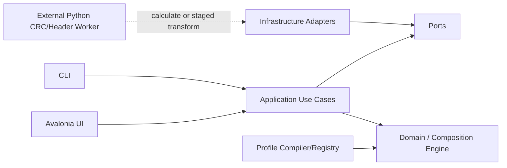

# NVT FW Combiner（NFC）實作規格

> 文件狀態：`Repository Bootstrap Baseline`
> 文件版本：`0.1.0-dev.0`
> 基準日期：`2026-06-25`
> 產品名稱：`NVT FW Combiner`
> 短名：`NFC`
> Repository：`Dennis40816/nvt_fw_combiner`
> 可見性：`Private`
> License：`MIT`（只涵蓋新 NFC 原創內容；`refcode/` 依個別來源與所有權處理）
> 本文件目的：鎖定產品、Composition 架構、資料契約、Codex 治理、CI/CD、里程碑與後續開發順序。

---

## 0. 文件使用原則

本文件 [`SPEC.md`](SPEC.md) 是 repository 內唯一的產品與高階工程規格來源。其他文件只補充特定範圍，不複製整份規格。

1. 架構決策寫入 `docs/adr/`；已核准 ADR 對其涵蓋議題優先。
2. 可執行契約以 JSON Schema、C#/Python 型別、測試、build properties 與 CI 為準。
3. root 與 nested `AGENTS.md` 只描述 agent 執行規則；不重複產品需求。
4. profile 與 golden regression 是 firmware 行為的可驗證依據；UI 顯示不能取代 byte-level 證據。
5. `refcode/` 是 immutable evidence，不可被 production project reference、編譯、執行或打包。
6. MIT scope 與 reference/third-party 邊界依 [`docs/governance/license-scope.md`](docs/governance/license-scope.md)。
7. Repository 名稱固定為 `nvt_fw_combiner`；solution/namespace 使用 `NvtFwCombiner`；產品 UI 使用 `NVT FW Combiner`。
8. `.NET SDK` 由 `global.json` pin，並由 `scripts/install-dotnet.ps1` / `.sh` 安裝。
9. `v0.1.0-dev.0` 是 init/bootstrap node；後續 tag 規則見 [`docs/governance/development-tags.md`](docs/governance/development-tags.md)。

本 baseline 不宣稱任何 IC 已達 production parity。Exact Python header/CRC transform 的命令、欄位與順序仍由 owner 後續提供；Codex 不得自行推測。

## 1. 背景與問題定義

目前有兩組重要 reference asset：

1. `ab_code_combiner` Python：具有 DP_AB、TPA、TPB 合併、TPB relocation、版本命名，以及部分 IC 的 CRC/header 寫回邏輯。
2. `Dennis40816/NFCG` 私有 prototype：已驗證 profile-driven merge、logical view、operation、validation、preview/build、Excel/profile、hook、CLI/Web/Desktop 與 golden regression 概念。

新工具不是重寫單一 script，而是建立可擴充的 firmware image composition platform。架構鎖定：

- **Merge**：由指定容量與填充值建立 blank image，再從一或多個來源合成新 image。
- **Replace**：必須先載入完整 reference/base BIN，clone 成 mutable work image 後再修改。
- initializer 完成後，兩者共用同一個 `CompositionEngine`、planner、operation algebra、validation、processor pipeline、mutation report 與 atomic output writer。
- Python 可能需要重寫 staging BIN 以完成 header/CRC。它只能修改 host 建立的隔離 staging copy；host 必須獨立 diff 並拒絕 declared write ranges 外的任何變更。
- CRC/header applicability 以 `IC + mode + stage` 的 `IntegrityDisposition` 與 processor declaration 表達；`unknown` 絕不等同 `none`。

### 1.1 產品 Experience

Merge：

- `standard-merge`：固定 profile 的正常合併。
- `ab-merge`：固定 profile 的 A/B bank 合併、relocation 與 integrity stages。
- `general-merge`：一或多個 BIN，使用者以 memory map drag、mapping table 或精確手動輸入設定 source/target ranges。

Replace：

- `display-replace`：Display 使用者主要操作 DP；DP 可 whole 或 profile-declared partitions，TP 若可替換必須是一個完整 atomic unit。
- `tp-hw-replace`：TP hardware 使用者只操作 TP 中被標記為 CtrlRAM 的 named regions/groups；DP 對此 experience 是 whole-only。
- `tp-fw-replace`：TP firmware 使用者操作 TP 的非 CtrlRAM declared regions；DP 是 whole-only，CtrlRAM 預設不可見/不可修改。
- `general-replace`：required reference BIN 加上一或多個 replacement BIN；使用者自由建立多筆 explicit mappings，但仍受 protected ranges、alignment、overlap、processor dependency 與 Preview gate 約束。

Experience 只控制 catalog、UI authoring policy 與 profile compile constraints。Executor 不依 `experienceId` 寫 workflow-specific branch。

### 1.2 核心風險

真正風險是 address-space、range、offset basis、初始化來源、region ownership、atomicity、覆寫順序、processor authority、CRC/header 計算順序與 profile evolution。這些規則必須成為 typed domain model 與可驗證資料，不得散落在 UI handler、Python one-off script 或未受控 custom code。

## 2. 參考來源與整合定位

### 2.1 使用者提供的規格草案

原始規格已定義三個主要 workflow：Normal Merge、AB Code Merge、Replace，並要求 Settings、profile-driven memory model、preview、traceability 與 golden sample regression。

### 2.2 Standard merge Python reference

從 `Dennis40816/NFCG` 的 reference testdata 擷取唯一需要的 standard merge Python source snapshot：

```text
refcode/gen_flash_bin_v2/
```

此資料夾保存 `gen_flash_bin.py`、`ic_config.json` 與其 `lib/*.py`；不保存 test BIN、expected BIN、cache 或執行輸出。來源 repository path、Git blob SHA 與本地 SHA-256 全部記錄於 `SOURCE_MANIFEST.json`。

### 2.3 Current AB/CRC Python reference

使用者提供的 `ab_code_combiner.rar` 已被整理為第二套且唯一的 AB reference snapshot：

```text
refcode/ab_code_combiner/
```

只保存 Python/source helper 與 README，不保存 firmware BIN、輸出 BIN、temporary file 或 `__pycache__`。

### 2.4 `NFCG` prototype：概念參考，不引入 codebase

主要參考 repository：

```text
https://github.com/Dennis40816/NFCG
```

概念參考路徑：

```text
src/application/
src/profiles/reference/
IC_ADDRESS_REFERENCE.md
CODING_RULES.md
GLOSSARY.md
```

整合策略：

- 重用 domain 概念、profile 語意、validation 思路、preview/build workflow 與 golden-regression 方法。
- **不得**將 NFCG TypeScript source 複製到 `refcode/`、新 solution、release package 或 generated workspace。
- **不得**將 TypeScript runtime、Node.js、npm/Electron 或原 repo package graph 當成新 C# runtime dependency。
- 不使用 Git submodule/subtree 綁定 prototype。
- TypeScript repo 只以固定 repository/path/ref metadata 作設計考證；production implementation 必須重新以 C# domain/application contracts 實作。
- prototype 歷史留在原 private repository；新 repository 乾淨起始。

### 2.5 `refcode/` 最終允許內容

`refcode/` 只允許以下兩個 code snapshot directory：

```text
gen_flash_bin_v2/
ab_code_combiner/
```

CI 必須拒絕第三個頂層 code snapshot、任何 `.ts/.tsx/.js`、firmware BIN、cache、venv 或 build output。

### 2.6 外部規範來源

Codex 與 agent governance 主要參考：

- OpenAI Codex `AGENTS.md` discovery 與 precedence。
- OpenAI Codex repository-scoped `.codex/config.toml`。
- OpenAI Agent Skills 與 `.agents/skills/<name>/SKILL.md`。
- `agents.md` 開放格式。
- `openai/codex`、`apache/airflow`、`temporalio/sdk-java` 的 AGENTS 實務。

原則不是複製任何大型 repository 的全部規則，而是抽取共同有效模式：可執行命令、明確邊界、就近覆寫、避免 context bloat、測試完成條件、reviewable change size 與安全禁區。

---

## 3. 產品目標

### 3.1 必須達成

1. 所有支援 IC/mode 的輸出可與核准 golden output byte-for-byte 相等。
2. 所有 range 使用明確的 half-open 語意 `[start, end)`，禁止混用 inclusive end。
3. Standard/AB/General Merge 與 Display/TP HW/TP FW/General Replace 共用同一套 composition primitives 與 executor。
4. Merge/Replace 的根本差異只由 `ImageInitialization` 表達：`blank` 或 `reference`。
5. UI、CLI、測試都呼叫同一個 application core；UI drag/drop 只建立 typed mappings，不直接修改 bytes。
6. 所有 byte mutation 都要有 operation id、來源/目標 address space、target range、原因、前後 hash 與 changed ranges。
7. Python 可依核准 processor contract 修改隔離 staging copy，以完成 CRC/header；C# host 仍負責 write-range policy、獨立 diff 驗證與 atomic promotion。
8. 每個 IC/mode/stage 都要明確宣告 integrity disposition；`unknown` 不得成為 supported profile。
9. production runtime 離線可用，不依賴網路、GitHub、系統 Python 或 package registry。
10. release 產物最小化、可重現、可驗證 SHA-256，且不含 sample firmware。
11. Codex 可從 root/nested AGENTS、repo skills、project config 與單一 verify command 得到一致規則；`polytail` 必須在完成與 review 前阻擋低品質 AI code。
12. 新增 IC/mode 時主要修改 profile、processor declaration 與 golden test，不新增 one-off merge/replace script。

### 3.2 品質目標

| 指標 | Beta Gate | 1.0 Gate |
| --- | ---: | ---: |
| Golden cases 通過率 | 100% 已宣告案例 | 100% 支援矩陣 |
| Domain/Application line coverage | ≥ 85% | ≥ 90% |
| Python worker line coverage | ≥ 95% | ≥ 95% |
| Domain/Application branch coverage | ≥ 80% | ≥ 85% |
| 未處理 analyzer warning | 0 | 0 |
| 未說明的 output overlap | 0 | 0 |
| processor 範圍外寫入 | 0 | 0 |
| release smoke failure | 0 | 0 |
| P0/P1 known defects | 0 | 0 |

Coverage 不是正確性的替代品；golden regression、property test、contract test、architecture test、independent staging diff 與 human firmware review 同樣是 release gate。

### 3.3 非目標

第一階段不包含：

- Firmware compiler/linker。
- 線上 telemetry 或自動上傳 firmware。
- app 內任意 Python/script editor。
- 未受 schema 約束的 plugin marketplace。
- 將 Excel 當成 runtime merge engine。
- 允許 Python 直接修改使用者原始 BIN、正式 output path 或 profile 未宣告的 range。
- 以「Custom」名義繞過 range、overlap、processor、golden 或 trace policy。

### 3.4 設計與交付流程

每個 feature、IC/mode 或 firmware semantic change 必須依序通過以下 stage；不得從 UI 直接跳到 byte mutation：

```text
Evidence inventory
  -> canonical memory/integrity facts
  -> ADR/schema/profile proposal
  -> domain invariants and threat analysis
  -> synthetic/unit/property tests
  -> deterministic composition plan
  -> infrastructure/worker adapter
  -> private golden parity
  -> UI/CLI rendering
  -> polytail audit
  -> package/security smoke
  -> human sign-off and release
```

| Stage | 主要輸入 | 必要輸出 | Gate |
| --- | --- | --- | --- |
| 1. Evidence | Python refs、owner memory sheet、existing golden hashes | source manifest、integrity matrix、uncertainty list | 來源/ownership 可追蹤 |
| 2. Canonical facts | legacy offsets、copy order、CRC/header facts | half-open range table、address space、atomicity、processor order | firmware owner review |
| 3. Contract design | facts + use case | ADR、JSON Schema/profile version、issue codes | architecture review |
| 4. Domain implementation | approved contract | immutable value objects、operation algebra、unit/property tests | architecture tests |
| 5. Orchestration | domain + ports | deterministic Preview/Build use cases、trace report | preview/build parity |
| 6. External adapters | port contracts | filesystem/process/profile/report/staging adapters | timeout/path/diff/security tests |
| 7. Parity | approved private vectors | byte equality、SHA-256、mutation report | golden sign-off |
| 8. Experience | stable application API | Avalonia/CLI flows、custom mapping editor、accessibility | UI/headless smoke |
| 9. Distribution | green protected CI | minimal package、SBOM、provenance、clean-machine smoke | release approval |

Change risk class：

- `R0`：純文件或無 runtime 影響的 tooling；1 位 reviewer。
- `R1`：一般 implementation，不變更 public/firmware contract；1 位 reviewer。
- `R2`：architecture、profile/schema、process protocol、dependency；至少 1 位 domain owner，必要時 ADR。
- `R3`：range/offset/patch/CRC/header/order/golden/security/release；2 位 human reviewers，必須有 byte-level evidence，禁止 agent auto-merge。

尚未確認的 firmware fact 不得以 placeholder 默默進 production profile；以 explicit `unknown` evidence state、open decision 或 unsupported catalog state 保留。

## 4. 現有 `ab_code_combiner` 行為盤點

### 4.1 合併順序

目前 `combine.py` 的有效順序為：

1. `output_size = len(DP_AB)`。
2. 以 zero-filled buffer 建立 output。
3. 將完整 `DP_AB` 複製到 output。
4. 驗證 TPA CRC（只有設定 CRC 的 IC）。
5. 複製 TPA payload。
6. 對 TPB 的 ILM/DLM/DIFF 內部位址做 relocation。
7. 重新計算並回填 TPB CRC（只有設定 CRC 的 IC）。
8. 複製 TPB payload。
9. 驗證 output size。

此 dependency order 是產品語意，遷移時不得任意重排。新架構以 immutable input + explicit TPB work buffer 保存順序，避免直接修改 caller-owned `bytearray`。若要正規化成 post-copy output operations，必須先證明完整 byte parity 並以 ADR 記錄 address-space 轉換。

### 4.2 CRC / header applicability facts

目前 reference code 以 `tp_crc_addr_offset` 與 `tp_crc_range` 是否同時存在決定行為，但新架構不得延續 nullable pair 或 `needsCrc` bool。已確認 evidence：

| IC | TPA | TPB | Evidence state |
| --- | --- | --- | --- |
| NT51929 | `none` | relocation only；CRC `none` | confirmed by uploaded config |
| NT51932 | `none` | relocation only；CRC `none` | confirmed by uploaded config |
| NT51950 | `verify-existing` | relocation -> `recalculate-and-write` | confirmed by code/sample |
| NT51951 | `verify-existing` | relocation -> `recalculate-and-write` | confirmed by config；golden pending |
| 其他 IC/mode | `unknown` | `unknown`/not applicable | inventory required |

`unknown` 與 `none` 完全不同：只有 reviewed evidence 才能宣告 `none`；`unknown` profile 不可升格為 supported。

目前演算法：

```text
Algorithm       CRC-32/MPEG-2
Width           32
Polynomial      0x04C11DB7
Initial         0xFFFFFFFF
Reflect input   false
Reflect output  false
Xor out         0x00000000
Check("123456789") = 0x0376E6E7
```

NT51950/NT51951 現行設定：

```text
CRC read range  [0xA100, 0xA130)
CRC write       [0xA130, 0xA134)
Stored endian   little-endian u32
```

- TPA：計算後與既有 stored CRC 比較。
- TPB：先完成 address relocation，再由 Python processor 對 staged work copy 執行必要 header/CRC 更新；精確 command、processor params 與完整 write ranges 待 firmware owner 提供後鎖定。host 必須對 before/after 做獨立 diff。

### 4.3 已執行的 reference verification

使用提供的 sample 做非破壞性重跑：

| Case | 結果 | Output SHA-256 |
| --- | --- | --- |
| NT51929 sample | 與提供 expected output 完全相同 | `2cc711e019d3cc8b9ea2fc5f168fd4427b66679ae168a2572856d1a306fd57f4` |
| NT51950 sample | 與三份既有 output 完全相同 | `4a292cd9615c58079b8994af8060af92562eaa92a55bc24bacc5ec5234e23b30` |

NT51950 sample 的已驗證 CRC：

```text
TPA stored/calculated CRC = 0x54A6A04F
TPB post-patch CRC        = 0xFBC4CEE4
```

### 4.4 現況風險

1. `patch_b_code` 直接修改輸入 `bytearray`；同一 instance 重跑會再次 relocation，非 idempotent。
2. CRC/header algorithm、read/write ranges、byte order 與 execution order 尚未形成完整 processor contract。
3. 現有 nullable CRC config 無法區分 `unknown`、`none`、verify-only 與 rewrite。
4. 若 Python 直接取得使用者路徑，將繞過 operation trace、write-range policy 與 atomic output；必須改為 host-owned staging copy。
5. `version.py` 部分讀取缺少一致 bounds validation。
6. log 是 console text，缺少 machine-readable report 與 issue code。
7. output date 直接讀系統時間，測試必須額外控制 clock。
8. README/sample status 可能 drift；文件不可取代 executable evidence。
9. Standard/AB/Replace/General 若各自建立 executor，未來 IC 會產生平行語意與大規模重構。
10. external process timeout、relative-path confinement、symlink/reparse protection、stdout protocol、版本協商與 integrity check 尚未全部實作。

## 5. 技術選型

### 5.1 主程式

| 項目 | 選擇 | 規則 |
| --- | --- | --- |
| Language | C# | nullable、warnings as errors |
| Runtime | `.NET 10` LTS | `global.json` pin SDK patch；不跨 feature band |
| UI | Avalonia 12 | 首要 target Windows x64；保留跨平台能力 |
| UI pattern | MVVM | View 不含 composition/firmware semantics |
| DI/hosting | `Microsoft.Extensions.*` | Composition root 集中於 Bootstrap project |
| MVVM toolkit | `CommunityToolkit.Mvvm` | 不自製 notification framework |
| Serialization | `System.Text.Json` source generation | 禁止 dynamic JSON 作為 domain model |
| Tests | xUnit | 優先 hand-written fake，避免不必要 mocking framework |
| Architecture tests | ArchUnitNET 或等效 reflection test | 鎖定 dependency direction |
| Logging | structured logging provider | user log 與 machine report 分離 |

實際建庫時以 `global.json`、`Directory.Packages.props` 與 lock file 鎖定精確版本。

### 5.2 Python CRC / header worker

| 項目 | 選擇 | 規則 |
| --- | --- | --- |
| Runtime baseline | CPython 3.13.x | 建庫時再確認 bundler 支援 |
| Package manager | `uv` | commit `uv.lock` |
| Runtime dependencies | 0，優先 stdlib-only | 降低供應鏈與 release 體積 |
| Test | pytest + property tests | protocol、algorithm、filesystem confinement、diff cases |
| Format/lint | Ruff | format + lint |
| Type check | Pyright strict | public API 不漏出 unknown/Any |
| Additional lint | Pylint | Python analyzer 之一，不是 Polytail |
| Packaging | PyInstaller one-file | 產出單一 `Nfc.CrcWorker.exe` |

Worker 支援兩種權限層次：

1. Protocol 1.x `calculate`：純 bytes -> CRC result，無 filesystem mutation。
2. Protocol 2.x `transform`：只可修改 host 建立的 staging `work.bin`；host 對 diff 與 write ranges 做最終裁決。精確 header processor 參數在 owner 提供操作方式後才完成。

`polytail` 已正式定義為 repository skill：`.agents/skills/polytail/SKILL.md`。它用來防止 AI 產生 architecture drift、duplicate logic、fake tests、placeholder、silent error、broad suppression 與不可 review 的 code；不是第三方同名 package，也不是 Pylint 的別名。

### 5.3 Profile 與契約格式

- Canonical runtime profile：JSON，符合 `composition-profile-v1.schema.json`。
- Schema：JSON Schema Draft 2020-12。
- Human authoring：第一階段直接編輯 JSON；後續可加入 Excel importer/compiler。
- General Merge / General Replace：UI 產生 typed mapping overlay，可保存成 versioned profile；不得產生 script。
- Processor recipe：JSON/typed declaration，與 memory mapping 分離但由 profile 明確引用。
- Reports：JSON；UI 顯示由 typed report 轉換。
- Spec/ADR/guide：Markdown。
- CSV/Excel：只作 import/export，不作 runtime source of truth。

## 6. 架構風格

採用 Clean Architecture + Ports and Adapters；核心是單一 `CompositionEngine`。



### 6.1 Dependency direction

```text
Nfc.Domain
  <- Nfc.Contracts
  <- Nfc.Application
  <- Nfc.Infrastructure
  <- Nfc.Presentation.Avalonia
  <- Nfc.Cli
  <- Nfc.Bootstrap
```

規則：

- `Domain` 不依賴 filesystem、process、UI、JSON serializer、Avalonia 或 logging implementation。
- `Application` 只依賴 Domain、Contracts 與 ports。
- `Infrastructure` 實作 filesystem、profile loading、staging workspace、external process、clock、hashing、report writer。
- `Presentation`/`Cli` 只建立 typed request，不自行解讀或修改 firmware offsets。
- `Bootstrap` 是唯一 composition root。
- `refcode` 不可被任何 project reference。
- 不建立 `MergeExecutor`、`ReplaceExecutor`、`CustomExecutor` 三套 mutation engine；workflow family 只影響 initialization、catalog 與 UI convenience。

### 6.2 專案分層責任

| Project | 責任 | 禁止內容 |
| --- | --- | --- |
| `Nfc.Domain` | range、address spaces、regions、operation algebra、plan、issue、trace | I/O、process、Avalonia |
| `Nfc.Contracts` | serializable profile/request/report/protocol DTO | composition execution |
| `Nfc.Application` | preview/build orchestration、policy、ports、diff verification | UI、direct filesystem |
| `Nfc.Infrastructure` | file/profile/report/process/staging adapters | 重複 firmware semantics |
| `Nfc.Profiles` | schema compiler、built-in profiles、catalog | UI-specific behavior |
| `Nfc.Presentation.Avalonia` | Views、ViewModels、mapping editor、state rendering | byte mutation |
| `Nfc.Cli` | automation surface | 另一套 executor |
| `Nfc.Bootstrap` | DI、startup、settings wiring | firmware rules |

### 6.3 Architecture test 必須驗證

- Domain 不 reference 其他 NFC project。
- Application 不 reference Infrastructure/Presentation/Avalonia。
- Infrastructure 不 reference Presentation。
- ViewModel 不直接使用 `File.*`、`Process.*` 或 binary mutation helper。
- 所有 workflow 都依賴同一 `ICompositionEngine`/use case。
- 所有 external processor invocation 都有 declared read/write ranges 與 target address space。
- Python staging adapter 不可接收 user-selected arbitrary executable/path。
- 所有 public application use case 回傳 structured result，不直接寫 console。

## 7. 核心 Domain Model

完整 variable catalog 見 [`docs/architecture/canonical-variable-model.md`](docs/architecture/canonical-variable-model.md)。核心模型刻意把「如何建立 image」、「使用者是誰」與「UI 有多少自由度」拆成正交維度。

### 7.1 Stable typed primitives

```text
IcId / ModeId / ProfileId / ProfileVersion
CompositionKind            // merge | replace
ImageInitializationKind    // blank | reference
ExperienceId               // stable extensible id
AudienceKind               // system | display | tp-hw | tp-fw | advanced
LayoutPolicy               // fixed | constrained | user-defined
RegionAccess               // hidden | read-only | whole | parts | explicit-range
ArtifactSlotId / ArtifactBindingId / AddressSpaceId / RegionId / ViewId
OperationId / ProcessorId / ValidationRuleId / IssueCode
ByteOffset / ByteLength / ByteRange
Alignment / Sha256Digest / ByteOrder / OverlapPolicy
IntegrityDisposition / ProcessorAuthority / ProcessorPurpose
```

Public API 禁止傳遞連續匿名 `int start, end, offset`，以及 `bool needsCrc`、`bool isReplace`、`bool isAb`。必須使用 value object、closed enum 或 named strategy。

### 7.2 Orthogonal dimensions

```text
CompositionKind
  merge
  replace

ImageInitialization
  BlankImageInitialization(capacity, fillByte)
  ReferenceImageInitialization(baseSlotId, expectedCapacity, validations)

ExperiencePolicy
  experienceId
  audience
  layoutPolicy
  inputPolicy
  regionAccessRules[]
  advancedConfirmation
```

Consistency rules：

- `merge` 必須使用 `blank` initializer。
- `replace` 必須使用 `reference` initializer。
- `experienceId` 不參與 executor dispatch。
- 新增角色/頁面應新增 experience policy/profile，不新增新的 composition engine。

### 7.3 Three model layers

```text
Definition
  IcDefinition
  CompositionProfile
  CanonicalRegionCatalog
  ExperiencePolicy
  Operations / validations / processors

Run binding
  CompositionRequest
  ArtifactBindings
  OutputOptions
  MappingOverrides

Execution
  ResolvedArtifacts
  AddressSpaceInstances
  CompositionPlan
  WorkBuffers
  ProcessorRuns
  MutationTrace
  CompositionResult
```

Definition 不含 selected path 或 UI state；run binding 不得發明 profile 未授權的 firmware semantics；execution state 不寫回 canonical definition。

### 7.4 Main aggregates

```text
IcDefinition
  icId
  displayNameKey
  flashCapabilities[]
  canonicalRegions[]
  supportedProfileIds[]
  evidenceStatus

CompositionProfile
  schemaVersion
  profileId/profileVersion/supportStatus
  icId/modeId
  compositionKind
  experience
  imageInitialization
  inputSlots[]
  addressSpaces[]
  regionAccessRules[]
  views[]
  operations[]
  validations[]
  outputNaming

CompositionRequest
  runId
  profileRef
  inputBindings{}
  mappingOverrides[]
  outputOptions
  strictness

CompositionPlan
  initialization
  orderedOperations[]
  occupancySegments[]
  processorInvocations[]
  validations[]

CompositionResult
  status
  outputBytes/hash/name
  versionTokens[]
  issues[]
  mutations[]
  report
```

### 7.5 Address spaces and ownership

| Address space | Mutable | Owner |
| --- | --- | --- |
| `input-artifact` | No | artifact loader |
| `reference-base` | No | artifact loader |
| `work-buffer` | Yes | one execution run |
| `output-image` | Yes | one execution run |
| `worker-staging-file` | Yes, isolated | infrastructure adapter |

Every range names its address space. Original input and reference base are immutable.

### 7.6 Canonical region classification

```text
MemoryRegion
  regionId
  parentRegionId?
  addressSpaceId
  role
  classificationTags[]     // dp, tp, tp-ctrlram, header, protected, ...
  range
  atomicity: whole | partitioned | explicit-mapping
  defaultReplacePolicy
  alignment
  processorDependencies[]
  compatibilityTags[]
```

Experience-specific access is separate：

```text
RegionAccessRule
  regionId or approved selector
  access: hidden | read-only | whole | parts | explicit-range
  allowedPartIds[]
  reason
```

This avoids duplicating memory maps for Display/TP HW/TP FW while keeping each UI constrained.

### 7.7 Persona rules

- **Display**：DP may be whole or declared parts. TP is `whole` only; partial TP is compile-time error.
- **TP HW**：only regions tagged `tp-ctrlram` or approved CtrlRAM groups may be replaced. DP is `whole` only.
- **TP FW**：only declared non-CtrlRAM TP regions may be replaced. DP is `whole` only; CtrlRAM is hidden/forbidden by default.
- **General Replace**：explicit ranges are allowed only where profile access is `explicit-range`; protected regions remain blocked.
- **General Merge**：input cardinality is extensible; every mapping row compiles to standard operations.

### 7.8 Operation algebra

Only these mutation/processing primitives are allowed：

```text
initialize-image
create-work-buffer
copy-range
fill-range
patch-scalar
replace-range
run-external-processor
assert-range
validate-checksum
extract-metadata
finalize-output
```

Every operation declares id, sequence, source/target spaces and ranges, overlap policy, pre/postconditions and reason. UI drag/drop is only an authoring interaction; it cannot directly mutate bytes.

### 7.9 Integrity and external processor authority

Do not use `needsCrc: bool`.

```text
IntegrityDisposition
  none
  verify-existing
  recalculate-and-write

ProcessorAuthority
  calculate
  transform
```

Inventory may contain `unknown`, but a supported profile may not. `transform` can modify only host-created staging copy and only declared write ranges. Host independently verifies the resulting diff.

### 7.10 Range and mutation invariants

- Internal ranges are half-open `[start, endExclusive)`.
- JSON uses `start` + `length`; UI may additionally show inclusive end.
- Arithmetic is checked; overflow and out-of-bounds fail before execution.
- Overlap defaults to reject and must be explicitly declared per operation.
- Every mutation records operation id, target space/range, before/after digest, changed ranges and reason.

## 8. Profile Schema

Canonical definition contract is [`docs/contracts/composition-profile-v1.md`](docs/contracts/composition-profile-v1.md); run binding and report are independently versioned.

### 8.1 Top-level profile fields

```json
{
  "schemaVersion": "1.0",
  "profileId": "nt51950-display-replace-v1",
  "profileVersion": "1.0.0",
  "supportStatus": "candidate",
  "icId": "NT51950",
  "modeId": "display-replace",
  "compositionKind": "replace",
  "experience": {
    "experienceId": "display-replace",
    "audience": "display",
    "layoutPolicy": "constrained",
    "inputPolicy": "fixed",
    "displayNameKey": "experience.display.replace",
    "regionAccessRules": []
  },
  "image": {},
  "inputSlots": [],
  "addressSpaces": [],
  "regions": [],
  "views": [],
  "operations": [],
  "validations": [],
  "outputNaming": {}
}
```

### 8.2 Supported experiences

| Experience | Composition | Initializer | Audience | Layout |
| --- | --- | --- | --- | --- |
| `standard-merge` | Merge | blank | system | fixed |
| `ab-merge` | Merge | blank | system | fixed |
| `general-merge` | Merge | blank | advanced | user-defined |
| `display-replace` | Replace | reference | display | constrained |
| `tp-hw-replace` | Replace | reference | tp-hw | constrained |
| `tp-fw-replace` | Replace | reference | tp-fw | constrained |
| `general-replace` | Replace | reference | advanced | user-defined |

This table is a product catalog baseline, not an executor enum. Future experiences reuse the same orthogonal fields.

### 8.3 Inputs, cardinality and instancing

Input slots declare role, requirement, cardinality, accepted extensions, size/content guards and compatibility tags. General modes use an extensible slot template instantiated into stable `bindingId` values at run time. Filename is never the source of IC/range truth.

### 8.4 Region access rules

A profile references canonical IC regions and applies experience access rules. Rules are deny-by-default; any region without an effective access rule is not authorable. `parts` requires declared child region IDs. `explicit-range` requires bounds, alignment, protected-range and processor dependency validation.

### 8.5 General mapping contract

Each mapping has：

```text
mappingId / sequence
sourceBindingId / sourceRange
targetSpaceId / targetRegionId? / targetRange
overlapPolicy
reason
```

- General Merge compiles mappings to `copy-range` over a blank image.
- General Replace compiles mappings to `replace-range` over a cloned reference image.
- Drag and table/manual editing share one in-memory mapping model and must round-trip exactly.
- Arbitrary scripts, executable paths and unregistered hooks are prohibited.

### 8.6 Compile pipeline

1. Parse strict JSON and reject unknown fields.
2. Validate schema and stable IDs.
3. Resolve IC region catalog and experience policy.
4. Verify composition/initializer consistency.
5. Instantiate address spaces and input bindings.
6. Validate access, atomicity, bounds, alignment, overlap and processor dependencies.
7. Compile fixed operations plus approved mapping overrides.
8. Produce deterministic `CompositionPlan` and plan hash.

Any validation failure blocks Build; Preview returns structured issues without output mutation.

## 9. 外部 Python CRC / Header Worker 設計

### 9.1 架構決策

保留兩個明確 contract：

- Protocol 1.x：純 `calculate`，worker 收 bytes、回 CRC；目前 prototype 即此模式。
- Protocol 2.x：`transform`，worker 可修改 host 建立的 staging copy，以完成 CRC/header 寫回；draft 見 [`crc-worker-transform-v2-draft.md`](docs/contracts/crc-worker-transform-v2-draft.md)。

Python 不得直接取得或覆寫使用者原始 BIN、正式 output、任意 path 或任意 executable。它只取得 one-shot run directory 內的 relative `work.bin`。

### 9.2 Staged transform flow

```text
immutable artifact/work buffer
  -> host creates isolated run directory
  -> host writes exact staging work.bin
  -> host records before hash/length
  -> worker transforms staging copy
  -> host validates response/exit/files
  -> host independently diffs before/after
  -> reject changed bytes outside allowedWriteRanges
  -> import verified result into named work buffer
  -> continue ordered composition plan
  -> delete staging directory
```

若 timeout、crash、unexpected file、length change、symlink/reparse、hash mismatch 或 out-of-range mutation，整個 operation fail closed；不得使用部分結果。

### 9.3 Process 與 filesystem 安全規則

- `UseShellExecute = false`；不拼 shell command。
- executable path 由 installation layout 與 release manifest 決定，不接受 per-run input。
- working directory 是 host 建立的 private staging directory。
- request 只允許 plain relative filename；拒絕 separator、`..`、drive、UNC、symlink、junction/reparse traversal。
- worker environment 使用 allowlist；network disabled；不得 spawn child process/load plugin。
- timeout 預設 5 秒；超時 kill process tree。
- stdout/stderr 均有大小上限；stdout 僅一個 JSON response。
- transform 後 host 驗證 file count、name、length、SHA-256、changed ranges 與 postconditions。
- worker failure 不得 fallback 至不同 algorithm 或未審核 C# rewrite。

### 9.4 Applicability model

每個相關 profile stage 分別宣告：

```text
integrityDisposition = none | verifyExisting | recalculateAndWrite
processorAuthority   = calculate | transform
processorPurpose     = checksum | header | headerAndIntegrity | relocation | compositePostProcess
```

Planning matrix 可使用 `unknown`，但 supported profile 不可。Protocol 1 對應 `calculate` authority；Protocol 2 對應受控的 `transform` authority。Current evidence matrix 見 [`integrity-processing-matrix.md`](docs/architecture/integrity-processing-matrix.md)。

### 9.5 Protocol 1.x calculate request/response

```json
{
  "protocolVersion": "1.0",
  "requestId": "demo",
  "operation": "calculate",
  "algorithmId": "crc-32-mpeg-2",
  "payloadBase64": "MTIzNDU2Nzg5"
}
```

```json
{
  "protocolVersion": "1.0",
  "requestId": "demo",
  "ok": true,
  "workerVersion": "0.1.0",
  "result": {
    "algorithmId": "crc-32-mpeg-2",
    "valueUnsigned": 58124007,
    "valueHex": "0x0376E6E7",
    "bytesLittleEndianHex": "E7E67603"
  }
}
```

### 9.6 Protocol 2.x transform reservation

Draft request 需要：

```text
protocolVersion/requestId
processorId
workingFile (relative only)
addressSpaceId/expectedLength
allowedReadRanges[]
allowedWriteRanges[]
typed parameters
```

response 需要 before/after hash、processor id、claimed changed ranges 與 checks。host 必須自行 diff；worker claim 只作 evidence，不作授權。

精確 Python command、header fields、params、TPA/TPB rewrite policy 與最小 write ranges，待使用者後續提供後，以 ADR/contract minor draft更新；未確認前不得實作 production transform。

### 9.7 Host ports

```csharp
public interface ICrcCalculator
{
    Task<CrcCalculationResult> CalculateAsync(
        CrcCalculationRequest request,
        CancellationToken cancellationToken);
}

public interface IFirmwarePostProcessor
{
    Task<PostProcessResult> TransformAsync(
        PostProcessRequest request,
        CancellationToken cancellationToken);
}
```

Application 不知道 `Process`、PyInstaller 或 staging path。Infrastructure adapter 負責 process/filesystem；Application 負責 policy、diff verdict 與 mutation trace。

### 9.8 Acceptance tests

- Empty payload -> `0xFFFFFFFF`。
- `123456789` -> `0x0376E6E7`。
- NT51950 approved CRC values。
- invalid JSON、unknown field、invalid base64、unsupported version/processor。
- path traversal、absolute path、symlink/reparse、extra file、length change。
- worker claims incomplete/incorrect changed ranges。
- changed byte just outside allowed range must fail。
- crash/timeout leaves original artifacts/output unchanged。
- deterministic replay。
- clean Windows package without system Python。

## 10. Unified Composition Pipeline

### 10.1 Shared stages

```text
Load profile and IC definition
→ bind artifacts
→ validate experience access and inputs
→ initialize blank/reference image
→ compile deterministic plan
→ execute ordered operations
→ run approved processors
→ validate mutations and integrity
→ generate report/name/hash
→ atomically commit output
```

Preview executes through plan/validation and processor dry-run capability where available, but does not commit output.

### 10.2 Merge vs Replace

| Dimension | Merge | Replace |
| --- | --- | --- |
| `compositionKind` | `merge` | `replace` |
| initialization | blank capacity + fill byte | immutable reference BIN clone |
| required base | none | exactly one reference base |
| normal mutation | copy/fill/patch/process | replace/copy/patch/process |
| common engine | yes | yes |

### 10.3 Standard Merge

Fixed profile inputs and mappings. The user selects IC/mode and BINs; profile owns ranges, output naming and post-processing.

### 10.4 AB Merge

Fixed A/B bank model with explicit logical views, target banks, relocation patches, integrity stages and comparisons. DP_AB and split DPA/DPB are separate profile modes, not runtime guessing.

### 10.5 General Merge

- Starts from blank image.
- Supports one or more input BIN bindings and one or more source segments per BIN.
- UI offers drag placement, resize subject to exact constraints, and table/manual hexadecimal/decimal entry.
- Mapping compiler validates bounds, overlap, alignment, protected target ranges and required post-processors.
- Saved presets become versioned profiles only after review; an ad-hoc run remains a request overlay.

### 10.6 Display Replace

- Requires full reference BIN.
- Exposes DP whole/declared partitions according to profile.
- TP is a complete atomic unit whenever it is offered; partial TP controls do not exist.
- Any DP change triggers declared header/integrity processors.

### 10.7 TP HW Replace

- Requires full reference BIN.
- Exposes only named TP CtrlRAM regions/groups from canonical region tags.
- DP can only be supplied/replaced as a whole artifact when the profile permits it.
- CtrlRAM replacement cannot escape its declared range; dependent CRC/header stages are mandatory.

### 10.8 TP FW Replace

- Requires full reference BIN.
- Exposes declared TP firmware/non-CtrlRAM regions such as code, tables or metadata as defined per IC.
- DP remains whole-only.
- CtrlRAM is hidden/forbidden unless a distinct approved profile explicitly changes the experience policy.

### 10.9 General Replace

- Requires reference BIN plus an extensible list of replacement BIN bindings.
- Supports multiple explicit mappings per BIN.
- Protected regions, alignment, atomic groups, overlap and processor dependencies remain profile-controlled.
- Every run requires Preview and an explicit advanced confirmation before Build.

### 10.10 Build atomicity

Final output is written to a new temporary file in the target directory, flushed, hashed, validated, then atomically promoted. Existing output is not overwritten unless the request and policy explicitly permit it. Failure removes temporary output and preserves reference/original files.

## 11. UI Design

### 11.1 Information architecture

```text
NVT FW Combiner
├─ Merge
│  ├─ Standard
│  ├─ AB Code
│  └─ General
├─ Replace
│  ├─ Display
│  ├─ TP HW
│  ├─ TP FW
│  └─ General
├─ Profiles & Evidence
├─ Reports
└─ Settings
```

### 11.2 Shared flow

1. **Configure**：select IC, mode/experience, inputs/reference, profile and output options.
2. **Preview**：show resolved versions, mappings, memory occupancy, operations, access-policy decisions, processors, warnings/errors and output name.
3. **Build**：only enabled after blocking issues are zero and required confirmation is complete.

### 11.3 Merge fixed experiences

Standard/AB use input cards generated entirely from profile slots. UI does not infer ranges. AB shows A/B lanes, relocation operations and integrity stages distinctly.

### 11.4 General mapping editor

The editor has synchronized views：

- left: input BIN list with extensible add/remove and source segment selection;
- center: output memory canvas with snap/alignment, drag and resize;
- right/bottom: exact mapping table with source start/length, target start/length, sequence, overlap policy and reason;
- issue panel: bounds, overlap, protected range, atomicity, compatibility and processor requirements.

A drag operation updates the exact table model; manual input updates the canvas. There is only one mapping state object.

### 11.5 Replace common header

Always display reference filename/hash/size, IC detection result, profile/experience, output naming, base immutability status and before/after diff summary.

### 11.6 Display page

DP region tree/cards are primary. DP partitions can be selected individually only when profile declares them. TP appears as one whole card or is absent.

### 11.7 TP HW page

Shows CtrlRAM groups and child regions only. The page explains dependent processors. DP appears only as an optional whole card when allowed.

### 11.8 TP FW page

Shows non-CtrlRAM TP firmware regions declared by the profile. DP is whole-only. CtrlRAM is not silently mixed into this workflow.

### 11.9 General Replace page

Uses the same mapping editor as General Merge, with a locked reference-base lane behind overlays. Advanced confirmation summarizes every target range and processor before Build.

### 11.10 Memory map and accessibility

Memory colors come from semantic roles, not operation order. Every segment has text/tooltip labels, address range, source binding, operation and status. Keyboard editing, screen-reader labels, focus order, high contrast and scalable text are release requirements.

## 12. 文本、資料格式與定義

### 12.1 Markdown

- UTF-8、LF、檔尾 newline。
- 一份文件只使用一個 H1。
- heading 逐級，不跳級。
- table 用於固定欄位；長敘述使用 section。
- code block 必須標示 language。
- RFC 2119 關鍵字以英文大寫：`MUST`、`MUST NOT`、`SHOULD`、`MAY`。
- 規格變更需同步 changelog 或 ADR。
- 使用 markdownlint；規則例外只可在 repo-level config 說明。

### 12.2 JSON

- UTF-8、LF、2-space indentation。
- property 使用 camelCase。
- unknown property 預設拒絕。
- canonical output 維持 deterministic property order。
- 不使用 comments、NaN、Infinity。
- bytes 使用 base64；digest 使用 lowercase hex。
- address/size 使用 decimal integer；UI/report 可附 `displayHex`。

### 12.3 YAML

- 只用於 GitHub Actions、Dependabot 或人類設定。
- 2-space indentation。
- 禁止 YAML 1.1 ambiguous boolean（`yes/no/on/off`）。
- workflow 使用 actionlint。

### 12.4 Identifier

| 類型 | 格式 | 範例 |
| --- | --- | --- |
| IC id | uppercase | `NT51950` |
| mode id | kebab-case | `ab-dp-ab` |
| profile id | `<ic>-<mode>-vN` | `nt51950-ab-dp-ab-v1` |
| operation id | verb phrase kebab-case | `copy-tpb-payload` |
| hook id | reverse/domain-like stable id | `nfc.crc32-mpeg2.external-v1` |
| issue code | uppercase snake | `CRC_WORKER_TIMEOUT` |
| JSON property | camelCase | `writeRanges` |
| C# type | PascalCase | `ByteRange` |
| Python module | snake_case | `crc_worker.py` |

### 12.5 Issue model

```json
{
  "severity": "error",
  "code": "CRC_MISMATCH",
  "message": "Stored CRC does not match calculated CRC.",
  "context": {
    "artifactId": "tpa_bin",
    "range": { "start": 41216, "length": 48 },
    "stored": "0x54A6A04F",
    "calculated": "0x00000000"
  }
}
```

Severity：`info | warning | error | fatal`。

### 12.6 日期與版本

- machine timestamp：UTC RFC 3339，例如 `2026-06-25T10:30:00Z`。
- output filename date：依產品規則使用 local `yyyyMMdd`，clock 可注入。
- app/profile/worker：SemVer。
- release tag：`vMAJOR.MINOR.PATCH`。
- prerelease：`v0.9.0-rc.1`。

### 12.7 Firmware output naming

Output naming 是 profile template，不寫死在 UI。

```text
{icLabel}_Flashcode_A_{dpA}{tpA}_B_{dpB}{tpB}_{date:yyyyMMdd}.bin
```

所有 token 必須：

- 可追溯到 extractor。
- 有 validation。
- 缺值時明確 error 或依 profile-defined fallback。

---

## 13. 名詞定義

| Term | Definition |
| --- | --- |
| Composition | Image initialization plus deterministic ordered operations and validations |
| Merge | Composition with blank initialization |
| Replace | Composition with reference-image initialization |
| Experience | UI/catalog authoring policy; never an executor branch |
| Display Replace | DP-focused replacement; TP whole-only |
| TP HW Replace | TP CtrlRAM-focused replacement; DP whole-only |
| TP FW Replace | TP non-CtrlRAM firmware replacement; DP whole-only |
| General Merge | User-defined mappings over a blank image |
| General Replace | User-defined mappings over a cloned reference image |
| Reference Base | Required immutable complete BIN for Replace |
| Canonical Region | IC-owned memory range and classification independent of a UI persona |
| Region Access Rule | Experience-specific authoring permission for a canonical region |
| CtrlRAM | Profile-declared TP hardware control RAM region; never inferred by filename |
| Artifact | Physical input BIN bytes |
| Logical View | Semantic slice of an artifact |
| Address Space | Named coordinate system and ownership boundary |
| Work Buffer | Run-owned mutable clone used for relocation or processing |
| Mapping | Explicit source range to target range authoring unit |
| Operation | Normalized executable composition primitive |
| Integrity Disposition | Required firmware result: none, verify-existing, recalculate-and-write |
| Processor Authority | External worker permission: calculate or transform |
| Mutation Trace | Auditable record of every changed range and reason |
| Golden Regression | Complete output byte/SHA comparison against approved evidence |
| Polytail | Repository Agent Skill that rejects low-quality AI changes and evidence gaps |

## 14. Codex 與 AI 開發規範

### 14.1 指令分層

- root `AGENTS.md`：全 repo 不變原則、驗證命令、架構邊界、安全禁區。
- nearest nested `AGENTS.md`：該目錄的更具體規則。
- ADR/schema/tests：其涵蓋行為的 executable source of truth。
- `.agents/skills/`：只有在任務符合 description 時載入的可重用 workflow。

root/nested instructions 必須保持短、可執行且不複製整份 spec。

### 14.2 `AGENTS.md` 必須包含

- canonical setup/build/test/lint command。
- repository map、dependency boundary、firmware 禁區。
- 何時必須新增 test/ADR/profile version。
- staging worker authority 與 original BIN immutable rule。
- Definition of Done、PR evidence、無法執行測試的回報格式。

### 14.3 禁止的 agent 行為

- 跳過 failing test、降低 threshold、擴大 exclude、刪除 tests 或修改 golden 讓結果變綠。
- 新增未核准 production dependency。
- UI/CLI/Python 各自建立 merge/replace semantics。
- 使用 one-off script、magic offsets、anonymous range、`needsCrc` bool。
- 讓 worker取得 user-selected path/executable 或直接改 original/final BIN。
- 在沒有 tests/evidence 下修改 range/patch/CRC/header/order。
- 提交 firmware BIN、secret、cache、build/release output。
- 以 TODO/placeholder/NotImplemented 冒充完成。
- 以大量無關 refactor 淹沒 firmware semantic change。

### 14.4 Codex project config

Repository 提交 `.codex/config.toml`：workspace-write、on-request approval、network disabled、login shell disabled、bounded threads。Project config 不 pin user model/provider/auth。

### 14.5 Repo skills

Repository 提交九個可組合 skill：

1. `nfc-architecture-change`：跨 layer/API/ADR。
2. `firmware-profile-authoring`：IC/profile/range/operation authoring。
3. `crc-worker-contract`：calculate/transform protocol、staging、diff、vectors。
4. `golden-regression`：byte-for-byte parity 與 private/public fixture evidence。
5. `ui-experience-change`：Merge/Replace UI、mapping editor、accessibility。
6. `composition-experience-change`：Display、TP HW、TP FW、General access policy。
7. `dotnet-bootstrap`：SDK pin、solution、installer、central package 與 clean-clone setup。
8. `release-readiness`：minimal package、hash、SBOM、smoke。
9. `polytail`：所有 non-trivial implementation/review 的 anti-slop gate，阻擋 architecture drift、duplicate code、fake tests、placeholder、silent failures、broad suppression 與不可 review diff。

Skill description 必須寫清楚何時觸發與不該觸發；`polytail` 在任何完成聲明或 PR approval 前執行，但不能取代 human firmware review。

### 14.6 Agent task template

```text
Goal
In scope / Out of scope
Authoritative spec/ADR/schema
Affected IC/mode/address spaces/ranges
Initialization kind
Integrity/processor stages
Acceptance criteria
Required commands/evidence
Risk class
```

Completion report：

```text
Summary
Files changed
Behavioral/firmware impact
Tests run/result
Tests not run/reason
Profile/schema/protocol/version impact
Polytail verdict
Risks/follow-up
```

### 14.7 Human review gate

不得只靠 agent auto-merge：range/address/offset、region atomicity、CRC/checksum/header、operation order、processor write range、golden output、schema/protocol major、release signing/permissions/secrets。

## 15. Coding 與品質規範

### 15.1 C#

- `Nullable=enable`、warnings as errors、code style in build。
- immutable record/value object；無 service locator/global mutable state/static clock。
- async I/O 接受 `CancellationToken`；binary arithmetic checked/bounds-validated。
- endian 使用 `BinaryPrimitives`；offset/range 必須有 typed semantic name。
- validation data problems 回 typed issues；不可 catch-all 後成功。
- module/class 保持單一責任；非機械 diff 目標 < 500 lines，>800 需拆分理由。
- application owns policy；infrastructure owns process/filesystem；UI owns rendering only。

### 15.2 Python

- Python 3.13 type syntax、Ruff、Pyright strict、Pylint、pytest/property tests。
- production 禁止 bare `except`、silent fallback、stdout traceback。
- calculation module pure；transform module只可操作 adapter 提供的 staging relative file。
- 不得 enumerate staging root 之外、spawn process、network、dynamic import/plugin。
- path、file count、length、JSON/base64/output size 全部有上限與 stable errors。
- exact processor logic 必須有 reference vectors/golden tests。

### 15.3 Profile、文件與設定

- JSON Schema + semantic compiler tests。
- Markdown links/lint、actionlint、YAML/security scans。
- third-party Actions pin full commit SHA。
- `unknown` integrity state不可進 supported profile。
- TP `whole-only` 等 atomicity 不可被 UI override。

### 15.4 `polytail` skill 與 required gate

- authoritative workflow：`.agents/skills/polytail/SKILL.md`。
- supporting policy：`docs/policies/polytail.md`。
- required CI check：`policy / polytail`。
- canonical command：`python scripts/verify.py --all`；shell wrappers僅轉呼叫。
- reviewer/subagent在 non-trivial change completion 前必須套用 Polytail checklist。
- gate 必須拒絕 placeholder、duplicate semantics、magic offsets、fake tests、broad suppression、swallowed errors、unbounded change、docs/schema drift 與 undeclared mutation。
- waiver 必須具 owner/issue/reason/risk/expiry/removal condition；firmware range、processor writes、secret、signing、release allowlist無永久 waiver。

### 15.5 Definition of Done

Change 完成條件：

- scope/acceptance criteria 達成，無 placeholder。
- changed behavior有 meaningful positive/negative tests。
- targeted tests與 full verify通過。
- analyzer/lint/type/architecture/profile contract通過。
- profile/schema/ADR/docs/report同步。
- processor diff/write range與original immutability有測試。
- 無 firmware、secret、generated output。
- PR 列出 commands、evidence gaps、release impact與 Polytail verdict。
- R3 change取得 required human review。

## 16. 測試策略

### 16.1 Test pyramid

1. Domain unit tests：range、overlap、patch、version extractor、naming。
2. Property tests：range arithmetic、CRC C#/Python equivalence、copy invariants。
3. Application tests：preview/build/replace orchestration。
4. Contract tests：C# host ↔ Python worker JSON protocol。
5. Profile schema/semantic tests。
6. Golden regression：byte-for-byte + SHA-256。
7. CLI smoke。
8. Avalonia ViewModel/headless smoke。
9. Packaged EXE smoke on Windows runner。

### 16.2 Golden fixture manifest

BIN 不直接進一般 Git history。建議：

- 私有 Git LFS，或公司 artifact storage。
- Git 只保存 manifest、hash、來源說明與存取指引。
- CI 以有權限的 internal runner 或受控 secret 下載。
- public fork/PR 不可取得 firmware。

Manifest：

```json
{
  "sampleId": "nt51950-ab-dp-ab-reference-001",
  "profileId": "nt51950-ab-dp-ab-v1",
  "inputs": [
    { "slotId": "dpAb", "fileName": "...", "size": 524288, "sha256": "..." }
  ],
  "expectedOutput": {
    "size": 524288,
    "sha256": "4a292cd9615c58079b8994af8060af92562eaa92a55bc24bacc5ec5234e23b30"
  },
  "approvedBy": ["<engineer-1>", "<engineer-2>"],
  "approvedAt": "<UTC timestamp>"
}
```

### 16.3 Mutation testing

Scheduled CI 使用 Stryker.NET 對下列高風險模組執行：

- range arithmetic。
- overlap policy。
- patch endian/bounds。
- CRC host backfill。
- version anchor calculations。

Python CRC 可使用 mutmut 或以手工 mutation vectors 取代；是否導入額外工具由 dependency policy 決定。

---

## 17. 安全與供應鏈

### 17.1 Runtime security

- 預設離線。
- 只讀取使用者選擇的 BIN/profile path。
- 防 path traversal、symlink/reparse-point surprise、TOCTOU。
- output 以 atomic replace；預設不覆蓋。
- temp files 使用 app-owned directory，完成後清理。
- log 不寫完整 firmware bytes。
- hex dump 只能在明確 diagnostic mode，並顯示警告。
- crash report 不包含 binary payload。

### 17.2 Dependency policy

新增 production dependency 必須說明：

- 用途與不能用 BCL/現有套件的原因。
- license。
- maintenance/security 狀態。
- transitive dependency 數。
- binary size 影響。
- trimming/AOT 相容性。

### 17.3 CI permissions

- workflow top-level `permissions: contents: read`。
- release job 才提升 `contents: write`、`id-token: write`。
- PR from fork 不取得 secrets。
- 不使用 `pull_request_target` 執行未受信任 code。
- 所有 action pin SHA。
- cache key 包含 lockfile hash。

### 17.4 Release provenance

每個 release 應產出：

- user package ZIP。
- `SHA256SUMS.txt`。
- CycloneDX SBOM（獨立 asset）。
- build provenance/attestation。
- release notes。
- source tag。
- code signing metadata（若啟用）。

---

## 18. CI 設計

### 18.1 Pull request CI

```text
policy / polytail
  - cross-language format/lint/type/analyzer gate
  - forbidden files / secret scan
  - reference manifest and action full-SHA policy
  - generated/lock/schema/document drift

docs-and-contracts
  - markdownlint
  - JSON Schema validation
  - actionlint on templates/workflows

csharp
  - dotnet restore --locked-mode
  - dotnet format --verify-no-changes
  - dotnet build -c Release --no-restore
  - dotnet test unit/application/architecture

python-worker
  - uv sync --frozen
  - ruff format --check
  - ruff check
  - pyright
  - pylint
  - pytest

integration
  - build worker executable
  - C#/Python calculate and staged-transform contract tests
  - host independent diff / path confinement tests
  - non-sensitive golden regression
  - CLI smoke

package-smoke
  - publish win-x64
  - assemble package
  - run --self-test / worker health
```

### 18.2 Release trigger

- signed/approved tag `vX.Y.Z`，或 protected manual workflow。
- tag version 必須等於 `VERSION`、assembly version、worker version、changelog heading。
- release job只能從 `main` 的 reachable commit 執行。
- release environment 需要 human approval。

### 18.3 Release package 最小內容

Built-in profiles、JSON Schema、CRC/header worker protocol metadata、UI resources 與 default settings 必須在 publish 時嵌入 `NvtFwCombiner.exe`。預設 end-user ZIP 不提供可編輯 source/profile tree：

```text
NvtFwCombiner-vX.Y.Z-win-x64/
├─ NvtFwCombiner.exe
├─ Nfc.CrcWorker.exe
├─ RELEASE-MANIFEST.json
├─ THIRD-PARTY-NOTICES.txt
├─ LICENSE.txt                 # generated from root MIT LICENSE
├─ README.txt
└─ SHA256SUMS.txt
```

`RELEASE-MANIFEST.json` 必須符合 `docs/contracts/release-manifest-v1.schema.json`，至少記錄 app/worker version、supported protocol versions、approved processor ids/bundle hash、built-in profile catalog hash、兩個 executable SHA-256、runtime identifier 與 signing identity。若工程師需要 editable profile pack，必須作為**另外一個版本化且簽章/雜湊驗證的 asset**，不得擴大預設最小 package。

不包含：

- PDB。
- source。
- `refcode/`。
- sample/golden firmware。
- test data。
- Python source/venv。
- docs 全集。
- unused locale/runtime。

### 18.4 Publish settings

主 app：

```text
RuntimeIdentifier=win-x64
SelfContained=true
PublishSingleFile=true
IncludeNativeLibrariesForSelfExtract=true
PublishTrimmed=false
DebugType=None
DebugSymbols=false
```

先禁止 trimming；等 Avalonia、serializer、DI 與 plugin surface 有完整 smoke 後再以 ADR 評估。

Worker：

```text
PyInstaller --onefile --clean --noconfirm --noupx
```

Release CI 必須驗證乾淨 Windows runner 在沒有預裝 .NET/Python 的情況下可啟動、完成 Protocol 1 health check、synthetic staged-transform safety smoke（啟用時）與 bundled composition fixture。

---

## 19. Git, Repository and Version Management

### 19.1 Repository identity

```text
Owner       Dennis40816
Name        nvt_fw_combiner
Product     NVT FW Combiner
Visibility  Private
Default     main
License     MIT
```

Repository uses underscore exactly as requested. C# namespace/solution use PascalCase `NvtFwCombiner`; executable uses `NvtFwCombiner.exe`.

### 19.2 Branch model

Trunk-based：`main` remains buildable; work uses short-lived `feat/<issue>-<topic>`, `fix/...`, `docs/...`, `chore/...`. No long-lived `develop` branch. Maintenance branches are introduced only after a stable release requires them.

### 19.3 Protection

`main` requires PR, passing checks, resolved conversations and linear history. Normal changes require one human review; firmware range, processor, schema/protocol, security and release changes require two appropriate reviewers. Force push and branch deletion are disabled.

### 19.4 Commits and PRs

Use Conventional Commits. Keep non-mechanical changes reviewable; split changes over roughly 500 lines where practical and justify changes over 800 lines. Firmware semantic changes are isolated from formatting/refactor churn.

### 19.5 Version and tags

- App, profile and worker use SemVer independently.
- Init commit version/tag is `v0.1.0-dev.0`.
- Development nodes follow [`docs/governance/development-tags.md`](docs/governance/development-tags.md).
- Tags are annotated, immutable and never moved.
- Only exact stable tags `vX.Y.Z` trigger release publishing.

### 19.6 License and changelog

Use Keep a Changelog. Root MIT `LICENSE` applies to original repository code only; reference scope follows `docs/governance/license-scope.md`.

## 20. Milestones

| Version node | Milestone | Core delivery | Exit criteria |
| --- | --- | --- | --- |
| `v0.1.0-dev.0` | Init | spec, AGENTS/skills, .NET 10/Avalonia scaffold, scripts, CI/release skeleton, two Python references | local repository validation and annotated tag |
| `0.1.0` | Repository Bootstrap | clean clone bootstrap, dependency locks, active public CI, app shell | one-command verify on clean Windows |
| `0.2.0` | Composition Core | typed ranges, region catalog, experience policy, initialization, planner/executor | unit/property/architecture tests |
| `0.3.0` | Standard Merge Parity | initial IC profiles aligned with `gen_flash_bin_v2` | approved golden byte parity |
| `0.4.0` | Worker & Integrity | calculate protocol, staged transform, host diff | contract/security/reference tests |
| `0.5.0` | AB Merge | DP_AB/split DP, relocation, integrity stages | approved AB regressions |
| `0.6.0` | Persona Replace | Display, TP HW, TP FW constrained experiences | atomicity/access/diff tests |
| `0.7.0` | General Modes & UX | General Merge/Replace mapping editor | drag/table round-trip and advanced safety tests |
| `0.8.0` | Packaging & Security | minimal package, SBOM, provenance, signing policy | clean-machine smoke |
| `0.9.0` | UAT / RC | support matrix, bug fixes, performance | no P0/P1 and owner sign-off |
| `1.0.0` | Stable | approved IC/mode/processor matrix | release approval |

UI progress never bypasses memory-map/golden evidence gates. Exact header transform remains blocked until owner instructions exist.

## 21. Repository Folder Structure

```text
nvt_fw_combiner/
├─ SPEC.md
├─ AGENTS.md
├─ README.md
├─ LICENSE
├─ VERSION
├─ CHANGELOG.md
├─ global.json
├─ NvtFwCombiner.slnx
├─ Directory.Build.props
├─ Directory.Build.targets
├─ Directory.Packages.props
├─ NuGet.config
├─ .agents/skills/
│  ├─ nfc-architecture-change/
│  ├─ firmware-profile-authoring/
│  ├─ crc-worker-contract/
│  ├─ composition-experience-change/
│  ├─ golden-regression/
│  ├─ dotnet-bootstrap/
│  ├─ release-readiness/
│  ├─ ui-experience-change/
│  └─ polytail/
├─ .codex/
│  ├─ config.toml
│  └─ agents/{architect,implementer,reviewer,tester}.toml
├─ .github/
│  ├─ AGENTS.md
│  ├─ CODEOWNERS
│  ├─ ISSUE_TEMPLATE/
│  └─ workflows/{ci,release}.yml
├─ docs/
│  ├─ adr/
│  ├─ architecture/
│  ├─ contracts/
│  ├─ governance/
│  ├─ policies/
│  ├─ references/
│  └─ ci/
├─ src/
│  ├─ NvtFwCombiner.Domain/
│  ├─ NvtFwCombiner.Contracts/
│  ├─ NvtFwCombiner.Application/
│  ├─ NvtFwCombiner.Profiles/
│  ├─ NvtFwCombiner.Infrastructure/
│  ├─ NvtFwCombiner.Bootstrap/
│  ├─ NvtFwCombiner.Cli/
│  └─ NvtFwCombiner.Presentation.Avalonia/
├─ profiles/{schema,built-in,samples}/
├─ tests/
├─ testdata/{manifests,public-synthetic}/
├─ tools/crc-worker/
├─ refcode/
│  ├─ gen_flash_bin_v2/
│  └─ ab_code_combiner/
├─ scripts/
└─ artifacts/                    # ignored generated output
```

No NFCG TypeScript source, Node runtime or third reference snapshot is permitted.

## 22. `refcode/` 規則

- 唯一允許的 code snapshot 是 `gen_flash_bin_v2/` 與 `ab_code_combiner/`。
- NFCG TypeScript codebase 不複製、不 vendor、不 submodule、不編譯、不作 runtime/package dependency。
- 每個 snapshot 必須有來源 repository/archive、path/ref/blob SHA、snapshot date 與 local SHA-256 manifest。
- 必須標記 license/ownership 狀態；不明確時只作 private evidence，不向外散布。
- 不得被 solution/project include，也不得由 production/test runtime dynamic-load。
- 不得保存 firmware BIN、expected output、build output、cache、venv、secret 或 executable。
- CI 必須拒絕第三個頂層 code snapshot，以及 `refcode/**/*.ts`、`.tsx`、`.js`、`.bin`。
- 若從 refcode 移植行為，PR 必須指出來源檔/函式、正規化後的 half-open ranges、差異與對應 regression test。
- reference 更新使用獨立 PR，避免和產品行為改動混合；hash drift 必須 fail closed。

---

## 23. NFCG 概念映射計畫（不匯入 TypeScript source）

### Phase A：Inventory

- 固定 NFCG repository/ref metadata；不建立 TypeScript snapshot。
- 列出 supported IC/mode/profile 與 existing operations。
- 對照 address reference、profiles、Python references與golden manifests。
- 將 legacy inclusive/implicit facts正規化成 address spaces、half-open ranges、regions、integrity dispositions。

### Phase B：Semantic mapping

只映射已驗證概念，不逐檔翻譯或保留 Node runtime：

| NFCG | NFC |
| --- | --- |
| `FlashMergeProfile` | `CompositionProfile` |
| `InputResolver` | `IArtifactResolver` + application use case |
| `MergePlanner` | `CompositionPlanBuilder` |
| `MergeExecutor` | single `CompositionEngine` |
| `VersionExtractor` | `VersionExtractionService` |
| `ValidationEngine` | `ValidationEngine` |
| `MergeHookRegistry` | `IProcessorRegistry` / approved in-process hooks |
| hook recipe JSON | versioned processor declaration/recipe schema |

不得保留 `Merge` 專屬名稱到會限制 Replace/General 的核心 public API；UI可使用產品語言，domain使用 composition language。

### Phase C：Parity-first port

1. range/address-space/initializer/core planner。
2. Standard CLI + golden。
3. Protocol 1 CRC calculate。
4. 等 owner instructions後完成 Protocol 2 staged transform。
5. AB。
6. Replace Display/TP HW/TP FW/General。
7. General Merge UI與其他 Avalonia experience。

### Phase D：Prototype retirement

NFCG 保留 private concept reference；新功能只進 NFC；不建立 source/package/submodule linkage，也不刪除原 golden/reference歷史。

## 24. Report 規格

Canonical contract：[`composition-report-v1.md`](docs/contracts/composition-report-v1.md) 與 [`composition-report-v1.schema.json`](docs/contracts/composition-report-v1.schema.json)。

Build report 必須能完整重建「使用何種定義、以何種初始映像、執行哪些操作，以及哪些 bytes 被誰改變」。至少包含：

```text
reportSchemaVersion
runId
startedAtUtc/completedAtUtc
appVersion
experienceId/modeId
profileId/profileVersion/profileSha256
imageInitialization.kind
imageInitialization.paddingByte
imageInitialization.referenceInputId
imageInitialization.referenceSize/referenceSha256
addressSpaces[]
regions[]
inputs[].id/pathPolicy/size/sha256
runBindings[]
versionTokens[]
plan.initialization
plan.operations[]
plan.integrityStages[]
explicitMappings[]
processorRuns[].workerVersion/workerSha256
processorRuns[].protocolVersion
processorRuns[].processorId/processorContractVersion/processorBundleSha256
processorRuns[].authority/purpose/status
processorRuns[].inputSha256/result                    # calculate
processorRuns[].beforeSha256/afterSha256              # transform
processorRuns[].claimedChangedRanges[]                 # transform
processorRuns[].hostVerifiedChangedRanges[]            # transform
mutations[].actor/operationId/range/beforeSha256/afterSha256
integrityResults[].disposition/status/readRanges/writeRanges
validations[]
issues[]
output.fileName/committed
output.size/sha256                         # only when committed
status
```

規則：

- `Merge` 的 `imageInitialization.kind` 必須為 `blank`；`Replace` 必須為 `reference`，且記錄原始 reference hash。
- `explicitMappings[]` 只保存經 compiler 正規化後的 source/target mapping；拖曳座標不是 firmware contract。
- `calculate` run 必須保存 input hash 與 structured result；`transform` run 必須同時保存 worker 宣告的 changed ranges 與 host 實際 diff ranges。兩者不一致或超出 `allowedWriteRanges` 時 build 失敗。
- `mutations[]` 必須涵蓋 copy、fill、patch、overlay、relocation、CRC/header transform；不得只記錄最後輸出。
- `integrityResults[].disposition` 必須區分 `none`、`verify-existing`、`recalculate-and-write` 與 evidence-only 的 `unknown`；`unknown` 不可被序列化成 `none`。`processorRuns[].authority` 另記錄 `calculate` 或 `transform`。
- Report 必須可供 CLI、UI、CI 使用，不放入 UI-specific HTML，也不得包含 firmware bytes 或 secret。

---

## 25. Settings

Settings precedence：built-in defaults -> user/machine -> workspace -> approved per-run override。

第一階段：

- default input/output/report folder。
- profile pack folder與 custom profile save folder。
- strict validation（production default strict）。
- output date/name override policy。
- theme/language/diagnostics。
- General Replace enable/advanced-confirmation policy。
- custom mapping default alignment/grid/number display。
- worker path只允許 installation/admin setting，不允許 per-run arbitrary path。
- staging root由 app管理；不可指到 firmware source folder。
- processor registry/version display只讀；使用者不能輸入 command line。

敏感設定、signing/secrets不進一般 JSON。

## 26. Performance 與可靠性

- binary loading 先支援 memory buffer；大於門檻時再評估 memory-mapped file。
- 512 KiB/1 MiB 等典型 image 不需過度複雜化。
- hash、copy、compare 使用 span/stream，避免不必要多次複製。
- input artifact 對 application 視為 immutable。
- build cancellation 不留下部分 output。
- worker timeout/kill 後清理 pipes/process。
- UI 不在 UI thread 執行 hash/build。
- 每次 run 有 correlation/run id。

初始性能目標（在一般公司 Windows x64 PC）：

- 1 MiB inputs preview < 1 秒（不含首次 app 啟動）。
- build + SHA-256 < 2 秒。
- worker單次 CRC 呼叫 < 500 ms，process startup 含在內。
- UI loading 操作不得凍結 > 100 ms。

這些是工程 target，不是 firmware correctness gate；UAT 後依實測調整。

---

## 27. 風險與緩解

| 風險 | 影響 | 緩解 |
| --- | --- | --- |
| IC/integrity facts 不完整 | 錯誤宣告「不需 CRC」 | `unknown != none`、owner+golden gate |
| Merge/Replace 各自實作 | 未來大改、行為 drift | single initializer + composition engine ADR |
| Python 直接覆寫原始 BIN | 資料毀損/越權 | isolated staging copy + host diff + atomic promotion |
| processor write range過寬 | 隱藏 header corruption | 最小 ranges、pre/postconditions、negative tests |
| General modes 被當 script | 無法治理 | typed mappings only、approved registry、Preview gate |
| TP partial replace | DP workflow產生不支援 image | persona-specific TP/DP atomicity |
| drag UI 與 table不一致 | 實際 mapping錯誤 | one ViewModel model；table authoritative |
| external protocol drift | build失敗/錯值 | version/schema/contract test/hash |
| worker bundler AV誤判 | 發布受阻 | signed stable binary、hash、clean smoke |
| agent產生低品質 code | duplicate/placeholder/fake tests | Polytail skill + independent review + bounded diff |
| reference/golden洩漏 | IP/security | hash manifests、private storage/runner |
| stale docs/schema | 誤導開發 | generated/drift checks、DoD同步 |

## 28. Codex Handoff Sequence

1. Run `scripts/install-dotnet.ps1` or `.sh`, then `python scripts/verify.py --all`.
2. Read root `AGENTS.md`, `SPEC.md`, nearest nested instructions and relevant skills.
3. Complete `0.1.0` bootstrap: dependency locks, clean-clone proof, CI check names and Avalonia shell smoke.
4. Implement typed address/range/region/experience-policy primitives without UI logic.
5. Implement blank/reference initializers and prove both feed one `CompositionEngine`.
6. Implement strict profile/request/report serialization and compiler.
7. Implement worker Protocol 1 and existing CRC vectors.
8. Wait for owner exact header instructions before Protocol 2 transform semantics.
9. Port Standard then AB profiles with golden parity.
10. Build fixed Merge UI.
11. Build Display, TP HW and TP FW Replace experiences from region access policies.
12. Build General Merge/Replace using one mapping editor/model/compiler.
13. Harden packaging, signing, security and clean-machine release.

Each step is a bounded issue/PR. Implementer and independent reviewer both apply `$polytail` before completion.

## 29. Locked and Open Decisions

| Decision | Value | Status |
| --- | --- | --- |
| Owner/repo | `Dennis40816/nvt_fw_combiner` | locked |
| Visibility | Private | locked |
| License | MIT | locked |
| Default branch/model | `main`, trunk-based | locked |
| SDK | .NET SDK `10.0.301` via `global.json` | locked for init |
| UI | Avalonia `12.0.4`, MVVM | locked for init |
| Core | one CompositionEngine; blank vs reference | locked |
| Merge experiences | Standard / AB / General | locked |
| Replace experiences | Display / TP HW / TP FW / General | locked |
| Experience semantics | catalog/UI/profile policy only | locked |
| Python mutation | host staging copy plus independent diff | locked |
| CRC applicability | per IC/mode/stage; unknown != none | locked |
| Exact header command/fields/order | owner to provide | blocking open item |
| Target OS 1.0 | Windows x64 | provisional |
| Code signing/golden storage/runner | company policy required | open |
| NFCG relationship | concept-only; no TS import | locked |
| `refcode/` | exactly two Python snapshots | locked |

## 30. 1.0 Acceptance Criteria

- Supported IC/mode/integrity matrix has no `unknown`.
- Every supported case has approved profile, evidence manifest, golden output/hash and owner sign-off.
- All seven experiences use one composition planner/executor.
- Merge blank initialization and Replace reference cloning have byte-level tests.
- Display blocks partial TP; TP HW blocks non-CtrlRAM TP edits; TP FW blocks CtrlRAM edits; both TP personas treat DP as whole-only.
- General Merge/Replace mapping rows have bounds, overlap, alignment, protected-region, cardinality and drag/table round-trip tests.
- Python worker cannot modify original/final paths; host proves all staged mutations fall within declared ranges.
- Packaged app works on clean Windows x64 with no preinstalled .NET/Python and no network.
- Release package contains only the approved minimal allowlist plus hashes, SBOM/provenance and license notices.
- AGENTS, repo skills, Codex config, CI and actual commands agree.
- Polytail, security/license review, UAT and byte-level sign-off complete.

## Appendix A：基準版本資訊（2026-06-25）

- .NET 10：LTS；runtime `10.0.9`，SDK pin `10.0.301`。
- Avalonia：`12.0.4`，支援 `net10.0`。
- OpenAI Codex 支援 root/nested `AGENTS.md`、project `.codex/config.toml`、repo `.agents/skills`。

實際建庫時必須重新確認 patch 版本，並以 lock/config pin，不直接依賴本附錄文字。

## Appendix B：外部參考 URL

- https://dotnet.microsoft.com/en-us/platform/support/policy/dotnet-core
- https://docs.avaloniaui.net/docs/get-started
- https://github.com/AvaloniaUI/Avalonia/releases
- https://developers.openai.com/codex/guides/agents-md
- https://developers.openai.com/codex/config-reference
- https://developers.openai.com/codex/skills
- https://developers.openai.com/codex/cloud/environments
- https://agents.md/
- https://github.com/openai/codex
- https://github.com/apache/airflow
- https://github.com/temporalio/sdk-java
- https://github.com/Dennis40816/NFCG
