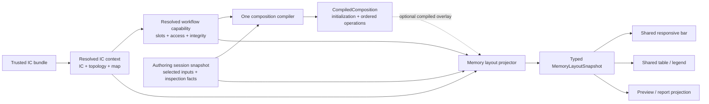

# 0.10.x Maintainability Working Design — Memory, Hex, and Verification

Status: continuation of the promoted workshop record.

This document preserves detailed reasoning and evidence behind the canonical
[0.10.x maintainability specification](../../SPEC.md#15-010x-maintainability-program-specification).
It is not an ADR, executable contract, profile, support claim, or independent
firmware-fact authority.

### Memory layout is one linear IC-first projection

“Memory map,” “composition coverage,” and “visual layout” are different
concepts and must not be owned by one presentation DTO:

- **Physical memory map** is an IC/topology fact: canonical address spaces,
  regions, ownership, kind, and half-open ranges.
- **Composition coverage** is workflow state: initialization plus the ordered
  operations and declared processor effects of one resolved capability.
- **Visual layout** is a Presentation rendering of those typed facts using the
  current language, theme, available width, and accessibility settings.

The current trusted-model audit confirms that physical geometry is normally
declared rather than calculated by a workflow. Across the current built-in
family documents, 631 of 631 regions in 52 region sets have an explicit
`start + length`. Twenty-six of 79 image maps add topology requirements, but
resolution selects one declared map/region-set variant; it does not synthesize
new ranges from an IC count. The current 13-row TP flash-map evidence follows
the same pattern: explicit region starts/lengths plus applicability/visibility
rules. NT51950/NT51951 capacity and AB-bank choices are fixed resolved variants,
not permission for Presentation to infer layout from a filename or length.

Dynamic composition coverage remains legitimate: General mappings are
user-authored operations, selected input length may participate in validation,
and resolved plan operations determine final ownership. Those facts overlay a
declared or explicitly authored address space; they do not make the underlying
IC physical map a UI calculation.

The intended data flow is linear:



The conceptual `MemoryLayoutSnapshot` contains only typed, source-neutral
facts:

- `CapabilityFingerprint`, `ResolutionToken`, and address-space `DefinitionId`;
- capacity and canonical physical regions;
- exact projection state and stable issues;
- before and after coverage segments;
- non-geometric pending/blocked items with artifact/part identity,
  prerequisite, known input length when available, and next-action code;
- half-open ranges, region/artifact/source-space identities, semantic roles,
  change dispositions, and contributing operation identities; and
- declared processor/integrity effects only within their approved write
  ranges.

It does not contain localized sentences, color strings, Avalonia brushes,
fixed pixel widths, or group identity inferred from a display label.

Color uses one global semantic Presentation vocabulary across Merge, Replace,
AB, Memory Layout, legends, and report projections:

- Domain/Application output separate typed dimensions such as artifact owner,
  artifact/part role, physical region kind, change disposition, processor
  effect, and interaction state;
- the memory snapshot never carries a HEX/RGB value, Avalonia brush, palette
  name derived from an English label, or a precomputed pixel width;
- Presentation maps semantic roles to shared theme tokens for light, dark, and
  high-contrast modes and calculates geometry from the actual available width;
- the same semantic role receives the same token in every IC and workflow;
- change/kept, A/B identity, selection, warning, and pending/blocked state are
  not silently collapsed into the firmware-owner color dimension; and
- labels, patterns, borders, icons, or text accompany color so evidence never
  depends on color perception alone.

The palette and primary-fill rule are accepted. The projector derives one
typed `MemoryContentRole` from the canonical artifact/part/physical-region
facts; that role alone selects the primary fill. Workflow disposition, bank or
endpoint identity, diagnostic severity, observed change, selection, and focus
remain separate typed dimensions rendered through patterns, boundaries,
markers, icons, and text. Profile data may select semantic firmware roles but
cannot choose product colors. This lets a future theme change update one token
map without changing firmware definitions, compiled plans, or report truth.

One pure Application projector performs the coverage algorithm:

1. seed the complete output range from `ImageInitialization`;
2. apply `CompiledComposition.Plan.OrderedOperations` in sequence using checked
   half-open split/overlay/merge rules;
3. retain operation/source/region provenance on every resulting segment; and
4. add only profile-declared processor effects, without pretending that
   pre-run declared authority is an observed post-run byte difference.

Before coverage, after coverage, operation rows, the visual bar, and its
supporting table are therefore different views of the same projection. Merge,
Replace, AB, and General modes do not implement separate drawing semantics.
They do, however, expose different valid workflow dispositions:

| Workflow | Pre-execution visual dispositions | Meaning |
| --- | --- | --- |
| Standard Merge | `PendingInput`, `WillWrite`, plus the resolved physical `Blank`/`Reserved` skeleton | Merge initializes a blank output. The default IC/topology layout remains visible before file selection. A missing file creates `PendingInput` only for the artifact/placement that actually requires it; a selected admitted input becomes `WillWrite`. There is no reference image and therefore no `Kept`. |
| AB Code Merge | `PendingInput`, `DpAbBase`, `TpaOverlay`, `TpbOverlay` | AB is still Merge. The supplied DP AB image is the base/seed and the TPA/TPB sections are overlays at resolved bank destinations. Missing required TPA/TPB is pending; no region is described as Replace or Kept. |
| Replace | `Kept`, `WillReplace`, plus pending/blocked input state | Replace clones a reference/base image. Unselected or unaffected reference ranges are `Kept`; admitted selected operations are `WillReplace`. |

General Merge's blank initializer is rendered as a low-contrast neutral surface
with a restrained fine-dot pattern, never as `Kept`. Its summary states the
exact initializer byte, for example **Blank fill: 00**, **Blank fill: FF**, or
another declared byte. Selected mappings use the normal `WillWrite`
disposition. General Replace instead starts from the Reference and therefore
uses the established striped `Kept` disposition outside selected
`WillReplace` mappings.

`Changed` and `Unchanged` are observed comparison outcomes only after Preview
or Build has produced byte evidence. They must not be used as aliases for
planned `WillWrite`, `WillReplace`, or `Kept`. Likewise, a single Boolean such
as the current `IsChanged` cannot represent workflow operation disposition,
reference preservation, selection, and observed diff truth. The typed snapshot
keeps these dimensions separate and the common renderer composes the relevant
ones for the active workflow.

The visual design must make the small Replace-only state set unambiguous:
`Kept` and `WillReplace` receive non-color cues such as pattern, border, icon,
or label, while Merge avoids showing those concepts entirely. The existing
kept diagonal pattern remains the non-color cue and is strengthened through the
shared treatment below; a weak accent outline alone is not sufficient evidence
of state.

The owner accepted the following global visual grammar. It preserves the
current overall palette while separating firmware identity from workflow state.

#### Firmware role hue

The primary fill hue answers **what owns or supplies these bytes**, never
whether the range is selected, valid, changed, or kept. The light-theme anchor
colors preserve the current recognizable palette:

| Semantic role | Light-theme anchor | Use |
| --- | --- | --- |
| DP / DP AB | blue `#2563EB` | Display/Initial Code and the DP AB seed |
| TP / TPA input coverage | green `#16A34A` | TP normal source/overlay in Merge and AB composition coverage; it is not a parent color that CtrlRAM Replace must render first |
| TPB / backup TP work | violet `#7C3AED` | Backup TP input/work and B-specific overlay |
| LDC | orange `#F97316` | LDC artifact/part |
| General source / vector-like data | teal `#0D9488` | Explicit user mapping or neutral data-source role |
| Reserved / base-neutral structure | slate `#64748B` with `#CBD5E1` boundary | Reserved, unowned, or neutral physical structure |

Warning amber and error red are reserved for diagnostic state, not normal
region identity. A legacy subtype whose current hue resembles severity must
always carry its explicit label and is a migration item for the shared token
map.

These values are Presentation theme-token anchors, not profile facts. Dark and
high-contrast themes provide corresponding role tokens; Domain, Application,
Bootstrap, reports, and trusted bundles never carry the color values.

#### CtrlRAM uses a dedicated subtype palette

The current pinned TP Flash Map contains 83 CtrlRAM rows and 21 distinct
region-id shapes. Their semantic roots are `normal`, `nf`, `mp`, `vn`, `diff`,
`dlm`, and `vector`; the remaining variation describes master/slave side and
topology visibility. One undifferentiated TP green therefore loses useful
CtrlRAM identity, while assigning a unique color to every physical row would
make the layout unlearnable.

The accepted model separates three visible dimensions:

```text
CtrlRAM subtype
  x endpoint role / side
  x topology applicability
  x Replace disposition
```

- subtype selects the role hue;
- master, slave, left, and right use compact `M`/`L`/`R` markers, labels, and
  grouping rather than new hues;
- topology selects which evidenced physical regions exist; it does not select
  a color;
- `Kept`/`WillReplace` applies the already accepted hatch/solid disposition
  treatment over the subtype hue.

The light-theme subtype anchors intentionally avoid diagnostic red
and warning amber:

| CtrlRAM subtype | Light anchor | Notes |
| --- | --- | --- |
| Normal | cyan `#0891B2` | normal runtime CtrlRAM |
| NF | indigo `#4F46E5` | replaces the current error-like red |
| MP | violet `#7C3AED` | MP-specific payload |
| VN | magenta `#DB2777` | VN-specific payload |
| DIFF / DLM | olive `#4D7C0F` | shared derived/cascade CtrlRAM role; explicit label still distinguishes DIFF from DLM |
| Vector | teal `#0F766E` | vector payload |
| Unknown/future | slate `#64748B` | explicit unsupported/unknown fallback; never hash a label into a random color |

CtrlRAM is not forced through a visual TP-artifact parent. The already accepted
memory model provides the required distinction:

- the **physical map** answers what the destination is. In CtrlRAM Replace and
  IC Details it identifies the region directly as `Normal CtrlRAM`, `NF
  CtrlRAM`, `MP CtrlRAM`, and so on. `owner = tp` is a secondary typed fact,
  filter, or detail rather than the primary label/fill;
- **composition coverage** answers which source writes it. Standard Merge may
  therefore show a TP BIN `WillWrite` segment without exposing CtrlRAM subtype
  colors, because CtrlRAM selection is not part of that workflow; and
- CtrlRAM Replace composes the subtype hue directly with `Kept` or
  `WillReplace`. It does not first paint a green TP layer and then expand it.

The dedicated subtype palette consequently appears in CtrlRAM-focused
selection, CtrlRAM Replace memory coverage, IC Details when physical region
kind is shown, its supporting region list, and CtrlRAM report grouping. A
source BIN shared by multiple physical destinations keeps one subtype hue and
gains a `Shared`/link marker; it does not invent a separate color. Narrow
segments move subtype, side, disposition, and range text to the supporting
region row rather than dropping identity.

CtrlRAM Replace does not render a standalone subtype or `Kept`/`WillReplace`
legend above the bar when the labeled region list is present below it. Such a
legend repeats the same color, identity, and disposition while consuming the
narrow right-hand panel, and scales particularly poorly for multi-IC layouts
such as NT51927 with three ICs. The supporting list is the legend and the
inspectable detail view:

- every row identifies IC/endpoint, explicit CtrlRAM subtype, half-open range,
  and textual/icon disposition;
- bar-segment hover and keyboard focus expose that same typed row content;
- color and hatch accelerate scanning but never replace the row's
  `Kept`/`Will replace` text and non-color cue; and
- multi-IC rows retain physical address order within compact IC/endpoint
  groups. A group containing `WillReplace`, warning, or error is expanded by
  default; an all-`Kept` group may remain a one-line count/range summary until
  activated.

The grouped list uses the same restrained inline-disclosure behavior as other
information surfaces, not a second large accordion control. Removing the
standalone legend is specific to a self-labeling panel; a visualization without
an adjacent labeled list must still provide an accessible equivalent key.

The target resolved region exposes closed typed subtype, endpoint role/side,
and topology applicability. Presentation maps those types to tokens. It must
not continue the current `SourceLabel.Contains(...)` color selection or put
color names/HEX values in a profile.

CRC, Header, Header Copy, and POSTBUILD never receive independent Memory Layout
colors. Header/CRC structures do not become primary user-authoring segments or
legend entries; their processor-only authority, execution result, and byte
evidence remain in the technical report unless a warning/error must be
promoted. When a displayed user range has declared processor involvement, its
hover/focus card may show the stage and authority as secondary technical facts
without repainting the range.

#### Workflow disposition effects

One renderer composes the role hue with exactly one planned disposition:

| Disposition | Fill and boundary | Non-color cue |
| --- | --- | --- |
| Resolved layout, input not selected | low-emphasis tint of the role hue, thin muted role boundary | explicit artifact/region label; no `Kept` or `Changed` wording |
| `WillWrite` | solid role hue with a stronger same-role boundary | write/arrow glyph and `Will write` in the legend or segment when space permits |
| `DpAbBase` | solid DP blue | `DP AB base` label; A/B bank boundaries remain explicit |
| `TpaOverlay` | solid TP green | `TPA overlay` label and A-bank identity |
| `TpbOverlay` | solid backup violet | `TPB overlay` label and B-bank identity |
| `Kept` | low-emphasis underlying role tint plus 45-degree diagonal stripes | preserve/lock glyph and `Kept` label |
| `WillReplace` | solid replacement role hue with a strong boundary | replace glyph and `Will replace` label |

File-backed mappings, Hex Overwrite, and Hex Fill use the same
`WillWrite`/`WillReplace` disposition rather than receiving new fill colors.
Their source kind is a separate typed fact: a compact file, overwrite, or fill
glyph appears in the segment when space permits and always appears in the
supporting row/hover/focus card. Color alone never distinguishes mapping
source.

The kept pattern uses a restrained one-pixel diagonal stroke at approximately
eight-pixel pitch in normal themes. It is dense enough to remain visible on a
long bar but does not obscure the underlying role hue or address boundary.
It replaces the current weak blue-outline-only signal. `WillReplace` does not
use stripes, so the two Replace states remain distinguishable even in
grayscale.

The default physical layout remains visible before inputs are selected. Its
low-emphasis fill means **known fixed structure**, not disabled, preserved, or
written. When an admitted file is selected, only its resolved destinations
move to the solid `WillWrite`/overlay/`WillReplace` treatment.

#### Pending, blocked, observed diff, and interaction

- `PendingInput` without resolved geometry is a separate non-geometric
  blue/info callout with prerequisite and next action, such as **Load TP
  first**. It never creates a gray or hatched pseudo-range.
- `Blocked` keeps every still-valid physical range visible and adds a separate
  warning/error issue with icon, one-line summary, and next action. It does not
  repaint the whole memory bar red.
- A user-mapping overlap marks only the exact half-open intersection with the
  shared Error surface/rail and conflict icon. The hover/focus card names both
  mapping ids and the intersection. Error red remains diagnostic state rather
  than a new firmware-role or mapping-source hue.
- `Changed`/`Unchanged` is a comparison dimension available only after
  Preview/Build. A changed result uses an explicit delta glyph/label and a
  high-contrast comparison rail or outline; it does not replace the artifact
  hue or reuse the planned-operation pattern. Hex Diff remains the byte-level
  evidence view.
- Pointer hover only strengthens the existing boundary or surface. Selection
  and keyboard focus use an external accent/focus ring and never change the
  role fill or disposition pattern. No hover, focus, or selection effect may
  be mistaken for `WillWrite`, `Kept`, or `Changed`.
- Segment text is rendered inside the bar only when enough width and contrast
  exist; otherwise the shared legend/table carries the label, range, and
  state. Technical ranges use the shared monospace role.

A standalone legend is conditional rather than permanently reserved. The
renderer shows a compact legend only when at least two non-obvious visual
states are simultaneously present and no adjacent self-labeling region list
already provides the equivalent accessible key. Segment labels and the
hover/focus/supporting card remain the primary explanation. A conflict is
always named directly and never depends on legend lookup.

Light, dark, and high-contrast acceptance tests cover boundaries, labels,
patterns, focus, grayscale/non-color recognition, and minimum text contrast.
High contrast replaces transparency-dependent tints with system surfaces,
explicit boundaries, labels, and the same kept pattern. State transitions do
not pulse or animate; reduced-motion mode therefore preserves identical state
evidence.

The physical map may be shown as soon as IC, topology, and map resolution are
valid. Exact output coverage is shown only after compilation succeeds. Geometry
and unresolved status are separate collections:

- every rendered geometry segment has an evidenced, resolved half-open range
  in a named address space;
- a selected artifact's known byte length may be displayed in its slot,
  supporting table, or pending item even when its destination is unresolved;
- an unresolved placement has no synthetic start/end, estimated proportional
  width, hatched envelope, or gray placeholder range;
- its non-geometric pending item names the affected artifact/part,
  prerequisite, and next action; and
- a blocked item names the actual validation/evidence issue rather than
  repeating a missing-input prompt.

For an NT51950 session that retained DP after TP became absent, the UI may keep
the DP filename and size but invalidates terminal DP health; an independent DP
selection is disabled until TP is ready. It draws every already resolved
physical-map range. A topology-dependent
Initial Code/LDC destination appears separately as **Initial Code placement —
Load TP first** rather than as a guessed block. Supplying TP atomically
reprojects the snapshot with exact placement. If TP is present but invalid, the
pending item becomes the typed blocked reason instead of asking for TP again.

Presentation may visually distinguish genuine resolved states such as
reserved, unchanged, selected, or processor-owned ranges; this rule forbids
only styling an invented range as if it had firmware geometry.

Presentation then performs only view policy:

- one formatter localizes typed artifact/operation/region roles;
- theme tokens map semantic roles to colors and kept/changed patterns;
- one responsive control calculates geometry from `ByteRange` and total
  capacity at the current available width; and
- a typed region/topology facet selects grouping, while Presentation decides
  ordering and default expansion.

Current implementation evidence shows why this seam is needed:

- Standard Merge and V2 DP Replace already start from a compiled composition,
  but rebuild separate display rows and coverage DTOs.
- AB coverage partly reconstructs TP ownership from compiled map provenance
  instead of applying one generic plan projection.

Characterization and projector tests must prove that pending artifacts retain
their known sizes without receiving a fabricated `ByteRange`, every rendered
segment is within the resolved address-space capacity, valid TP input replaces
the NT51950 pending item with exact placement, invalid TP produces a blocked
item, and no Presentation code constructs firmware ranges from labels or file
lengths. Presentation/architecture tests additionally require identical
semantic roles to resolve to the same theme token across workflows, prohibit
HEX colors and pixel widths in Domain/Application/Bootstrap memory contracts,
cover light/dark/high-contrast contrast and non-color cues, and reject
source-label parsing as a color or grouping authority.
- CtrlRAM coverage is assembled separately from the TP flash-map/postbuild
  catalogs and selected region ids.
- Bootstrap emits English labels, hex colors, and a fixed `300`-pixel
  `BarWidth`.
- `CoverageFill` selects colors from `SourceLabel`, while
  `ReplaceRegionGroupBuilder` infers Cascade/Common/Master/Slave/Base groups
  from slot ids and label substrings.
- Presentation normalizes more labels and derives explanatory sentences before
  shared XAML templates render the result.

The existing shared XAML templates are useful rendering assets, but their
input contract is too visual and too string-driven. The target is a deep memory
layout module with one small typed interface, not another wrapper around
`WorkbenchMemoryDisplay`.

The migration order is:

1. characterize range geometry, before/after ownership, pending/blocked states,
   selection changes, grouping, localization, accessibility, and responsive
   rendering for representative modes;
2. introduce the typed snapshot and pure projector behind the current adapter;
3. migrate Standard Merge and V2 DP Replace first because they already compile
   an exact operation plan;
4. migrate AB and General through the same projector;
5. migrate CtrlRAM after its resolved capability/compiled plan exposes every
   display-relevant region and declared processor effect, retaining a narrow
   compatibility adapter until then; and
6. move localization/theme/geometry fully into Presentation, then delete
   string-based grouping, color selection, fixed widths, and parallel display
   construction.

### One read-only Hex Viewer under every Hex experience

The shared foundation is a read-only Hex Viewer. The Hex Editor composes that
viewer with editing commands and editable interaction; it does not require
classical UI-control inheritance. Report Hex Diff supplies comparison data,
range navigation, and review decorations to the same viewer foundation.

The accepted seam is Presentation-owned because it is a rendering and
interaction module, not a source of firmware truth. Its smallest public input
is one immutable bounded `HexViewportSnapshot` containing numeric document
length/start offset, visible primary bytes, optional comparison bytes, selected
address, and typed cell decorations such as changed, search-match, or
structural-boundary roles. It does not contain formatted address/HEX/ASCII
strings, brushes, mutable cell ViewModels, commands, filesystem handles, or
localized firmware conclusions. For the first Hex extraction slice, the module retains the current
16-byte row invariant internally rather than exposing an unevidenced
configurable row width.

The viewer owns only reusable display/navigation behavior:

- bounded/virtualized row rendering and honest unavailable-range treatment;
- address-space-qualified address, hexadecimal, and ASCII formatting;
- primary and optional comparison planes;
- hit testing, byte/range selection, address navigation, and viewport-local
  cell bounds;
- typed display decorations supplied by a host-owned search/diff/editor
  projection; and
- accessible byte and row descriptions.

Its source-neutral output is a small interaction intent carrying the numeric
address, trigger kind, and viewport-local bounds required by the host. The
intent set covers viewport/scroll requests, selection or activation, and
context requests. It does not expose an edit command. Search execution and
large-file byte acquisition remain with the host/Application capability; the
viewer only renders their bounded results and match decorations.

The viewer does not know firmware workflows, report acceptance policy, editor
mutation rules, save behavior, or processor semantics.

The editor is composition, not subclassing and not a viewer `IsEditable`
branch:

```text
RawBinaryEditorSession (Application mutable state)
    -> HexEditorViewportAdapter (Presentation projection)
    -> HexViewportSnapshot
    -> HexViewportControl (always read-only)
    -> Hex interaction intent
    -> HexEditOverlay / editor host
    -> typed editor command
    -> RawBinaryEditorSession
```

Viewer and Editor reuse the same `HexViewportControl`, renderer, typography,
geometry, theme roles, and decoration rules inside the existing Avalonia
Presentation module. The first Hex Viewport implementation slice does not
create a second look-alike control or a new package merely to express this
seam. The read-only host adds only viewer-appropriate navigation/review chrome;
the Editor host adds the existing editing chrome, overlay, and commands around
the identical viewport surface. A separately distributed package is justified
only by a later real cross-application consumer, not by this refactor.

The edit overlay listens for an activation intent, positions the existing
inline editor over the supplied cell bounds, validates the proposed value, and
sends an address-based editor command. Overwrite, insert/delete, structural
identity, search, undo/redo, and persistence remain owned by the Application
editor session and its Presentation host. The Viewer never receives
`EditValue`, Commit, Undo, or Save.

The report adapter continues to own verified-snapshot identity,
retained-preview honesty, difference-range ordering, acceptance/review state,
and evidence. It projects immutable primary/comparison bytes and decorations
into the same viewport snapshot and may treat activation as selection only.
A historical report must never reread a source BIN to fabricate missing
comparison bytes.

Current evidence supports this direction:

- `RawBinaryEditorSession` already owns a bounded Application viewport and
  immutable-source/work-buffer editing semantics.
- `HexEditorViewportControl` uses one custom-drawn visual rather than hundreds
  of child controls, but it binds directly to `HexEditorWorkspaceViewModel`.
- `ReportHexDiffViewModel` separately implements 16-byte windowing, address and
  ASCII formatting, before/output rows, changed masks, and navigation.
- `V0911KeepsRawEditorAndReportDiffRenderersSeparate` intentionally froze that
  separation for the `0.9.11` scope. It is historical scope protection, not the
  target architecture.

The migration must preserve or improve the current editor functionality and
custom-rendered performance. M2 first captures viewer navigation, selection,
comparison, accessibility, large-file windowing, and all editor mutations.
M3 then extracts the source-neutral Presentation viewport snapshot/intent
contract, shared renderer, and editor/report adapters. The old separation test
is replaced only after equivalent behavioral and boundary coverage exists.
Application remains authoritative for editor bytes and report evidence;
Presentation owns only the bounded rendering snapshot and interaction state.

The owner explicitly accepts the current Hex Editor as a strong module and
presentation baseline. The implementing `0.10.x` slice must retain its visible address/HEX/ASCII
layout, custom-drawn surface, inline byte editor, selection/hover behavior,
reference comparison, structural edit visualization, context operations,
search/go-to, range edit, insert/delete, undo/redo, changed-block navigation,
save flow, keyboard behavior, and accessibility unless a separately approved
improvement demonstrably preserves the original capability.

Extraction alone is not a performance claim. The implementation must preserve
the current bounded custom renderer rather than replace it with a child control
per byte or an `ItemsControl` grid. The immutable snapshot is a visible window,
not a whole-document copy. Relatively cold row bytes/comparison planes and
typed decorations change only when the source, viewport, search result, or
edit result changes; hot hover, focus, caret, and selection feedback remain
renderer-local or use a small interaction state so pointer movement does not
allocate/reproject the viewport. A byte overwrite invalidates only affected
visible cells/rows; a structural insert/delete may reproject the bounded
window but never materializes the whole tail.

Before extraction, characterization records current large-file open/first
paint, scroll and hit-test latency, selection/hover allocation, go-to/search,
inline edit commit, structural edit, and retained memory at representative
document sizes. The extracted Viewer/Editor must be equal or better on the
agreed measurements and preserve screenshot/interaction parity. A slower
shared Viewer is not accepted merely because it removes duplicate code.
For the standalone Editor, the expected first extraction result is equivalent
performance followed by measured improvement in hot scrolling, hover, and
localized repaint where duplicated projection or allocation is removed; its
whole editable buffer, structural edits, search, and undo history may retain
similar costs. The larger memory and projection benefit is expected when
Report Diff and BIN Inspector stop maintaining parallel row/window models.
These are hypotheses to measure, not permission to claim an unmeasured speedup.
Replacement requires representative before/after render captures, automated
visual comparison, interaction smoke, performance characterization, and final
owner acceptance of the real editor feel.

### Verification concurrency and measured critical path

The canonical verifier currently serializes every selected top-level stage:
structure, repository-script tests, Python verification, and .NET
verification. A deterministic equal-duration scheduling probe observed
`maxConcurrentStages = 1`; the proposed scheduler therefore has a red-capable
behavioral baseline rather than only a source-code assumption.

CI requires a different reading from local `--all`:

- ordinary PR/push CI already starts policy, Python, and .NET as separate jobs;
  internal top-level scheduling does not stack an additional three-way speedup
  on those jobs;
- PR run `30084322462` completed policy in about 7 seconds, Python in about
  35 seconds, and .NET in about 277 seconds, so .NET is the wall-clock critical
  path;
- the Python and .NET jobs both ran the repository-script suite. Its observed
  spans were about 12.1 seconds on Linux and 28.7 seconds on Windows. Giving
  that suite one CI owner removes approximately 29 seconds from the measured
  critical path, reducing that representative PR run from about 277 to 248
  seconds, roughly a 10% wall-clock improvement;
- release candidate run `30085682223` spent about 316 seconds in its single
  `Verify release source` step. Structure, repository scripts, and Python
  preceded the .NET lane by about 31 seconds, so bounded top-level concurrency
  has an initial measured opportunity of roughly 10% there as well; and
- package preview and release workflows that invoke `--all` inside one Windows
  job receive this concurrency benefit, while ordinary PR CI primarily benefits
  from eliminating duplicate ownership.

The expected gain is therefore meaningful but bounded. The first slice does
not claim a multiple-times speedup. After it lands, lane and command timings
must be emitted and compared on local Windows, PR CI, package preview, and
release candidate workflows. Deeper optimization targets the measured .NET
critical path only; restore, format, build, test, and fixture dependencies are
not split merely to increase apparent concurrency.

Coverage rollout follows the same measure-before-gating rule. `0.10.0` records
the executed .NET/Python line and branch baselines. CI then prevents overall
regression, applies a non-decreasing changed-module ratchet, and uses 85% line /
80% branch as the minimum target for new or substantially changed
Domain/Application code. The existing Beta/1.0 percentages remain milestone
targets until the collector, baseline, exclusions, and runtime cost are
reviewed and the repository-wide fail-under is explicitly promoted.

The production-size objective is separate from coverage.
[`ADR 0021`](../adr/0021-code-size-ratchet-and-convergence.md) owns its exact
scope, frozen baseline, target, transition into the canonical verifier, and
anti-gaming rules. Each implementation slice reports its delta, but line
reduction never replaces behavior, architecture, golden, processor,
accessibility, security, or release evidence.
