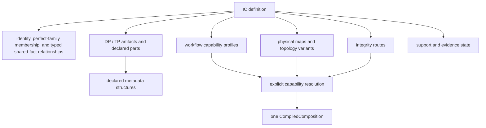

# 0.10.x Maintainability Working Design — Resolution and Ownership

Status: continuation of the promoted workshop record.

This document preserves detailed reasoning and evidence behind the canonical
[0.10.x maintainability specification](../../SPEC.md#15-010x-maintainability-program-specification).
It is not an ADR, executable contract, profile, support claim, or independent
firmware-fact authority.

## Accepted target model

### IC is the query root, not a god object

An IC is the unique root for resolving supported composition behavior, but it
does not own every fact in one large class or JSON document. It composes smaller
authoritative models:



Execution resolution remains explicit:

```text
IC + workflow + topology + applicable map/version inputs
    -> one resolved capability
    -> one CompiledComposition
```

`CanonicalCapabilityCatalog` names the logical route-capability authority; it
does not require a graph database and is not another firmware-fact store. For
each exact IC/workflow/IC Count/map-variant route it references the canonical
trusted definitions and keeps these four facts independent:

1. one shared authoring availability for UI and CLI;
2. runtime execution admission;
3. evidence classification; and
4. publication/support status.

Application owns this runtime catalog contract and its join policy. Profiles
owns trusted definition normalization, physical-map resolution, and canonical
compilation. Infrastructure supplies hash-validated trusted bundles,
exact-route authoring policy, evidence classification, and publication policy
through ports. Bootstrap only wires those owners. A bundle-index entry trusts
exact bytes; a composition profile declares firmware behavior; authoring policy
declares one exact-route `Available`/`Unavailable` result shared by UI and CLI;
evidence classifies regression authority; publication policy classifies the
support claim. UI and CLI cannot override or diverge from authoring policy. The
catalog references these typed identities and does not infer one from another.
A missing authoring-policy entry is not `Unavailable`; it is a fail-closed
materialization error. A route-scoped legacy migration adapter may temporarily
project `Missing` for inventory/reporting, but cannot expose Build through that
state, and the route cannot join the canonical catalog until its policy is
explicit.

Normal UI authoring selectors and normal CLI list/help output enumerate only
`Available` exact routes. They do not fill authoring pages with disabled
`Unavailable` options. A direct CLI request for an `Unavailable` route returns
one stable typed issue and cannot compile or execute it. The full Support Matrix
continues to enumerate `Available` and `Unavailable` with exact policy
provenance/reason, keeping deliberate policy distinct from missing
materialization data.

Publication policy follows the same explicitness rule. Every canonical exact
route declares one versioned `PublicationStatus`, including intentional
`Internal`, `Candidate`, or `TestOnly` classifications. An omitted entry is a
fail-closed materialization error rather than implicit `Internal` or
`Unsupported`. A route-scoped legacy adapter may temporarily report the
existing `Unclassified` value for migration inventory but cannot turn it into a
public support claim. `Unclassified` is not part of the target publication
vocabulary: every canonical route must choose `Supported`, `Candidate`,
`Internal`, or `TestOnly`, and the legacy enum/value is deleted after its
migration denominator reaches zero. `EvidenceStatus.Missing` is different: it
is a valid explicit evidence classification that truthfully records the absence
of qualifying evidence.

`RouteId` is a stable logical identity, not a semantic revision checksum. It is
formed from IC, workflow, IC Count variant, and map variant. Integrity route,
processor binding, artifact/metadata definitions, compiled operations, and
other firmware-semantic inputs belong to `CapabilityFingerprint`; they do not
create another Support Matrix row for the same logical route.

Authoring, publication, and evidence decisions bind both the stable `RouteId`
and an expected `CapabilityFingerprint`. If any firmware-semantic input changes,
the old decisions become stale and cannot authorize the current route until
explicit reviewed supersessions pin the new fingerprint. Stale authoring policy
cannot expose Build; support or evidence classification is likewise never
inherited merely because the stable route id is unchanged.
The current migration `SupportRouteIdentity` includes integrity identity/hash;
that representation is retired as the canonical catalog adopts the split
identity/fingerprint contract.

Execution admission is derived, not hand-authored catalog data. The canonical
compiler proves admission by producing a valid `CompiledComposition` eligible
for the engine. The current machine may still be unable to execute that
composition; `RuntimeDependencyReadiness` reports that refreshable environment
state without changing trusted definitions or admission. `Internal`,
`Candidate`, and `TestOnly` are publication classifications, not alternate
authoring states.

A valid evidence resolution of `Missing` for the current fingerprint is not
the same as corrupt or untrusted evidence input. `Supported` plus
`EvidenceStatus.Missing` remains materializable and does not change the Build
expression. It creates a critical certification inconsistency in Support Matrix
and System Information and blocks support promotion, CI/release, and formal
certification. A new `Supported` decision must pin the current fingerprint and
pass the route/risk-specific evidence and human-review gate; a global evidence
rank is rejected because generic mapping, fixed copy, Replace, and external
processor routes require different proof. Malformed, required-but-absent, or
hash-invalid policy/evidence source data is instead a catalog integrity failure
and follows atomic last-known-good or cold-start fail-closed behavior.

`ResolvedCapability` is the selection-scoped Application projection of this
authority. `SupportMatrix` is the enumerated reporting and CI projection. UI,
CLI, Settings, and support reporting query these projections rather than
maintaining their own IC support lists. A route that is selectable but not
executable is invalid. An authoring-unavailable route remains an explicit
Support Matrix row with independent publication/evidence state; no publication
classification is inferred from its authoring value.

This is the single external resolution seam. UI, CLI, artifact inspection,
composition compilation, memory projection, and live report generation must
not independently query a TP Header catalog, re-resolve a family alias, or
re-evaluate topology applicability. They consume the same resolved capability
snapshot and its resolved artifact bindings, metadata structures, header
instances, applicability states, and typed pending/blocked outcomes.

There is no public `TpHeaderResolver`. Header-definition lookup, alias
expansion, repeated-field expansion, instance placement, and applicability
evaluation are internal implementation of IC-rooted capability resolution.
The generic BIN inspector accepts resolved metadata-structure instances and
immutable artifact bytes; it does not accept an IC id or recover selection
context from the bytes. The compiler then lowers behavior bindings from that
same resolved snapshot into one `CompiledComposition`.

Historical reports remain the deliberate exception to live resolution: report
generation records the resolved identities, semantic results, provenance, and
diff classification into the report snapshot, while a later report viewer
renders that snapshot without re-resolving it against current trusted bundles.
This preserves historical meaning without creating another firmware-fact
authority.

Application owns `ResolvedCapability` as one immutable, read-only query/session
snapshot, not a replacement god DTO. It references the existing Domain
`ResolvedFirmwareImageMap` when physical resolution is available and a
`CompiledComposition` when compilation has succeeded. It neither replaces nor
duplicates them: `ResolvedFirmwareImageMap` remains physical resolution
authority and `CompiledComposition` remains sole execution authority. Its
target shape is a small stable root composed from strongly typed child models:

```text
ResolvedCapability
|-- CapabilitySelection
|-- ResolvedArtifactPlan
|-- ResolvedMetadataPlan
`-- ResolvedCompositionCapability
```

These child responsibilities and the cross-cutting terminology contract are
accepted. The root owns the selected IC/map/topology/workflow facts,
trusted-definition provenance, one deterministic `CapabilityFingerprint`, and
one opaque `ResolutionToken`. It stores neither an overall readiness status nor
a second issue/outcome collection. Every child belongs to that same root and
can be checked against the same `ResolutionToken`. A child from one resolution
must never be combined with a child from another resolution, even when their IC
labels happen to match.

`CapabilityFingerprint` covers only the canonical facts that can change
firmware resolution, inspection, or compilation for the selection: applicable
map, artifacts and parts, metadata structures, workflow behavior, integrity
routes, and their resolved selection/variant references. It does not include
`AuthoringAvailability`, evidence, publication status, or current-machine
runtime dependency readiness. Those inputs retain separately traceable
version/hash provenance. Every catalog publication still generates a new
`ResolutionToken`, including a policy-only publication, which forces consumers
to re-evaluate action/readiness projections while permitting firmware
inspection caches keyed by an unchanged capability fingerprint to remain
eligible.

Fingerprinting is one versioned semantic chain, not a set of independent
serializers. Trust admission first verifies the exact raw-document byte hash
without normalization. That hash feeds the canonical definition hash;
capability fingerprinting references it and adds only the resolved selection;
compiled-plan fingerprinting adds only lowering output; run/Preview identity
adds only accepted run inputs/options. From the canonical definition upward,
one language-neutral encoding applies. No layer repeats lower-layer fields,
ranges, operations, or processor facts. Reflection, dictionary order, C# type
names, and storage/JSON paths are excluded. Semantic format changes bump the
fingerprint version and make pinned policy stale pending explicit review.
`RouteId`, `ResolutionToken`, `AuthoringRevision`, and `FileStamp` remain
distinct identity/revision concepts. `FileStamp` captures one selected
external file's accepted byte length and SHA-256; path and filesystem
timestamp are non-authoritative hints. It is not part of the
firmware-semantic fingerprint chain.

Validation follows the same one-owner rule. Contracts intake owns serialized
shape and local bounds; Domain construction owns firmware-semantic invariants;
resolution/compiler owns only selection and lowering; Application owns current
input/session/readiness identity; the processor host owns actual staged
mutation/tool checks. A downstream layer consumes the typed validated result
and does not repeat the same rule, text, or issue code. Local engine/host
memory-safety and execution checks remain mandatory but cannot become alternate
firmware-fact or diagnostic owners. Tests may assert the boundary, but no
unvalidated DTO enters resolution or execution.

Cache behavior is correctness-neutral. Only the immutable trusted-catalog
snapshot, artifact-inspection cache, bounded Hex viewport/page cache, and
runtime-dependency snapshot are admitted cache categories. They have explicit
capacity/lifetime and invalidation owners and use complete definition/content
hashes, capability fingerprint, file stamp, selection/topology identity, or
environment generation as applicable. IC/mode/filename-only keys are rejected.
Authoring state stores identity/revision rather than BIN payload/cache state,
and UI/workflows do not create parallel caches. Clearing every cache produces
the same bytes, readiness, diagnostics, evidence, publication, and support
through canonical recomputation.

The children are not independently populated projections of the same raw
profile data:

- `CapabilitySelection` contains only IC and workflow definition references,
  selected topology and IC count, and selected map/capacity/variant references.
  The root separately records `BundleHash`, trusted-bundle version provenance,
  the derived `CapabilityFingerprint`, and its per-publication
  `ResolutionToken`. Selection never contains firmware ranges, artifact or
  metadata definitions, selected-file state, inspection results, or copied
  child readiness.
- `ResolvedArtifactPlan` contains artifact-instance, input-role, part-definition,
  and normalization-policy references plus topology applicability and typed
  prerequisite/readiness state. It is immutable and contains no selected file,
  drag/drop, progress, icon, disclosure, or other UI-session state.
- `ResolvedMetadataPlan` owns only artifact-instance references,
  metadata-structure definition references, topology applicability, and typed
  prerequisite/readiness results. Canonical artifact/part definitions remain
  the sole owners of locators, fields, ranges, and formatter declarations; the
  Inspector dereferences them through the same resolution snapshot.
- `ResolvedCompositionCapability` contains the workflow/capability definition
  reference, selected map/topology/variant references, artifact-instance
  bindings, typed applicability/readiness/prerequisite state, and only the
  per-run user or inspection values that have no canonical definition, such as
  General explicit mappings or an inspected capacity parameter. It never
  restates canonical mappings, ranges, operations, processor declarations, or
  integrity routes. The compiler dereferences those definitions through the
  same resolution snapshot and materializes the only `CompiledComposition`;
  this child neither defines a second composition nor executes bytes.
- each plan entry owns its local applicability/readiness and typed reason so a
  usable child remains usable when another child is waiting for evidence or an
  artifact. Overall issue lists, action availability, and `CanCompile` are
  derived projections over those states, never independently stored truth.

One firmware fact has at most three semantic forms: its Contracts wire DTO, one
Domain-owned canonical definition, and one resolved/compiled reference carrying
only identity, selected applicability, resolved/per-run state, and execution
identity. Profiles may use private ephemeral normalization state, but not a
consumer-visible semantic mirror. Application, Bootstrap/Workbench,
Presentation, and CLI may project ids, typed status/readiness, decoded values,
formatted values, and issues; they never copy firmware definitions. Repository
callers migrate without compatibility shims for accidental public
implementation types.

The outer `CapabilityResolutionResult` reports failures that prevent any
coherent snapshot from being created, such as an unknown IC, invalid topology
or IC count, an unresolved required definition reference, or an invalid trusted
bundle. It does not manufacture a half-valid `ResolvedCapability`. Once a
snapshot exists, pending input and child-local blocked prerequisites are normal
resolved states rather than fatal resolution failures.

`WorkbenchCompositionService` is only the compatibility facade through which
current UI and CLI callers reach this target. It is not renamed into a
permanent gateway. Migration exposes focused Application use-case contracts for
capability/session resolution, input inspection, Preview/Build execution, and
typed result/report retrieval. Bootstrap retains only DI/composition wiring;
it owns neither long-lived Workbench DTO semantics nor firmware policy. Each
vertical slice records remaining facade callers and lowers its aggregate
ratchet. The last slice proves zero callers and deletes the facade. A single
replacement `IWorkbenchEverything` interface and one service per workflow are
both rejected.

Those contracts are capability-centered rather than workflow-centered.
Application has shared capability query, authoring-session, artifact
inspection, Preview/Build, report retrieval, and runtime-dependency refresh use
cases. Standard/AB/General Merge and DP/CtrlRAM/General Replace vary through
canonical definitions, policies, typed child drafts, and compiled operations;
they do not retain separate service/request/result hierarchies. Typed General
mapping or CtrlRAM child state cannot create another execution/readiness/report
pipeline, and UI/CLI cannot add workflow facades.

NFC is not a supported .NET SDK during this program. Bootstrap,
Presentation, ViewModel, and other implementation types do not become stable
external contracts merely because they are declared `public`. Once all
repository callers, XAML bindings, and tests migrate, those surfaces may change
or be deleted without an indefinite compatibility shim for unknown DLL
consumers. Firmware bytes, CLI behavior, versioned persisted schemas, and
user-visible workflow behavior remain governed compatibility surfaces.

The same boundary applies to documentation. Accidental-public or forwarding
implementation types do not require boilerplate XML summaries that restate
their names. Repeated explanation moves to the canonical contract/type owner.
Persisted schemas and reusable public boundaries remain documented, as do all
firmware, evidence, security, mutation, lifetime, concurrency, and fail-closed
rationales.

The final runtime contains one current trusted-bundle/profile compiler path for
every executable route. Legacy C# built-in profiles, legacy compilation
identity/admission, `LegacyRuntimeExecutable`, and their catalogs remain only
as route-scoped migration seams. The workflow-regression matrix identifies
legacy/current/both authority per route; an R3 legacy owner is deleted only
when its direct or independent evidence gate permits it. `CompiledComposition`
remains the sole execution artifact. Manifest-pinned external `combiner.exe`
processors remain separately governed adapters and are not the legacy runtime
retired by this convergence.

### NT51929 Standard Merge tracer boundary

The first canonical ownership migration is one exact route:
`NT51929 + Standard Merge`. It is deliberately broad in architecture and narrow
in firmware scope. The new catalog/query/command seam is IC-neutral, and the CLI
and the existing NT51929 Workbench wrapper call that same Application seam.
There is no fallback or second executable owner for this route. Other routes
remain available only through a named route-scoped migration adapter whose
remaining callers, parity evidence, and deletion criterion are explicit.

The accepted firmware facts for this tracer are:

- output/map length `0x40000`;
- DP `[0x0000, 0x6000)`;
- explicit gap `[0x6000, 0x7000)`;
- TP `[0x7000, 0x40000)`;
- exactly two compiled copy operations, `copy-tp` and `copy-dp`; and
- no processor stage.

`0x80000` is the NT51929 AB Merge size, not a Standard Merge fact. Processor
behavior is also route-specific: Standard Merge has no POSTBUILD; CtrlRAM
Replace uses the approved legacy Combiner POSTBUILD for its applicable
Single/Cascade routes; AB Merge has no external processor but relocates declared
TP Backup scalar fields. The IC identity alone cannot select or generalize any
of these behaviors.

The tracer proves the general seam only. NT51929 DP Replace plus DPCMI is the
next independent route slice, and remaining headless routes migrate in later
batches before the desktop switches to the focused Application contracts.

### Portable data-only IC onboarding

The `0.10.x` endpoint must allow an IC that fits the existing closed vocabulary
to be onboarded without a per-IC C# service, branch, or UI list. Its versioned
bundle declares IC identity, `PerfectFamilyRelationship` membership or typed
`SharedFactRelationship` references, maps and IC Count
applicability, artifacts, metadata structures, workflow profiles, and evidence
references. A separately versioned, hash-pinned package trust index admits only
reviewed exact bytes.

The contract is designed for independent hosts and later IC-authoring UI:
schemas, fingerprints, validation, resolution, compilation, conformance tests,
and golden vectors cannot depend on Avalonia, Workbench DTOs, reflection, or
mutable UI state. A bundle cannot contain executable plugins, scripts, dynamic
assemblies, or arbitrary processor implementations. A genuinely new locator,
operation, integrity behavior, or processor kind requires a reviewed extension
of the closed schema/domain vocabulary.

A later authoring UI creates and validates an untrusted candidate only. It
exports the candidate for independent review, CI/evidence, and any required
firmware-owner approval. Promotion changes the hash-pinned trust index, after
which the runtime atomically publishes a new immutable catalog snapshot. The UI
does not mutate the live catalog, and trusted, execution-admitted, and
published/supported remain separate dimensions.

Exact-route keys are unique across the materialized catalog. Duplicate entries
and conflicting definition identities or hashes are errors; load order,
version preference, and last-write-wins are forbidden. A failed refresh does
not partially replace a catalog: a running process retains the last-known-good
snapshot and publishes the refresh diagnostic separately. On cold start, no
valid snapshot means no Build capability. Application exposes one typed fatal
catalog diagnostic so UI and CLI can present the same outcome, impact, action,
and technical evidence without parsing loader exception text.

Catalog refresh is command-driven. Startup performs one complete
materialization. During the process lifetime, only an explicit Application
`Reload Catalog` command may build and publish a replacement snapshot; runtime
filesystem watching and implicit hot reload are forbidden. The command reads
and validates a complete candidate graph off to the side, then either atomically
publishes it or leaves the current snapshot unchanged and publishes a system
diagnostic. A future authoring UI requests this command only after candidate
review and atomic trust-index promotion finish. A normal CLI invocation loads
the current trusted material at process startup rather than observing files
mid-command.

That diagnostic belongs to a refreshable system-status/diagnostic snapshot, not
to `CompositionRunReport`. A run report is immutable evidence for one requested
Preview or Build and may be persisted in Report History. System status describes
the current catalog, trust materialization, application version, runtime
dependencies, and environment; it may change without any run and is refreshed
or replaced as one coherent snapshot. A Presentation Message Center may display
both through separate sections, but no common UI container is allowed to merge
their contracts or persistence.

System status is re-probed on process start. It may retain only a
contract-bounded in-memory transition list for the current process so a reload
failure/recovery sequence remains understandable. Resolved issues stop
contributing to the active Message Center badge, and no system event is
automatically persisted into Report History. A user-requested
`Export Diagnostics` operation may serialize a versioned, privacy-filtered
diagnostic document for support; that document is not a composition report and
cannot be loaded as one.

The accepted technical suffix vocabulary is:

| Suffix | Single meaning | Canonical example |
| --- | --- | --- |
| `Id` | Stable canonical semantic identity | `DefinitionId` |
| `Ref` | Typed reference to a canonical identity | `DefinitionRef<T>` |
| `Hash` | Cryptographic hash of exact bytes | `BundleHash` |
| `Fingerprint` | Deterministic identity derived from multiple canonical facts | `CapabilityFingerprint` |
| `Token` | Opaque short-lived identity for one runtime publication | `ResolutionToken` |
| `Revision` | Monotonically increasing mutable-state version | `AuthoringRevision` |
| `Stamp` | Captured external-resource identity at a point in time; `FileStamp` uses accepted byte length plus SHA-256, not path/timestamp authority | `FileStamp` |
| `Key` | Composite lookup/cache value | `AuthoringSessionKey` |
| `Snapshot` | Immutable captured data, never an identity synonym | `ActiveSessionSnapshot` |
| `State` | Session-owned mutable lifecycle | `AuthoringSlotState` |
| `Plan` | Definition references plus resolved runtime state | `ResolvedArtifactPlan` |
| `Result` | One operation or resolution outcome | `CapabilityResolutionResult` |

Target contracts do not introduce a generic `ProfileFingerprint`,
`ResolutionContext`, or unqualified `SomethingIdentity`. Existing production
names migrate only in the vertical slice that already moves their ownership;
terminology cleanup does not authorize a repository-wide rename-only change.
In particular, a firmware-semantic fingerprint is not embedded into stable
`RouteId`; authoring/publication/evidence bindings carry the expected
fingerprint explicitly.

An artifact is a logical firmware object recognized by the product, not the
file currently selected in the UI. A canonical artifact definition declares
its identity and stable structure once: its parts, named sections, metadata
structures, accepted shape, and applicable policy references. DP, TP, combined
DP AB, TP Normal, and TP Backup are examples at this level; a DP artifact may
contain Initial Code and, only when declared by the resolved IC/map, an LDC
part. An artifact instance is one role-bound occurrence of such a definition
inside a workflow, such as the DP input of Standard Merge, the TPA and TPB
inputs of AB Merge, or the reference and replacement inputs of CtrlRAM Replace.
The instance supplies role and resolved context without copying its definition.

`AuthoringSlotState` instead records what is happening in one isolated
page/mode authoring session: whether that role is empty or has a selected file,
the selected file identity, `Checking`/`Verified`/`Warning`/`Error` lifecycle,
an inspection-result reference, validation issues, and derived action
availability. It binds to one resolved artifact instance but is neither an IC
fact nor a trusted-bundle definition. Leaving AB Merge and entering Replace
therefore resolves a different artifact plan and reads a different session's
slot states; an AB IC, IC count, selected filename, or cached inspection result
cannot become Replace state merely because both pages reuse the same visual
control.

There is deliberately no resolved Memory Layout child. The physical map,
artifact definitions, workflow bindings, and compiled operations retain one
canonical owner. The pure layout projector reads narrow views of that same
immutable definition, the current authoring-session state, and an optional
`CompiledComposition`, then creates a disposable `MemoryLayoutSnapshot`.
That snapshot may materialize geometry and coverage needed to render one
screen, but it is never persisted, cached as firmware authority, or accepted
as compiler input.

Application performs one resolution and passes only the required child model
across each consumer interface. The UI receives Application-owned authoring
and presentation state rather than the root or raw profile documents.
Infrastructure may deserialize/version trusted-bundle JSON, but raw schema
objects, open-ended property bags, and generic dictionaries never cross the
resolution seam. Extensible metadata uses a closed, versioned discriminated
model, not caller-side key lookup.

Publication and caching are atomic: a context or prerequisite change creates a
new root snapshot rather than mutating children in place. An authoring session
may retain the previous user inputs while resolving the replacement snapshot,
but it cannot publish a mixture of old inspection/layout state and new
selection state. This ties the IC-first model directly to the already agreed
mode/session isolation rule.

M2 characterization and later architecture tests must prove that identical
resolved inputs produce equivalent child models/fingerprints, topology or map
changes replace all affected children coherently, pending prerequisites do not
erase unrelated usable children, mismatched fingerprints are rejected before
compile, and UI/CLI/Application consumers do not depend on trusted-bundle
document types or dictionary keys.

Authoring exposure, execution admission, evidence/publication, input readiness,
and runtime dependency readiness replace the current overloaded
workflow-readiness projection:

1. `AuthoringAvailability` is an exact-route versioned policy with the closed
   values `Available` and `Unavailable`. UI and CLI consume the same value and
   cannot override it independently. It cannot be inferred from a bundle,
   compilability, evidence, or publication state. Missing policy is a
   materialization failure, not a third runtime value.
2. `ExecutionAdmission` is proved by canonical compilation into an engine-
   eligible `CompiledComposition`; it is never a manually maintained catalog
   boolean.
3. `EvidenceStatus` is the executable regression-matrix classification:
   `DirectGolden`, `ApprovedAlias`, `SyntheticOracle`, `ContractOnly`, or
   `Missing`. It informs reports, promotion, release, and human-review gates;
   it does not manufacture or remove an executable capability.
4. `PublicationStatus` is the independently versioned support claim, including
   distinctions such as supported, candidate, internal, or test-only. It does
   not decide authoring availability or firmware execution. Missing publication
   policy is a materialization failure, not a fifth publication value; legacy
   `Unclassified` exists only on the named migration projection.
5. `InputReadiness` derives from current authoring slots, selections, decoded
   metadata prerequisites, mappings, and validation.
6. `RuntimeDependencyReadiness` is a refreshable snapshot of the current
   machine's requirements for the selected compiled capability, including
   processor/tool binding, platform, manifest, executable, version/hash, and
   staging availability.

Authoring, evidence, and publication policy are versioned independent inputs;
execution admission comes only from canonical compilation. Input readiness
belongs to the authoring session. Runtime dependency readiness belongs to an
environment inspection adapter. It is neither trusted-bundle data nor part of
`CapabilityFingerprint`, and it must never grant processor write authority.
The compiled processor dependency references are the sole requirements
inspected; the host does not scan installed tools and infer firmware behavior
from what happens to be present.

`ResolvedChildReadiness` remains local to each resolved child capability; there
is no stored root summary, independent pending/blocked collection, or mutable
page `IsReady` flag:

| `ResolvedChildReadiness` | Meaning | Consumer behavior |
| --- | --- | --- |
| `NotApplicable` | The resolved IC/workflow does not declare this capability. | Omit or explain it as unsupported-by-design; do not present it as an error or missing file. |
| `PendingInput` | A required user-supplied artifact or selection is absent. | Preserve already resolved sibling facts and name the exact next action, such as `Load TP first`. |
| `Blocked` | Required supplied data is invalid/ambiguous, trusted evidence is missing, or the resolved declarations conflict. | Expose typed issues and fail closed; never compile or execute firmware mutation from this child. |
| `Ready` | Every required fact for this child has resolved and passed its admission rules. | The child may be consumed through its narrow interface. |

These coarse resolved-child readiness states do not replace the more detailed
metadata outcomes below. They are derived from them, capability availability,
and requirement policy:

- an intentionally absent capability becomes `NotApplicable`, while a required
  binding that unexpectedly resolves to `NotDeclared` is `Blocked`;
- `WaitingForArtifact` becomes `PendingInput`;
- a required `BlockedByArtifact`, `Invalid`, or unsupported `Unknown` becomes
  `Blocked`;
- validated required `Value` outcomes contribute to `Ready`; and
- an optional unknown fact may remain a diagnostic without blocking an
  otherwise ready capability.

`Loading` is transient session/inspection lifecycle, not a fifth published
`ResolvedChildReadiness` value. The session exposes that work is resolving while
retaining the last coherent snapshot; it atomically publishes a replacement
snapshot after evaluation completes. On first load, the session has inputs and
resolving progress but no fabricated partially updated resolved snapshot.

Action availability, validation/reportability, and execution eligibility are
different derived questions:

- inspection and memory projection consume every available `Ready` child and
  render typed pending/blocked portions independently;
- a required missing UI input may disable Build and identifies the missing
  slot;
- once required UI inputs are supplied, Preview/Build may remain callable so
  compile, validation, processor, and integrity failures produce the required
  report; and
- only a `Ready` resolved composition capability may produce a
  `CompiledComposition` eligible for engine execution.

The accepted Build rule is:

```text
CanBuild
    = AuthoringAvailability.Available
    && ExecutionAdmission.Admitted
    && InputReadiness.Ready
    && RuntimeDependencyReadiness.Ready
```

`EvidenceStatus` and `PublicationStatus` are deliberately absent from this
expression. They may block promotion or release and may require firmware-owner
review, but they do not silently change byte execution or an explicitly
configured shared UI/CLI authoring result.

When a required external processor is missing, on the wrong platform, has an
invalid manifest, or fails executable version/hash verification, the UI
preserves the selected IC, IC Count, slots, files, and mappings. It presents
one operator-first issue and remediation. Build is disabled. Preview remains
available once the minimum authoring request exists, performs all safe
preflight/inspection/compilation possible, and produces a blocked report
without starting the processor or mutating bytes.

Runtime dependency inspection is an explicit invalidatable snapshot. Settings
may request a refresh after the tool package/environment changes. A missing
tool result is therefore not held forever in a process-lifetime `Lazy<null>`;
an in-flight older probe also cannot publish over a newer
`ResolutionToken`/`AuthoringRevision`. Tests cover missing, malformed,
wrong-platform, SHA-mismatched, refreshed-ready, and stale-refresh results in
addition to the ready path.

For NT51950 with DP selected but TP absent, DP file facts remain `Ready`; the
topology-dependent Initial Code address map is
`PendingInput(TP.FWConfig.ChipNumber)`; the known physical memory skeleton
remains visible; unresolved placement is labeled **Load TP first**; and Build
is unavailable because a required UI input is missing. Supplying a valid TP
replaces the snapshot with ready dependent children. Supplying an invalid TP
instead produces `Blocked` issues and a reportable non-executable result; it
does not erase the selected DP or ask the user to load TP again.

Characterization and interface tests cover the NT51950 absent/valid/invalid TP
transitions, an IC for which LDC is `NotApplicable`, preservation of ready
sibling facts, exact next-action projection, report generation for blocked
supplied inputs, and the absence of a separately stored global readiness flag.

Metadata, filenames, hashes, PID, or inspected version values may validate,
warn, or help the user, but they never silently select an IC, family, topology,
profile, or integrity route.

### Output naming is a compiled capability

Output naming is derived from the selected output artifact and canonical
inspected facts, not from a Bootstrap or Presentation helper. Each composition
capability references one canonical `OutputNamingRule`. Compilation
materializes the sole `CompiledOutputNamingRequirement`; there is no parallel
resolved naming plan or workflow-specific filename builder.

A naming rule declares:

- a stable rule identity and filename template;
- a closed output-artifact type;
- required token identities and typed references to canonical metadata or run
  facts;
- the per-token missing policy: block, use an explicitly declared placeholder,
  or omit an explicitly optional segment;
- invalid-character policy; and
- whether an explicit filename override is permitted.

Normal output uses the common structure:

```text
{IC}_{OutputType}_{VersionInfo}_{Date}.bin
```

The last token is **Date**, not Data, and uses the deterministic `yyyyMMdd`
rendering of the run clock captured once. `OutputType` is derived from the
actual output artifact rather than the workflow label. A FlashCode result uses
`FlashCode`; a TP-firmware result uses `TPFW`. The version-info formatter is
selected by output artifact/rule: a normal FlashCode may render
`D{DpVersion}T{TpVersion}`, while TP firmware renders only its declared TP
version segment. AB keeps its separately evidenced A/B version-info structure
inside the same outer IC/output-type/date skeleton; this decision does not
silently rename the current AB contract.

DP version tokens resolve only from the accepted DPCMI-derived metadata fact.
TP version tokens resolve only from the accepted FirmwareConfig fact. Legacy
contiguous DP Version readers, raw offsets, path-based fallback inspection, and
candidate-order heuristics do not remain naming authorities. A placeholder
such as `xxxx` is legal only when the compiled rule explicitly declares that
missing-token policy; it is not a global Bootstrap constant.

One `OutputNameResolutionResult` reads the same immutable accepted inspection
snapshot used for composition admission. It returns the automatic filename,
actual override decision, typed issues, resolved-at time, and report-safe
token provenance. It never rereads a source BIN. Preview, Build, UI, CLI, and
report consumers use that same result, preventing time-of-check/time-of-use or
formatter drift.

Output destination remains separate. UI/CLI may select an output directory and
an allowed explicit filename override, but paths are not firmware metadata.
The protected output writer continues to reject input/report/saved-rule
aliasing, and the infrastructure writer performs constrained atomic commit;
neither adapter derives firmware version tokens or chooses a naming rule.

Characterization and contract tests cover normal FlashCode, TP-firmware base,
AB, declared unknown-token policies, explicit override, deterministic date,
protected-path failures, report provenance, no input reread, and UI/CLI
parity. Legacy Standard/CtrlRAM naming helpers are removed only after their
approved filename behavior has moved through this interface.
