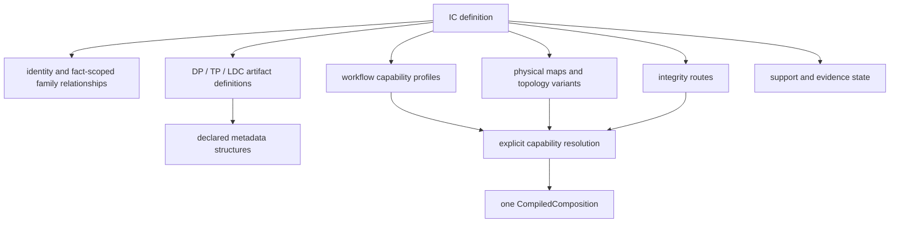

# 0.10.x Maintainability Architecture Working Design

Status: active working design record, updated 2026-07-24.

Baseline: `0.10.0` commit
`1967e20a7b1c6a52353ad543a22f7fd368b72ad3`.

This document preserves the owner/architecture workshop conclusions that guide
the `0.10.x` maintainability sequence. It separates accepted direction,
observed repository evidence, and unresolved design questions so later context
loss cannot silently change the plan.

This is not an ADR, executable contract, support claim, profile, memory map, or
firmware-evidence source. `SPEC.md`, accepted ADRs, schemas, trusted profiles,
tests, and owner-approved golden evidence remain authoritative. A production
change to a public boundary, profile schema, processor route, memory range, or
firmware behavior still requires its normal ADR/contract/evidence review.

## Outcome and release boundary

The near-term objective is a maintainable repository:

- deep modules with small, stable interfaces;
- explicit ownership and planned migration seams;
- higher behavioral, contract, and integration coverage;
- one authoritative definition for each control, class, function, formatter,
  firmware fact, and state transition;
- no parallel compatibility owner after migration completes; and
- an architecture that can support a future IC-authoring UI without making
  that late-stage feature the current priority.

`0.10.0` performs architecture inventory and design only. It does not perform
the production restructuring described here. The planned sequence remains:

| Version | Maintainability phase | Required outcome |
| --- | --- | --- |
| `0.10.0` | M0/M1 baseline and design | Record ownership, evidence, intended seams, and migration order without changing production behavior. |
| `0.10.1` | M2 characterization and test-harness convergence | Protect existing byte, report, state-transition, and UI behavior before moving owners. |
| `0.10.2` | M3/M4 production migration and cleanup | Move one vertical slice at a time, prove parity, then remove superseded adapters and projections. |

The Settings Support Matrix and release-promotion recovery work already assigned
to `0.10.0` remain independent product slices. This design record does not
authorize mixing a production refactor into either slice.

## Baseline evidence

The following measurements describe the baseline above. They are review
evidence, not permanent size limits:

| Surface | Observed baseline | Architectural reading |
| --- | --- | --- |
| `WorkbenchCompositionService` | 39 partial files, about 4,994 raw lines, 53 public static members | A broad and shallow Workbench boundary combines catalog, inspection, display projection, naming, compilation, execution, and reporting. |
| `WorkbenchCompositionModels` | About 379 lines and 40 public types | Bootstrap effectively exposes a parallel presentation/application contract. |
| `MainWindowViewModel` | 26 partial files, about 4,845 raw lines, 281 public members/bindings | Navigation, mode state, selector projection, slot state, inspection, validation, and run lifecycle form an implicit cross-product state machine. |
| `V2CompositionPlanCompiler` | 9 files, about 2,516 raw lines, about 7 internal/public entry-like members | This is comparatively deep. Size alone is not a reason to split it. |
| Architecture tests | 25 files, about 4,218 raw lines, 106 tests | Valuable boundaries exist, but many assertions depend on source strings or file position and need equivalent behavioral coverage before replacement. |

`CompositionRunService` and the external-processor staging model already expose
comparatively cohesive seams. They are not the first refactor targets. The
first high-value seam is the Workbench/Presentation boundary.

## Accepted target model

### IC is the query root, not a god object

An IC is the unique root for resolving supported composition behavior, but it
does not own every fact in one large class or JSON document. It composes smaller
authoritative models:



Execution resolution remains explicit:

```text
IC + workflow + topology + applicable map/version inputs
    -> one resolved capability
    -> one CompiledComposition
```

Metadata, filenames, hashes, PID, or inspected version values may validate,
warn, or help the user, but they never silently select an IC, family, topology,
profile, or integrity route.

### DP, TP, and LDC are artifact roles

DP, TP, and LDC describe firmware artifacts or physical section ownership.
They are not metadata. Each artifact may declare zero or more metadata
structures, for example DPCMI, FWConfig, version fields, or PID fields.

The common BIN inspector executes only structures declared for the resolved:

```text
IC + map/topology + slot
```

One formatter then renders the resulting typed facts. Metadata results must
distinguish at least:

- `NotDeclared`: this artifact has no such structure;
- `Unknown`: the structure is declared but the value cannot be established;
- `Invalid`: bytes were available but violate the declared structure; and
- `Value`: a validated typed value is available.

This prevents an absent declaration, unavailable data, and invalid firmware
from collapsing into the same UI state.

### Topology is a first-class selection axis

Topology belongs under an IC capability. A map, workflow, slot, metadata
structure, and integrity route must either be invariant for the parent
capability or explicitly narrow its applicability.

Applicability is declared at the highest cohesive capability/profile/map level.
Children inherit it; only exceptions override or narrow it. The model must not
require repeated `single`/`cascade` tags on every leaf.

Known examples that the model must be able to express include NT51929 cascade
`2–8 IC`, NT51930 cascade `2–13 IC`, and NT51927/NT51928 exact `2 IC`/`3 IC`
variants. These examples describe representational needs only; existing trusted
profiles remain the execution authority.

### Family relationships are named and fact-scoped

An IC may participate in multiple relationships at the same time. A relationship
shares only named, approved facts; it does not inherit an entire IC definition.
Examples include:

- a `perfect-family` relationship scoped to explicitly approved behavior; and
- a `tp-shared-family` relationship scoped to approved TP facts.

NT51927/NT51928 must be able to share TP facts while retaining differing
LDC/DP facts. NT51950/NT51951 must be able to share approved TP facts while
retaining their DP layout differences. Even a perfect-family relationship has
an explicit fact scope: AB equivalence does not imply Normal, Replace, DP,
header, or evidence equivalence.

Family answers “which facts may be reused across ICs?” Topology answers “which
variant applies within this IC or shared fact?” They are independent axes.

### Trusted definitions use versioned bundles

The intended representation is a hybrid set of small JSON documents, not one
giant JSON file:

- a small IC index/definition;
- references to shared perfect-family or TP-family facts;
- artifact and metadata definitions;
- workflow profiles and integrity routes; and
- a root manifest that closes and verifies the bundle.

Versioned means that schema, bundle, family, and profile versions are explicit.
Trusted means strict schemas, closed manifest paths, per-entry SHA-256 values,
a bundle content hash, and a release trust anchor. Loading arbitrary user JSON
must never grant firmware authority.

Current profile-bundle JSON and its generic loader are the migration starting
point. Manually maintained parallel C# IC catalogs become compatibility
adapters only. They are removed after all consumers use the trusted model and
parity is proven. C# continues to own generic loading, normalization,
resolution, compilation, inspection, and formatting behavior.

A future IC-authoring UI may create only an untrusted candidate bundle in a
staging area, with validation and a reviewable diff. Promotion still requires
repository review, firmware-owner approval, golden evidence, CI, and a release
trust anchor. This UI is intentionally later than the maintainability work.

## Shared UI capabilities

### Slots are one capability, not merely shared XAML

Repeated firmware slots should derive from one capability containing:

- a typed slot definition;
- the common BIN inspector;
- semantic formatting;
- validation/readiness state; and
- one shared visual control.

Each workflow declares only its actual differences, such as required/optional,
artifact role, accepted capability, or access policy. This does not create a
god control: workflow orchestration and firmware semantics remain outside the
visual component.

Repeated spacing, padding, sizing, and visual roles use shared design tokens.
The same semantic value must not acquire a separate formatter or fallback
policy merely because it appears on another page.

### Modes own isolated authoring sessions

Each page/mode retains its own user-entered selection and files when the user
navigates away and restores them on return. Modes do not share derived
inspection, validation, readiness, memory projection, preview/build state, or
cache entries.

A session identity includes:

```text
page + mode + IC + topology + profile fingerprint
```

The session owns:

- slot inputs;
- inspection results;
- validation/readiness;
- memory coverage projection; and
- preview/build state.

The UI binds to one immutable or coherently published `ActiveSessionSnapshot`.
An inspection cache is keyed by session identity, slot identity, and immutable
file identity. Stale asynchronous results cannot publish into a different
session. An incompatible IC, topology, or profile change atomically invalidates
the affected session state.

The historical AB Code to Replace selector defect demonstrates the current
risk. `SelectedIc`/`SelectedNumber` were shared across Merge and Replace while
the selected Merge mode remained live. The fix in commit `35e1d581` introduced
an active-page-aware AB context. The regression
`ReplaceDoesNotInheritAbMergeSelectorProjection` protects the symptom, but the
long-term correction is explicit session ownership rather than more manual
property refresh calls.

The implementation order is:

1. characterize page × mode × IC × topology transitions;
2. extract a deep authoring-session module;
3. leave navigation, modal state, and active-session routing in
   `MainWindowViewModel`;
4. move shared slot inspection/formatting/control behavior behind the session;
5. remove old refresh/invalidation compatibility paths only after parity.

### One read-only Hex Viewer under every Hex experience

The shared foundation is a read-only Hex Viewer. The Hex Editor composes that
viewer with editing commands and editable interaction; it does not require
classical UI-control inheritance. Report Hex Diff supplies comparison data,
range navigation, and review decorations to the same viewer foundation.

The viewer owns only reusable display/navigation behavior:

- a bounded read-only byte source with explicit capabilities and honest
  unavailable-range handling;
- bounded/virtualized rows and address-space-qualified addresses;
- hexadecimal and ASCII presentation;
- byte/range selection and address navigation;
- byte/ASCII search when the source declares the required byte coverage;
- optional primary/reference planes;
- cell-level typed display decorations such as changed, search match, selected,
  or structural-boundary roles; and
- accessible byte and row descriptions.

The viewer does not know firmware workflows, report acceptance policy, editor
mutation rules, save behavior, or processor semantics.

The editor adapter continues to own overwrite, insert/delete, structural
identity, search, undo/redo, inline editing, and persistence. The report adapter
continues to own verified-snapshot identity, retained-preview honesty,
difference-range ordering, acceptance/review state, and evidence. A historical
report must never reread a source BIN to fabricate missing comparison bytes.

Current evidence supports this direction:

- `RawBinaryEditorSession` already owns a bounded Application viewport and
  immutable-source/work-buffer editing semantics.
- `HexEditorViewportControl` uses one custom-drawn visual rather than hundreds
  of child controls, but it binds directly to `HexEditorWorkspaceViewModel`.
- `ReportHexDiffViewModel` separately implements 16-byte windowing, address and
  ASCII formatting, before/output rows, changed masks, and navigation.
- `V0911KeepsRawEditorAndReportDiffRenderersSeparate` intentionally froze that
  separation for the `0.9.11` scope. It is historical scope protection, not the
  target architecture.

The migration must preserve or improve the current editor functionality and
custom-rendered performance. M2 first captures viewer navigation, selection,
comparison, accessibility, large-file windowing, and all editor mutations.
M3 then extracts a source-neutral read-only viewport contract and shared
Presentation renderer. The old separation test is replaced only after
equivalent behavioral and boundary coverage exists.

Exact production type names and whether the neutral viewport contract belongs
in an existing Application namespace or a new focused Application module remain
open until the characterization inventory is complete. It must not move visual
state into Domain or make Presentation authoritative for bytes.

## Migration and evidence gates

Every production slice follows these rules:

1. Fix a baseline and characterize current behavior before moving ownership.
2. Move one responsibility through one compatibility seam.
3. Keep UI and CLI on the same Application contract.
4. Prove byte, report, selector/session, and accessibility parity appropriate
   to the slice.
5. Delete the old adapter only after every caller has moved.
6. Apply Polytail and independent review.
7. Keep R2/R3 architecture, firmware-owner, golden, and release gates intact.

M2 should favor behavioral/interface characterization over source-location
assertions. Existing source-string architecture tests remain until equivalent
coverage is demonstrably present; test-count or line-count reduction is not an
exit criterion.

## Open design questions

The following items are deliberately not settled by this record:

1. the smallest stable read-only Hex viewport contract and its exact owner;
2. the precise capability boundaries that replace the broad Workbench DTO
   surface;
3. the normalized schema shape for IC, artifact, topology, relationship, and
   metadata references;
4. profile-fingerprint construction and compatibility policy for restored
   authoring sessions;
5. cache lifetime and memory limits for multiple retained mode sessions; and
6. the exact vertical-slice order inside `0.10.2`.

These questions should be grilled and decided before `to-spec` converts this
working design into implementation specifications and tickets. Any decision
that changes a durable public or firmware boundary must then be promoted to an
ADR or normative contract rather than remaining only in this document.
