# IC Workflow Flowchart Reference

Status: architecture reference; evidence dates are recorded by the cited manifests and review history.

This document is an index for the current Merge and Replace flows by IC. It is not a production support claim. A profile is production-ready only after profile validation, golden regression, processor diff review, and owner sign-off. The implementation runbook for adding a new IC workflow is [`adding-ic-merge-replace-workflow.md`](adding-ic-merge-replace-workflow.md).

> **0.10.x target scope:** NT51920, NT51925, NT51930, and NT51931 are retired
> by `SPEC.md` and #221. Their detailed flows below document the executable
> pre-#221 compatibility baseline or historical evidence only; they are not
> target production routes and must not be migrated by #177, #187, or #194.
> #221 removes their selectable and executable flow rows. Retaining a diagram
> until that removal lands does not preserve runtime or publication authority.

## Update rule

Update this document in the same change when any of these sources change:

- `profiles/built-in/package-trust-index.json`; this owns hash-pinned bundle materialization and runtime admission for Standard Merge, AB Merge, DP Replace, General Merge, General Replace, and CtrlRAM Replace.
- `src/NvtFwCombiner.Bootstrap/BuiltInV2RegistrationRegistry.cs`; this generically projects non-CtrlRAM registrations from the package trust index without IC route literals.
- `src/NvtFwCombiner.Bootstrap/BuiltInV2Bundle.cs`; production profiles are manifest-pinned V2 bundles admitted by the package trust index. Synthetic compiler fixtures remain test-only under `tests/NvtFwCombiner.TestSupport/`.
- `src/NvtFwCombiner.Bootstrap/CtrlRamV2RouteRegistry.cs`; this generically projects each admitted runtime postbuild profile and typed Number plan from the same trust index.
- `profiles/built-in/ctrlram-postbuild-v2/catalog.json`; Infrastructure validates its pinned hash and projects typed runtime profiles.
- [`../adr/0031-ctrlram-profile-intervals-and-build-plan-authority.md`](../adr/0031-ctrlram-profile-intervals-and-build-plan-authority.md)
- `docs/architecture/nt51950-nt51951-dp-length-policy.md`
- `docs/architecture/ctrlram-postbuild-command-matrix.md`
- `docs/architecture/nt51950-nt51951-ab-code-contract.md`
- `docs/architecture/supported-ic-matrix.md`
- `docs/architecture/adding-ic-merge-replace-workflow.md`

The architecture test `IcWorkflowFlowchartReferenceCoversBuiltInIcLists` checks
that this document lists every admitted IC from the package trust index and the
CtrlRAM postbuild catalog. The test is a sync guard only; profile/family data,
the package trust index, and owner evidence remain the behavior authorities.

## Notation

- Ranges use half-open notation: `[start, end)`.
- `Implemented profile` means the repo has an executable built-in profile or command catalog entry. It does not imply production parity.
- `Golden pending` means the repo has an executable profile or command catalog entry, but owner-approved golden output and firmware sign-off are still pending.

CtrlRAM production admission follows three independent decisions: requested IC selects the owner-declared family, Common FW selects an effective runtime-profile interval only when the IC has more than one runtime profile, and the requested Number selects a typed build plan. PID, filename, exact golden Common/TP FW version, whole-file SHA, and a golden fixture's observed chip count are report/evidence fields, never family or route gates. FWConfig chip count is cross-checked after plan selection and a contradiction requires an explicit user decision; it does not silently select another plan.

## All-IC / all-mode release index

The table below and the detailed sections that follow are the versioned index
for every selectable IC/workflow. It pairs the high-level mode diagram with
the per-IC table so a diagram never becomes a second execution specification.
Availability and certification remain the Support Matrix's facts; this index
does not turn a candidate or golden-pending route into a support claim.

Editable Mermaid Live permalink (generated from the source below on
2026-07-23):

https://mermaid.live/edit#pako:eNptkk1PAjEQhv_KpGeIovEgJhrYVfRgYsSb66G0s9Ck29ZpVyGE_-6w68IG7aHJfDzvfGS2QnmNYixK67_VSlKCt7xwwG_yXohs5X1EIPysMSbU8JSBdBoqhgrxAcPhLUy3hXhGWiJ4glcMViq8K8SuVZk2ORlrzROTkjQ0yWMI5EtjcRjRovrVJl8njKzch3OGJ9MOuxpdj67P-L9o_ssLKM0a9c0-cHUO0bilxTMlo5IaW-8I2hqehiUhnsjfs_wMHZK0XQ1cB2uUSVDJEFgwgnd2c8I9MJe_dBP_Mw8Hm3lOuNl-r4ns6-T5CKdNYMLV1QIJ2OeaNXN18l8cCD6mRW2sPtF67PV-0Prb_bdJK-MgyhLTBtB9ofXh2FfWaD3t-_JV4Bl0NwywP_JVsAfXqGpe4d5FGDylA5-3fGvc942HvjHrG4-dIQaiQqqk0XyFfEpphRW3Ni6ExlLWlsvsOEdy7fnGKTFOVONA1EHLhLmRS5JV69z9AJ8o4Cc

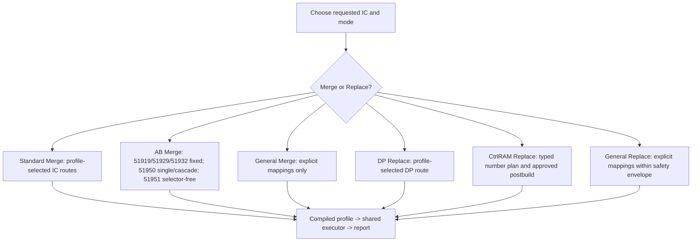

The release handoff records this file revision and permalink, plus the
NT51950/NT51951 AB permalink in
[`nt51950-nt51951-ab-code-contract.md`](nt51950-nt51951-ab-code-contract.md).
This is documentation only and does not authorize all-mode implementation
convergence.

## Per-IC flow index

| IC | Standard Merge flow | DP Replace flow | CtrlRAM Replace flow | General Replace flow | Current status notes |
| --- | --- | --- | --- | --- | --- |
| NT51917 | `SM-GENFLASH-V2-ALIAS`: packaged canonical V2 bundle is selected by Bootstrap UI/CLI through its content-hash anchor; map-bound alias of NT51927. | `R-DP-GENFLASH-V2`: hash-anchored DP Replace profile is routed. | `R-CTRLRAM-927-V2-ALIAS`: one `[1.0.0, infinity)` runtime profile exposes single, exact 2-chip, and exact 3-chip V2 plans. | `R-GENERAL-POSTBUILD`: non-exact General Replace shapes fail closed. | Exact FW/PID/SHA values identify regression cases only. The NT51917 staged identity and 7/10/13-command plans remain support-neutral. |
| NT51919 | `SM-GENFLASH-V2-ALIAS`: packaged canonical V2 bundle is selected by Bootstrap UI/CLI through its content-hash anchor; map-bound alias of NT51929. | `R-DP-GENFLASH-V2`: hash-anchored DP Replace profile is routed. | `R-CTRLRAM-51929-ALIAS`: the `[1.0.0, infinity)` single and bounded `2–8 IC` cascade plans are V2-routed; cascade authorizes DLM CRC 1–7 at `[0x7128,0x7144)`. | `R-GENERAL-POSTBUILD`: non-exact General Replace shapes fail closed. | `AB-51929-FAMILY-PILOT` is runtime/CLI routed through the approved NT51929 fact scope; UI and release gates remain open. |
| NT51923 | `SM-GENFLASH-V2`: packaged canonical V2 bundle is selected by Bootstrap UI/CLI through its content-hash anchor. | `R-DP-GENFLASH-V2`: hash-anchored DP Replace profile is routed. | `R-CTRLRAM-LEGACY-NORMAL`: one `[1.0.0, infinity)` profile; single and generic cascade are V2-routed, with DiffDLM only in cascade. | `R-GENERAL-POSTBUILD`: explicit mappings use protected-range gates; TP/CtrlRAM mappings run selected postbuild when available. | Golden values are regression evidence; firmware-owner review remains required before support promotion. |
| NT51926 | `SM-GENFLASH-V2`: packaged canonical V2 bundle is selected by Bootstrap UI/CLI through its content-hash anchor. | `R-DP-GENFLASH-V2`: hash-anchored DP Replace profile is routed. | `R-CTRLRAM-LEGACY-NORMAL`: `[1.0.0,2.0.0)` uses the 1.4.1-sourced profile and `[2.0.0,infinity)` uses the 2.0.0-sourced profile; both expose single and generic cascade V2 plans. | `R-GENERAL-V2-DP-SLICE`: single/full-Flash/file-backed DP-only mappings use V2; TP/CtrlRAM, patches/fills, other counts and shapes fail closed. | Missing Common FW blocks only because two runtime intervals exist. Exact golden versions do not narrow either interval; support remains neutral. |
| NT51927 | `SM-GENFLASH-V2`: packaged canonical V2 bundle is selected by Bootstrap UI/CLI through its content-hash anchor. | `R-DP-GENFLASH-V2`: hash-anchored DP Replace profile is routed. | `R-CTRLRAM-927`: one `[1.0.0, infinity)` profile exposes single, exact 2-chip, and exact 3-chip V2 plans. | `R-GENERAL-POSTBUILD`: non-exact General Replace shapes fail closed. | PID, exact Common FW, and whole-reference SHA are evidence only; command-plan distinctions come from owner-provided single/2/3 plans. |
| NT51928 | `SM-GENFLASH-LDC-VARIANT`: one capability; absent LDC selects the shared NT51927-compatible `0x40000` candidate, while supplied structurally valid LDC selects `0x80000`; invalid supplied LDC blocks without fallback. | `R-DP-LDC-VARIANT`: accepted Reference `0x40000` permits Initial Code only; `0x80000` permits Initial Code, LDC `[0x40000,0x62000)`, or both through one `1..2` selection group. | `R-CTRLRAM-927-PARTIAL`: separately declared owner-approved non-NB single, exact 2-chip, and exact 3-chip profiles reference their matching TP/postbuild facts inside the NT51928 container; this authority is not inherited from the Initial Code/TP shared-fact relationship. | `R-GENERAL-POSTBUILD`: non-exact General Replace shapes fail closed. | NT51928 NB remains excluded; #239 owns the dual-capacity headless migration, while existing CtrlRAM evidence and support gates remain separate. |
| NT51929 | `SM-GENFLASH-V2`: packaged canonical V2 bundle is selected by Bootstrap UI/CLI through its content-hash anchor. | `R-DP-GENFLASH-V2`: hash-anchored DP Replace profile is routed. | `R-CTRLRAM-51932`: the `[1.0.0, infinity)` single and bounded `2–8 IC` cascade plans are V2-routed; cascade authorizes DLM CRC 1–7 at `[0x7128,0x7144)`. | `R-GENERAL-POSTBUILD`: non-exact General Replace shapes fail closed. | `AB-51929-FAMILY-PILOT` has direct golden parity and runtime/CLI routing. UI, final firmware confirmation, and release gates remain open. |
| NT51932 | `SM-GENFLASH-V2`: packaged canonical V2 bundle is selected by Bootstrap UI/CLI through its content-hash anchor. | `R-DP-GENFLASH-V2`: hash-anchored DP Replace profile is routed. | `R-CTRLRAM-51932`: the `[1.0.0, infinity)` single and bounded `2–8 IC` cascade plans are V2-routed; cascade authorizes DLM CRC 1–7 at `[0x7128,0x7144)`. | `R-GENERAL-POSTBUILD`: explicit mappings use protected-range gates; TP/CtrlRAM mappings run selected postbuild when available. | `AB-51929-FAMILY-PILOT` is runtime/CLI routed through the approved NT51929 fact scope; UI and release gates remain open. |
| NT51950 | `SM-950-951-DP-PERSPECTIVE-V2`: packaged canonical V2 maps select the submitted DP capacity. | `R-DP-950-951`: the workbench UI/CLI routes the V2 profile and selects its base capacity; LDC is already packaged in the DP payload. | `R-CTRLRAM-51950`: the `[1.0.0, infinity)` single and current 2-IC cascade plans are V2-routed; cascade writes Diff CtrlRAM `[0x33200,0x33B10)`, preserves Diff NF `[0x33B10,0x34600)`, ignores inactive AE dummy content, and authorizes DLM CRC 1–19 `[0xA134,0xA180)`. | `R-GENERAL-POSTBUILD`: non-exact General Replace shapes fail closed. | Single/cascade share the TP layout and postbuild offsets inside the `0x40000` container. Wider counts and NT51929-family FWConfig placement are not inferred. Exact PID/version/SHA values remain evidence only; AB is separate and no support promotion is claimed. |
| NT51951 | `SM-950-951-DP-PERSPECTIVE-V2`: packaged canonical V2 maps select the submitted DP capacity. | `R-DP-950-951`: the workbench UI/CLI routes the V2 profile and selects its base capacity; LDC is already packaged in the DP payload. | `R-CTRLRAM-51950`: the `[1.0.0, infinity)` single and current 2-IC cascade plans are V2-routed; cascade writes Diff CtrlRAM `[0x33200,0x33B10)`, preserves Diff NF `[0x33B10,0x34600)`, ignores inactive AE dummy content, and authorizes DLM CRC 1–19 `[0xA134,0xA180)`. | `R-GENERAL-POSTBUILD`: explicit mappings use protected-range gates; TP/CtrlRAM mappings run selected postbuild when available. | TP layout/postbuild offsets match NT51950 inside the distinct `0x80000` container; the extra tail remains preserved. Wider counts and NT51929-family FWConfig placement are not inferred. AB and firmware-owner promotion remain separate. |

## AB Initializer Policy

All AB V2 profiles copy the complete submitted DP container before their
declared TPA/TPB overlays. The `v0.9.14` runtime/CLI pilot admits only
NT51919, NT51929, and NT51932: they use the fixed `0x80000` AB map, consume
declared prefixes from 512 KiB DP_AB and 256 KiB TPA/TPB inputs, and apply
checked cloned-TPB relocations at `0x7164/0x7168/0x716C`. The owner approved
NT51929 direct golden applicability for NT51919 and NT51932 through the exact
family fact scope; UI and final release gates remain open.

`0.9.15` adds the separately declared NT51950 and NT51951 AB plans described
by [the AB contract](nt51950-nt51951-ab-code-contract.md). They copy complete
DP input first, copy only TP `[0xA000,0x37000)`, never alter TPA, relocate TPB
ILM/DLM/DIFF in a clone, then import the profile-bound staged TPB postbuild
result only after a TPB-only diff check. NT51950 has the visible closed
`single`/`cascade` selection; NT51951 has no selector. Their function opening
does not certify missing direct golden evidence.

### AB-950-951-v0.9.15

The full editable source and Mermaid Live permalink are maintained in
[`nt51950-nt51951-ab-code-contract.md`](nt51950-nt51951-ab-code-contract.md).
The release handoff records this document revision and that permalink; neither
the rendering nor the link has runtime authority.

## Standard Merge flowcharts

### SM-GENFLASH and SM-GENFLASH-V2

Used by the executable golden-backed gen_flash profiles: NT51923, NT51926,
NT51927, NT51929, and NT51932. Bootstrap also selects the owner-confirmed,
map-bound aliases NT51917 and NT51919. Historical NT51920/NT51931 fixtures are
not runtime routes.

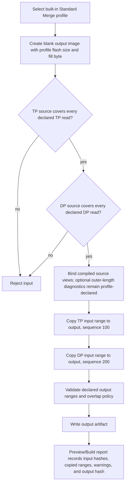

The DP source-size notes below are expected golden lengths, not exact-size
execution gates. DP and TP inputs must cover their listed address-bearing source
views; other total lengths are accepted under the profile's source-view policy.
No outer-length warning is implied unless the profile explicitly declares that
optional diagnostic. A compatible same-IC FlashCode may provide either section.
Replace Reference and complete DP AB inputs remain exact declared container
variants.

| IC | Output size | TP range | DP range | Observed fixture length (diagnostic only) |
| --- | ---: | --- | --- | --- |
| NT51917 | `0x40000` | `[0x00000, 0x35000)` | `[0x3C000, 0x40000)` | Owner-confirmed alias of NT51927; declared source length `0x200000`; alias golden regression uses NT51927 fixtures. |
| NT51919 | `0x40000` | `[0x07000, 0x40000)` | `[0x00000, 0x06000)` | Owner-confirmed alias of NT51929; declared source length `0x40000`; alias golden regression uses NT51929 fixtures. |
| NT51923 | `0x40000` | `[0x00000, 0x3C000)` | `[0x3E000, 0x40000)` | Source length equals range end. |
| NT51926 | `0x40000` | `[0x00000, 0x3C000)` | `[0x3E000, 0x40000)` | Source length equals range end. |
| NT51927 | `0x40000` | `[0x00000, 0x35000)` | `[0x3C000, 0x40000)` | Declared source length `0x200000`. |
| NT51929 | `0x40000` | `[0x07000, 0x40000)` | `[0x00000, 0x06000)` | Declared source length `0x40000`. |
| NT51932 | `0x40000` | `[0x07000, 0x40000)` | `[0x00000, 0x06000)` | Declared source length `0x40000`. |

### Historical (retired): SM-FLASHMAP-V2

This diagram records the pre-#221 NT51930 migration contract only. NT51930 is
retired and no selector, bundle, runtime, package, or publication route uses it.

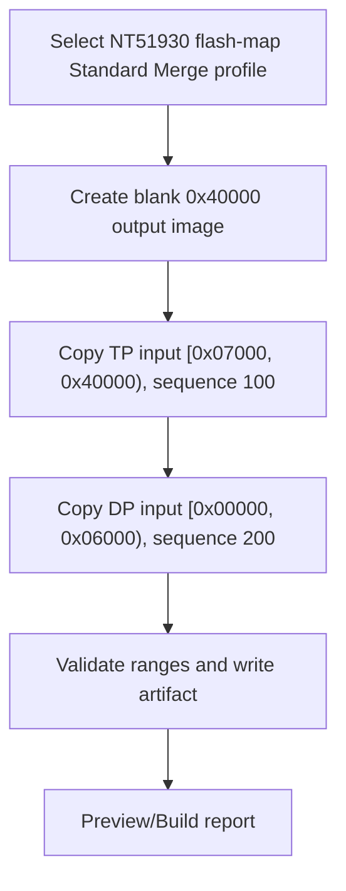

| IC | Output size | TP range | DP range | Evidence note |
| --- | ---: | --- | --- | --- |
| NT51930 | `0x40000` | `[0x07000, 0x40000)` | `[0x00000, 0x06000)` | Derived from `IC_FlashMap.xlsx 51930 TP Flashmap`; owner golden added from `merge_bin.7z`. |

### SM-GENFLASH-LDC-VARIANT

Used by NT51928 non-NB.

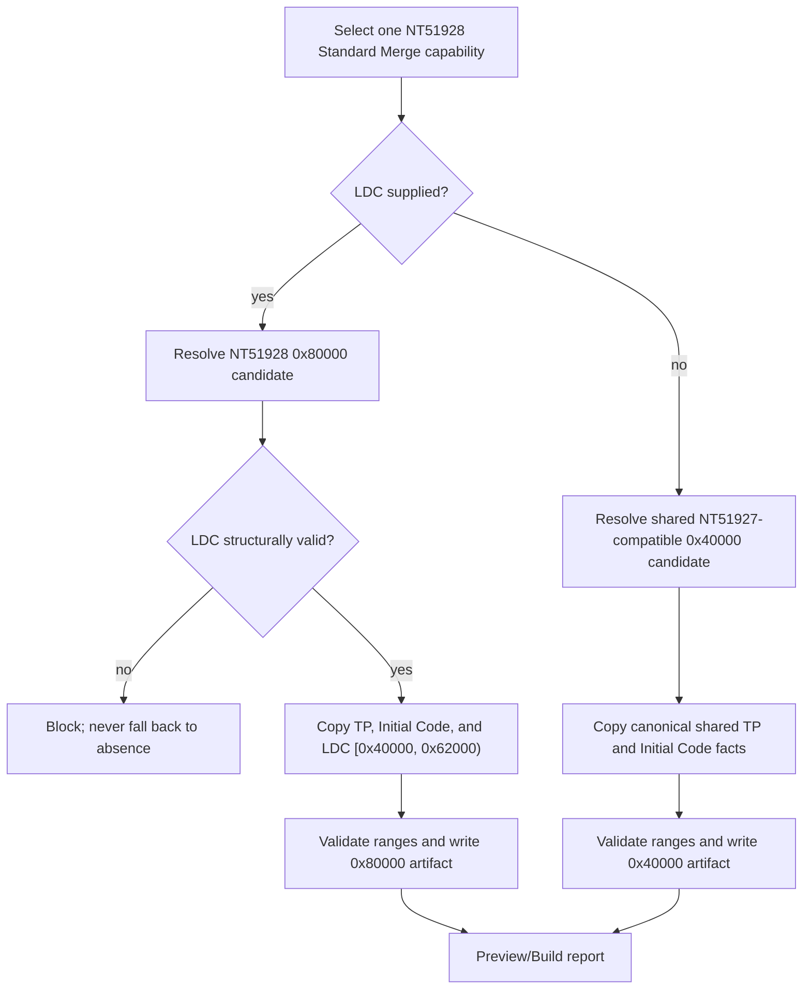

### SM-950-951-DP-PERSPECTIVE

Used by NT51950 and NT51951. This flow is an executable built-in Standard Merge profile with owner golden output for current `0x40000` and `0x80000` DP Perspective cases.

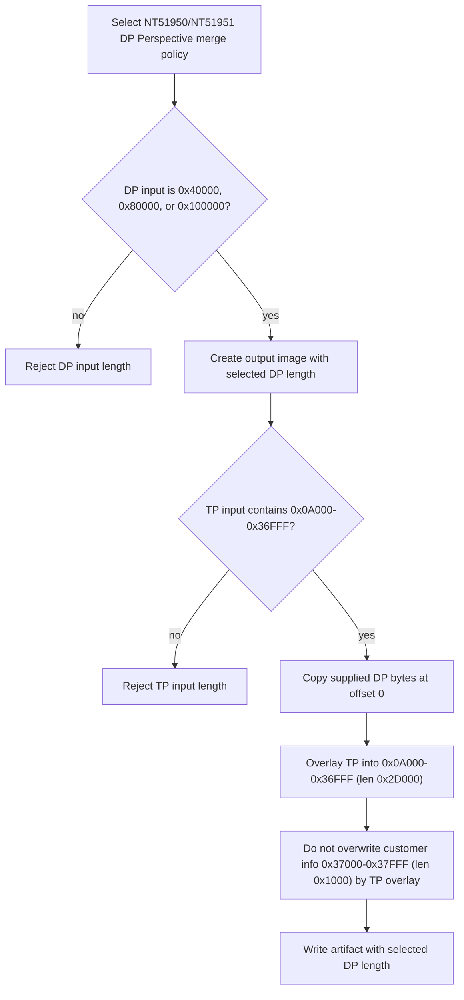

## DP Replace flowcharts

### R-DP-GENERIC

This is the generic Replace composition shape. Real per-IC DP maps are still pending unless a profile explicitly declares the DP or LDC partitions.

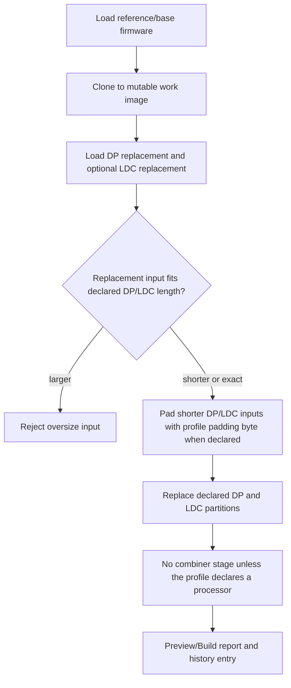

### R-DP-950-951

Used by NT51950 and NT51951 as the target DP Perspective policy. The V2 profiles are runtime-admitted by archived owner-approved legacy full-byte comparison and public synthetic expected hashes with no known deviations; the workbench route has no legacy fallback. This migration evidence is not an independent hardware golden or a product support claim.

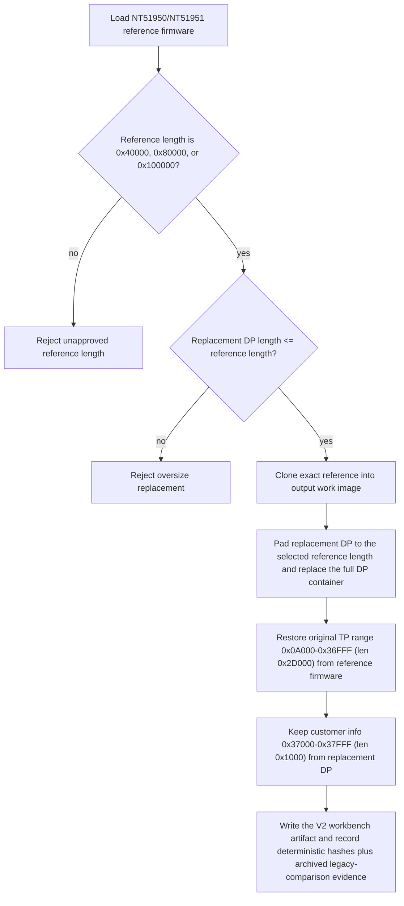

### Historical (retired): R-DP-930

This diagram records the pre-#221 NT51930 DP Replace characterization only.
The fixture and deterministic oracle are historical evidence and do not admit
a runtime route.

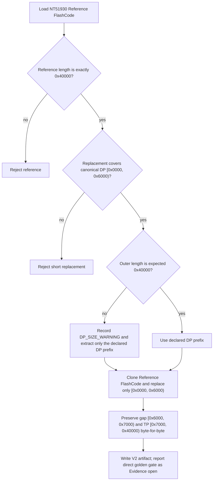

## CtrlRAM Replace flowcharts

All CtrlRAM Replace flows require post-replace legacy Combiner 1.13.0 processing before the result can be treated as a finished TDDI firmware image. Command sequences are stored as structured command data, then converted to argv arrays. Production resolves requested IC family, effective Common FW profile interval, and typed Number plan in that order. A trusted V2 profile then scopes map resolution and processor write authority; an absent route fails closed. Firmware metadata is still reported, and FWConfig chip count is cross-checked against the requested plan, but PID, exact golden versions, filename, and SHA never choose a route.

### R-CTRLRAM-927

Used by NT51917, NT51927, and NT51928 non-NB.

NT51917, NT51927, and NT51928 non-NB each expose exactly three owner-provided
command plans: single, 2-chip, and 3-chip. Their one runtime profile covers all
Common FW versions from `1.0.0`; exact FW/PID/SHA values only identify regression
cases. NT51928's CtrlRAM plans separately declare the matching TP/postbuild facts
inside its container; this route authority is not inherited from its
Initial-Code/TP `SharedFactRelationship` with NT51927. NT51928 NB is not covered
and fails closed.

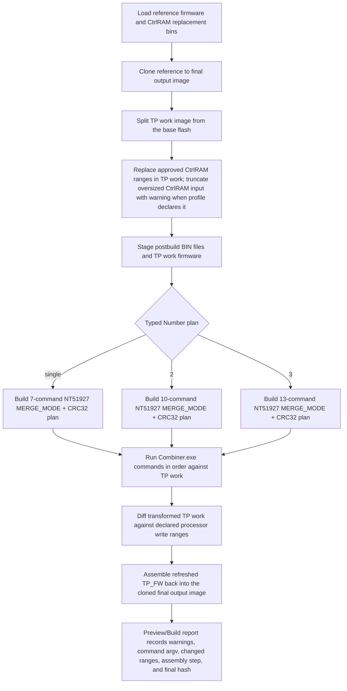

### R-CTRLRAM-LEGACY-NORMAL

Used by NT51923 and NT51926. NT51923 has one runtime interval
`[1.0.0, infinity)`. NT51926 uses `[1.0.0,2.0.0)` for its
1.4.1-sourced profile and `[2.0.0,infinity)` for its 2.0.0-sourced profile.
Every interval exposes single and generic cascade V2 plans. Exact golden
versions, PID, count, filename, and SHA do not narrow these plans.

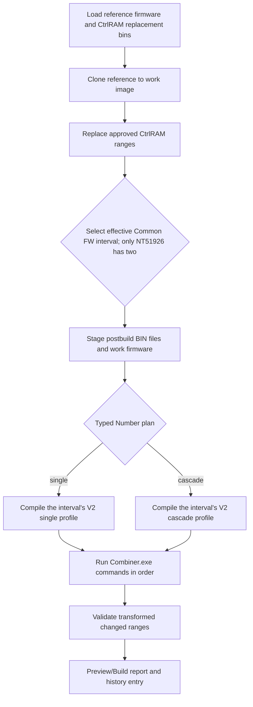

### R-CTRLRAM-51932

Used by NT51919, NT51929, and NT51932.

Each has one runtime profile from `1.0.0` and routes both single and bounded
`2–8 IC` cascade. Single profiles exclude cascade-only DiffDLM authority.
Cascade IC Count `N` compiles exactly `N-1` active records from target
`0x2D100`: only each `0x0B90` DLM prefix is replaced, each `0x0870` NF tail
and every inactive target record remain reference bytes, and AE dummy records
after the active prefix are ignored. Postbuild alone places the FWConfig
Backup. Runtime compares its marker-derived actual start with
`AlignUp(0x2D100 + (N - 1) * 0x1400, 0x1000)` and reports an in-authority
mismatch as a warning. Direct fixture metadata remains regression evidence and
never narrows either typed plan.

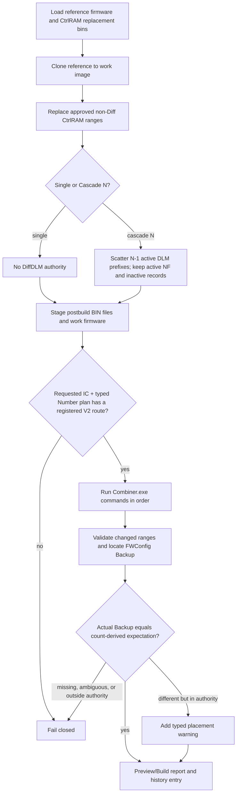

### Historical (retired): R-CTRLRAM-51930

This diagram records the pre-#221 NT51930/NT51931 CtrlRAM characterization.
Both ICs are retired; the described plans are not resolvable or executable.

NT51930 has one runtime interval `[1.0.0, infinity)` and exactly two plans:
single and count range `2–13`. The single V2 profile has no DiffDLM input or
write authority; only the `2–13` plan exposes the cascade-only DiffDLM region.
`>=14` is neither shown nor routed. NT51931 routes both single and generic
cascade; its cascade-6 golden is evidence for that plan, not an exact-count
production gate, and its single profile excludes cascade-only DiffDLM authority.

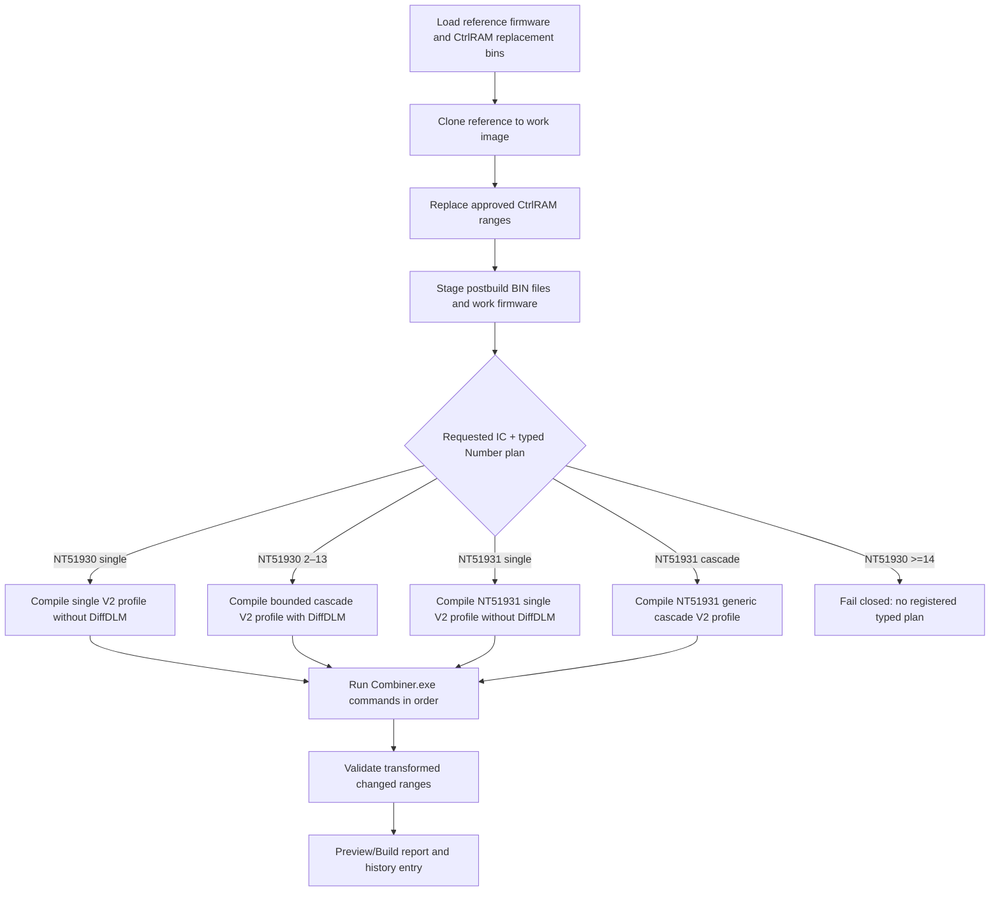

### R-CTRLRAM-51950

Used by NT51950 and NT51951.

Both ICs have one runtime profile covering `[1.0.0, infinity)` and route single
plus the currently confirmed 2-IC cascade. They use identical TP offsets and
processor authority; NT51950 keeps a 256 KiB container and NT51951 keeps a
512 KiB container. Cascade replaces only `[0x33200,0x33B10)` and preserves
`[0x33B10,0x34600)` from the reference. Their End Flag is fixed at `0x36FFC`,
so postbuild copies the primary FWConfig at `0x22200` to the fixed canonical
Backup at `0x36000`. Wider counts and the NT51929-family count-derived
placement formula are not inferred. PID, exact FW version, whole-file SHA, and
golden identity are reported but do not select either route. LDC is packaged
inside DP, and AB remains a separate workflow.

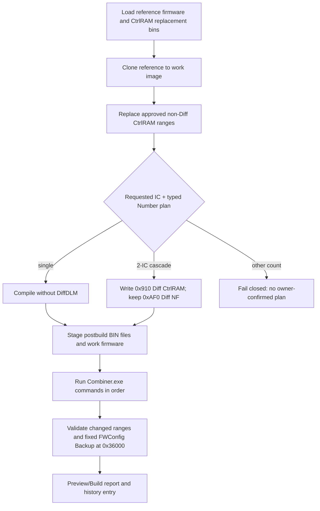

## General Replace flowchart

### R-GENERAL

General Replace is available as a generic composition model. It becomes safe for a production IC only after protected ranges, allowed explicit-map areas, alignment rules, and processor triggers are known.

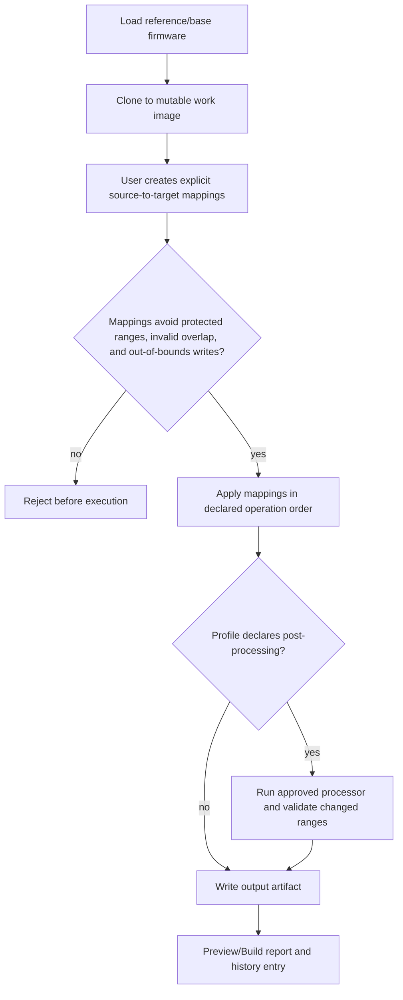
