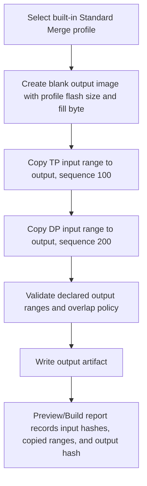
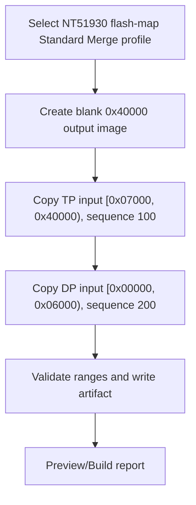
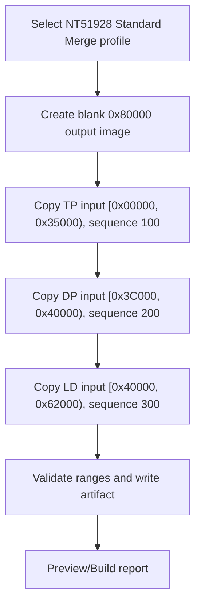
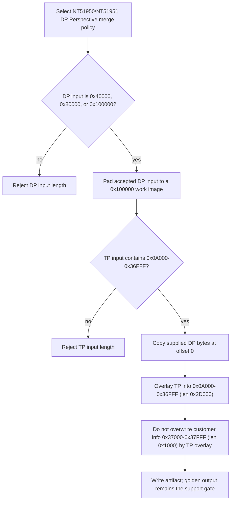
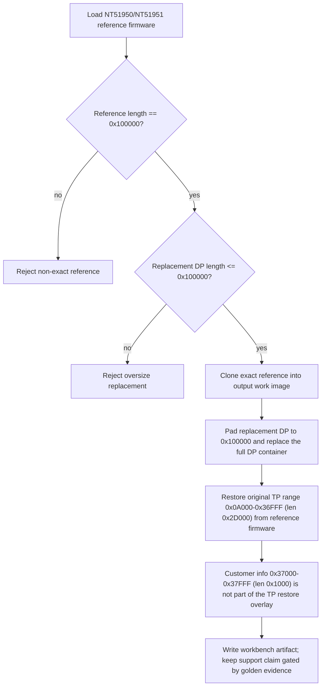
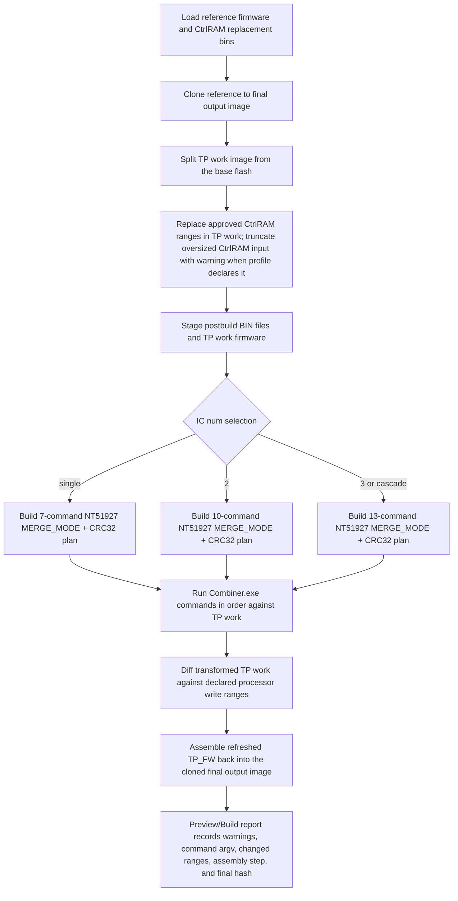
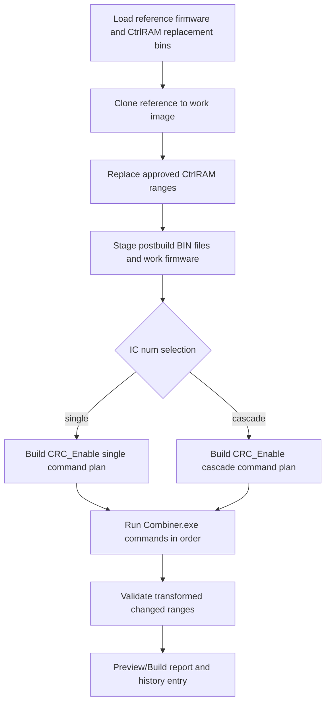
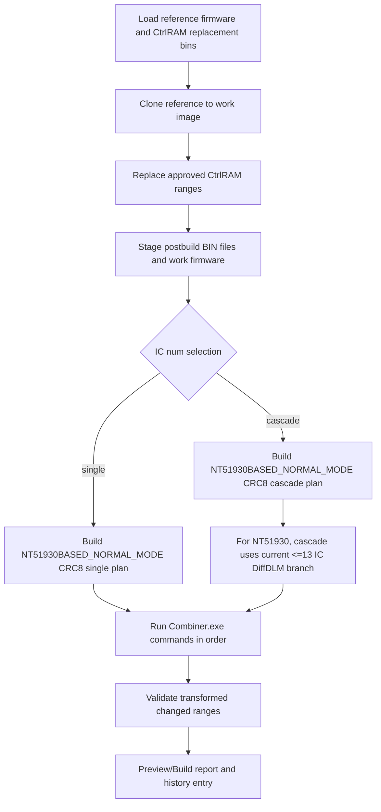
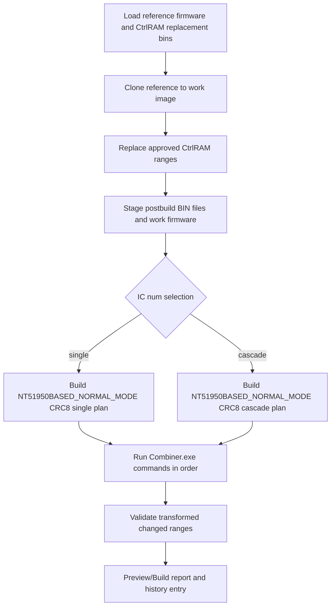
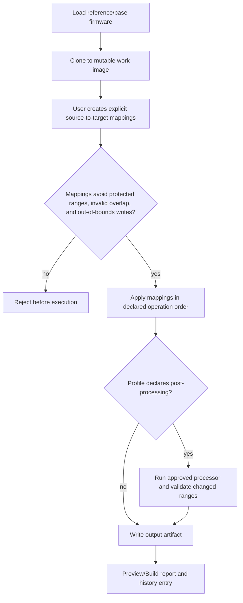

# IC Workflow Flowchart Reference

Status: architecture reference as of 2026-07-02.

This document is an index for the current Merge and Replace flows by IC. It is not a production support claim. A profile is production-ready only after profile validation, golden regression, processor diff review, and owner sign-off.

## Update rule

Update this document in the same change when any of these sources change:

- `src/NvtFwCombiner.Profiles/BuiltInStandardMergeProfiles.cs`
- `src/NvtFwCombiner.Profiles/BuiltInReplaceProfiles.cs`
- `src/NvtFwCombiner.Application/ExternalTools/LegacyCombinerPostbuildCatalog.cs`
- `docs/architecture/nt51950-nt51951-dp-length-policy.md`
- `docs/architecture/ctrlram-postbuild-command-matrix.md`
- `docs/architecture/supported-ic-matrix.md`

The architecture test `IcWorkflowFlowchartReferenceCoversBuiltInIcLists` checks that this document lists every IC from the built-in Standard Merge profiles and the CtrlRAM postbuild catalog. The test is a sync guard only; the C# catalog and owner evidence remain the source of behavior truth.

## Notation

- Ranges use half-open notation: `[start, end)`.
- `Implemented profile` means the repo has an executable built-in profile or command catalog entry. It does not imply production parity.
- `Golden pending` means the repo has an executable profile or command catalog entry, but owner-approved golden output and firmware sign-off are still pending.

## Per-IC flow index

| IC | Standard Merge flow | DP Replace flow | CtrlRAM Replace flow | General Replace flow | Current status notes |
| --- | --- | --- | --- | --- | --- |
| NT51917 | `SM-GENFLASH-ALIAS`: executable owner-confirmed alias of NT51927. | `R-DP-GENERIC`: DP profile wiring pending. | `R-CTRLRAM-927`: follows NT51927, numeric single/2/3 IC and cascade. | `R-GENERAL`: explicit mapping only after protected map is known. | Standard Merge alias regression uses NT51927 golden bytes; CtrlRAM command core implemented. |
| NT51919 | `SM-GENFLASH-ALIAS`: executable owner-confirmed alias of NT51929. | `R-DP-GENERIC`: DP profile wiring pending. | `R-CTRLRAM-51932`: follows NT51929/NT51932. | `R-GENERAL`: explicit mapping only after protected map is known. | Standard Merge alias regression uses NT51929 golden bytes; CtrlRAM command core implemented. |
| NT51920 | `SM-GENFLASH`: direct gen_flash profile. | `R-DP-GENERIC`: DP profile wiring pending. | `R-CTRLRAM-LEGACY-NORMAL`: `CRC_Enable`. | `R-GENERAL`: explicit mapping only after protected map is known. | Implemented Standard Merge profile and CtrlRAM command core. |
| NT51923 | `SM-GENFLASH`: direct gen_flash profile. | `R-DP-GENERIC`: DP profile wiring pending. | `R-CTRLRAM-LEGACY-NORMAL`: `CRC_Enable`, cascade split DiffDLM. | `R-GENERAL`: explicit mapping only after protected map is known. | Implemented Standard Merge profile and CtrlRAM command core. |
| NT51926 | `SM-GENFLASH`: direct gen_flash profile. | `R-DP-GENERIC`: DP profile wiring pending. | `R-CTRLRAM-LEGACY-NORMAL`: `CRC_Enable`. | `R-GENERAL`: explicit mapping only after protected map is known. | Implemented Standard Merge profile and CtrlRAM command core. |
| NT51927 | `SM-GENFLASH`: direct gen_flash profile. | `R-DP-GENERIC`: DP profile wiring pending. | `R-CTRLRAM-927`: numeric single/2/3 IC and cascade. | `R-GENERAL`: explicit mapping only after protected map is known. | Implemented Standard Merge profile and special CtrlRAM command core. |
| NT51928 | `SM-GENFLASH-LD`: includes TP, DP, and LD. | `R-DP-GENERIC`: DP/LD profile wiring pending. | `R-CTRLRAM-927`: follows NT51927 for non-NB only. | `R-GENERAL`: explicit mapping only after protected map is known. | NT51928 NB is not covered and must be a separate IC if approved later. |
| NT51929 | `SM-GENFLASH`: direct gen_flash profile. | `R-DP-GENERIC`: DP profile wiring pending. | `R-CTRLRAM-51932`: follows NT51932. | `R-GENERAL`: explicit mapping only after protected map is known. | Implemented Standard Merge profile and CtrlRAM command core; AB is deferred. |
| NT51930 | `SM-FLASHMAP-DYNAMIC`: flash-map derived profile. | `R-DP-GENERIC`: DP profile wiring pending. | `R-CTRLRAM-51930`: current cascade maps to `<=13 IC`. | `R-GENERAL`: explicit mapping only after protected map is known. | Implemented Standard Merge profile and CtrlRAM command core; normal merge golden pending. |
| NT51931 | `SM-GENFLASH`: direct gen_flash profile. | `R-DP-GENERIC`: DP profile wiring pending. | `R-CTRLRAM-51930`: NT51930-based mode. | `R-GENERAL`: explicit mapping only after protected map is known. | Implemented Standard Merge profile and CtrlRAM command core. |
| NT51932 | `SM-GENFLASH`: direct gen_flash profile. | `R-DP-GENERIC`: DP profile wiring pending. | `R-CTRLRAM-51932`: direct postbuild reference. | `R-GENERAL`: explicit mapping only after protected map is known. | Implemented Standard Merge profile and CtrlRAM command core; AB is deferred. |
| NT51950 | `SM-950-951-DP-PERSPECTIVE`: executable profile, golden pending. | `R-DP-950-951`: workbench exact-base path implemented; production profile/golden pending. | `R-CTRLRAM-51950`: direct postbuild reference. | `R-GENERAL`: explicit mapping only after protected map is known. | Standard Merge profile, DP Replace workbench path, and CtrlRAM command core implemented; golden pending. |
| NT51951 | `SM-950-951-DP-PERSPECTIVE`: follows NT51950 profile, golden pending. | `R-DP-950-951`: follows NT51950 workbench exact-base path; production profile/golden pending. | `R-CTRLRAM-51950`: follows NT51950. | `R-GENERAL`: explicit mapping only after protected map is known. | Standard Merge profile, DP Replace workbench path, and CtrlRAM command core implemented; golden pending. |

## Standard Merge flowcharts

### SM-GENFLASH

Used by the executable golden-backed gen_flash profiles: NT51920, NT51923, NT51926, NT51927, NT51929, NT51931, and NT51932. Owner-confirmed alias profiles reuse this same flow: NT51917 follows NT51927, and NT51919 follows NT51929.

| IC | Output size | TP range | DP range | DP input length note |
| --- | ---: | --- | --- | --- |
| NT51917 | `0x40000` | `[0x00000, 0x35000)` | `[0x3C000, 0x40000)` | Owner-confirmed alias of NT51927; declared source length `0x200000`; alias golden regression uses NT51927 fixtures. |
| NT51919 | `0x40000` | `[0x07000, 0x40000)` | `[0x00000, 0x06000)` | Owner-confirmed alias of NT51929; declared source length `0x40000`; alias golden regression uses NT51929 fixtures. |
| NT51920 | `0x40000` | `[0x00000, 0x30000)` | `[0x3E000, 0x40000)` | Source length equals range end. |
| NT51923 | `0x40000` | `[0x00000, 0x3C000)` | `[0x3E000, 0x40000)` | Source length equals range end. |
| NT51926 | `0x40000` | `[0x00000, 0x3C000)` | `[0x3E000, 0x40000)` | Source length equals range end. |
| NT51927 | `0x40000` | `[0x00000, 0x35000)` | `[0x3C000, 0x40000)` | Declared source length `0x200000`. |
| NT51929 | `0x40000` | `[0x07000, 0x40000)` | `[0x00000, 0x06000)` | Declared source length `0x40000`. |
| NT51931 | `0x40000` | `[0x00000, 0x3C000)` | `[0x3E000, 0x40000)` | Declared source length `0x80000`. |
| NT51932 | `0x40000` | `[0x07000, 0x40000)` | `[0x00000, 0x06000)` | Declared source length `0x40000`. |

### SM-FLASHMAP-DYNAMIC

Used by NT51930.

| IC | Output size | TP range | DP range | Evidence note |
| --- | ---: | --- | --- | --- |
| NT51930 | `0x40000` | `[0x07000, 0x40000)` | `[0x00000, 0x06000)` | Derived from `IC_FlashMap.xlsx 51930 TP Flashmap`; golden pending. |

### SM-GENFLASH-LD

Used by NT51928 non-NB.

### SM-950-951-DP-PERSPECTIVE

Used by NT51950 and NT51951. This flow is an executable built-in Standard Merge profile, but production support still needs owner golden output.

## DP Replace flowcharts

### R-DP-GENERIC

This is the generic Replace composition shape. Real per-IC DP maps are still pending unless a profile explicitly declares the DP or LD partitions.

### R-DP-950-951

Used by NT51950 and NT51951 as the target DP Perspective policy. The workbench path is wired for this exact-base rule; golden evidence and profile promotion are still required before a support claim.

## CtrlRAM Replace flowcharts

All CtrlRAM Replace flows require post-replace legacy Combiner 1.13.0 processing before the result can be treated as a finished TDDI firmware image. Command sequences are stored as structured command data, then converted to argv arrays.

### R-CTRLRAM-927

Used by NT51917, NT51927, and NT51928 non-NB.

### R-CTRLRAM-LEGACY-NORMAL

Used by NT51920, NT51923, and NT51926.

### R-CTRLRAM-51932

Used by NT51919, NT51929, and NT51932.

### R-CTRLRAM-51930

Used by NT51930 and NT51931.

### R-CTRLRAM-51950

Used by NT51950 and NT51951.

## General Replace flowchart

### R-GENERAL

General Replace is available as a generic composition model. It becomes safe for a production IC only after protected ranges, allowed explicit-map areas, alignment rules, and processor triggers are known.

