# IC Workflow Flowchart Reference

Status: architecture reference; evidence dates are recorded by the cited manifests and review history.

This document is an index for the current Merge and Replace flows by IC. It is not a production support claim. A profile is production-ready only after profile validation, golden regression, processor diff review, and owner sign-off. The implementation runbook for adding a new IC workflow is [`adding-ic-merge-replace-workflow.md`](adding-ic-merge-replace-workflow.md).

## Update rule

Update this document in the same change when any of these sources change:

- `src/NvtFwCombiner.Bootstrap/BuiltInV2RegistrationRegistry.cs`; this owns the explicit production Standard Merge and DP Replace registration lists plus non-routed General Merge candidates.
- `src/NvtFwCombiner.Bootstrap/BuiltInV2Bundle.cs`; production profiles are manifest-pinned V2 bundles. Synthetic compiler fixtures remain test-only under `tests/NvtFwCombiner.TestSupport/`.
- `profiles/built-in/ctrlram-postbuild-v2/catalog.json`; Infrastructure validates its pinned hash and projects typed runtime profiles.
- `docs/architecture/nt51950-nt51951-dp-length-policy.md`
- `docs/architecture/ctrlram-postbuild-command-matrix.md`
- `docs/architecture/supported-ic-matrix.md`
- `docs/architecture/adding-ic-merge-replace-workflow.md`

The architecture test `IcWorkflowFlowchartReferenceCoversBuiltInIcLists` checks that this document lists every IC from the built-in Standard Merge profiles and the CtrlRAM postbuild catalog. The test is a sync guard only; the C# catalog and owner evidence remain the source of behavior truth.

## Notation

- Ranges use half-open notation: `[start, end)`.
- `Implemented profile` means the repo has an executable built-in profile or command catalog entry. It does not imply production parity.
- `Golden pending` means the repo has an executable profile or command catalog entry, but owner-approved golden output and firmware sign-off are still pending.

## Per-IC flow index

| IC | Standard Merge flow | DP Replace flow | CtrlRAM Replace flow | General Replace flow | Current status notes |
| --- | --- | --- | --- | --- | --- |
| NT51917 | `SM-GENFLASH-V2-ALIAS`: packaged canonical V2 bundle is selected by Bootstrap UI/CLI through its content-hash anchor; map-bound alias of NT51927. | `R-DP-GENERIC`: DP profile wiring pending. | `R-CTRLRAM-927-V2-ALIAS`: exact FW 1.4.1 single/PID `0x5709`, FW 1.3.2 two-chip/PID `0x1615`, and FW 1.4.0 three-chip/PID `0x570A` bases use a hash-pinned NT51917 alias bundle over the canonical NT51927 family; other shapes retain fallback. | `R-GENERAL-POSTBUILD`: explicit mappings use protected-range gates; TP/CtrlRAM mappings run selected postbuild when available. | Each exact CtrlRAM alias preserves the corresponding NT51927 V1/V2 output SHA and 7/10/13-command sequence while retaining the `nt51917_fw.bin` staged identity; support remains neutral. |
| NT51919 | `SM-GENFLASH-V2-ALIAS`: packaged canonical V2 bundle is selected by Bootstrap UI/CLI through its content-hash anchor; map-bound alias of NT51929. | `R-DP-GENERIC`: DP profile wiring pending. | `R-CTRLRAM-51929-ALIAS`: exact FW 2.0.0/PID `0x4703`/single/reference-SHA shape uses the separately manifest-pinned NT51919 profile over the canonical NT51929 family; V1/V2 bytes and two-command process evidence match. Other shapes retain fallback. | `R-GENERAL-POSTBUILD`: explicit mappings use protected-range gates; TP/CtrlRAM mappings run selected postbuild when available. | `AB-51919-CANDIDATE`: fixed `0x80000` V2 plan aliases NT51929; no UI/CLI route or runtime promotion. |
| NT51920 | `SM-GENFLASH-V2`: packaged canonical V2 bundle is selected by Bootstrap UI/CLI through its content-hash anchor. | `R-DP-GENERIC`: DP profile wiring pending. | `R-CTRLRAM-LEGACY-NORMAL`: `CRC_Enable`. | `R-GENERAL-POSTBUILD`: explicit mappings use protected-range gates; TP/CtrlRAM mappings run selected postbuild when available. | V2 Standard Merge preserves legacy golden bytes; firmware-owner review remains required before release support. |
| NT51923 | `SM-GENFLASH-V2`: packaged canonical V2 bundle is selected by Bootstrap UI/CLI through its content-hash anchor. | `R-DP-GENERIC`: DP profile wiring pending. | `R-CTRLRAM-LEGACY-NORMAL`: `CRC_Enable`, cascade split DiffDLM. | `R-GENERAL-POSTBUILD`: explicit mappings use protected-range gates; TP/CtrlRAM mappings run selected postbuild when available. | V2 Standard Merge preserves legacy golden bytes; firmware-owner review remains required before release support. |
| NT51926 | `SM-GENFLASH-V2`: packaged canonical V2 bundle is selected by Bootstrap UI/CLI through its content-hash anchor. | `R-DP-GENERIC`: DP profile wiring pending. | `R-CTRLRAM-V2-141-CASCADE`: Common FW 1.4.1 cascade without a version edit selects exact `0x3C000`/`0x40000` maps and processes one TP prefix; other cases retain the existing path. | `R-GENERAL-V2-DP-SLICE`: single/full-Flash/file-backed DP-only mappings use V2; TP/CtrlRAM, patches/fills, other counts and shapes retain protected legacy planning/postbuild. | Both V2 slices preserve forced-V1 bytes and do not promote support; exact range and firmware-owner review remain. |
| NT51927 | `SM-GENFLASH-V2`: packaged canonical V2 bundle is selected by Bootstrap UI/CLI through its content-hash anchor. | `R-DP-GENERIC`: DP profile wiring pending. | `R-CTRLRAM-927`: exact single/2/3 V2 routes use full-reference-SHA admission; other shapes retain the fallback. | `R-GENERAL-POSTBUILD`: explicit mappings use protected-range gates; TP/CtrlRAM mappings run selected postbuild when available. | Common FW 1.4.0/PID `0x570A`/three-chip now has support-neutral V1/V2 byte and 13-command parity; it is expected-derived evidence, not public support promotion. |
| NT51928 | `SM-GENFLASH-LD-V2`: hash-anchored V2 route includes TP, DP, and typed auxiliary LD. | `R-DP-GENERIC`: DP/LD profile wiring pending. | `R-CTRLRAM-927-PARTIAL`: exact non-NB FW 1.3.2/PID `0xF206`/two-chip/512 KiB Standard Merge base uses a separately pinned V2 profile and preserves `[0x34800,0x80000)` including DP/LDC. | `R-GENERAL-POSTBUILD`: explicit mappings use protected-range gates; TP/CtrlRAM mappings run selected postbuild when available. | NT51928 NB is not covered; every other base/version/count remains outside this exact V2 route and retains the existing evidence-gated path. |
| NT51929 | `SM-GENFLASH-V2`: packaged canonical V2 bundle is selected by Bootstrap UI/CLI through its content-hash anchor. | `R-DP-GENERIC`: DP profile wiring pending. | `R-CTRLRAM-51932`: exact AUTO_PRJ-594/PID `0x4703`/Common FW 2.0.0/single/reference-SHA uses V2; other shapes retain the fallback. | `R-GENERAL-POSTBUILD`: explicit mappings use protected-range gates; TP/CtrlRAM mappings run selected postbuild when available. | The non-AB single V1/V2 output is byte-identical with only 15 classified CRC bytes relative to the owner expected. `AB-51929-CANDIDATE` remains a separate fixed `0x80000` candidate with no runtime promotion. |
| NT51930 | `SM-FLASHMAP-V2`: packaged canonical V2 bundle is selected by Bootstrap UI/CLI through its content-hash anchor. | `R-DP-GENERIC`: DP profile wiring pending. | `R-CTRLRAM-51930`: current cascade maps to `<=13 IC`. | `R-GENERAL-POSTBUILD`: explicit mappings use protected-range gates; TP/CtrlRAM mappings run selected postbuild when available. | V2 Standard Merge preserves the `merge_bin.7z` golden bytes; firmware-owner review remains required before release support. |
| NT51931 | `SM-GENFLASH-V2`: packaged canonical V2 bundle is selected by Bootstrap UI/CLI through its content-hash anchor. | Not Supported. | Exact AUTO_PRJ-158/PID `0x131B`/cascade-6 V2 route is materialized with registered 1.13.0 `NT51931BASED_NORMAL_MODE CRC8`; support remains neutral. | Not Supported. | V1 and V2 output SHA are both `f38fdecd...c594`; payload drift to the owner expected is 0 and all 108 differing bytes are classified header/header-copy CRC. Other shapes do not enter the exact route. |
| NT51932 | `SM-GENFLASH-V2`: packaged canonical V2 bundle is selected by Bootstrap UI/CLI through its content-hash anchor. | `R-DP-GENERIC`: DP profile wiring pending. | `R-CTRLRAM-51932`: direct postbuild reference. | `R-GENERAL-POSTBUILD`: explicit mappings use protected-range gates; TP/CtrlRAM mappings run selected postbuild when available. | `AB-51932-CANDIDATE`: fixed `0x80000` full DP -> TPA -> relocated TPB V2 plan; no UI/CLI route or runtime promotion. |
| NT51950 | `SM-950-951-DP-PERSPECTIVE-V2`: packaged canonical V2 maps select the exact submitted DP capacity; owner `0x40000` DP golden passes. | `R-DP-950-951`: the workbench UI/CLI routes the supported V2 profile and selects its exact base capacity. | `R-CTRLRAM-51950`: exact AUTO_PRJ-676/PID `0x4A06`/FW 2.0.0/single/reference-SHA uses V2; other shapes retain the fallback. | `R-GENERAL-POSTBUILD`: explicit mappings use protected-range gates; TP/CtrlRAM mappings run selected postbuild when available. | CtrlRAM V1/V2 bytes are equal and the owner delta is four CRC words. Cascade has no product case and is outside v0.9.9 scope. `AB-51950-CANDIDATE` remains separate and unpromoted. |
| NT51951 | `SM-950-951-DP-PERSPECTIVE-V2`: packaged canonical V2 maps select the exact submitted DP capacity; owner `0x80000` DP golden passes. | `R-DP-950-951`: the workbench UI/CLI routes the supported V2 profile and selects its exact base capacity. | `R-CTRLRAM-51950`: follows NT51950. | `R-GENERAL-POSTBUILD`: explicit mappings use protected-range gates; TP/CtrlRAM mappings run selected postbuild when available. | Standard/DP migration evidence is not a hardware golden or product support claim. `AB-51951-CANDIDATE` uses the owner-approved NT51950 workflow-logic scope and independently locks the distinct `0x80000` synthetic topology; firmware-owner review and runtime promotion remain pending. |

## Deferred AB Initializer Policy

All five AB V2 candidates copy the complete submitted DP container before their declared TPA/TPB overlays, and none is routed through Bootstrap, UI, CLI, or Application runtime. NT51919, NT51929, and NT51932 use the fixed `0x80000` AB map and checked cloned-TPB relocations at `0x7164/0x7168/0x716C`; the owner approved NT51929 golden applicability for NT51919 and NT51932, with independent configuration tests retained. NT51950 and NT51951 stage immutable A/B banks, apply only the declared TPB DIFF relocation in C#, then invoke Legacy Combiner 1.13.0 with the verified `NT51950BASED_MERGE_AB_MODE` command. That AB command does not consume `map.txt`; C# never writes the AB header CRC, and Combiner owns the declared B-header ILM/DLM/CRC mutations. NT51950 has two direct owner fixtures with full-byte parity; the owner approved their workflow-logic applicability to NT51951, whose distinct `0x80000` synthetic topology remains locked. Firmware-owner review remains required before any runtime promotion.

## Standard Merge flowcharts

### SM-GENFLASH and SM-GENFLASH-V2

Used by the executable golden-backed gen_flash profiles: NT51920, NT51923, NT51926, NT51927, NT51929, NT51931, and NT51932. Bootstrap selects the packaged, hash-anchored V2 artifact for NT51917, NT51919, NT51920, NT51923, NT51926, NT51927, NT51929, NT51931, and NT51932. The owner-confirmed aliases are map-bound: NT51917 resolves its physical region-set fact to NT51927, and NT51919 resolves it to NT51929.

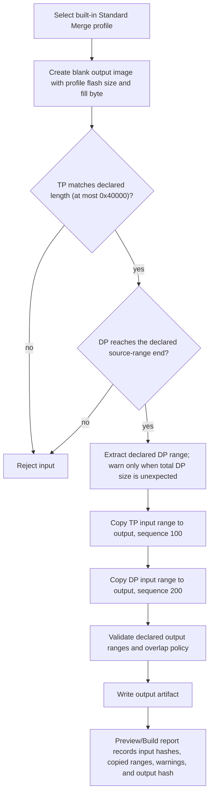

The DP source-size notes below are expected golden lengths, not exact-size execution gates. A DP input must cover the listed DP range; other total lengths are accepted with a warning. TP input remains exact-length for its declared profile range.

| IC | Output size | TP range | DP range | DP input length note |
| --- | ---: | --- | --- | --- |
| NT51917 | `0x40000` | `[0x00000, 0x35000)` | `[0x3C000, 0x40000)` | Owner-confirmed alias of NT51927; declared source length `0x200000`; alias golden regression uses NT51927 fixtures. |
| NT51919 | `0x40000` | `[0x07000, 0x40000)` | `[0x00000, 0x06000)` | Owner-confirmed alias of NT51929; declared source length `0x40000`; alias golden regression uses NT51929 fixtures. |
| NT51920 | `0x40000` | `[0x00000, 0x30000)` | `[0x3E000, 0x40000)` | Source length equals range end. |
| NT51923 | `0x40000` | `[0x00000, 0x3C000)` | `[0x3E000, 0x40000)` | Source length equals range end. |
| NT51926 | `0x40000` | `[0x00000, 0x3C000)` | `[0x3E000, 0x40000)` | Source length equals range end. |
| NT51927 | `0x40000` | `[0x00000, 0x35000)` | `[0x3C000, 0x40000)` | Declared source length `0x200000`. |
| NT51929 | `0x40000` | `[0x07000, 0x40000)` | `[0x00000, 0x06000)` | Declared source length `0x40000`. |
| NT51931 | `0x40000` | `[0x00000, 0x3C000)` | `[0x3E000, 0x40000)` | Declared source length `0x80000`. |
| NT51932 | `0x40000` | `[0x07000, 0x40000)` | `[0x00000, 0x06000)` | Declared source length `0x40000`. |

### SM-FLASHMAP-V2

Used by NT51930 through its packaged, hash-anchored canonical V2 bundle.

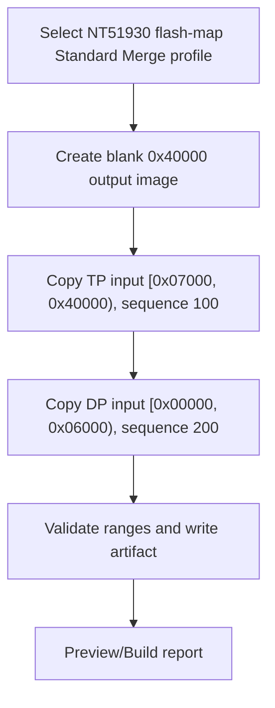

| IC | Output size | TP range | DP range | Evidence note |
| --- | ---: | --- | --- | --- |
| NT51930 | `0x40000` | `[0x07000, 0x40000)` | `[0x00000, 0x06000)` | Derived from `IC_FlashMap.xlsx 51930 TP Flashmap`; owner golden added from `merge_bin.7z`. |

### SM-GENFLASH-LD

Used by NT51928 non-NB.

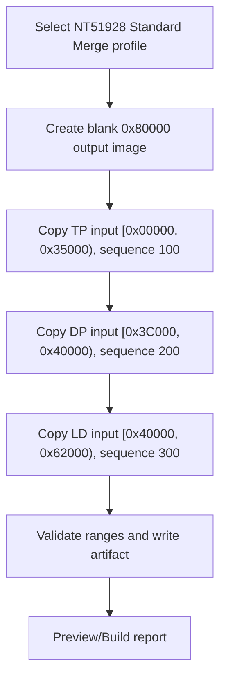

### SM-950-951-DP-PERSPECTIVE

Used by NT51950 and NT51951. This flow is an executable built-in Standard Merge profile with owner golden output for current `0x40000` and `0x80000` DP Perspective cases.

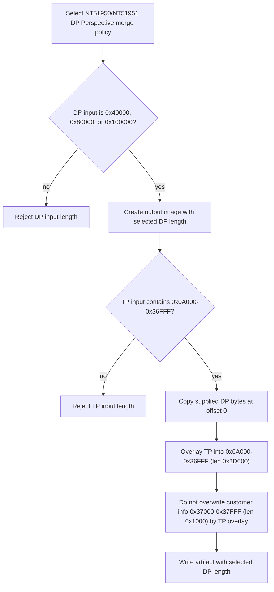

## DP Replace flowcharts

### R-DP-GENERIC

This is the generic Replace composition shape. Real per-IC DP maps are still pending unless a profile explicitly declares the DP or LD partitions.

### R-DP-950-951

Used by NT51950 and NT51951 as the target DP Perspective policy. The V2 profiles are runtime-admitted by archived owner-approved legacy full-byte comparison and public synthetic expected hashes with no known deviations; the workbench route has no legacy fallback. This migration evidence is not an independent hardware golden or a product support claim.

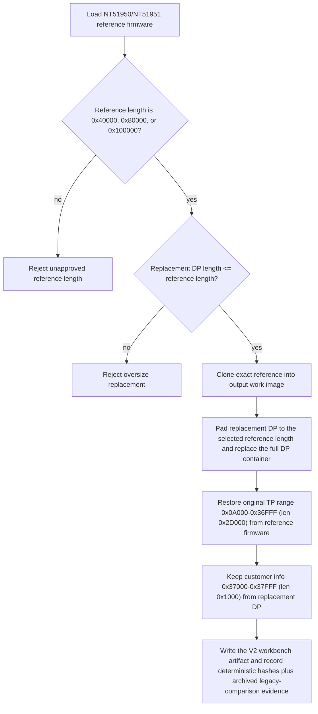

### R-DP-930

Used by NT51930. This V2 route reuses the exact canonical 256 KiB Standard Merge map. Its checked-in deterministic oracle and owner Standard Merge self-replacement control admit the safety contract, while direct owner DP Replace golden parity remains **Evidence open**.

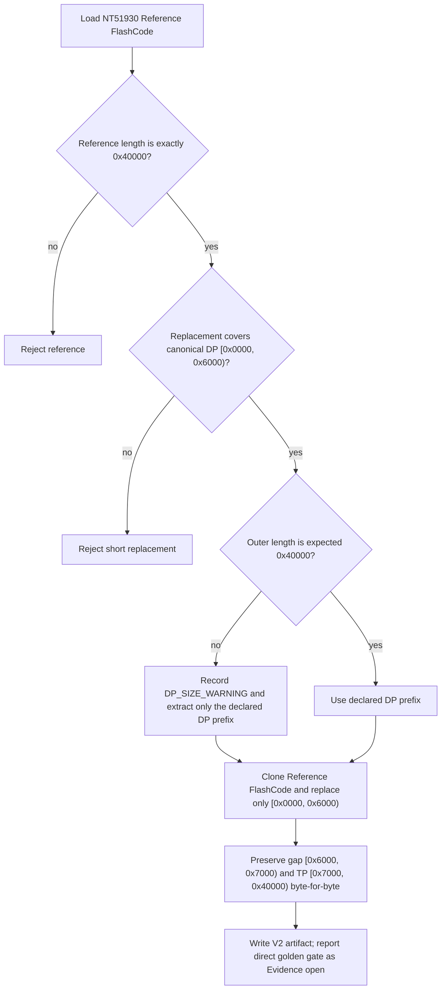

## CtrlRAM Replace flowcharts

All CtrlRAM Replace flows require post-replace legacy Combiner 1.13.0 processing before the result can be treated as a finished TDDI firmware image. Command sequences are stored as structured command data, then converted to argv arrays.

The validated NT51926 product flow accepts TP-work and full-Flash artifacts.
Common FW 1.4.1 cascade without a TP firmware-version edit now selects either
exact `0x3C000` TP work or exact `0x40000` full Flash through V2, runs one
TP-prefix processor contract, and keeps the full-Flash tail unchanged. The TP
case matches its archived Legacy Combiner output and full Flash matches forced
V1 bytes; support promotion still requires firmware-owner R3 review.

### R-CTRLRAM-927

Used by NT51917, NT51927, and NT51928 non-NB.

NT51927 enters an exact V2 route only when IC, processor, branch, numeric mode,
Common FW version, chip count, PID, and the complete reference-image SHA all
match a reviewed case. The Common FW `1.4.0` / PID `0x570A` / three-chip case
selects `nt51927-ctrlram-replace-fw140-threechip`, runs one ordered 13-command
session, and preserves V1 output bytes. Its expected-derived result contains
29 complete header/CRC words plus four explicit VN replacement ranges. It
remains support-neutral because no independent owner expected output exists.
Every other project, base hash, version, count, or selector retains the
existing fallback.

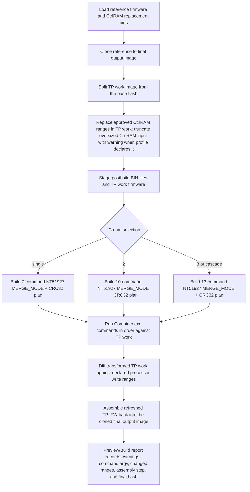

### R-CTRLRAM-LEGACY-NORMAL

Used by NT51920, NT51923, and NT51926.

For NT51926 only, the V2 executable candidate is the exact-shape runtime
specialization for Common FW 1.4.1 cascade without a version edit, accepting
both `0x3C000` TP and `0x40000` Flash. The diagram below remains the residual
path for other versions/counts and version edits; routing the candidate is not
a runtime support promotion.

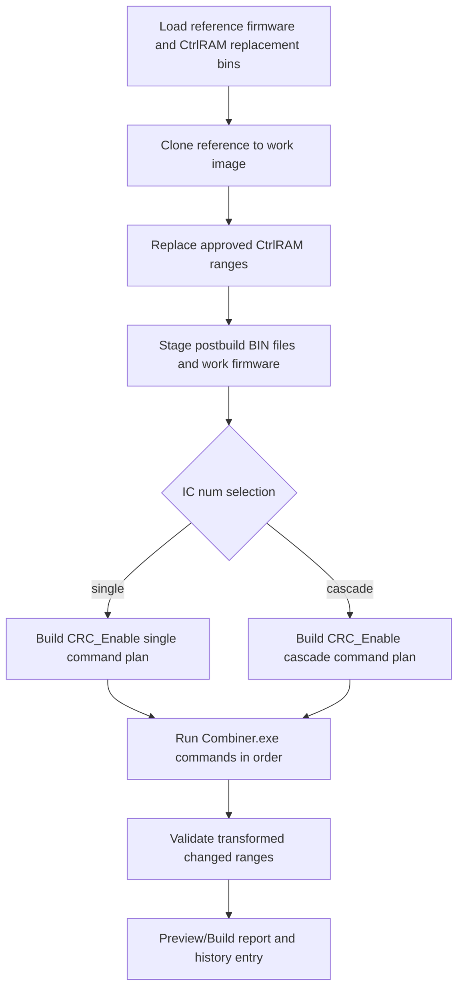

### R-CTRLRAM-51932

Used by NT51919, NT51929, and NT51932.

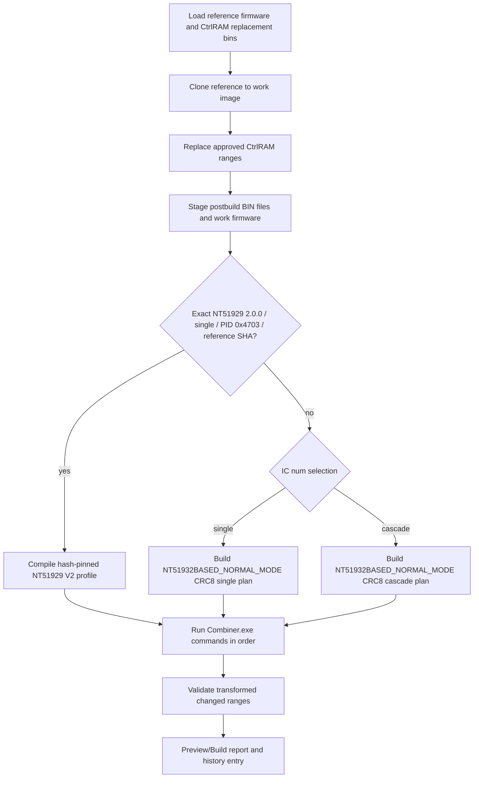

### R-CTRLRAM-51930

Used by NT51930 and NT51931.

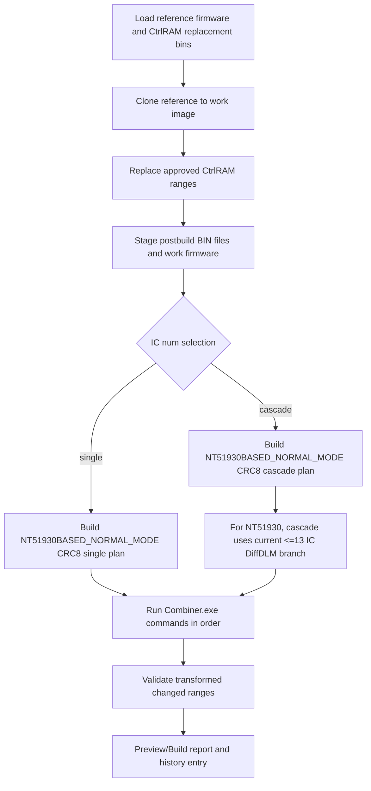

### R-CTRLRAM-51950

Used by NT51950 and NT51951.

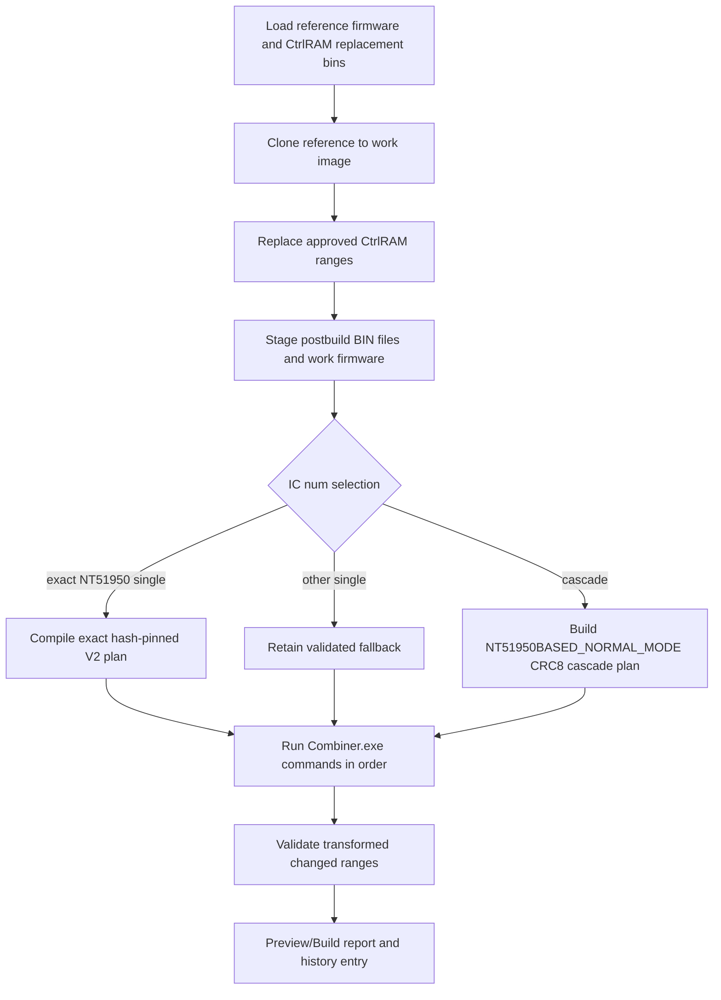

## General Replace flowchart

### R-GENERAL

General Replace is available as a generic composition model. It becomes safe for a production IC only after protected ranges, allowed explicit-map areas, alignment rules, and processor triggers are known.

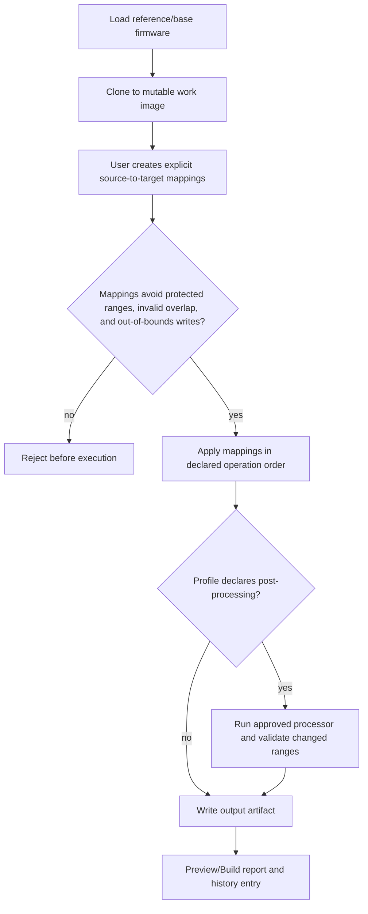
