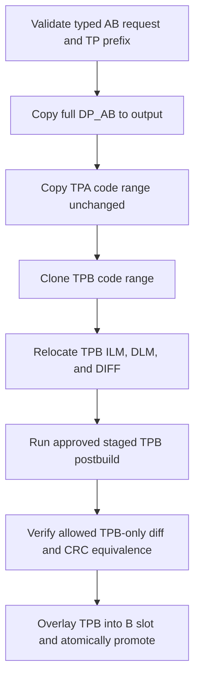

# NT51950 / NT51951 AB Code Contract

Status: `0.9.15` release-target design and review contract. It does not itself
claim certification or replace the profile, processor binding, or executable
tests as the source of runtime behavior.

Related authority: [ADR 0035](../adr/0035-ab-topology-operator-selection.md),
[ADR 0036](../adr/0036-output-destination-and-ab-naming-v2.md), and the
[IC workflow reference](ic-workflow-flowcharts.md).

## Declared layouts

| IC / typed route | DP input and output | A/B boundary | TPA target | TPB target | CMI base / A CMI / B CMI | TPB relocation addend |
| --- | --- | ---: | --- | --- | --- | ---: |
| NT51950 `single` | `[0x00000,0x80000)` | `0x40000` | `[0x0A000,0x37000)` | `[0x4A000,0x77000)` | `0x3B000` / `0x3B016` / `0x7B016` | `0x40000` |
| NT51950 `cascade` | `[0x00000,0x100000)` | `0x40000` | `[0x0A000,0x37000)` | `[0x4A000,0x77000)` | `0x05000` / `0x05016` / `0x45016` | `0x40000` |
| NT51951 selector-free | `[0x00000,0x100000)` | `0x80000` | `[0x0A000,0x37000)` | `[0x8A000,0xB7000)` | `0x05000` / `0x05016` / `0x85016` | `0x80000` |

All intervals are half-open. The output starts as a complete DP_AB copy, has
exactly the DP input length, and preserves every DP byte outside the TP
overlays. A/B identify slot coordinates, not physical chip count. NT51950
alone has the two symbolic operator choices `1 IC` / `Cascade`; TP FWConfig
classification can request confirmation but never silently selects a route.
NT51951 has one declared byte plan and never presents an IC-number control.

## Input, metadata, and name contract

- TPA and TPB each need only cover `[0x00000,0x37000)`; longer tails are not
  copied, mutated, or naming input.
- The copied source code interval is exactly `[0x0A000,0x37000)`.
- NVT flash-header/FWConfig parsing is required for both TPA and TPB; the
  report records FW/subversion, chip classification, Common FW, and PID/project
  provenance. Missing or invalid required NVT metadata fails closed.
- DP CMI is read-only. Reg17 supplies the DP major byte; the high nibble of
  Reg18 supplies the zero-padded DP minor nibble. Reg16 and the low nibble of
  Reg18 remain report/Jira provenance, not filename fields.
- Automatic identity is
  `NT519xx_FlashCode_A_DmmmmTvvvv_B_DmmmmTvvvv_yyyyMMdd.bin`, with UTC system
  date. An explicit output path wins and becomes the report identity. Any
  output/input alias fails closed; another existing output path is atomically
  replaced.

## TPB-only postbuild boundary

TPA remains byte-for-byte copied and its CRC is never recomputed. TPB is the
only cloned mutable source. Before postbuild, these little-endian `u32` fields
receive the layout addend:

| Field | Source-relative interval |
| --- | --- |
| ILM | `[0xA100,0xA104)` |
| DLM | `[0xA110,0xA114)` |
| DIFF | `[0xA120,0xA124)` |

The approved staged postbuild route then calculates CRC-32/MPEG-2 over
`[0xA100,0xA130)` and writes its little-endian value at `[0xA130,0xA134)`.
It is the authoritative writer so the release/runtime environment matches the
same postbuild implementation used by the approved 950/951 path. C# performs
the same pure calculation only as an independent equivalence assertion. The
host rejects a changed DP byte, any out-of-range TPB mutation, a length change,
or a C#/postbuild CRC disagreement before it imports the staged TPB bytes into
the B slot.

Required tests include all three maps, complete DP preservation, short-prefix
rejection, longer-tail independence, NVT metadata detection, TPA no-write,
the three TPB relocations, TPB postbuild allowed ranges, C#/postbuild CRC
equivalence, output identity/override rules, source immutability, and atomic
failure.

## Mermaid flow and release permalink

The Mermaid source below is versioned with this contract. It is explanatory:
the compiled profile and staged processor are the executable authority.

Editable Mermaid Live permalink (generated from this exact source on
2026-07-23):

https://mermaid.live/edit#pako:eNpNkcFuwjAQRH9l5TP8AIdKJCEUiaqIol6aqtrGG7Dk2K5j00aIf-_aUaE5RJHzZnY8exGtlSQWotP2uz2hD3CoGgP8LN8a8YpaSQwEYXQkYVmAp69IQwA0Eg47cJ469dOId5jPH6BgSWndCF3UGqrdBwuCBRuDi4GhybjIbPnHHnZLSCHAozkSRMMx-EPe-DLzVeK1NcSC4p_ghlUZWzG2J23blDqRm-3TDKr0SpGrTV3fFKusqJMiGkDnvD3zLYeAPD6LnR3CZ1T6HqbOmnXqhrzqRkDNzU343Bo9glRdl2eV-xK4LXVGTaa9B11ni0e2eD6T1zjmUcpwUwUM2k7lYrC9atl95JJtb8NkIGaiJ9-jkry0SyPCiXr-s2iEpA6j5pqvzGAM9mU0rVgEH2kmoktrrBQePfbT4fUXa62hpQ

The `0.9.15` release handoff must record this file path, its commit SHA, and
the permalink above. The release-level all-IC/all-mode index references this
contract; it is a documentation deliverable, not an implementation-convergence
authorization.
