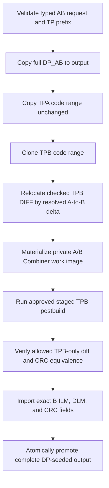

# NT51950 / NT51951 AB Code Contract

Status: canonical `0.10.x` design and review contract, migrated by issue #190.
It does not itself claim certification or replace the profile, processor
binding, or executable tests as the source of runtime behavior.

Related authority: [ADR 0035](../adr/0035-ab-topology-operator-selection.md)
and [ADR 0036](../adr/0036-output-destination-and-ab-naming-v2.md).

## Function state and certification debt

All three routes in this document are function-open in `0.9.15`: the shared
Application executor is reachable from UI and CLI. This is not a support or
certification claim.

| Route | Direct golden state | Certification debt |
| --- | --- | --- |
| NT51950 `1 IC` | Two owner-supplied outputs are regression-pinned | Firmware-owner postbuild/map review and certification closure. |
| NT51950 `Cascade` | Missing | Direct vector plus firmware-owner postbuild/map review and release evidence. |
| NT51951 selector-free | Missing | Direct vector plus firmware-owner postbuild/map review and release evidence. |

No NT51950 evidence certifies NT51951, and the `1 IC` vector does not certify
NT51950 `Cascade`. Standard Merge, DP Replace, and CtrlRAM evidence do not
substitute for an AB Code direct golden.

## Declared layouts

| IC / typed route | DP input and output | A/B boundary | TPA target | TPB target | CMI base / A CMI / B CMI | TPB relocation addend |
| --- | --- | ---: | --- | --- | --- | ---: |
| NT51950 `single` | `[0x00000,0x80000)` | `0x40000` | `[0x0A000,0x37000)` | `[0x4A000,0x77000)` | `0x3B000` / `0x3B016` / `0x7B016` | `0x40000` |
| NT51950 `cascade` | `[0x00000,0x100000)` | `0x40000` | `[0x0A000,0x37000)` | `[0x4A000,0x77000)` | `0x05000` / `0x05016` / `0x45016` | `0x40000` |
| NT51951 selector-free | `[0x00000,0x100000)` | `0x80000` | `[0x0A000,0x37000)` | `[0x8A000,0xB7000)` | `0x05000` / `0x05016` / `0x85016` | `0x80000` |

All intervals are half-open. The output starts as a complete DP_AB copy, has
exactly the DP input length, and preserves every DP byte outside the TP
overlays. A/B identify slot coordinates, not physical chip count. NT51950
alone has the two symbolic operator choices `1 IC` / `Cascade`; TP FWConfig
classification can request confirmation but never silently selects a route.
NT51951 has one declared byte plan and never presents an IC-number control.

## Input, metadata, and name contract

- TPA and TPB each need only cover `[0x00000,0x37000)`; longer tails are not
  copied, mutated, or naming input.
- The copied source code interval is exactly `[0x0A000,0x37000)`.
- NVT flash-header/FWConfig parsing is required for both TPA and TPB; the
  report records FW/subversion, chip classification, Common FW, and PID/project
  provenance. Missing or invalid required NVT metadata fails closed.
- TP version/subversion, Common FW, PID/project identifiers, source filename,
  hash, and display text are never route selectors. Only canonical IC, the
  compiled profile map, and (for NT51950 alone) the explicit `1 IC`/`Cascade`
  selection determine memory coordinates and processor invocation.
- DP CMI is read-only. Reg17 supplies the DP major byte; the high nibble of
  Reg18 supplies the zero-padded DP minor nibble. Reg16 and the low nibble of
  Reg18 remain report/Jira provenance, not filename fields.
- Automatic identity is
  `NT519xx_FlashCode_A_DmmmmTvvvv_B_DmmmmTvvvv_yyyyMMdd.bin`, with UTC system
  date. An explicit output path wins and becomes the report identity. Any
  output/input alias fails closed; another existing output path is atomically
  replaced.

## TPB-only postbuild boundary

TPA remains byte-for-byte copied and its CRC is never recomputed. TPB is the
only cloned mutable source. Before postbuild, the host applies the resolved
layout addend only to this checked little-endian `u32` field:

| Field | Source-relative interval |
| --- | --- |
| DIFF | `[0xA120,0xA124)` |

The host first materializes a private A/B Combiner work image: 512 KiB for
NT51950 (`A[0x00000,0x40000)`, `B[0x40000,0x80000)`) and 1 MiB for NT51951
(`A[0x00000,0x80000)`, `B[0x80000,0x100000)`). That whole private image is
the processor's staging/read scope, not its write authority. The host admits
changes only to B-bank TPB ILM, DLM, and Header CRC: respectively
`[0x4A100,0x4A104)`, `[0x4A110,0x4A114)`, and `[0x4A130,0x4A134)` for
NT51950; the corresponding NT51951 ranges begin at `0x8A100`, `0x8A110`, and
`0x8A130`. After the external diff is checked, the host imports only those
three four-byte fields from the private work image. It never backfills the
whole B bank; the already-seeded DP container and every byte outside the named
TP overlays and exact imports remain byte-for-byte unchanged.

The approved staged postbuild route then calculates CRC-32/MPEG-2 over
`[0xA100,0xA130)` and writes its little-endian value at `[0xA130,0xA134)`.
It is the authoritative writer so the release/runtime environment matches the
same postbuild implementation used by the approved 950/951 path. C# performs
the same pure calculation only as an independent equivalence assertion. The
host rejects a changed DP byte, any out-of-range TPB mutation, a length change,
or a C#/postbuild CRC disagreement before it imports the three verified fields.

The workbench Memory coverage view labels A bank, B bank, and postbuild A/B
work buffers with their roles. The postbuild step description shows the full
staging/read scope and the three exact allowed-write ranges separately; the
full `[0x00000,0x80000)` NT51950 scope must not be described as one CRC
calculation interval.

Required tests include all three maps, exact topology-resolved DP capacity,
complete DP preservation, short-prefix rejection, longer-tail independence,
NVT metadata detection, TPA no-write, checked TPB DIFF relocation, TPB
postbuild allowed ranges and exact three-field imports, C#/postbuild CRC
equivalence, output identity/override rules, source immutability, and atomic
failure.

## Mermaid flow and release permalink

The Mermaid source below is versioned with this contract. It is explanatory:
the compiled profile and staged processor are the executable authority.

Historical `0.9.15` Mermaid Live permalink retained for provenance (the source
below reflects the narrower canonical `0.10.x` import boundary):

https://mermaid.live/edit#pako:eJxNkU1vwjAMhv-KlTNodw6T-kEBaUiIoV3WaQpNAhFp3KUJrEP89zmpBusBVeV57Nf2lTUoJJsxZfDSHLnzsCtrC_Rk7zV740YL7iX4oZMCshyc_Aqy98CtgN0GOieV_q7ZB0ynz5CTUmA3gArGQLn5JMEjYPBd8ASNhfPEFn_sbpNBDAGO24OEYCkGvYg7XyS-jLxBK0nI_wl3rEzYnLCtNNjE1JFcvawnUMafGLlcVdXdmCejImNNtNM07I-kkfQ5ytlTDgW2e22lgwu6E-iW_-tXJXsR-wULvOscnmlHvSdIpNYd9n4ftHmMskjOMm6W-qkBuKG9j_gUrRlAaKVS0mJbAO2ashhpm0fbZSqxohI5b05K06Jz6A2OJ-EeW91Q1YHmwBb9KLIJa6VruRZ06mvN_FG29M-sZkIqHgwd50YMDx5fB9uwmXdBTljo4vFLzQ-Ot-PH2y_0NrMb

The `0.10.x` review handoff records this file path and commit SHA. Broader
all-IC/all-mode documentation remains a separate owner-selected organization
slice; this dedicated contract does not authorize unrelated convergence.
