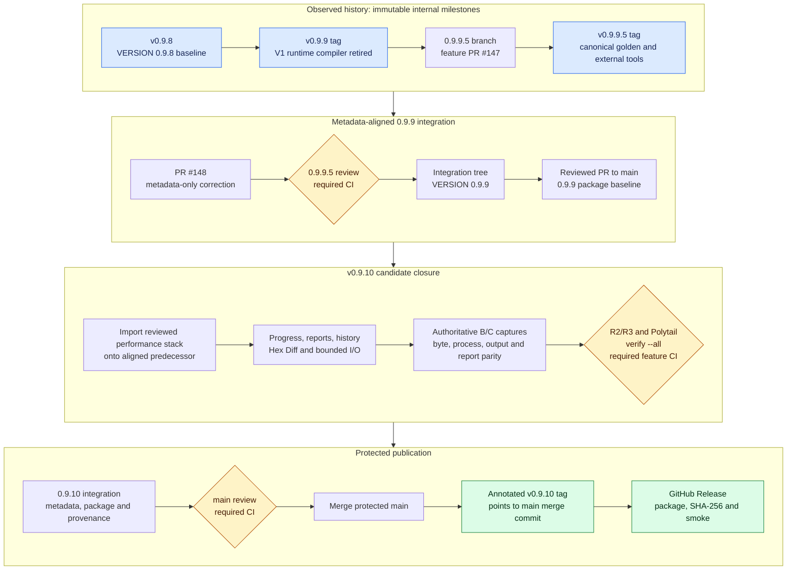

# v0.9.8 to v0.9.10 Release Impact and Integration Flow

Status: verified repository and GitHub history snapshot on 2026-07-19.

## Purpose

This document separates code milestones from stable releases, summarizes the
areas affected from `v0.9.8` through the planned `v0.9.10`, and defines the
integration and publication order that `v0.9.10` must follow.

It does not change firmware behavior, profile promotion, golden approval, or
release policy. Existing tags are immutable and must not be moved or reused.
This is a measured status index; the completion roadmap, accepted ADRs,
contracts, profiles, and executable tests remain the normative authorities.

## Release-state summary

| Milestone | Code and tag state | Main/release state | Classification |
| --- | --- | --- | --- |
| `v0.9.8` | Tag contains `VERSION=0.9.8`; code-size and package convergence are complete | A GitHub Release exists. The tag is not an ancestor of the current `origin/main`, so the current ancestry policy must be applied afresh to later releases | Published historical release and technical baseline |
| `v0.9.9` | Immutable tag points to the reviewed V1-compiler-retirement commit, but its tree still contains `VERSION=0.9.8` | Not merged into current `main`; no GitHub Release | Internal code milestone and predecessor only |
| `v0.9.9.5` | Immutable four-component milestone tag points to merge commit `0589ba3a`; its tree still contains `VERSION=0.9.8` | Not a `vX.Y.Z` tag, not merged into current `main`, and no GitHub Release | Internal canonical-evidence consolidation marker only |
| `0.9.9` integration correction | PR `#148` at `adcb742c` changes only `VERSION`, `SPEC.md`, `CHANGELOG.md`, and verification records; local `verify.py --all` passed | Must merge through `0.9.9.5`, then a reviewed integration PR to `main` | Metadata-aligned `0.9.9` main/package baseline; it does not repair or replace either historical tag |
| `v0.9.10` | Assigned performance and Change Report remediation milestone; not tagged | Must start from the metadata-aligned predecessor and close version, main, package, provenance, review, CI, and release gates below | Next eligible exact stable tag/release candidate if every gate closes |

The stable release workflow accepts only an exact `vX.Y.Z` tag, checks out that
tag, and requires its commit to be reachable from `main`. A later correction on
`main` cannot repair an already-created tag because the workflow builds the
tagged tree. Therefore the existing `v0.9.9` and `v0.9.9.5` tags must not be
dispatched through `.github/workflows/release.yml`. PR `#148` can align the
integration tree and its package metadata, but it cannot retroactively turn
either immutable tag into stable release authority.

## Affected areas

| Version | Primary affected areas | Runtime and user impact | Explicitly unchanged |
| --- | --- | --- | --- |
| `v0.9.8` | Production C#/AXAML size ratchets, duplicate schema/profile ownership, bundle registration, external-tool resolution, package allowlist, SBOM/provenance and smoke checks | Smaller and more maintainable source/package surface; no support expansion | Firmware ranges, operation order, processor write authority, AB CRC ownership and support truth |
| `v0.9.9` | V2 CtrlRAM exact routes, the exact NT51926 DP-only General Replace route, Workbench/display projections, `CompositionProfileCompiler` callers and implementation, code-size gates, route/evidence tests | Exact admitted shapes execute through V2. Unsupported or non-exact CtrlRAM/General Replace shapes fail closed instead of entering the retired V1 compiler | Legacy Combiner executable and constrained staged runner remain; no automatic support promotion and no C# replacement for Combiner-owned CRC/header writes |
| `v0.9.9.5` | `testdata/golden/canonical`, direct evidence and fact-scoped aliases, diagnostic separation, golden consumers, external-tool catalog, release reference allowlist and deployment parity | Test, audit and packaging consumers use one canonical manifest/path identity. Product runtime and output bytes do not change | Profiles, address ranges, processors, CRC behavior, runtime route admission and support state |
| `v0.9.10` | Composition input/output ownership, staged processor I/O/readback, catalog hashing, report serialization/history, Raw Hex Editor search/change tracking, firmware inspection, output-name projection, typed progress, virtualized report/Hex Diff UI, performance evidence | Build must stay responsive, publish typed progress, avoid repeated scans/copies, and keep large reports/history/Hex Diff bounded | Firmware bytes, command order, processor authority, output/report meaning and support truth must remain parity-locked |

### Downstream compatibility consequences

- A test or packaging tool that reads a dated golden path directly must migrate
  to the canonical manifest and artifact identity introduced by `v0.9.9.5`.
- A caller that relied on a non-exact V1 composition fallback must now handle a
  typed fail-closed result. Reintroducing the retired compiler is not allowed.
- External processors still run only against host-created staging copies. The
  canonical external-tool catalog changes identity and packaging ownership, not
  process authority.
- `v0.9.10` performance work may remove repeated allocation, I/O or projection,
  but it must not change firmware output, process argv/order, report evidence or
  support admission.

## Line-count impact

The measurements below use the repository code-size policy's nonblank-line
definition. Production includes tracked `src/**/*.cs` and `src/**/*.axaml`.
Tests include tracked C#, Python, and PowerShell below `tests/`. Documentation
includes Markdown below `docs/` plus the root specification, changelog, and
README. These are physical tree measurements, not `git diff` additions.

| Tree | Fixed commit | Production | Tests | Documentation | Production change |
| --- | --- | ---: | ---: | ---: | ---: |
| `v0.9.8` | `c3b77363` | 56,742 | 45,069 | 7,043 | Baseline |
| `v0.9.9` | `270e803e` | 53,628 | 52,739 | 8,120 | -3,114 from `v0.9.8` |
| `v0.9.9.5` | `0589ba3a` | 53,628 | 54,439 | 8,273 | 0 production change |
| `v0.9.10` source stack | `437dffaf` | 61,436 | 55,837 | 9,221 | See the reconciliation note below |
| `v0.9.10` stable-reconciled candidate | `6f3698dd` | 59,429 | 61,610 | 10,857 | +5,801 from `v0.9.9.5` |

The `v0.9.10` source stack contains 125 commits after its shared base
`7aa65650`. Comparing those two exact trees isolates the performance work from
the later `v0.9.9` and `v0.9.9.5` convergence:

| Area | Shared base | Source stack | Physical nonblank change |
| --- | ---: | ---: | ---: |
| Production C#/AXAML | 55,638 | 61,436 | **+5,798** |
| Tests | 48,671 | 55,837 | +7,166 |
| Documentation | 7,922 | 9,221 | +1,299 |
| Profiles/contracts | 36,371 | 36,371 | 0 |
| Tooling/release source | 5,398 | 5,432 | +34 |

Production Git churn for that same 125-commit stack is `+7,663/-1,090` across
129 files. The physical nonblank increase is smaller because churn also counts
blank lines and rewritten lines. Production ownership of the `+5,798` result is:

| Production project | Nonblank change | Share of production growth |
| --- | ---: | ---: |
| Presentation/Avalonia | +4,108 | 70.9% |
| Application | +715 | 12.3% |
| Bootstrap | +663 | 11.4% |
| Infrastructure | +280 | 4.8% |
| Domain | +32 | 0.6% |
| Profiles, Contracts, CLI | 0 | 0% |

The raw `v0.9.9.5..437dffaf` tree comparison was `+7,808` production nonblank
lines because the source branch did not yet contain the final predecessor's
compiler retirement and canonical consolidation. After all 125 commits were
reconciled, `6f3698dd` measures 59,429 production lines: three lines above the
arithmetic projection and 5,801 above `v0.9.9.5`.

Owner decision on 2026-07-19 sets the `v0.9.10` production limit to a 60,000
nonblank-line hard ceiling. The reconciled candidate is 571 lines below it.
Named partials are frozen at the same tree's exact measurements:
`WorkbenchCompositionService` 4,405 and `MainWindowViewModel` 4,069. Exact JSON
and the general partial-aggregate gate remain active. A dedicated code-size
convergence phase starts after `v0.9.11`, when it will establish lower measured
descending ratchets without deleting safety, accessibility, evidence, or
performance coverage.

## Consolidated changelist

The review history comprises 109 commits from `v0.9.7` to `v0.9.8`, 149 from
`v0.9.8` to `v0.9.9`, 14 from `v0.9.9` to `v0.9.9.5`, and 125 in the isolated
`v0.9.10` source stack: 397 commits before final reconciliation. Commit count is
not a size or quality metric; it records independently reviewed evidence and
implementation phases. The final `v0.9.10` history may change during rebase,
while the fixed source-stack SHA preserves this measurement baseline.

### v0.9.8: source and package convergence

- Froze firmware behavior while consolidating source ownership, duplicate
  validation, registrations, compatibility projections, and pass-through
  adapters.
- Established the 56,742-line production ratchet and duplicate JSON/partial
  aggregate checks.
- Bounded the portable Windows package against the reviewed 57,501,699-byte
  inner-ZIP baseline and added allowlist, hash, SBOM/provenance, worker, and
  smoke enforcement.
- Kept firmware ranges, processor commands, output bytes, AB CRC ownership, and
  support truth unchanged.

### v0.9.9: exact V2 routes and V1 compiler retirement

- Added exact, hash-pinned V2 CtrlRAM routes and evidence for the reviewed
  NT51917/19/20/23/26/27/28/29/30/31/32/50/51 shapes while retaining
  support-neutral status.
- Routed the exact NT51926 DP-only General Replace shape through V2; unsupported
  or non-exact CtrlRAM/General Replace shapes now fail closed.
- Retired both production `CompositionProfileCompiler` callers and the V1
  compiler implementation, plus replaced display/catalog/metadata fallbacks
  whose retained V2 authority had direct evidence.
- Preserved the owner-approved Legacy Combiner executable and constrained
  staging/diff runner. Combiner-owned CRC/header behavior was not rewritten in
  C#.
- Reduced production nonblank lines from 56,742 to 53,628 while expanding exact
  route, architecture, golden, CLI, and UI evidence.

### v0.9.9.5: canonical golden and external-tool consolidation

- Consolidated canonical physical evidence under one
  IC/workflow/variant/topology/case inventory without changing firmware bytes.
- Closed direct-golden, direct-input-evidence, and fact-scoped alias identities;
  aliases do not become direct product evidence or automatic support.
- Separated diagnostics and owner handoff records from expected golden and
  prevented them from entering release consumers.
- Aligned manifest paths, sizes, SHA-256 identities, consumer lookups, release
  references, and deployment/package parity.
- Centralized Legacy Combiner, DiffNFMerge, and CRC Worker package/runtime facts;
  DiffNFMerge remains unregistered and release-excluded.
- Added no production C#/AXAML lines. Test, validator, manifest, and governance
  changes carry the consolidation evidence.

### v0.9.10: performance and Change Report remediation

- Executes Automatic Build once, exposes typed progress, and keeps composition,
  inspection, report projection, history, and persistence work off the UI
  dispatcher with generation/cancellation ownership.
- Removes evidenced repeated artifact reads, hashes, buffer clones, staging-tree
  scans, processor readbacks, catalog canonicalization allocations, and private
  bundle snapshot copies while preserving trust-boundary copies.
- Adds sequential difference discovery, reused hashes/semantics, lazy/paged
  report rows, bounded local history, streaming local-state restore, and
  atomic latest-wins persistence.
- Adds a read-only bounded Hex Diff workspace and reduces Raw Hex Editor search,
  change-range, navigator, and source-address-map allocation costs.
- Reuses immutable firmware-inspection and output-name facts without allowing UI
  snapshots to replace authoritative Build-time reads.
- Adds exact B/C metrics, package/manual acceptance records, progress
  accessibility, and report/process/output parity contracts. It does not change
  firmware semantics or support admission.
- Remains pre-release: stable-predecessor reconciliation, authoritative B/C,
  and the source-ceiling decision are complete. Packaged UI/accessibility,
  final R2/R3 and firmware-owner review, canonical verification, required CI,
  main merge, tag, and GitHub Release remain gates.

## Integration and publication flow

[Open the editable flow in Mermaid Playground][mermaid-playground].

The Playground rendering was inspected at 1920 x 1080. The four stages are
readable without node overlap or clipped labels. The first stage preserves the
immutable internal milestones, yellow diamonds identify review/CI gates, and
green nodes identify the only policy-compliant stable publication path.

## Current merge flow

### Completed predecessor chain

1. `v0.9.8` provided the feature-frozen source/package baseline.
2. Exact V2 routes and V1 compiler retirement accumulated on
   `feature/0.9.9/golden-evidence-request`; the reviewed code milestone was
   tagged `v0.9.9`.
3. `0.9.9.5` was created from the `v0.9.9` code milestone.
4. `feature/0.9.9.5/golden-tool-consolidation` merged through PR `#147` into
   `0.9.9.5` at `0589ba3a`; the internal milestone was tagged `v0.9.9.5`.
5. PR `#148` carried the metadata-only `0.9.9` correction into `0.9.9.5`.
   PR `#149` then merged the reviewed integration to protected `main` at
   `32c37e254271de507be49d0f5ef38faaa122dba6`.
6. Annotated tag object `1590a27fea6cb108e49d6406e008f2da28bd8f96`
   peels exactly to that main commit. Stable `v0.9.9`, its package, and GitHub
   Release are published; the earlier `v0.9.9.5` consolidation remains an
   internal predecessor milestone.

### Required v0.9.10 flow

1. Use protected-main stable `v0.9.9` commit `32c37e25` as the only Node B and
   predecessor authority. This gate is complete.
2. Replay the reviewed performance stack onto that exact predecessor. This is
   complete at `6f3698dd`: 130/130 patches are range-diff equal with zero
   conflicts.
3. Rebuild authoritative before/after captures and close byte, output, process
   and report parity. This gate is complete; packaged interaction evidence is
   separate.
4. Complete remaining R2/R3/firmware-owner review, Polytail,
   `python scripts/verify.py --all`, and feature
   PR required CI before integration.
5. Merge reviewed slices into the exact `0.9.10` integration branch.
6. Before the final PR, set `VERSION` to `0.9.10` and align `SPEC.md`,
   `CHANGELOG.md`, verification/development-tag records and assembly metadata.
7. Produce the exact-source package dry run and verify its allowlist, hashes,
   SBOM, provenance, worker self-check and smoke result.
8. Open the version-branch PR to protected `main`; close actionable review and
   required CI without exceptions that would alter firmware or release truth.
9. Merge to `main`, then create one annotated `v0.9.10` tag on that exact main
   commit. Never tag a feature-branch SHA.
10. Dispatch `release.yml` for `v0.9.10`, verify the immutable GitHub Release and
    package evidence, and do not replace an already-published asset.

## Current program status

Snapshot: 2026-07-19 17:25 Asia/Taipei. Branch progress may advance after this
snapshot; commit and CI identities remain the authority.

| Workstream | Completed checklist | Current authority | Active or remaining work |
| --- | ---: | --- | --- |
| `v0.9.8` | Historical release complete | `c3b77363`, GitHub Release exists | No migration work; use as the source/package baseline only |
| `v0.9.9` stable release | Complete | Protected main/tag commit `32c37e25`; GitHub Release and package published | Final v0.9.10 predecessor and Node B authority |
| `v0.9.9.5` consolidation | 8/8 | Internal integration/tag commit `0589ba3a` | Historical consolidation only; not used as final Node B |
| `v0.9.10` stable reconciliation | Complete | Candidate `6f3698dd`; 130/130 patches equal, build 0/0, semantic suites and clean structure pass | Keep frozen while final release gates close |
| `v0.9.10` authoritative B/C | Complete | B `32c37e25`, C `6f3698dd`; exact hashes/counts/raw samples in the performance baseline | Packaged UI/accessibility and human review remain |
| `v0.9.10` publication | Open | Feature branch only | Complete final review, verifier, CI, metadata/package/provenance, main merge, tag, and release |

The `v0.9.10` implementation and stable-predecessor B/C are complete. The
feature remains pre-release because packaged interaction/accessibility,
required human and independent review, the single final canonical verifier,
required CI, protected-main merge, tag, and GitHub Release are not complete.

## Post-v0.9.10 TODO inventory

No `v0.9.11` or later version is assigned yet. The reviewed `v0.9.10` B/C
result and final support matrix decide whether any item becomes `v0.9.11`, a
later `0.9.x` release, `v1.0.0`, or a post-`1.0.0` feature. Listing an item does
not authorize runtime support or bypass evidence.

### Performance residuals, only if v0.9.10 misses its target

- Close any measured process, buffer, I/O, report, history, Hex Diff, progress,
  startup, cancellation, accessibility, or working-set residual that remains
  after the final packaged B/C run.
- Introduce a compact/versioned report representation only if fragmented-report
  evidence still fails after repeated work is removed. It must preserve exact
  ranges, semantics, hashes, processor trace, full export, and backward reading.
- Revisit the Presentation growth concentration and partial-type boundaries
  without deleting accessibility, parity, cancellation, or safety evidence.

### Code-size convergence after v0.9.11

- Inventory production ownership from the final reviewed release tree and
  separate feature code, safety/evidence code, compatibility code, and exact
  duplication before setting a reduction target.
- Reduce Presentation and orchestration growth first because the current
  0.9.10 stack attributes 70.9% of its production increase to Avalonia
  Presentation. Preserve localization, accessibility, cancellation, and typed
  UI/Application boundaries.
- Restore descending total-source and partial-aggregate ratchets from the
  reviewed result. Do not treat unused capacity below 60,000 as a permanent
  budget for unrelated features.

### Evidence-backed firmware workflow follow-ups

- Add controlled `DiffNFMerge.exe` preprocessing for NT51919/NT51929/NT51932
  and NT51950/NT51951 cascade CtrlRAM only after exact tool/hash/argv/order,
  size/error, golden, and redistribution evidence is approved. Until then users
  provide the already-built `NF_Ctrlram.bin`.
- Add reviewed custom postbuild profiles through the existing
  profile/planner/executor/staging/diff boundaries. Arbitrary scripts, per-run
  command editing, and guessed write authority remain prohibited.
- Obtain General Replace owner full-output golden parity; synthetic contract
  tests cannot become product support evidence.
- Define a separate AB Reference FlashCode profile and extractor if that input
  becomes a product requirement. Normal offsets, DP Replace acceptance, and
  filenames cannot be reused by inference.

### Candidate intake and project customization

- Keep manifest-driven candidate IC intake deterministic and human-reviewed.
  It may generate candidate bundles and validation reports, but it must not
  infer firmware facts, register runtime support, or promote an IC automatically.
- After `v1.0.0`, design the low-priority UI intake workflow for user-entered IC
  facts, evidence attachment, bundle generation, validation, and explicit
  review/promotion.
- After `v1.0.0`, specify a custom Merge/Replace plan editor for rare project
  layouts, including reusable favorites and import into General Merge/General
  Replace. A user-authored plan need not claim built-in product golden support,
  but it must still compile through the same closed mapping, range, processor,
  immutable-input, staging, and diff checks. It never enables arbitrary code.

### First stable sample

- Reconcile the final support matrix and close clean-machine Windows package,
  SBOM/provenance, external-tool redistribution, signing/legal policy,
  long-running stability, accessibility, and release-manifest evidence.
- Publish `v1.0.0` only from the exact reviewed `main` commit after firmware and
  release owners sign off the package and supported workflow matrix.

## Release stop conditions

Stop before merge, tag or publication if any of the following is true:

- `VERSION`, specification, changelog, assembly metadata, package name or
  provenance disagree;
- the proposed stable tag is not exact `vX.Y.Z` or is not reachable from
  `main`;
- required CI, `verify.py --all`, R2/R3 review, Polytail or firmware-owner gates
  are not closed;
- B/C evidence finds unexplained firmware, process, output or report drift;
- package allowlist, hash, SBOM, provenance, signing or smoke validation fails;
- a change attempts to move/recreate `v0.9.9` or `v0.9.9.5`, infer support from
  a golden alias, or restore a retired V1 runtime fallback.

## Related sources

- [Development tags](../governance/development-tags.md)
- [Development execution workflow](../governance/development-execution-workflow.md)
- [v0.9.8 code-size policy](../governance/v0.9.8-code-size-policy.md)
- [v0.9.9 legacy retirement evidence](../governance/v0.9.9-legacy-retirement-evidence.md)
- [0.9.x completion roadmap](0.9.x-completion-roadmap.md)
- [Profile-bundle consolidation and intake boundary](0.9.2-profile-bundle-consolidation-plan.md)
- [Release package contract](../ci/release-package.md)
- [v0.9.10 performance baseline](../references/replace-performance-baseline.md)
- [v0.9.10 Windows manual acceptance](../references/v0.9.10-windows-manual-performance-acceptance.md)

[mermaid-playground]: https://mermaid.ai/live/edit#pako:eNqFVdtu2zgQ_ZWB8qokvsRN7S4K-JLEahPbUYp9We8DRY1sohSppSi3RpB_75CKpHhbtC8Dg5pzZuacIf0ccJ1iMAkyqb_xPTMWvsy2CqCskp1hxR6W0dOXf7bBOinRHDCFvSitNscJiDyvLEskglAWjWISciGRviost8G_jgUgFQa5FVrBfVyfTInt0LsYX7z_KzGXH_--iZ-i9Qr8CSSsRCkUtvhZkz0Gy3Y1og-mUlbkCFznBdU0YNBSobSFzQnmURcjSAxTfO-hGTJbGYRNDGf9q-s2fdFWofymDmdKK8Fprp2WKSpgKgX8_jqr1Vp2Y07h_PwjzHyc-7hwH1ClW3UiZ3yzmUYxlXtAy1Jm2TmTYqdI2HpIpyVlOsV-o-ENEdQz1CLmDZlW8kiqmFdAS3H73Olh8CDwm8cZ_K9yusE82gYvdeodcUddF2AN4k9OjVvmJaXHnpFoqCerIWdCeUQ9UsH4V7bDn7298ULd-njn4_LXos2nq9ahfg_ImFTQuOS_1CX5-RulIjdNXmhabNN0WaDJtMlpKxBKS935ZrWi1hszChIFOZalNi35Jye60TtDxyGxOVL68XohPMcSv8NCZJlflURXKiWu6HLdcnwmjmll99oIS_IeEGaXcxqocGtZeo7kaDGkBjT3dXRli8p6wrok6UngY0t5T9bGg8t46HM2Wh4tE9JTHdCI7EjKMilP_W4uwhvfI-_AJx8_-3j_azeeltGmlsKS2E6sKpF0T_6wsw-vV5IMfLPkJ-sbtrviRiEJDqicSy3rimZ12_WnHV77C2aIqGi7dLiWyA0wVUqTCfSpWazm5heaOiybVYbcM9FbkwvbMjwSw52wyyqBGCXSbtfQeoCQVJqeD0bv_CRlrr92Qzx4cVc-rn3c-Ph4Ird7d_1x_WLULwvdA__DWVCnccnKcoFZ9_ZCJqScnKUJsgzD0hqqPTmjVoaYhFxLbSZn_evBaHT14YRg5y5Ujc0wG_LrFptcjYa9cYO9GvVZb3iKNbUCTWmecezg_dH73jBt4L3RAPvv_l-6aCvjAAdd5XGf93lXucd6rIPCNJyFi27yN19uw_tw5Ud6c7gJH5tOPwRhQLaSvWkweQ7sHnP3L5hixippg5cwYJXVT0fFg4k1FYZBVbgXZyEYLW5eH778AE1HUhY
