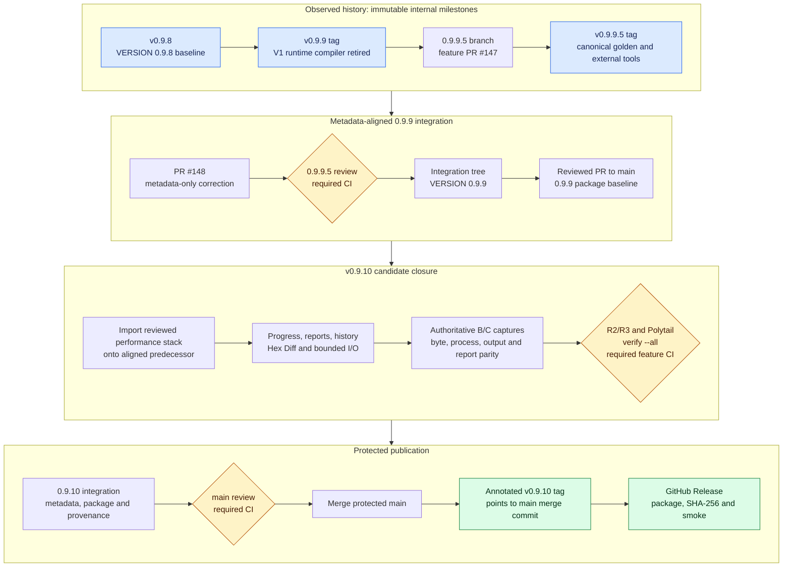

# v0.9.8 to v0.9.10 Release Impact and Integration Flow

Status: verified repository and GitHub history snapshot on 2026-07-19.

## Purpose

This document separates code milestones from stable releases, summarizes the
areas affected from `v0.9.8` through the planned `v0.9.10`, and defines the
integration and publication order that `v0.9.10` must follow.

It does not change firmware behavior, profile promotion, golden approval, or
release policy. Existing tags are immutable and must not be moved or reused.

## Release-state summary

| Milestone | Code and tag state | Main/release state | Classification |
| --- | --- | --- | --- |
| `v0.9.8` | Tag contains `VERSION=0.9.8`; code-size and package convergence are complete | A GitHub Release exists. The tag is not an ancestor of the current `origin/main`, so the current ancestry policy must be applied afresh to later releases | Published historical release and technical baseline |
| `v0.9.9` | Immutable tag points to the reviewed V1-compiler-retirement commit, but its tree still contains `VERSION=0.9.8` | Not merged into current `main`; no GitHub Release | Internal code milestone and predecessor only |
| `v0.9.9.5` | Immutable four-component milestone tag points to merge commit `0589ba3a`; its tree still contains `VERSION=0.9.8` | Not a `vX.Y.Z` tag, not merged into current `main`, and no GitHub Release | Internal canonical-evidence consolidation marker only |
| `0.9.9` integration correction | PR `#148` at `adcb742c` changes only `VERSION`, `SPEC.md`, `CHANGELOG.md`, and verification records; local `verify.py --all` passed | Must merge through `0.9.9.5`, then a reviewed integration PR to `main` | Metadata-aligned `0.9.9` main/package baseline; it does not repair or replace either historical tag |
| `v0.9.10` | Assigned performance and Change Report remediation milestone; not tagged | Must start from the metadata-aligned predecessor and close version, main, package, provenance, review, CI, and release gates below | Next eligible exact stable tag/release candidate if every gate closes |

The stable release workflow accepts only an exact `vX.Y.Z` tag, checks out that
tag, and requires its commit to be reachable from `main`. A later correction on
`main` cannot repair an already-created tag because the workflow builds the
tagged tree. Therefore the existing `v0.9.9` and `v0.9.9.5` tags must not be
dispatched through `.github/workflows/release.yml`. PR `#148` can align the
integration tree and its package metadata, but it cannot retroactively turn
either immutable tag into stable release authority.

## Affected areas

| Version | Primary affected areas | Runtime and user impact | Explicitly unchanged |
| --- | --- | --- | --- |
| `v0.9.8` | Production C#/AXAML size ratchets, duplicate schema/profile ownership, bundle registration, external-tool resolution, package allowlist, SBOM/provenance and smoke checks | Smaller and more maintainable source/package surface; no support expansion | Firmware ranges, operation order, processor write authority, AB CRC ownership and support truth |
| `v0.9.9` | V2 CtrlRAM exact routes, the exact NT51926 DP-only General Replace route, Workbench/display projections, `CompositionProfileCompiler` callers and implementation, code-size gates, route/evidence tests | Exact admitted shapes execute through V2. Unsupported or non-exact CtrlRAM/General Replace shapes fail closed instead of entering the retired V1 compiler | Legacy Combiner executable and constrained staged runner remain; no automatic support promotion and no C# replacement for Combiner-owned CRC/header writes |
| `v0.9.9.5` | `testdata/golden/canonical`, direct evidence and fact-scoped aliases, diagnostic separation, golden consumers, external-tool catalog, release reference allowlist and deployment parity | Test, audit and packaging consumers use one canonical manifest/path identity. Product runtime and output bytes do not change | Profiles, address ranges, processors, CRC behavior, runtime route admission and support state |
| `v0.9.10` | Composition input/output ownership, staged processor I/O/readback, catalog hashing, report serialization/history, Raw Hex Editor search/change tracking, firmware inspection, output-name projection, typed progress, virtualized report/Hex Diff UI, performance evidence | Build must stay responsive, publish typed progress, avoid repeated scans/copies, and keep large reports/history/Hex Diff bounded | Firmware bytes, command order, processor authority, output/report meaning and support truth must remain parity-locked |

### Downstream compatibility consequences

- A test or packaging tool that reads a dated golden path directly must migrate
  to the canonical manifest and artifact identity introduced by `v0.9.9.5`.
- A caller that relied on a non-exact V1 composition fallback must now handle a
  typed fail-closed result. Reintroducing the retired compiler is not allowed.
- External processors still run only against host-created staging copies. The
  canonical external-tool catalog changes identity and packaging ownership, not
  process authority.
- `v0.9.10` performance work may remove repeated allocation, I/O or projection,
  but it must not change firmware output, process argv/order, report evidence or
  support admission.

## Integration and publication flow

[Open the editable flow in Mermaid Playground][mermaid-playground].

The Playground rendering was inspected at 1920 x 1080. The four stages are
readable without node overlap or clipped labels. The first stage preserves the
immutable internal milestones, yellow diamonds identify review/CI gates, and
green nodes identify the only policy-compliant stable publication path.

## Current merge flow

### Completed predecessor chain

1. `v0.9.8` provided the feature-frozen source/package baseline.
2. Exact V2 routes and V1 compiler retirement accumulated on
   `feature/0.9.9/golden-evidence-request`; the reviewed code milestone was
   tagged `v0.9.9`.
3. `0.9.9.5` was created from the `v0.9.9` code milestone.
4. `feature/0.9.9.5/golden-tool-consolidation` merged through PR `#147` into
   `0.9.9.5` at `0589ba3a`; the internal milestone was tagged `v0.9.9.5`.
5. Neither milestone tag changes `main` or creates a downloadable stable
   release. Both remain immutable predecessor evidence.
6. PR `#148` carries the metadata-only `0.9.9` correction from `adcb742c` into
   `0.9.9.5`; after its review and CI close, the aligned integration tree must
   enter `main` through a separate reviewed PR. No historical tag is moved.

### Required v0.9.10 flow

1. Finish PR `#148` and the subsequent integration PR to `main`, producing the
   metadata-aligned `0.9.9` predecessor without changing predecessor tags.
2. Rebase or import the reviewed performance stack onto that exact aligned
   predecessor.
3. Rebuild authoritative before/after captures from that exact base and close
   byte, output, process and report parity.
4. Complete R2/R3 review, Polytail, `python scripts/verify.py --all`, and feature
   PR required CI before integration.
5. Merge reviewed slices into the exact `0.9.10` integration branch.
6. Before the final PR, set `VERSION` to `0.9.10` and align `SPEC.md`,
   `CHANGELOG.md`, verification/development-tag records and assembly metadata.
7. Produce the exact-source package dry run and verify its allowlist, hashes,
   SBOM, provenance, worker self-check and smoke result.
8. Open the version-branch PR to protected `main`; close actionable review and
   required CI without exceptions that would alter firmware or release truth.
9. Merge to `main`, then create one annotated `v0.9.10` tag on that exact main
   commit. Never tag a feature-branch SHA.
10. Dispatch `release.yml` for `v0.9.10`, verify the immutable GitHub Release and
   package evidence, and do not replace an already-published asset.

## Release stop conditions

Stop before merge, tag or publication if any of the following is true:

- `VERSION`, specification, changelog, assembly metadata, package name or
  provenance disagree;
- the proposed stable tag is not exact `vX.Y.Z` or is not reachable from
  `main`;
- required CI, `verify.py --all`, R2/R3 review, Polytail or firmware-owner gates
  are not closed;
- B/C evidence finds unexplained firmware, process, output or report drift;
- package allowlist, hash, SBOM, provenance, signing or smoke validation fails;
- a change attempts to move/recreate `v0.9.9` or `v0.9.9.5`, infer support from
  a golden alias, or restore a retired V1 runtime fallback.

## Related sources

- [Development tags](../governance/development-tags.md)
- [Development execution workflow](../governance/development-execution-workflow.md)
- [v0.9.8 code-size policy](../governance/v0.9.8-code-size-policy.md)
- [v0.9.9 legacy retirement evidence](../governance/v0.9.9-legacy-retirement-evidence.md)
- [0.9.x completion roadmap](0.9.x-completion-roadmap.md)
- [Release package contract](../ci/release-package.md)
- [v0.9.10 performance baseline](../references/replace-performance-baseline.md)
- [v0.9.10 Windows manual acceptance](../references/v0.9.10-windows-manual-performance-acceptance.md)

[mermaid-playground]: https://mermaid.ai/live/edit#pako:eNqFVdtu2zgQ_ZWB8qokvsRN7S4K-JLEahPbUYp9We8DRY1sohSppSi3RpB_75CKpHhbtC8Dg5pzZuacIf0ccJ1iMAkyqb_xPTMWvsy2CqCskp1hxR6W0dOXf7bBOinRHDCFvSitNscJiDyvLEskglAWjWISciGRviost8G_jgUgFQa5FVrBfVyfTInt0LsYX7z_KzGXH_--iZ-i9Qr8CSSsRCkUtvhZkz0Gy3Y1og-mUlbkCFznBdU0YNBSobSFzQnmURcjSAxTfO-hGTJbGYRNDGf9q-s2fdFWofymDmdKK8Fprp2WKSpgKgX8_jqr1Vp2Y07h_PwjzHyc-7hwH1ClW3UiZ3yzmUYxlXtAy1Jm2TmTYqdI2HpIpyVlOsV-o-ENEdQz1CLmDZlW8kiqmFdAS3H73Olh8CDwm8cZ_K9yusE82gYvdeodcUddF2AN4k9OjVvmJaXHnpFoqCerIWdCeUQ9UsH4V7bDn7298ULd-njn4_LXos2nq9ahfg_ImFTQuOS_1CX5-RulIjdNXmhabNN0WaDJtMlpKxBKS935ZrWi1hszChIFOZalNi35Jye60TtDxyGxOVL68XohPMcSv8NCZJlflURXKiWu6HLdcnwmjmll99oIS_IeEGaXcxqocGtZeo7kaDGkBjT3dXRli8p6wrok6UngY0t5T9bGg8t46HM2Wh4tE9JTHdCI7EjKMilP_W4uwhvfI-_AJx8_-3j_azeeltGmlsKS2E6sKpF0T_6wsw-vV5IMfLPkJ-sbtrviRiEJDqicSy3rimZ12_WnHV77C2aIqGi7dLiWyA0wVUqTCfSpWazm5heaOiybVYbcM9FbkwvbMjwSw52wyyqBGCXSbtfQeoCQVJqeD0bv_CRlrr92Qzx4cVc-rn3c-Ph4Ird7d_1x_WLULwvdA__DWVCnccnKcoFZ9_ZCJqScnKUJsgzD0hqqPTmjVoaYhFxLbSZn_evBaHT14YRg5y5Ujc0wG_LrFptcjYa9cYO9GvVZb3iKNbUCTWmecezg_dH73jBt4L3RAPvv_l-6aCvjAAdd5XGf93lXucd6rIPCNJyFi27yN19uw_tw5Ud6c7gJH5tOPwRhQLaSvWkweQ7sHnP3L5hixippg5cwYJXVT0fFg4k1FYZBVbgXZyEYLW5eH778AE1HUhY
