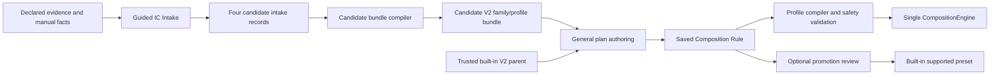

# Post-1.0 Guided IC Intake and Project Plan Proposal

- Status: Proposal
- Target: After the stable `v1.0.0` release; no specific `1.x` release is committed
- Scope: Product and architecture specification only
- Runtime/schema authority: None until a later reviewed ADR and contract change
- Builds on: candidate IC intake, trusted V2 profile bundles, General Merge/Replace, and Saved Composition Rule 2.0

## Purpose

This proposal defines a post-1.0 engineering workspace for two related but distinct jobs:

1. guide a user through adding a new IC as a deterministic, reviewable candidate; and
2. let a project engineer create a rare, project-specific Merge or Replace plan and reuse it from General Merge or General Replace.

The feature must reduce manual JSON work without turning the UI into a firmware-rule engine. It must
not infer firmware behavior from arbitrary BIN files, create one-off executors, or silently promote a
custom plan into a supported Standard, AB, DP Replace, or CtrlRAM Replace workflow.

## Relationship to the pre-1.0 intake milestone

The `v0.9.10` scope remains the narrow UI-driven front end for the existing four-record candidate
intake. It proves declared-file binding, manual evidence entry, deterministic output, and candidate-only
status. It does not need to implement custom plans, candidate profile execution, or promotion.

This post-1.0 proposal starts only after the V2 bundle/compiler boundary and the `v1.0.0` support
matrix are stable. It expands that intake foundation into guided family/profile authoring and adds the
separate Project Plan Library. The recommended first target is a `1.x` engineering feature release,
not a `v1.0.0` release blocker.

## Product decision

The product exposes two workspaces backed by existing contracts:

| Workspace | Primary user | Output | Runtime authority |
| --- | --- | --- | --- |
| Guided IC Intake | Firmware integrator | Candidate evidence records, candidate bundle draft, validation report, and missing-evidence list | None by default |
| Project Plan Library | Project engineer | A versioned Saved Composition Rule bound to a parent V2 profile | General Merge/Replace only, subject to validation |

They share identifiers, canonical maps, evidence references, and validation reporting, but they are not
one wizard and do not share a hidden mutable model. IC intake defines candidate firmware facts. A
project plan defines a constrained operation overlay on already declared facts.



## Non-goals

This proposal does not add:

- automatic range, CRC/header, alias, topology, PID, FWConfig, or output-name inference;
- arbitrary scripts, shell commands, expressions, plug-ins, or per-run executable paths;
- a second Merge/Replace executor or a UI byte-mutation path;
- direct editing of installed built-in bundles or the support catalog;
- automatic support promotion based on a successful custom build;
- a new top-level navigation tab;
- runtime parsing of Excel workbooks or unbounded directory scans.

## Trust and lifecycle

The UI must show the current lifecycle state without treating it as a support claim.

| State | Meaning | Preview/Build | Catalog exposure |
| --- | --- | --- | --- |
| Draft | Incomplete manually entered facts or plan | No build; validation preview only | Local workspace only |
| Validated candidate | Structure and safety facts are complete; golden may be absent | General Merge/Replace allowed with an unverified warning | Local plan library only |
| Reviewed preset | Team-reviewed General plan with exact parent binding | General Merge/Replace allowed | Importable/shared preset |
| Promoted built-in | Golden, owner review, release review, and support gates are complete | Normal supported workflow | Standard/AB/DP/CtrlRAM catalog as approved |

Missing golden evidence alone must not block a local custom plan in General Merge or General Replace.
It must remain a promotion blocker and must be recorded in the report. Missing bounds, protected-range
policy, required integrity behavior, or processor authority remains a hard build failure.

## Capability A: Guided IC Intake

### Entry point

Add `Settings > Engineering > IC Intake` after `v1.0.0`. It is an engineering tool, not a normal
Merge/Replace workflow and not a new top-level tab.

The initial post-1.0 UI wraps the existing deterministic candidate-intake boundary. It creates the
same four records currently emitted by `scripts/create_candidate_ic_intake.py`:

- `candidate-evidence-manifest.json`;
- `candidate-bundle-rows.json`;
- `missing-evidence.json`; and
- `validation-report.json`.

A later candidate-bundle compiler may consume those records and emit V2 family/profile source files
into a separate empty staging directory. It must never register or deploy the result automatically.

### Intake steps

The UI is a resumable wizard with these steps:

1. **Identity**: family id, member/IC id, display name, source project, revision, and intended workflows.
2. **Topology**: IC-number choices, chip counts, capacities, supported input shapes, and explicit aliases.
3. **Memory map**: canonical regions, ownership, kind, visibility, half-open ranges, atomicity, and protected ranges.
4. **Metadata**: PID and version fields, output naming facts, and FWConfig fields. Runtime FWConfig must use the unique NVT Backup copy at terminal `T - 0xFFF`; a primary location is evidence/display only.
5. **Workflows**: Standard, AB, General, DP Replace, CtrlRAM Replace, and General Replace candidate declarations.
6. **Integrity and tools**: integrity disposition, approved processor id, exact tool manifest, declared read/write ranges, and ordered processor stages.
7. **Evidence**: declared files, logical names, sizes, SHA-256 values, citations, owner/reviewer status, and confidentiality class.
8. **Validation and export**: candidate records, candidate bundle draft when eligible, deterministic hashes, and the remaining evidence checklist.

Every technical value has a structured form field and an advanced JSON preview. The JSON preview is
derived from the typed form state; it is not a second editable source of truth in the same session.

### Declared inputs

The intake workspace accepts only owner-selected inputs:

- manual fact entry;
- an evidence manifest;
- explicitly bound workbook/export, source-code, document, issue export, firmware, or owner record;
- optional `mmap.h`, BAT/CMD/log, FWConfig source, sample BIN, expected output, and tool package evidence;
- a previously exported candidate workspace.

Office documents are read as bounded bytes or through an offline importer. Macros and Office
automation are disabled. The importer does not search sibling folders, network locations, or the
user's workstation for missing files.

### Candidate outputs

Export creates a new empty destination and writes:

- the four deterministic candidate-intake records;
- a hash inventory and source-filename trace;
- a candidate V2 family/profile bundle draft only when all required facts are explicitly declared;
- a closed-root materialization preview;
- a machine-readable validation report;
- a human-readable missing-evidence and promotion checklist.

The original evidence filenames remain trace metadata. Export does not copy private firmware into
Git, edit built-in bundles, change runtime allowlists, add support rows, or create release assets.

### Intake validation

Always-blocking validation includes:

- malformed ids, versions, hashes, duplicate keys, and duplicate facts;
- path traversal, reparse points, lock files, undeclared artifacts, and size/hash mismatch;
- invalid or overlapping canonical regions;
- unknown range end semantics or checked-arithmetic overflow;
- missing protected-range policy;
- ambiguous alias scope;
- executable workflow facts with unknown integrity behavior;
- undeclared processor read/write ranges or unregistered tools;
- more than one candidate source for the same authoritative fact.

Non-blocking candidate findings include missing golden output, missing support approval, and missing
release review. These findings block promotion, not candidate export.

## Capability B: Project Plan Library

### Entry points

Project plans are edited from General Merge or General Replace through `Save plan`, `Import plan`,
and `Plan library` commands. `Settings > Engineering > Plan Library` provides management, import,
export, compatibility status, and favorites. It is not a separate byte-execution workflow.

The persisted plan is Saved Composition Rule 2.0, or a reviewed backward-compatible minor revision
if named extension points are required. No parallel custom-plan schema is introduced.

### Parent binding

Every plan binds to one exact parent V2 context:

- bundle id/version/content hash;
- profile id/version/content hash;
- family id/version/content hash;
- canonical map id;
- composition kind and General experience;
- derived output-capacity and compilation-fingerprint compatibility checks.

The parent may be either a trusted built-in profile or a locally validated candidate profile. A
candidate parent keeps the plan local and unverified, but it may Preview/Build in General mode once
all structural, range, integrity, and processor requirements pass. A changed parent hash marks the
plan `Needs revalidation`; the application never silently migrates offsets or accepts a nearest
matching IC. Output capacity and compilation fingerprint are compiler results and need not become
duplicated persisted fields when the existing exact parent hashes are sufficient.

### Plan contents

A project plan may declare:

- named input slots such as `high-resolution`, `low-resolution`, and `tp`;
- source ranges relative to those slots;
- targets relative to canonical region ids;
- ordered `copy-range` or `replace-range` fragments;
- parent-narrowing access limits;
- explicit overlap policy where the parent permits overlap;
- references to validation and processor stages already owned by the parent;
- display name, description, tags, original filename, project/Jira reference, and semantic version.

A plan may not declare a raw absolute target outside a canonical region, a new processor command, a
tool path, output naming, an arbitrary patch, or a new integrity algorithm.

### Operation order

Users may reorder only the mapping fragments inside a parent-declared extension point. Mandatory
parent stages stay fixed:

```text
initializer
-> parent preconditions/relocation
-> user mapping extension point
-> parent-required integrity processors
-> final validation
-> atomic output promotion
```

This allows a project to express `high-resolution -> low-resolution -> TP` or another reviewed
overlay order without moving CRC/header refresh ahead of the bytes it protects.

For AB Merge, a project plan must bind to a parent AB profile that already owns bank layout, TPA/TPB
work buffers, relocation, and header processing. The plan may reorder only explicitly exposed AB
mapping fragments. It cannot invent bank semantics. Without such a parent it is a General Merge
plan, not an AB Merge implementation.

For Replace, the immutable base is always cloned first. A TP/header-affecting mapping can run only
when the parent already declares a compatible processor stage and write authority. Missing golden
does not block the custom build; missing processor authority does.

### Example: project-specific resolution composition

One plan can define:

| Order | Slot | Source | Target | Purpose |
| ---: | --- | --- | --- | --- |
| 1 | `high-resolution` | declared DP range | `dp-high` + offset | Main high-resolution payload |
| 2 | `low-resolution` | declared DP range | `dp-low` + offset | Alternate low-resolution payload |
| 3 | `tp` | declared TP range | `tp-code` + offset | Project TP overlay |
| 4 | parent stage | n/a | declared integrity ranges | Required header/CRC refresh |

Preview shows the exact before/after memory coverage, overlap order, processor stages, and every
half-open range before Build.

### Favorites and reuse

The Plan Library supports:

- search by IC, project, workflow, tag, and parent compatibility;
- favorites/pinning and recently used plans;
- import/export of the versioned rule JSON;
- duplicate-as-new-version;
- read-only comparison against the current parent;
- explicit `Needs revalidation`, `Unverified`, `Reviewed`, and `Built-in` states.

Plans and the favorites index live in the user's application-data directory and are written
atomically. Installed profile directories remain read-only. Sharing is file-based initially; a team
server or cloud catalog is outside this proposal.

## No-golden execution policy

A General custom plan may Preview and Build without golden evidence when all structural and safety
checks pass. The absence of golden evidence must produce all of the following:

- an `Unverified custom plan` status beside the Build command;
- an explicit acknowledgement in the Build confirmation;
- a report field recording that no golden comparison was performed;
- rule id/version/hash, original filename, parent fingerprint, inputs, operations, and processors in the report;
- no supported-workflow badge and no automatic catalog promotion.

The acknowledgement is not a safety override. Build still fails for invalid ranges, forbidden
overlap, protected-region access, unknown integrity, missing tools, undeclared processor writes,
changed parent binding, or invalid input sizes.

## Promotion to a built-in workflow

`Promote` exports a review package; it never edits production catalogs. Promotion into Standard
Merge, AB Merge, DP Replace, CtrlRAM Replace, or a built-in General preset requires a normal reviewed
repository change with:

- exact compatible parent/profile facts;
- synthetic and contract tests;
- golden evidence when firmware semantics are affected;
- processor command and allowed-write evidence when applicable;
- firmware-owner review for R3 behavior;
- support/release review;
- canonical repository verification.

Successful local builds, frequency of use, or a favorite flag are never promotion evidence.

## Architecture ownership

| Layer | Responsibility |
| --- | --- |
| Contracts | Candidate records and Saved Composition Rule schema; no execution |
| Profiles | Resolve parent maps, validate overlays, and compile one `CompiledComposition` |
| Domain | Existing ranges, operations, initializers, and `CompositionEngine` |
| Application | Intake/export, plan validation, Preview/Build, reports, and atomic output policy |
| Infrastructure | Bounded file import, local plan storage, hash calculation, and staging adapters |
| Bootstrap | Typed UI/CLI facades and issue projection |
| Presentation | Forms, memory visualization, plan ordering, favorites, localization, and accessibility |

Firmware semantics never live in XAML, ViewModels, local-plan storage, or the candidate UI.

## Rollout after `v1.0.0`

The recommended sequence is:

1. **Guided intake foundation**: UI authoring of the existing four candidate records, validation, resume, and deterministic export.
2. **Candidate bundle drafting**: compile fully declared facts into a non-routed V2 bundle preview; no inference or registration.
3. **General Merge plan library**: author/import/export/favorite Saved Composition Rules and run unverified local plans.
4. **General Replace plan library**: enable processor-aware Replace plans only after protected-range and postbuild contracts are complete.
5. **AB extension points**: expose only parent-owned AB ordering points with AB golden/processor contract coverage.
6. **Promotion package**: export a review-ready repository change package; retain human review and normal CI gates.

The first implementation milestone should stop after step 1 or 2. Custom plan authoring is lower
priority and should not delay the guided IC intake UI.

## Rejected alternatives

- **One combined intake-and-plan wizard**: mixes physical IC facts with project operation policy and creates an ambiguous source of truth.
- **Infer profiles from BINs, workbooks, or filenames**: cannot establish authoritative ranges, integrity behavior, aliases, or topology.
- **Let users edit Standard/AB plans directly**: bypasses promotion and makes supported workflow behavior depend on local state.
- **Store a script or command sequence as the plan**: bypasses typed operations, processor manifests, write-range checks, and reproducibility.
- **Treat a favorite or successful build as support evidence**: usage frequency does not prove firmware correctness.
- **Clone the General executor for custom projects**: duplicates range, overlap, processor, report, and output-atomicity semantics.

## Trade-offs

- Exact parent hashes make saved plans safer but require explicit revalidation after a bundle/profile update.
- Candidate Build without golden evidence supports engineering experiments but produces no support claim and requires clear report provenance.
- Parent-owned extension points cannot express every imaginable operation order; unsupported orders must become reviewed profile changes instead of hidden UI behavior.
- Guided intake reduces repetitive JSON authoring but cannot eliminate firmware-owner review for physical facts and integrity behavior.
- Local file-based sharing is less convenient than a central service, but it keeps the first release offline, deterministic, and reviewable.

## Acceptance criteria

The feature is ready for implementation review only when the later ADR/contracts define and tests prove:

- UI form state round-trips to the existing candidate records without losing citations or hashes;
- equivalent manual and imported facts produce byte-identical candidate records;
- candidate export never changes runtime registration or support catalogs;
- custom plans compile through the same profile compiler and `CompositionEngine` as manual General mappings;
- blank Merge and reference Replace initialization remain unchanged;
- fragment reorder changes only the declared mapping sequence;
- mandatory relocation/integrity/final validation stages cannot be moved;
- protected/out-of-bounds/overlapping/undeclared processor writes fail closed;
- missing golden is warning-only for local General execution and blocking for promotion;
- parent hash drift invalidates the plan before Preview/Build;
- reports identify custom-plan provenance and unverified status;
- local plan writes are atomic and do not modify imported files;
- UI and CLI consume the same typed use cases;
- no script, shell, expression, arbitrary executable path, or workflow-specific executor is introduced.

## Deferred contract decisions

Implementation must not begin by changing schemas speculatively. The first post-1.0 architecture
phase must decide:

1. whether Saved Composition Rule 2.0 already expresses the required ordered extension points or needs a minor version;
2. the exact acknowledgement and report fields for locally validated candidate Build;
3. the global upper bounds for mapping count, total mapped bytes, imported artifact count, and local library size;
4. the exact review-package shape used to promote a local plan or candidate IC into the repository.

These decisions require an accepted ADR, synchronized prose/schema/examples, architecture tests, and
security review. They do not alter the core decision: declared data enters one compiler and one
composition engine.
