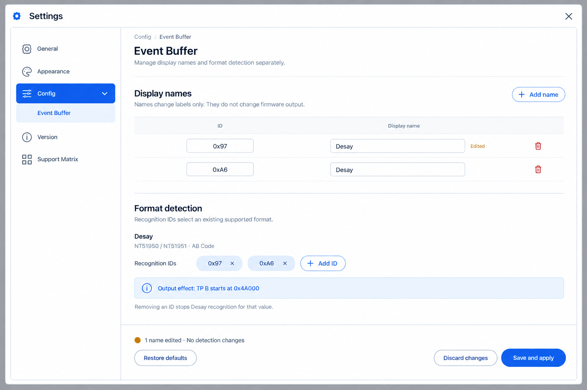
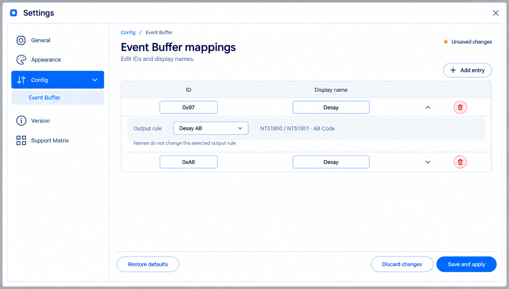
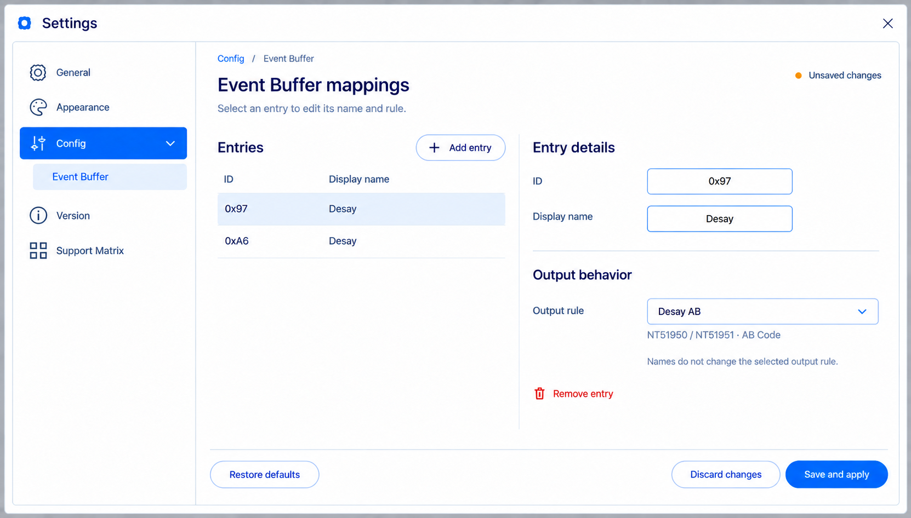
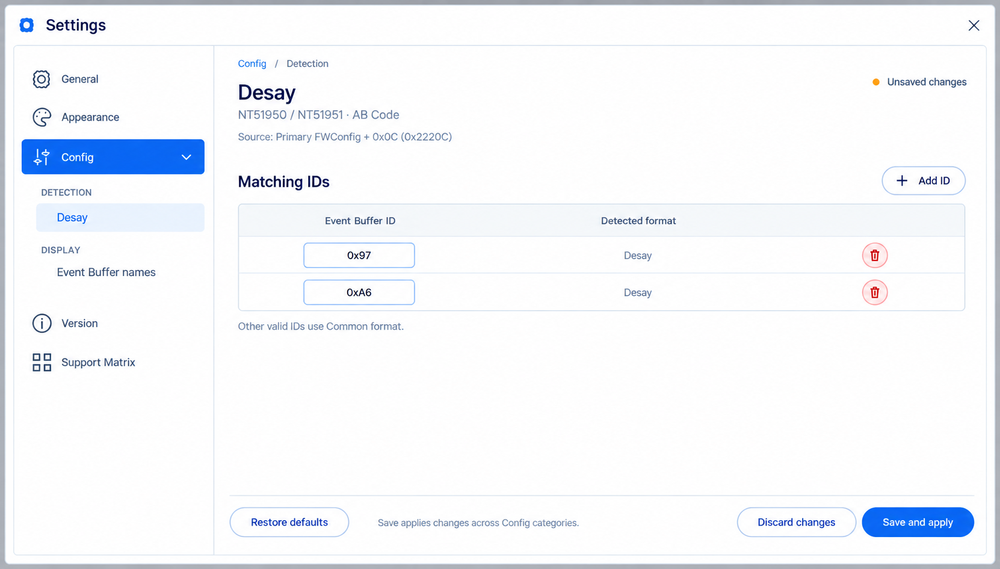
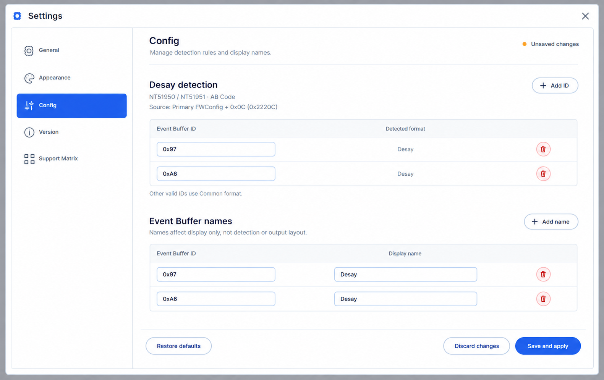

# Custom-options layout handoff

Status: preview-first workflow accepted by the owner on 2026-09-08. The
broader per-page custom-options redesign remains unapproved; the separately
accepted Config page structure/behavior and current preview are summarized
below. Preserve completed slot-alignment fixes and their recorded evidence.
Current allocation (owner resequencing, 2026-09-14) is owned by the
[roadmap sequence](../architecture/nfc_roadmap.md#current-release-sequence--2026-09-14):
urgent Desay/public AB corrections **and the bounded editable Desay Settings
surface in `1.1.6`**, Information/output-confirmation UI in `1.1.7`, remaining
Settings conveniences in `1.1.8`, and broader per-page option density in
`1.2.4`. This replaces the preceding blanket `1.1.7` UI allocation. General
and maintainer rule-authoring remain separate `1.3.x` work.

## Current decision checkpoint — Config preview, 2026-09-14

This checkpoint consolidates the accepted discussion, not implemented product
behavior. Detailed decisions remain in the sections linked below.

| Area | Current conclusion |
| --- | --- |
| Initial applicability and source | NT51950/NT51951 partial-family AB Code only. Desay detection uses the documented **primary** FWConfig `0x22200 + 0x0C = 0x2220C`; `0x2200C` was a typo. Match one byte against `0x97` OR `0xA6`. Do not change existing Backup-based readers or the CtrlRAM primary-write-source exception. |
| Detection and admission | Automatically apply Desay on a valid match; valid nonmatches use Common. Invalid/unreadable required primary data blocks rather than falling back to Backup/Common. TPA and TPB must resolve to the same format; their raw Desay IDs may differ. |
| Urgent layout and capacity | Desay AB TP B starts at `0x4A000`; public NT51950 partial-family **2 IC** AB TP B starts at `0x8A000`. Coupled ranges/processors still need evidence-backed consolidation. Desay DP AB input is expected to be `0x100000` bytes (1 MiB / 8 Mbit); size mismatch is a warning, independent of blocking range-safety failures. |
| Information | TP Version → PID → Common FW Version → Event Buffer Version, e.g. plain text `0x97 - Desay`, not a badge. The scoped format display must use the detector's primary observation. Input Details defaults Off; the broader Information/output-confirmation redesign remains separately allocated. |
| Config page | Add **Config > Event Buffer Format** inside the existing Settings modal. Each entry has a **Unique ID** dropdown restricted to owner-defined identities (e.g. Desay) and an editable **Alias name**. Users may select an existing identity, but cannot type/add identities or edit their effect definitions. The selected identity, never the alias, binds supported output effects; changes take effect after Save and apply. Recognition-byte editability needs confirmation against the earlier editable-ID request. No generic Output rule editor or vertical table gridlines. Keep ordinary Preferences immediate-apply. |
| Draft actions | Fixed footer: **Restore defaults** prepares the current group's defaults in the draft; **Discard changes** discards unsaved edits; **Save and apply** validates, persists and re-evaluates selected inputs without reloading BINs. Show Unsaved changes; switching Settings sections retains drafts. Dirty close/Escape asks before discarding. Successful save stays on Config; failed persistence preserves draft and prior effective state. |
| Configuration safety and refresh | Reject invalid Settings drafts. Loaded invalid/conflicting external detection config blocks affected AB Builds, without silent Common/default/stale-rule fallback. Missing names alone do not block valid detection. Check external updates at startup, explicit reload and pre-Build; running Builds keep their captured immutable rules. |
| Version priority | Urgent AB corrections and editable Desay Config are in `1.1.6`. Full Launcher release is `2.0.0`; first bounded Launcher development and the separate source-data refresh reminder remain in `1.2.0`. The roadmap owns the complete schedule. |

Accepted behavior details: [firmware intake](#desay-nt51950--nt51951-rule-intake--2026-09-14),
[invalid configuration](#desay-settings-invalid-configuration-decision--2026-09-14),
[Config lifecycle](#desay-rule-apply-lifecycle-and-config-page--2026-09-14).
Current design decision: [owner-defined identity and editable alias](#event-buffer-format-identity-and-alias--2026-09-14).
The owner subsequently clarified that one Event Buffer Format item should combine
an owner-defined vendor identity selected by dropdown and an editable alias.
The earlier task-separated image,
stacked/vendor-grouped designs and A/B images are superseded visual history,
not approved references for implementation of this revised model.

## Accepted next step

Current owner priority, 2026-09-14: the CtrlRAM selection-slot alignment preview
is approved and locally implemented/verified below. The Desay primary locator,
invalid-configuration behavior, apply lifecycle and Config page structure are
now settled; do not re-ask them. Confirm recognition-byte editability under the
revised identity/alias model, review its revised Config preview, then consolidate
remaining bank/write-range and independent evidence facts for the urgent
`1.1.6` slice. Editable Settings is now part
of that first slice, not deferred until the full rule-authoring UI. This
schedule is not firmware implementation approval while material facts remain
unresolved. Completed slot/group-header/disclosure fixes are not reopened.

Capture the actual current AB Code page, then provide a preview based on that
same page before changing production layout. Preserve the existing width,
button styles, disclosure arrows, typography and input-card conventions.
Do not substitute an invented application screen for the actual baseline.

The preview should separate IC/mode/topology context, required inputs,
nearby routine options and one collapsible area for infrequent options.
An enabled output-changing option remains visible in the collapsed summary.
Dummy DP keeps its explicit non-TP `0xFF` explanation and confirmation;
collapsing a section never changes the selected settings or clears files.
Output naming and delivery stay in the existing Build settings surface.
These are preview constraints, not authorization for new persistence,
customer detection, a form framework or firmware behavior.

## Acceptance and return point

- Owner reviews the preview before production UI implementation.
- After approval, implement one bounded unit, compare its actual render with
  the approved reference, run affected tests and commit that unit.
- The owner separately requested Desay DP Excel incorporation into the
  existing IC FlashMap authority, with the source revision date and import
  date distinguished. Firmware facts and byte evidence stay with their
  existing owners, not this UI handoff.
- The owner's later 2026-09-08 amendment defers NT51928 confirmation and resumes
  the roadmap's Memory Layout follow-up now. IC/Desay firmware decisions remain
  pending and no longer block that independent UI assessment. The completed compact
  Technical details disclosure is not reopened. Assess the residual generic
  Reserved-source wording as the next bounded Memory item; any further visual
  change still needs its actual baseline and approved reference.
- The subsequent Memory Map grouping discussion has an
  [accepted information model](../architecture/nfc_roadmap.md#small-region-grouping-accepted-information-model--2026-09-08).
  This is separate from the still-unapproved custom-options preview here.
- The owner's 2026-09-13 Memory Layout visual approval is tracked in the
  [hover-hierarchy handoff](v1.1.x-memory-layout-interaction-handoff.md).
  That bounded implementation does not include selector-slot redesign or
  authorize the custom-options proposal in this document.

## Current status

On source `e8ad0f0cd91cfda9ab6d5d0c79b8c95ed17d17e4`, the existing
`AbDummyDpControlTests` were rerun: 4 passed, 0 failed/skipped, 14 seconds of
test execution (build time is additional). `NFC_VISUAL_OUTPUT_DIR` was set to
the external `evidence/v114-custom-options-baseline-20260908` directory;
`ab-baseline.trx` records the result. The production MainWindow headless render
uses NT51929, AB mode, Dummy On, no TP files, English Light at 1440x900.
This is an actual current template render, not a native Windows/DPI attestation.

- [Actual baseline](references/v1.1.4-custom-options-baseline.png).
- [Proposed screenshot-based preview](references/v1.1.4-custom-options-proposed.png).

The built-in image generator edited that baseline with this brief: preserve
chrome, column proportions, existing input/button styles and the right-side
Memory Layout; group the existing two checkboxes under an expanded Options
disclosure, retain a visible Dummy/non-TP-fill summary, compact the disabled DP
card and keep TPA/TPB inputs below it. The generated preview is scaled to
1586x992 and is not pixel-exact production evidence; native dimensions remain
1440x900. Its right-hand content is context, not a proposed memory-map change.
Owner visual acceptance and implementation remain pending. Before accepting
it as a final geometry contract, resolve the additional nested Options border
and whether the compact Dummy DP row belongs inside that disclosure.

## Public baseline and vendor variation discussion — 2026-09-09

The owner requests a `1.1.x` discussion of a systematic public/vendor-specific
UI and workflow model because specialized options seem to be added separately.
Version allocation is owned by the [current roadmap](../architecture/nfc_roadmap.md#current-release-sequence--2026-09-14);
the [work-package boundary](../architecture/nfc_roadmap.md#public-baseline-and-vendor-specific-uiworkflow-discussion)
retains the discussion requirements.
This extends the assessment, not the approval of the existing preview or any
new firmware/UI framework.

Owner follow-up, 2026-09-13: discuss the concrete customized-flashmap execution
approach after `1.1.5` Release, before starting its implementation. Use the
questions below to compare an explicit profile-based variant with any genuinely
needed authoring/import tooling: public/family reuse, customer/layout selection,
source revision and versioning, range/overlap validation, Golden evidence and
report traceability. No option is selected yet; the current release scope and
separate rule-authoring UI allocation remain unchanged.

Inventory current exceptions first: AB same-TP/Dummy choices, IC-specific
input/metadata presentation, CtrlRAM selection/availability, Standard
DP-perspective merge, naming/delivery and proposed Desay changes. For each,
identify its canonical producer, callers, applicability, confirmation,
persistence, output/report impact and evidence. A specialized feature is not
automatically a vendor feature; preserve legitimate IC/workflow distinctions.

Questions to resolve before implementation:

1. **Identity and scope:** what is public baseline, vendor, project or layout
   revision; can a vendor have several variants; which combinations of IC,
   topology and workflow are declared compatible?
2. **Selection and safe defaults:** where does explicit variant selection
   live; how is the active choice visible; what happens when it is absent,
   unsupported or stale? Do not silently infer identity from filenames.
3. **Ownership:** firmware ranges/integrity stay in profiles; existing typed
   capability/session decisions own applicability and authoring transitions;
   shared UI renders those decisions. Determine actual missing contracts
   before adding registries, configuration formats or abstractions.
4. **Switching and lifecycle:** which selected files/options can be retained,
   what must be revalidated, when confirmation is required, and whether any
   choice persists. Never clear inputs merely because a section collapses.
5. **Traceability and tests:** capture exact variant/revision in the existing
   report/provenance mechanism; test public behavior unchanged, each declared
   variant, unsupported combinations, cancellation and equivalent UI/CLI
   admission. Firmware-changing variants retain independent byte/Golden gates.
6. **Migration and preview:** compare a real public page with one bounded
   Desay example, preserve shared styles, prioritize high-impact duplicate
   branches, and explicitly retire superseded paths. Do not replace working
   pages with a speculative all-purpose dynamic form.

Deliverable: an agreed ownership/variation model, preview and bounded migration
plan with acceptance criteria. Production implementation and exact firmware
layout approval are later decisions, not implied by adding this TODO.

## Customized flashmap execution proposal — after v1.1.5, 2026-09-13

Status: discussion draft, not an accepted firmware specification or permission
to implement. This follows the completed
[v1.1.5 release](../references/verification-report.md#115-published-release-closure-2026-09-13).
The roadmap remains the version-allocation owner; the existing preview above
is not approved by this proposal.

### Outcome and recommended first slice

Let an operator knowingly choose an approved public or customer layout without
duplicating IC facts across pages. Recommend **maintainer-authored, reviewed
profile variants first**, using the existing trusted bundle/compiler and
Application execution path. Do not start with a runtime Excel loader, arbitrary
JSON overrides, a vendor-specific executor or a general form engine.

Necessary operator/maintainer stories:

- Build with the public layout and obtain unchanged bytes and support status.
- Select one approved customer/layout revision and see that identity before
  selecting inputs, inspecting Memory Layout and confirming Build.
- Review a proposed map revision and its source evidence without overwriting
  the accepted map or silently changing another family member.
- Read an old report and identify the exact executed layout after the catalog
  has changed; reproducing a build additionally requires its exact trusted
  package/profile and input evidence, not the report alone.

### Ownership, reuse and known gaps

| Concern | Existing owner and proposed use |
| --- | --- |
| Public/family geometry | [Family contract](../contracts/firmware-family-v1.md#ownership) owns physical spaces, capacity, regions, metadata and constraints. Perfect members reference one complete definition; partial members share only explicit facts. A customer variant is a distinct evidenced map selection, not a member override of Perfect semantics. |
| Workflow behavior | Composition profile/compiler owns input views, copy/replace order, CRC/Header processors and allowed writes. Geometry alone cannot grant AB, CtrlRAM or Build support. |
| Selection and lifecycle | Extend the existing typed capability/authoring context only where needed. [FirmwareMapResolutionInputs](../../src/NvtFwCombiner.Domain/Firmware/FirmwareMapResolutionInputs.cs) currently takes member, mode, capacity, topology and artifacts, not a customer selector; this is a contract decision, not merely adding a dropdown. |
| Input and cached information | Existing accepted artifact/session identities invalidate inspection, readiness, preview and layout on a context change. UI renders the accepted result; it does not derive customer ranges or keep a second map table. |
| Delivery and history | Keep Build settings and existing Report/History stores. Customer selection is not an output-folder setting and old reports must not be reinterpreted with today's selected map. |

Do not propose unrestricted inheritance/override syntax. Reuse exact canonical
region/metadata references where the current contract permits it. If sharing
one differing map would require a new contract, show that smallest concrete
gap for review before inventing a generic variant registry. In particular,
NT51950 and NT51951 are not Perfect equivalents: a shared Desay statement does
not establish equal AB geometry, capacity, CRC, Header or topology behavior.

### Proposed operator behavior and failure boundaries

1. Show one explicit `Layout` choice beside IC/workflow context. The proposed
   default is the current public layout, visibly labeled; never infer vendor
   or revision from a BIN filename, PID or matching hash. A customer may have
   more than one project/layout revision, so customer name alone is not identity.
2. Offer only declared IC/workflow/topology combinations. No matching layout,
   ambiguous matches, missing prerequisites, an unknown revision or an
   untrusted package leaves a typed pending/blocked result; never fall back to
   another customer or public map silently.
3. Switching layout uses one accepted-context transition. Propose retaining
   compatible input selections but revalidating all dependent results before
   Build; incompatible selections are explained before any confirmed clearing.
   Cancel changes nothing. A late result from the previous layout cannot
   repopulate the screen or enable Build. Source files are never deleted.
4. Pin the accepted layout revision for the session/run. Catalog refresh cannot
   silently upgrade an active layout. Persistence across restarts is an open
   decision; the smallest first slice needs only session selection.
5. UI and any later CLI path use the same typed request, applicability and
   validation. No separate command-line firmware algorithm is proposed.

The 2026-09-14 owner intake below adds **FWConfig-based Desay format detection**
to this discussion, superseding any assumption that explicit manual selection
is the only candidate mechanism. Automatic activation after successful detection
is now approved for NT51950/NT51951 AB Code; manual override and ambiguous
matches still require a consolidated decision;
this does not authorize filename-based inference or an unreviewed map switch.

### Authoring, import and revision management

For the first slice, maintainers edit the existing canonical family/profile
sources and use existing materialization/validation/trust packaging. Every
published revision remains immutable and binds exact content hashes. A changed
layout receives a new reviewed revision rather than replacing old evidence.

Excel is proposed as **maintainer-side input evidence**, not executable runtime
policy. First freeze the supplied workbook revision/hash, sheet and cell
provenance; record source revision date separately from import date. List
units, address spaces and inclusive/exclusive ends explicitly. A future small
converter, only if repeated imports justify it, may emit a reviewable draft
and old/new range diff through the existing schema/compiler. Unknown columns,
formulas with unevaluated values, conflicting units or ambiguous fields must
produce a diagnostic instead of guessed geometry. Import never installs or
promotes the draft automatically and may not execute workbook macros/scripts.

The current sequence allocates maintainer rule-authoring UI to `1.3.3` and
General saved-rule work to `1.3.2`. Neither is silently pulled forward by this
proposal. End-user arbitrary address editing is not part of the first slice.

### Validation, Golden and report traceability

Use the existing checked half-open range model: correct address space,
nonnegative bounds, capacity/parent containment, alignment, sibling overlap,
explicit gaps, exact source coverage and allowed write ranges. Separate source
offset, target address and metadata locator. Validate processor prerequisites
and before/after mutation ranges, not just a successful map diagram.

Public regression must preserve complete existing Golden outputs. A new
firmware-changing variant needs independent expected output or its explicitly
approved evidence contract, full-output comparison and write-range audit for
each declared workflow/topology. Include missing input, wrong size, stale hash,
ambiguous selection, cancelled switching and async stale-publication cases at
existing Domain/compiler/Application seams. UI tests verify those typed
results and selection visibility, not duplicate firmware calculations.

Current [CompositionRunReport](../../src/NvtFwCombiner.Application/Composition/CompositionRunReport.cs)
already persists profile id/version, IC/mode/experience, map id, compilation
fingerprint, input summaries, operations, mutations and output. Its general
report shape does **not** individually persist every family/bundle version/hash
or a complete authoring-session snapshot. The runtime
[V2CompilationProvenance](../../src/NvtFwCombiner.Domain/Composition/V2CompiledCompositionDetails.cs)
and resolved map have richer exact identities; the existing General
[SavedRuleParentIdentity](../../src/NvtFwCombiner.Application/Authoring/SavedRuleLifecycle.cs)
already persists an exact bundle/profile/family parent in that specific path.
Do not duplicate those facts or claim a fingerprint reconstructs them.

Recommend projecting the necessary existing immutable identities into the
actual persisted run-report contract, plus explicit customer/layout revision
and source-revision provenance where absent. Exact field names and schema
compatibility require review. The canonical composition-report schema and
Application JSON are distinct wire models; do not conflate them. Old reports
remain readable from persisted evidence, displaying unavailable fields as such
rather than inferring them from the current catalog. Input hashes and accepted
range hashes remain distinct from layout/source-document hashes.

### Bounded sequence and open decisions

1. Decide whether the first release offers only reviewed built-in variants
   (recommended) or also end-user import/editing; the latter adds a separate
   trust, persistence and authoring scope.
2. After that choice, confirm layout identity/default/persistence/switching
   behavior and one public versus customer example. Capture the actual page and
   approve a preview before UI implementation.
3. Resolve the smallest typed selection and report-provenance gaps, then add
   one evidenced variant through existing owners. Delete any superseded
   per-page vendor/range branch only after equivalent public and variant tests.
4. Promote only after independent firmware evidence and the normal release
   gates; add a reusable import helper only if a second actual import exposes
   repeatable work.

The owner's Desay statement that TP Backup becomes `0x4A000` is a recorded
change request, not an approved universal map. Its exact revision, affected IC/workflow/bank,
source/target ranges, topology and CRC/Header effects must be resolved from
the supplied evidence. NT51928BT confirmation remains deferred and it is not
exposed by this proposal. Approval of this draft would not itself certify any
of those byte changes. The next owner question is item 1; later choices remain
explicitly open rather than being silently selected here.

## Selection-slot alignment preview — 2026-09-14

Scope: visual proposal only, based on the actual NT51927 / 3 IC CtrlRAM screen
after `75eb7b6a`. No production UI changes or fresh product tests in this intake.
The current extra `Margin="32,0"` on Base/general slots compensates for grouped
CtrlRAM surface/disclosure padding. It aligns cards to other cards but leaves
`Input files` and its description on a different left edge.

Proposed common layout:

- Keep the one outer Input files panel and the individual slot-card styles.
- Align Input files heading/description, Base/TP/DP cards, group headings and
  CtrlRAM card boundaries to one shared content width; remove compensating
  32px insets rather than adding another inset to the heading.
- Remove the nested CtrlRAM group border and horizontal padding. Preserve
  Common/Master/Slave/Cascade semantics and expansion; use a plain heading row,
  selected/total count, existing far-right chevron, spacing and a quiet
  horizontal separator. One count replaces the redundant repeated summary.
- Preserve Max Size/Target Addr, metadata, filenames, existing button styles,
  confirmation behavior, input values and the completed Memory Layout design.

The owner requested an effect image before implementation and approved the
alignment preview on 2026-09-14. The earlier AB/custom-options preview remains
a separate unapproved proposal. A simultaneous request to align Output layout
with the Input files frame is implemented as shared top-edge alignment, with
natural content heights (the stated local interpretation, not an owner decision
to force equal bottom edges). Shared Grid rows handle wrapping/resizing without
a fixed vertical offset.

- [Actual NT51927 / 3 IC baseline](references/v1.1.6-selection-slot-baseline.png),
  MainWindow headless render at 1180x1040, English/Light, after `75eb7b6a`.
- [Proposed alignment preview](references/v1.1.6-selection-slot-alignment-proposed.png),
  generated with the built-in image tool by editing that baseline, not a
  production screenshot or pixel-exact test result. The generator rescales the
  canvas; it is a layout-review reference, not authoritative firmware data.

Generation brief: preserve chrome, IC/Mode/Targets and the right-hand Memory
Layout; change only Input files by widening Base and CtrlRAM cards to align
with the heading, removing the nested Common border/padding, and retaining a
plain Common/count/chevron row with a thin horizontal separator. Preserve
individual card/metadata/Max Size/Target Addr/button conventions. No Desay
controls are included in this independent visual proposal. Primary-agent
visual review confirms the proposed shared boundaries and borderless group;
owner visual acceptance is received; local production evidence follows below.

### Local R1 implementation admission

Base `382f868e`, existing `1.1.6` branch, clean worktree. Owner approved the
slot-alignment preview; the additional Output layout request uses the stated
shared-top-edge interpretation above. Existing owners:
`Resources/MainWindowWorkflowTemplates.axaml` supplies the workflow input
containers; `Resources/MainWindowSharedTemplates.axaml` owns the shared group
template; `Styles/MainWindowControlStyles.axaml` / `MainWindowStyles.axaml`
own group surface/disclosure styling; `MainWindow.axaml` owns page-column
geometry. Keep `FirmwareSlotCard` internals, group/session ViewModels,
firmware/profile facts, Desay rules and Build semantics unchanged.

Mutable surfaces are those five Presentation XAML files, related tests in
`CtrlRamSelectorLayoutTests.cs`, `XamlControlStyleContractTests.FirmwareSlotCompact.cs`
and narrow cross-workflow layout coverage, plus this handoff and actual captures.
First reproduce title/card inset and nested-outline mismatch using real
rendered bounds. Verify both themes/languages, selected/empty states, narrow
and wide windows, disclosure keyboard/focus behavior and selection retention.
Include Standard/AB, shared CtrlRAM guidance and Memory Layout consumers;
compare actual NT51927 / 3 IC production rendering with the accepted preview.
Finish with affected tests, scoped Polytail and a local commit; no release run.

### Local completion — 2026-09-14

- [Actual NT51927 / 3 IC result](references/v1.1.6-selection-slot-alignment-actual.png)
  uses the same real MainWindow, 1180x1040, English/Light and certified input
  state as the baseline. Headless render at 100%, not native Windows DPI evidence.
- Input title, Base, Common and individual cards now share the left boundary;
  all cards share the right boundary. Removed the compensating 32 px insets and
  nested group frame. Group title/count/disclosure, individual card borders,
  Max Size / Target Addr, file actions and selected state remain intact.
- Both Merge and Replace use shared Grid rows for Input/Output top edges;
  no fixed-height or fixed-offset workaround. The original 430 px output width
  and natural panel heights remain unchanged. This is the stated interpretation
  of the latest request, not forced equal bottom edges.
- The input-only disclosure style preserves a keyboard focus underline without
  restyling Memory Layout technical-detail disclosures. No ViewModel, firmware,
  profile, rule, support or Build behavior changed.

Verification (test-area environment set per root instructions):

| Check | Result |
| --- | --- |
| Initial slot red: `CtrlRamSectionsKeepApprovedAnchorsAndOutlines` plus `FirmwareSlotGroupSurfaceUsesOnlyATopSeparatorAcrossThemes` | 18 failures: original 32 px title/card inset and enclosing 2 px border. |
| Added Input/Output top-edge red: selector matrix | 16 failures, original vertical difference 66–129 px across viewport/language cases. |
| `dotnet test tests/NvtFwCombiner.UiSmoke.Tests/NvtFwCombiner.UiSmoke.Tests.csproj --no-restore --filter 'FullyQualifiedName~CtrlRamSelectorLayoutTests\|FullyQualifiedName~FirmwareSlotGroupSurfaceUsesOnlyATopSeparatorAcrossThemes\|FullyQualifiedName~StandardMemoryLayoutControlTests\|FullyQualifiedName~AbMemoryLayoutControlTests\|FullyQualifiedName~CtrlRamMemoryLayoutTests\|FullyQualifiedName~FirmwareSlotGroupRefreshTests\|FullyQualifiedName~AbDummyDpControlTests'` | 37 passed; 4 Dummy DP assertions still expected the pre-hover permanent details list. Evidence: `D:/NvtFwCombiner-TestArea/evidence/v116-selection-slot/selection-slot.trx`. |
| Updated Dummy DP regression, `--filter 'FullyQualifiedName~AbDummyDpControlTests'` | 4/4 passed. It now performs real pointer hover, checks the card's `Initialization` and `0xFF`, and retains confirmation/disabled input/equal-width checks. The list was removed by earlier commit `ff4d2dad`; production behavior was not changed to satisfy this assertion. Evidence: `selection-slot-dummy-hover.trx` in the same directory. |

Final affected coverage is 37 + 4 passing cases across these two runs, not a
fresh full-suite or Golden-output certification. The 37 passing cases apply to
unchanged production and test sources; the follow-up changed only the four
Dummy DP test cases. Coverage includes dark/light, English/Traditional Chinese,
980x640/1440x900, loaded/empty, resize, group keyboard collapse/expand, selected
file retention, Shared CtrlRAM guidance and actual Standard/AB/CtrlRAM hover.

Scoped primary-agent Polytail: **PASS (local R1 only)**. Reviewed diff from
`382f868e`: no duplicate semantic producer, state mutation, placeholder,
suppression or firmware authority change. Measured bounds use a 0.5 px
tolerance; actual/reference comparison confirms the accepted flattened group
hierarchy and shared card edges. Additional right-panel movement is the latest
request, not unintended drift. `git diff --check` passes. Native DPI/manual
acceptance, formal integration CI and release-wide Golden execution are not
claimed by this local checkpoint. Desay intake below remains record-only.

### Group-header weight follow-up — 2026-09-14

Owner requests bold Common-style headers. Local R1 base `113d1b7d`, branch
`1.1.6`; reuse `FirmwareSlotGroupTemplate` as the single owner for all input
group titles. Change only its title weight from SemiBold to Bold, preserving
font size, geometry, count badges, other card titles and firmware behavior.
Extend the existing rendered selector regression to check the actual title
weight alongside alignment, resizing and keyboard disclosure behavior.

Completed: one local `FontWeight="Bold"` override in the shared group header;
no global `cardTitle` change. Selector red reproduced 16 weight mismatches;
the same 16 cases plus 2 NT51927 loaded-window hover cases passed (18/18).
Command: `dotnet test tests/NvtFwCombiner.UiSmoke.Tests/NvtFwCombiner.UiSmoke.Tests.csproj --no-restore --filter 'FullyQualifiedName~CtrlRamSectionsKeepApprovedAnchorsAndOutlines|FullyQualifiedName~LoadedCtrlRamWindowStartsWithOnlyTheOverview'`.
[Actual bold-header render](references/v1.1.6-selection-slot-bold-headers.png)
retains the accepted 1180x1040 English/Light geometry. Scoped primary-agent
Polytail: **PASS (local R1)**; `git diff --check` passes. No release claim.

### FW Info disclosure alignment follow-up — 2026-09-14

Local R1 base `ded670b1`, branch `1.1.6`. Owner reports Show details drifting
toward the middle at full width. Existing owner is `Views/FirmwareSlotCard.axaml`
and its `ApplyResponsiveLayout` in `.axaml.cs`, shared by all firmware slots.
Rendered regression reproduces a 304 px wide-layout offset (280 px identity
column + 24 px gap). Move only the additional-facts disclosure/contents to a
full-width lower row aligned with the card content left edge. Preserve primary
facts, responsive columns, labels, actions, selected files and expand state.
Mutable paths: these two control files, existing selector/compact/input-layout
tests and this handoff. Verify narrow/wide and resizing, expanded/collapsed,
keyboard activation, metadata retention and real-window captures. This direct
geometry evidence makes further speculative instrumentation unnecessary.
No firmware or Desay changes, no full release verification for this local fix.

Completed: the disclosure and additional facts now occupy their own lower row,
spanning the content column(s), while primary facts keep their two-/four-column
responsive layout. No extra row space is shown when additional facts are absent.
[1920x1080 collapsed](references/v1.1.6-fw-details-wide.png) and
[expanded](references/v1.1.6-fw-details-wide-expanded.png) are real headless
MainWindow renders with certified NT51926 inputs, English/Light, 100% scale.
The expanded capture intentionally shows keyboard focus on the disclosure.

The initial selector regression had 4 wide failures (304 px) and 12 passes.
After the fix, affected tests produced 38 passes and 6 old input-column failures:
`FirmwareSlotPersistenceControlTests` still required the 32 px inset removed
by the approved `113d1b7d` alignment change. Updated that geometric expectation
(same 0.5 px tolerance); its 6 cases then passed. Final affected evidence is
**38 + 6 passing cases across two runs**, not a fresh full-suite pass.
The follow-up changed only those persistence test expectations, not production.
Both runs used `dotnet test tests/NvtFwCombiner.UiSmoke.Tests/NvtFwCombiner.UiSmoke.Tests.csproj --no-restore`
with targeted filters and the required test-area environment; results are
`D:/NvtFwCombiner-TestArea/evidence/v116-fw-details/fw-details.trx` and
`fw-details-persistence.trx`. Coverage includes selected/empty cards, themes,
languages, 980/1440/1920 widths, keyboard expand/collapse, resizing while open,
additional-fact count, file retention, Browse centering and AB metadata.

Scoped primary-agent Polytail: **PASS (local R1)**. Reused the existing control
and responsive-layout owner; no duplicate metadata path, firmware mutation,
global styling change or debug instrumentation. `git diff --check` passes.
Native/maximized Windows DPI behavior and release CI/Golden execution are not
claimed by this headless local checkpoint.

## Desay NT51950 / NT51951 rule intake — 2026-09-14

Latest owner clarification: the initial mechanism is scoped to **NT51950 and
NT51951 partial-family AB Code**, primarily feature/readiness gating. Do not
apply it to Standard Merge, CtrlRAM or other family members by inference;
future expansion requires explicit applicability. The owner corrected the
capacity to **8 Mbit** and confirmed the exact size as **1,048,576 bytes
(1 MiB / `0x100000`)**, superseding the earlier `8 MB` wording. The size check measures the **DP AB
Code input file**, not TP inputs or final output. The latest visual amendment
replaces the earlier Format badge proposal with a plain-text field named
**`Event Buffer Version`** (previous preview label: `Event Buffer Format`),
retaining the actual value with ID first, e.g. **`0x97 - Desay`** or
`0x84 - Common`. The owner will supply the ID/name correspondence; the latter
is still an illustrative example, not a newly approved public allowlist.
Output must identify IC, Mode and vendor/public baseline.
Owner decision: successful Desay detection automatically applies the applicable
Desay gating and layout; no manual vendor selection is required. This settles
automatic activation only for the stated NT51950/NT51951 AB Code scope.
Owner follow-up confirms a **single byte** at FWConfig-relative `+0x0C`:
either `0x97` **or** `0xA6` matches Desay, not an ordered two-byte signature.
Owner follow-up confirms `0x2200C` was a typo: primary FWConfig starts at
`0x22200`, with this field at `0x2220C`. The owner explicitly selects the
**primary** as the new detector's source because it has a documented location.
Both questions are closed. Use the canonical primary binding for each scoped
TP input, not an output-bank address or UI constant. Do not fall back to
Backup when the required primary is unreadable/invalid; retain the agreed
blocking behavior. Other existing Backup consumers are not migrated by this
decision. Production implementation remains pending.
The bounded editable Settings surface is now allocated to `1.1.6` below;
remaining lifecycle decisions do not reopen that delivery priority.
Owner follow-up also requests the actual value for public inputs (original
wording `Common Format 0x84`, now the Event Buffer Format field above).
`0x84` is a display example, not a newly declared
public-only allowlist. A valid read not matching the configured Desay values
uses Common; an unreadable/invalid required FWConfig must not fall back to
Common and blocks Build in this scoped format-dependent workflow. The owner
confirms that a TP input missing required bytes is a serious input error.
This does not escalate the separate DP-size warning or unrelated informational
metadata warnings. The owner confirms that **TPA Desay / TPB Common, or the
reverse, blocks Build**: both inputs must resolve to the same format. This
does not require identical raw marker values when both resolve to Desay;
`0x97` and `0xA6` are already declared matches for that format. Any proposed
manual override and the remaining Settings
lifecycle details are not yet approved; the output
confirmation presentation is still open.

Owner placement clarification: Desay `0x4A000` means **TP B's start address in
the AB output image**, not merely a Standard TP Backup annotation. Separately,
the **public NT51950 partial-family AB Code / 2 IC** case moves TP B to
**`0x8A000`**. Keep the explicit 2 IC applicability; do not infer topology from
file size or the existence of two A/B banks, and do not change public single-IC
or other topologies by analogy. Synchronize dependent offsets/write facts as
one firmware change after the discussion, not just Memory Layout labels.
The owner explicitly requires all questions to be answered and a complete
consolidation before development begins. Only this intake is updated now.

**Status: owner direction recorded; implementation and exact firmware contract
pending.** The owner explicitly requested recording first and discussion of
which workflow stages change **after the selection-slot UI discussion**.
No runtime/configuration/schema/profile/firmware bytes are changed here.
Release allocation remains with the existing
[public/vendor discussion](../architecture/nfc_roadmap.md#public-baseline-and-vendor-specific-uiworkflow-discussion),
not a newly scheduled implementation release.

| Item | Owner direction to preserve | Precision / follow-up before implementation |
| --- | --- | --- |
| A — detection and Info | Read one byte at primary FWConfig-relative `+0x0C`; either `0xA6` or `0x97` matches Desay (OR comparison, not a two-byte signature). Owner selects the documented primary field `0x2220C`, with base `0x22200`; `0x2200C` was a typo. Show the same observed marker as plain text, e.g. `0x97 - Desay`. A valid nonmatch selects Common; missing/invalid required primary FWConfig blocks rather than defaulting to Common or falling back to Backup. TPA/TPB Common-versus-Desay disagreement also blocks. Successful detection automatically applies Desay gating/layout in scope. | Primary source selection is settled; preserve existing Backup-based version/topology readers. Bind detection and its displayed Event Buffer value to the same primary observation, not different copies. Ambiguous rule configurations still need explicit outcomes. Automatic activation does not authorize an unverified map or broaden applicability. |
| A — editable matching rules | The signatures may change or grow. User must be able to add/remove/change the configured values without recompiling, through an identifiable configuration file. Assess consolidating similar user-editable rules in Settings. | Inventory existing mechanisms first; propose one Settings entry over one validated rule source, not separate per-page lists. Decide schema/location, load/reload timing, defaults, import/export/reset, invalid-file feedback, applicability and precedence. File edits and Settings must agree. Record rule revision in accepted inspection/run evidence and invalidate stale results. These are design questions, not an implementation of a general rules engine. |
| B — capacity warning | Check the **DP AB Code input file** against exactly **1,048,576 bytes (1 MiB / `0x100000`)**, confirmed by the owner as the intended 8 Mbit capacity. Any unequal size raises a **warning**. | Both the artifact and exact byte count are settled. Show actual and expected size on mismatch. Do not apply this check to TP files or final output, or silently escalate the warning to a Build blocker; existing independent range/safety failures still block as required. |
| C — Desay TP B placement | The owner confirms `0x4A000` is the **TP B start in the AB output image** for the scoped NT51950/NT51951 partial-family Desay case. | Reuse the shared fact under explicit Desay applicability, not a whole-map Perfect-family override. Source length/end and related bank/header/processor write contracts still require consolidation. Do not apply this AB decision to Standard Merge or CtrlRAM. |
| D — reusable vendor workflow | Separate the public and Desay operator flows, and design a reusable pattern for future vendors. | Separate applicability, selection, prompts and profile-declared operations through the existing canonical owners/shared execution model. Do not create a vendor-specific executor or scattered UI byte rules. Discuss where detection, confirmation/selection, capacity feedback, layout preview, Build and Report each belong. No final workflow sequence is approved yet. |
| E — public TP B placement | The owner now specifies **public NT51950 partial family, AB Code, 2 IC: TP B start `0x8A000`** and requests synchronized offsets/write information. | Keep public 2 IC applicability separate from Desay's `0x4A000`. Audit existing member routes and which already use this placement; preserve unaffected single-IC/topology contracts. Do not infer an equivalent Standard backup change. Independent output/write-range evidence remains required before firmware integration. |

Planned coupled audit for C/E: B-bank and TP placement, source range/length,
DIFF relocation addend, Combiner transport bank boundaries and command offset,
ILM/DLM/CRC import slices and allowed write ranges, container bounds/overlap,
Memory Layout/Report projection, and affected regression/Golden contracts.
These values must derive from the selected canonical map/operation owners;
do not patch addresses independently in UI or change golden expectations to
fit the implementation. The current TP A start `0xA000` would mathematically
imply A-to-B deltas `0x40000` and `0x80000` respectively, but that calculation
alone does not establish every bank extent or allowed write range.

### Known evidence differences to resolve later

- Current public/candidate NT51950 and NT51951 profiles declare FWConfig start
  `139776` = `0x22200`; adding `0x0C` gives **`0x2220C`**, not `0x2200C`.
  See their `fw-config-source` entries in
  [NT51950](../../profiles/built-in/nt51950-ctrlram-replace-candidate/families/nt51950-ctrlram-replace.json)
  and [NT51951](../../profiles/built-in/nt51951-ctrlram-replace-candidate/families/nt51951-ctrlram-replace.json).
  The owner confirms the old `0x2200C` was a typo; there is no remaining
  numerical conflict or evidence for a Desay-specific `0x22000` base from that
  statement. Current [AB admission](../../src/NvtFwCombiner.Application/Composition/CompositionRunService.AbMergeTopology.cs)
  calls `TryReadBackup`, whose [reader](../../src/NvtFwCombiner.Application/FlashMaps/FirmwareConfigMetadataReader.cs)
  locates a unique `00 4E 56 54` marker and uses the terminal `T` address minus
  `0xFFF` as the Backup start. The owner rejects the proposed reuse of Backup
  for Desay detection and selects the documented primary instead. This is a
  scoped new field/source binding, not authorization to switch every existing
  FWConfig consumer. The current reader's blanket runtime-Backup XML comment
  will need a scoped clarification with the separately approved implementation;
  it must not conceal this explicit primary-source contract.
- Read-only source inventory at `2ba065c8`: current FWConfig display inspection,
  AB TP version observations/topology admission and final Backup validations
  use Backup. The [CtrlRAM version-write adapter](../../src/NvtFwCombiner.Infrastructure/Composition/BuiltInCtrlRamAuthoringAdapter.FirmwareVersion.cs)
  is a real primary-read exception: its `PrimaryToCanonicalBackup` route reads
  `FirmwareConfigPrimaryStart` and requires decoded primary facts to equal
  Backup facts (apart from structure address) before rebasing the write plan.
  This is write-source/propagation validation, not a general display fallback.
  No code or test behavior was changed during this inventory.
- The [2026-09-08 workbook intake](../references/ic-flashmap/README.md#desay-workbook-intake--2026-09-08)
  observed Desay TP Backup `[0x4A000,0x7F000)` for the right-hand 950/951 table,
  but allocation versus executable copy range, capacity-column applicability,
  public/customer-information preservation and source overlap issues remain.
  The new direction confirms the desired Desay backup start, not all of those
  unresolved lengths, byte effects or the separate NT51928BT identity.

### Settings inventory queued for the later workflow review

Output confirmation discussion, not an approved design: reuse the existing
Build settings dialog; consider a persistent top summary for effective output
IC, Mode and Format, followed by a DP AB Code actual/expected-size result and
visible warnings. Keep output naming, source disclosure and delivery controls.
Detected Event Buffer Format and effective output format are distinct facts; pending or
conflicting applicability must not be presented as an accepted Desay output.
The owner requests discussion before deciding this layout. Additional dialogs,
acknowledgement checkboxes are not approved. Automatic Desay activation is now
approved by the owner decision above; the confirmation layout itself is not.

Information owner amendments, 2026-09-14; requirements recorded, final visual
acceptance and production implementation remain pending:

- **TP Version comes first. PID is primary information and more important than
  IC Count.** Latest owner priority is interpreted as TP Version, PID, Common
  FW Version, Event Buffer Version; IC Count is secondary. The owner's literal
  first phrase was `tp version event`; no separate TP Event field is established
  by the current inventory, so clarify that wording before introducing a new
  metadata field. The final item is understood as the already discussed
  `u8EventBufferFormatVersion` at FWConfig-relative `+0x0C`, not another byte.
  PID must use its existing canonical metadata
  binding/formatter; do not substitute Jira Index or infer it from a filename.
- Use the latest label **Event Buffer Version**, plain text such as
  **`0x97 - Desay`**, with the hexadecimal ID before its mapped name and no
  format badge. Use the owner-supplied ID/name table when available; do not
  invent names for unmapped IDs. Proposed fallback is `0xNN - Unknown`, where
  Unknown refers to the missing display name, not an unreadable byte or an
  automatic change of the accepted Common/Desay applicability policy. Keep health badges
  separate. Use neutral readable values, muted labels and existing action
  colors, without vertical dividers or extra nested panels.
- Browse and clear remain side by side in a reserved right action area,
  centered on the main content, excluding Details. Align both button hit areas
  and visual centers on one horizontal centerline. Details expansion must not
  move the action group. The generated previews are not measured alignment
  evidence; the owner still questioned this alignment.
- Wide layouts retain a bounded aligned grid; narrow/crowded layouts reflow
  primary fields to two columns without shrinking text or buttons. Truncated
  filenames/values disclose full text on hover or keyboard focus. Secondary
  fields expand downward; blocking issues remain visible without disclosure.
- Add a Settings appearance preference **Expand input details by default**,
  default **Off**. This concerns input Information details, not every tree,
  Memory Layout or Report disclosure in the app. Proposed lifecycle: persist
  through existing preferences and apply to newly created input cards; explicit
  per-card expansion/collapse remains local. Do not reset a user's current
  choice on ordinary refresh or mutate selected inputs/readiness when toggled.
- Detection source/address and rule revision belong in Details/Report;
  effective IC/Mode/format remain visible in output confirmation. Reuse shared
  Information rendering across pages. Refresh the preview to include PID before
  final approval; current generated illustrations omit it. Actual responsive,
  theme and interaction checks follow bounded implementation, not this intake.

Scheduling checkpoint: new Information/Settings/Desay/Profile work above is
not locally implemented merely because preview images exist. Keep this batch
separate from the completed slot-alignment, bold group-header and FW Info
disclosure-alignment corrections recorded earlier. The roadmap owns allocation;
the current sequence explicitly advances only the urgent AB correction and
bounded Desay Settings to `1.1.6`. Information, other UI and full rule-authoring
remain in their separately allocated versions.

### Owner data refresh before 1.2.0 release — 2026-09-14

The owner requests a reminder **before releasing 1.2.0** to provide/update:

1. Latest public **NT51950 DP Perspective** source/layout.
2. Latest **Desay DP Perspective** source/layout, with member applicability
   retained explicitly rather than inferred for NT51951 or NT51928BT.
3. **Event Buffer ID/name correspondence** for display and the separately
   approved detection-rule bindings.

This deadline remains `1.2.0` even though the full Launcher release is now
`2.0.0`. Request any material required to establish the urgent `1.1.6` AB
contract earlier; the reminder is not permission to implement from missing or
conflicting firmware facts.

Status: awaiting the owner's latest material; the previously recovered workbook
and the example IDs do not satisfy this refresh. During release preparation,
check which items were received, their source revisions/dates, comparison with
current definitions and outstanding owner decisions. Preserve independent
byte evidence for any resulting firmware changes. DP Perspective is not DP
Replace: this request does not reopen the experience selected for retirement.
Display-name lookup and vendor/layout applicability remain distinct; renaming
an ID must not itself change offsets, processing or supported routes.

The current-task reminder `1-2-0` checks every six hours for actual 1.2.0 release
preparation and outstanding refresh items, staying quiet on unchanged state.
The roadmap also carries this release-preparation reminder so it is not only
dependent on a scheduled check. This is not a new automated CI gate, a promise
of background execution while the host is unavailable, or advance approval to
implement or publish unknown firmware changes.

### Input-gate inspection — 2026-09-14

Read-only source/test inspection, not a fresh test run:

- [Compiled input inspection](../../src/NvtFwCombiner.Application/InputInspection/CompiledInputArtifactInspectionService.cs)
  blocks source-view input shorter than its compiled required end before
  input-load content validation; it need not wait for an NVT marker failure.
- [NVT Backup reader](../../src/NvtFwCombiner.Application/FlashMaps/FirmwareConfigMetadataReader.cs)
  requires exactly one complete `00 4E 56 54` marker and a readable derived
  structure. A marker match alone does not prove every firmware field valid.
- [AB topology validation](../../src/NvtFwCombiner.Application/Composition/CompositionRunService.AbMergeTopology.cs)
  checks this Backup and the version complement, but returns early without
  an AB topology selection. The existing
  [NT51950 missing-Backup regression](../../tests/NvtFwCombiner.Bootstrap.Tests/AbMergeRuntimeAdmissionTests.cs)
  expects `AB_TP_FIRMWARE_CONFIG_BACKUP_INVALID`. This is not proof of an
  equivalent mandatory gate for selector-free NT51951.
- The new format-dependent 950/951 scope therefore needs an explicit shared
  required-FWConfig validation independent of topology-selector visibility,
  with affected regression cases for missing/truncated/ambiguous NVT data,
  invalid required structure, readable Common/Desay values and unchanged
  DP-size warning behavior. Reuse the existing canonical reader/validation
  owner; do not create a UI-only reader or broaden unrelated AB version-warning
  contracts. Primary versus Backup binding for format detection still needs
  resolution; do not silently equate a valid Backup with a validated primary
  format byte.

Candidate categories to examine, **not claims of existing editability**:
vendor-format match values/applicability; capacity warnings; input/family hint
rules; naming preferences; saved composition mappings; IC/layout authoring.
For each identify current canonical owner, UI/config entry, add/remove support,
validation, update lifecycle and risk. Separate harmless appearance preferences
from rules that affect classification or firmware writes. Editable detection
values cannot silently grant arbitrary offsets, processors or write authority.

Owner follow-up, 2026-09-14: Settings is the requested common entry point for
the user-editable items admitted by this assessment. Proposed grouping below
is for discussion, not a claim that these editors already exist or approval
to expose every field:

| Candidate | Assessment recommendation / boundary |
| --- | --- |
| Input Information disclosure | Owner requests a Settings preference to expand input Details by default, initially Off. Reuse existing appearance persistence; lifetime behavior is proposed above and must preserve manual disclosure and input state. |
| Vendor detection values | First bounded candidate: add/remove/change marker values for a declared IC/workflow and supported format. Do not let a new value invent a new layout or processor. |
| Capacity and input/family hints | Inventory warning thresholds and presentation separately from required source coverage, declared family membership and non-relaxable safety checks. The accepted Desay size remains exactly `0x100000` bytes; user editing of that policy is not yet approved. |
| Output preferences | Assess output folder, naming preferences and delivery defaults through their existing owners; distinguish user defaults from firmware naming contracts and per-run overrides. |
| Shared configuration lifecycle | Assess one validated configuration source shared by file editing and Settings, with defaults/reset, import/export, actionable invalid-file feedback and explicit apply/reload. Capture its revision with accepted input/run state so stale results cannot survive an effective rule change. |
| Saved mappings and IC/layout authoring | Include in the inventory but preserve the current `1.3.2` saved-rule and `1.3.3` IC-rule authoring allocations. Offsets, copy lengths, CRC/write ranges and support promotion are not ordinary Settings preferences. |

The parallel Profile/Family/IC Count assessment is read-only. Its recommendation
must distinguish IC identity, fact-scoped family reuse, physical topology,
container capacity, A/B banks, vendor applicability and workflow operations;
it does not authorize a profile/schema rewrite before the Q&A is consolidated.

This extends the earlier maintainer-only proposal with an owner-requested
editable detection-rule scope. Owner follow-up now places the bounded Desay
editor in the first `1.1.6` vendor slice: add/remove/edit supported marker
bindings and names through one validated, persisted configuration owner.
Include invalid-edit feedback and explicit apply/reload that re-inspects
affected inputs and invalidates stale preview/readiness; preserve per-run rule
identity and separate display-name edits from firmware applicability. Broader
import/export conveniences may follow in `1.1.8`; basic safety must not wait.
The owner-approved invalid-configuration behavior below closes that question;
the remaining apply/reload timing is a separate decision.
Do not pull `1.3.2` saved-rule or `1.3.3` IC-rule authoring forward. Follow-up tests
should cover matching/nonmatching/unknown signatures, invalid rule edits,
capacity mismatches, exact affected-family/variant scope, input/config changes,
old Report identity and unchanged public Golden outputs. Firmware-changing
profiles still require independent byte evidence and owner review.

### Desay Settings invalid-configuration decision — 2026-09-14

Owner-approved behavior, not yet implemented:

- Invalid edits in Settings cannot be applied. Keep the previously valid
  effective configuration and show the actionable validation error; an
  invalid draft must not overwrite the persisted valid configuration.
- When an externally edited config is loaded and its detection rules are
  malformed or conflicting, show the specific failure and block affected AB
  Builds. Do not silently select Common, substitute default rules, or continue
  those Builds using a stale last-known-good configuration. Other unaffected
  workflows are not blocked by this scoped failure.
- Offer **Restore defaults** as an explicit user action, then validate and
  re-evaluate affected inputs. Do not automatically erase a user's invalid
  configuration merely because loading failed.
- A missing display name for an ID does not invalidate an otherwise valid
  detection binding and does not itself block Build. Keep the actual numeric
  ID visible and distinguish absent naming from an unreadable firmware field
  or invalid detection rules.

Add targeted acceptance for invalid Settings drafts preserving valid state,
external syntax/conflict failures blocking only affected AB runs, no silent
Common/default/stale-rule fallback, explicit default recovery, and valid
detection with absent display names. Apply/reload timing is settled by the
following owner follow-up; the proposed editor presentation remains distinct.

### Desay rule apply lifecycle and Config page — 2026-09-14

The owner accepts the lifecycle and the subsequent **Settings > Config**
large-page recommendation. This supersedes the earlier dedicated editor-modal
proposal; ordinary Preferences continues to apply immediately:

- A successful explicit save/apply re-evaluates already-selected inputs without
  asking the user to reload the BIN files.
- External configuration changes are checked at startup, explicit reload and
  before the next Build; invalid rules follow the accepted scoped blocking
  policy above.
- An already-running Build uses the immutable rule snapshot captured at its
  start. New settings affect subsequent Builds, never the operation midway.
- Preserve the immediate-apply behavior of ordinary preferences; do not add a
  global Save requirement to Settings as part of the Desay change.

Accepted presentation and behavior:

- Add **Config** to the existing Settings navigation rail. It occupies the
  existing large content area, not another modal or a new application-level
  workflow tab. Reuse shared Settings/control styles.
- Initially expose **Desay detection** and **Event Buffer ID/name lookup**,
  keeping detection bindings separate from display names. Show the declared
  applicability, e.g. `NT51950 / NT51951 · AB Code`. Do not add empty placeholders
  for unimplemented features or imply that a name edit selects a new layout.
- Use a rule table without vertical gridlines. Keep the action footer outside
  the scrollable content so actions remain visible in long lists.
- Footer left: **Restore defaults** prepares defaults for the current rule
  group in the draft; it does not immediately persist or apply them.
- Footer right: **Discard changes** restores the last saved configuration in
  the draft; **Save and apply** validates, persists and re-evaluates affected
  inputs. Do not use the ambiguous standalone label **Reset**.
- Display **Unsaved changes** while the draft differs. Switching Settings
  sections preserves the Config draft without repeated prompts. Closing
  Settings or pressing Escape with changes uses the shared discard-confirmation
  convention; do not silently apply or lose the draft.
- Successful save stays on Config. A persistence failure keeps the draft and
  previous effective configuration, shows the error and does not report success.
- These transactional actions apply only to Config; other Settings preferences
  keep their existing immediate-apply behavior.

The existing [update-source editor](../../src/NvtFwCombiner.Presentation.Avalonia/ViewModels/SettingsViewModel.VersionManagement.cs)
already separates `BeginEditUpdateSource`, `CancelEditUpdateSource` and
`ConfirmUpdateSourceAsync` around `UpdateSourceDraft`; reuse that transaction
pattern, not its version-management service or firmware authority. The page
structure and behavior above are approved; the visual preview below has been
produced but is not yet accepted as exact geometry. No production UI/configuration is implemented
by this discussion record. Add focused draft/save/discard/defaults/persistence-
failure, cross-section retention, dirty-close/Escape and scroll-footer coverage
when implementing, alongside the existing rule-admission tests.

### Event Buffer Format identity and alias — 2026-09-14

Latest owner clarification supersedes the two-section editor proposal: one
**Event Buffer Format** item combines a unique vendor identity, which only the
owner may add and which maps to supported effects, with an **Alias name** that
ordinary users may edit. Alias text is presentation data, not a detection key
or executable rule. Renaming it must preserve identity, recognition and output
effects. No ordinary-user add-vendor or effect-editor action is authorized.
Subsequent clarification: **Unique ID is a selection-only dropdown**, not a
read-only field and not free text. Users may select a different existing
owner-defined identity; only the owner may introduce a new identity and its
supported effect definition.

Keep three concepts distinct even when shown in one row:

- Fixed vendor identity definitions: owner-defined, bound to admitted profile
  behavior. Settings may change which existing identity an entry selects, but
  cannot create an identity or rewrite its effect binding. Exact serialized key
  spelling is not prescribed by this planning clarification.
- Alias name: editable display text associated with that identity, not a
  separately editable firmware rule for every byte value.
- Recognition byte values, currently `0x97` / `0xA6` for Desay: values read from
  the scoped FWConfig field, not the unique vendor identity itself. The earlier
  user-editable ID-set request is retained as context; confirm whether it remains
  editable in this unified row or becomes owner-maintained too. Do not silently
  infer either permission from the latest alias wording.

Changing the dropdown is an output-affecting configuration edit, unlike an
alias rename. Show the selected identity's effects read-only and include the
selection change in the pending-change summary. It is staged until **Save and
apply** validates and persists it; selection alone does not alter active runs.
Validate recognized identity keys and supported scope at config admission,
not only through the dropdown: hand-edited unknown keys cannot create support.
This config mapping selection is not a per-Build manual vendor override;
runtime detection still uses the configured recognition data and scoped primary
FWConfig observation. Recognition-byte editing remains the separate open question.

Combine the UI without merging semantic ownership. Existing primary-source,
scope, invalid-config and save/apply decisions remain unchanged. New identities
and their effects enter through owner-approved profile changes, not by accepting
arbitrary keys from user config. This records a planning decision only; it adds
no login/role system, production implementation or firmware support.

### Task-separated Config preview — 2026-09-14

Historical iteration, superseded by the identity/alias clarification above.

Owner accepted the usability diagnosis and revised task model. Earlier A/B
alternatives are superseded, not two surfaces to implement. Their core problem
was coupling a simple alias edit to output-rule controls: deletion had ambiguous
effects, repeated per-ID bindings duplicated the same format, and selection or
disclosure hid the consequences. A generic rule editor is not needed for this
bounded Config slice.

| Task | Editable data and effect |
| --- | --- |
| Display names | Add/edit/remove an ID-to-name entry. This changes labels only; removing a name never removes a recognition ID or changes firmware output. Keep actions clearly named for that scope. |
| Format detection | Manage recognition IDs together within an already supported format, initially Desay with `0x97` and `0xA6`. Show IC/workflow scope and output effects read-only. Removing an ID affects recognition, not its optional display name; show that consequence before applying. |
| Review changes | Separate name changes from detection-ID additions/removals in the pending-change summary. Saving a name-only draft must not imply that firmware rules changed. Preserve the accepted validation, persistence, re-evaluation and dirty-close lifecycle. |

Navigation remains **Settings > Config > Event Buffer**, not a Desay page.
An alias cannot create vendor support; this does not authorize arbitrary format
creation, offsets, processors, executable rules or a manual vendor override.
The format group's identity is independent of editable alias text. Existing
invalid/conflicting configuration gates still apply, including consistency
validation after recognition-ID edits; the picture does not demonstrate those
validators or authorize disabling them.



Preview provenance: built-in `image_gen`, based on the actual-template
[Settings baseline](references/v1.1.6-settings-config-baseline.png), English,
Light, 1536 × 1024. The pictured “1 name edited · No detection changes” is an
illustrative draft state, not a real saved configuration or observed application
result. The two-section composition is a visual proposal for the accepted task
separation; no production code, firmware behavior or tests changed.

Visual inspection: the preview separates the two tasks, groups both Desay IDs,
keeps output effects read-only, uses horizontal table separators and retains
the Settings shell and fixed draft-action footer. Generated display-name text
is still left aligned and its field is wider than requested; final implementation
must preserve the owner's centered table/max-field-width preference. Exact
geometry and visual acceptance remain pending. Restore-defaults scope must be
explicit in its draft review rather than inferred from whichever row has focus.

<details>
<summary>Exact built-in generation prompt</summary>

```text
Use case: ui-mockup. Create ONE polished English Light-theme desktop Settings preview, grounded in the attached actual Avalonia Settings screenshot. Preserve its recognizable white modal, dark navy text, blue accents, thin pale borders, gear header and top-right close X, familiar rounded buttons. Redesign CONTENT only for task-oriented Config. Landscape 1536x1024, readable compact UI, no extra windows or alternative designs.

Sidebar similar to reference, a little narrower (about250px): General, Appearance, Config expanded and selected, indented single child "Event Buffer", Version, Support Matrix. Vendors are DATA, never navigation. No fake future categories. Main right pane: breadcrumb "Config / Event Buffer"; title "Event Buffer"; one small muted subtitle "Manage display names and format detection separately."

Show TWO clear, compact sections on one page, separated by whitespace and a thin horizontal divider, not a dashboard of many cards.
Upper section heading "Display names", short helper "Names change labels only. They do not change firmware output." Right-aligned outlined "+ Add name".
Table has centered headers "ID" and "Display name", a small unlabeled actions column. Only horizontal separators, NO vertical gridlines. Two rows: 0x97 and Desay; 0xA6 and Desay. ID controls max110px, text inputs max260px, centered and vertically aligned. Small red trash icons at right. No Output rule column or selector, no per-row disclosure, no scope repeated per ID. Show a discreet "Edited" marker beside first row for a representative name-only unsaved draft.

Lower section heading "Format detection", short helper "Recognition IDs select an existing supported format."
ONE group only, not a separate row per ID. Compact group label "Desay"; next line gray read-only "NT51950 / NT51951 · AB Code". Under label "Recognition IDs", horizontally aligned chips "0x97 ×" and "0xA6 ×", then outlined "+ Add ID". Below a pale blue low-height informational strip with exact text "Output effect: TP B starts at 0x4A000". Next line small muted text "Removing an ID stops Desay recognition for that value." No generic rule editor, no dropdown, no manual vendor selection, no Add format button. Keep this block visibly separate from names without heavy nested borders.

Fixed footer spans right content pane only. Above buttons, modest amber-dot change summary "1 name edited · No detection changes" (this is illustrative draft state, not a success alert). Bottom left outlined "Restore defaults"; bottom right outlined "Discard changes" and primary blue "Save and apply". Keep footer within modal, reasonable gap from content without vast unused blank space. No vertical table lines, no oversize cards, no gradients, no giant badges, no decorative artwork, no firmware filenames, no example 0x84 or unknown addresses. This is a reference preview, not an actual software screenshot; no claim of verification.
```

</details>

### Vendor-neutral Config alternatives — 2026-09-14

Historical proposal, superseded by the accepted task separation above.

Owner feedback: the compact revision is still insufficiently general because
other vendors may be added; question whether ID/name aliases are all the user
needs to edit. Offer two alternatives for selection, without implementing either.

Revised shared direction: **Settings > Config > Event Buffer**. Vendor names
are mapping data, not navigation items or separate pages. Future categories
are configuration subjects and appear only when implemented. One integrated
editing surface may project both ID/name lookup and scoped supported-rule
bindings, but must not merge their meanings: changing an alias never changes
layout, offsets or support. New vendors/IDs do not create executable profiles.
Names alone cannot replace the approved `0x97`/`0xA6` detection bindings, which
affect the admitted 950/951 AB behavior; no filename/string-based vendor classifier
is introduced by simplifying the UI.

| Alternative | Proposal and trade-off |
| --- | --- |
| **A — compact inline table (recommended)** | Edit centered ID and display-name fields directly. Expand a row for its existing output-rule binding and scope; normally the list stays compact. Suitable for quick mapping edits without a permanent details column. |
| **B — list and detail editor** | Select a read-only ID/name row on the left; edit that entry and inspect its output behavior on the right. Easier to inspect richer entries, but uses more space and requires selection before editing. |

Both retain the agreed Config draft/save/discard/defaults and invalid-rule
boundaries. The pictured Output rule selector is a **proposal** limited to
already admitted bindings, not arbitrary firmware-rule authoring or automatic
support promotion. Choosing A/B does not grant new firmware facts or change the
primary-versus-Backup decision. Final binding editability/presentation must remain
consistent with the consolidated contract before implementation.





Generated using built-in `image_gen`, each editing the prior compact preview
derived from the actual Settings baseline. Visual inspection: both remove
vendor-specific navigation, keep familiar shell/footer styling, preserve
`0x97`/`0xA6` examples and separate display-name edits from output-rule behavior.
A uses centered inline fields and expanded-row context; B uses a selected list
and details. B's generated list text remains left aligned; final geometry must
honor the owner's table-alignment preference. No production code/tests changed,
no choice or exact reference is approved yet. Prior images below are historical
alternatives, not additional pages to implement.

<details>
<summary>Exact built-in generation prompts for A and B</summary>

Option A:

```text
Use case ui-mockup. Edit the attached Avalonia Settings design into OPTION A: a compact vendor-neutral inline mapping table. Produce one full English Light-theme landscape page, same Settings modal/header/sidebar/button visual language as reference. This is a UI preview only.
Critical conceptual change: vendors are DATA, not navigation. Remove DETECTION, DISPLAY, Desay and Event Buffer names branches. Sidebar retains General, Appearance, Config expanded, Version, Support Matrix. Under Config show only one generic child "Event Buffer" selected pale blue; Config parent blue, no vendor-specific page. Do not add fake future categories.
Right header breadcrumb "Config / Event Buffer", heading "Event Buffer mappings", subtitle "Edit IDs and display names." Small amber dot "Unsaved changes" top right. Compact margins and 14px-equivalent readable text; avoid giant cards. Right aligned outlined "+ Add entry" on table toolbar.
Main content ONE compact inline-edit table, modest max width about820px. Columns "ID", "Display name", and unlabeled actions. No vertical gridlines; only thin horizontal separators. Each data row about40px. Numeric field max110px, display name field max240px; all table headers and values centered in cells. Rows use only two actual examples: editable 0x97 / editable Desay, and editable 0xA6 / editable Desay. Each row has a small chevron disclosure plus red trash icon, vertically centered.
First row 0x97 disclosure is expanded: directly beneath that row, an integrated slim pale neutral strip (not a floating modal or big card) displays "Output rule" with a compact dropdown value "Desay AB", and readonly "NT51950 / NT51951 · AB Code". Under this one short muted sentence "Names do not change the selected output rule." This is one existing supported binding, NOT arbitrary map authoring. No addresses, CRC editors, vendor-specific sidebar or duplicate name table. Second 0xA6 disclosure is collapsed. A user primarily sees the simple ID/name list; rule detail is secondary. Do not invent Common 0x84 or new vendor IDs.
Persistent right-content footer: outlined "Restore defaults" at left, outlined "Discard changes" and primary blue "Save and apply" at right. Preserve familiar pill-shaped controls. Footer not part of content scroll and not across sidebar. Clear full view, compact and calm, normal text size. Do not add badges, vertical table lines, complex subnavigation, nested dialogs or black focus borders. Keep edit controls small, body whitespace intentional, full modal uncropped.
```

Option B:

```text
Use case ui-mockup. Edit the attached Avalonia Settings image into OPTION B, a vendor-neutral master-detail Event Buffer editor. One full English Light-theme desktop landscape preview. Preserve Settings white modal frame, gear/X header, same blue/outline button styling, navy/muted text. This is a design alternative, not shipped UI.
Remove existing vendor-specific DETECTION/DISPLAY/Desay navigation. Sidebar main entries: General, Appearance, Config expanded blue, Version, Support Matrix. Under Config ONLY child "Event Buffer" selected pale blue, no vendor category, no fake future settings.
Right content heading "Event Buffer mappings", breadcrumb "Config / Event Buffer", subtitle "Select an entry to edit its name and rule." Amber dot "Unsaved changes" at upper right. Compact legible text and narrow margins.
Distinct layout from an inline editable table: below title split the content into a LEFT compact read-only entry list (about45% of right content width) and RIGHT editor panel (remaining55%) separated by space, not additional app navigation. Left list heading "Entries" with outlined "+ Add entry". Below two-column list "ID" and "Display name", thin horizontal row separators only and NO vertical gridlines. Two rows only: 0x97 / Desay and 0xA6 / Desay. Center column labels/values. First 0x97 row is selected pale blue; 0xA6 is unselected. No textbox-looking fields inside list.
Right editor heading "Entry details". Compact labeled fields: "ID" with centered short editable input "0x97"; "Display name" with editable input "Desay". Clear thin horizontal separator. Then smaller section heading "Output behavior" with dropdown label "Output rule" value "Desay AB". Read-only context line "NT51950 / NT51951 · AB Code". Helper text "Names do not change the selected output rule." The rule dropdown is limited to already supported rules, not arbitrary map authoring. At editor bottom a small red trash action "Remove entry". No second Save button in editor. No editable address, no firmware byte rules, no support promotion.
A fixed footer spans only the right-content area: outlined "Restore defaults" left; outlined "Discard changes" and solid blue "Save and apply" right. Keep all bottom buttons on same baseline with same height. This global Save commits the Config draft, editing an entry does not save immediately.
No duplicated tables, no nested modal, no chart, no placeholder vendor/ID, no Common 0x84, no search/import/export, no vertical lines inside table, no black focus outline, no extra category names. Maximize clarity with existing clean industrial UI. Full uncropped frame; not a collage and not an annotated diagram.
```

</details>

### Compact categorized Config preview — 2026-09-14

Owner amendment: make Config more compact and organize it into categories
because more configuration will follow. Do not shrink text to achieve density
or populate unimplemented categories as placeholders.

Proposed realization, awaiting review of the exact navigation/geometry:

- Expand Config within the existing Settings navigation rail. Group the current
  entries as **Detection > Desay** and **Display > Event Buffer names**. Display
  only the selected category on the right, without another full navigation
  column, nested modal or a growing stack of all configuration tables.
- Reduce navigation/row/section spacing and cap numeric input widths. Keep
  headers, values and actions centered in their table columns, no vertical
  table lines, and readable text/hit areas. Approximate image geometry is not
  a measured Avalonia control-size contract.
- Preserve Config draft state across categories. Proposed scope clarification:
  **Save and apply** and **Discard changes** operate on the full Config draft,
  while **Restore defaults** prepares defaults only for the current category.
  The fixed footer states the cross-category save scope. This proposal does
  not change the already-approved runtime snapshot or invalid-config policy.
- Grouping is Presentation navigation only: detection bindings and display-name
  lookup retain separate meanings and the shared validated configuration owner.



Built-in `image_gen` edit of the preceding Config preview, which derives from
the retained actual Settings baseline. Visual inspection confirms hierarchical
categories, one active Desay table, shorter centered ID fields, the exact
primary source/value examples, no vertical table separators and visible footer
actions. This is a **generated preview**, not a newly captured application or
implemented UI. Category switching, draft preservation, compact/native/theme
acceptance and footer behavior remain implementation-time tests. Keep the
first preview below as superseded iteration history, not concurrent UI scope.

<details>
<summary>Exact compact-preview generation prompt</summary>

```text
Use case: ui-mockup, precise edit. Edit the attached Config preview into a COMPACT categorized revision of the SAME Avalonia Settings interface. Produce one full landscape desktop screenshot-style design preview, around 1440x820. The user requests less bulky controls and proper categories for many future configs. Keep white Light theme, Settings header with blue gear and X, restrained navy/muted-blue text, existing pill-like button styling, blue navigation selection, thin outer border. Do not add a new app shell, nested modal, toolbar system, cards or a third navigation column.
Use the EXISTING left Settings sidebar (around 260px) as a hierarchical navigation. Main entries in this exact order: General, Appearance, Config, Version, Support Matrix. The Config parent is expanded with a downward chevron and blue emphasis. Under Config, show two small non-clickable uppercase group labels DETECTION and DISPLAY, indented modestly. Under DETECTION one leaf "Desay" selected with a subtle light-blue rectangle and blue text. Under DISPLAY one leaf "Event Buffer names" unselected, fitting on one line. Main item rows around44px, leaves36px, compact padding. Preserve General/Appearance/Version/Support Matrix line-icon style. All nav text left aligned and vertically centered. No fake future categories or placeholders.
Right content: small breadcrumb "Config / Detection"; page heading "Desay" about22px; under it "NT51950 / NT51951 · AB Code". Upper right small amber dot with "Unsaved changes". A compact read-only label line "Source: Primary FWConfig + 0x0C (0x2220C)" beneath heading, not editable. Content padding about24px, section gaps16px, no enormous whitespace between title and table.
One table ONLY, no Event Buffer names table on this selected category. Section heading "Matching IDs" and right aligned existing outlined "+ Add ID" button. Table columns "Event Buffer ID", "Detected format", unlabeled trash action. Headers centered over cells. Two compact40px rows: 0x97 / Desay / small red trash icon; 0xA6 / Desay / small red trash icon. Editable numeric fields centered, approx110px wide by30px tall; read-only Desay centered; icon hitareas30px, center aligned. Table max width about720px, aligned left within content, sensible bounded column widths, never stretch the numeric input to hundreds of pixels. Thin horizontal separators only, NO vertical gridlines. Header36px. Under it one muted helper line "Other valid IDs use Common format." No additional redundant panels, giant cards, duplicate Desay or firmware output settings.
Keep the remaining right workspace unfilled for future rows, no meaningless filler. Footer fixed to bottom of right content, separate from scrolling, has left aligned outlined "Restore defaults"; right aligned outlined "Discard changes" then solid blue "Save and apply". All footer buttons about36px high matching existing style. Near the footer, one small helper "Save applies changes across Config categories." No category-specific save ambiguity. Do not place the footer across the left rail. No giant bottom whitespace outside footer. User only requested preview; do not show fake saved-success or completed implementation.
Must preserve exact values 0x97, 0xA6, 0x2220C. Clear readable English, no microtext, no black focus outline, no vertical table gridlines, no darkened input, no random badges, no search bar or import/export. Only Config expands into these two semantic categories; unrelated Settings sections are intact. Render full uncropped compact view.
```

</details>

### Config visual preview — 2026-09-14

Status: generated design preview for owner review, **not** an application
screenshot, implemented XAML, passing visual test or approved exact reference.

- [Baseline](references/v1.1.6-settings-config-baseline.png): retained actual
  production-template headless render from the `v115-settings-style-probe`
  evidence, English/Light, 1584×997 at scale 1. It contains representative
  historical version rows, not current release status. This turn did not
  recapture or run the application.
- [Config preview](references/v1.1.6-settings-config-preview.png): built-in
  `image_gen` edit of that baseline. The underlying current Settings has the
  same modal/header/navigation/content arrangement inspected in the preceding
  discussion; this is not a newly invented shell.
- Visual inspection: frame, left navigation, selected Config, separate rule
  and naming tables, primary-source label, no vertical table gridlines,
  Unsaved changes and the three footer actions are present and readable.
  Numeric input text is left aligned in this generated preview; the earlier
  centered-column preference must be reconciled in the final visual review.
- The pictured `0x97`/`0xA6` → Desay entries use already accepted examples;
  no speculative Common `0x84` mapping is shown. The example does not satisfy
  the pending latest owner-supplied Event Buffer ID/name table.
- A static image cannot prove sticky-footer scrolling, actual persistence,
  invalid/dirty states, keyboard focus, dark/narrow layout or run isolation.
  Those need implementation-time targeted behavior/render checks. No product
  tests are claimed for this documentation/preview unit.

<details>
<summary>Exact built-in image generation prompt</summary>

```text
Use case: ui-mockup. Create ONE high-fidelity English desktop Config page preview by editing the supplied real Avalonia Settings screenshot. This is a design preview, not a shipped screenshot.
Input image: edit target and strict layout/style baseline, 1584x997 Light theme. Preserve the existing full Settings modal frame, header Settings gear and close X, white background, sidebar width and separator, existing typography, blue selected navigation style, outlined secondary buttons, and rounded blue primary button. Do not invent a different application shell.
In the existing left sidebar preserve General, Appearance, Version, Support Matrix; add Config between Appearance and Version, select Config in solid blue, and unselect Version. Keep all labels left aligned and vertically centered. Match existing icon style.
Replace only the right page contents. Title "Config", subtitle "Manage detection rules and display names." At the upper right show a small restrained amber dot and "Unsaved changes", not a large warning banner.
Page content: clear section heading "Desay detection". Under it muted text "NT51950 / NT51951 · AB Code". One concise source line "Source: Primary FWConfig + 0x0C (0x2220C)" rendered as read-only text, NOT editable address input. On the section heading row right add outlined "+ Add ID" button.
Below, compact table with header "Event Buffer ID", "Detected format", and an unlabeled action column. Rows: editable input "0x97", read-only "Desay", red trash icon; editable input "0xA6", read-only "Desay", red trash icon. Center column headers and values vertically and horizontally; table uses thin horizontal separators ONLY, NO vertical gridlines. Input boxes should have restrained existing pale-blue borders, no oversized chunky boxes.
Small muted sentence below table: "Other valid IDs use Common format."
Next separate section heading "Event Buffer names", right aligned outlined "+ Add name" button. Subtitle "Names affect display only, not detection or output layout." Another matching table with header "Event Buffer ID", "Display name", unlabeled action column. Two rows: editable "0x97", editable "Desay", red trash icon; editable "0xA6", editable "Desay", red trash icon. Again NO vertical gridlines. Do not add Common 0x84 or invented IDs. No switches, no hex-map editing, no import/export, no empty future-feature boxes.
Keep total content compact and balanced, not nested inside giant cards. Show subtle scroll indicator along the right content edge if needed but footer must stay fixed below the scroll area.
At bottom of ONLY right content area, fixed footer separated by one very light horizontal line: secondary outlined "Restore defaults" at left; secondary outlined "Discard changes" and primary filled blue "Save and apply" at right, same baseline and height. Existing pill-ish Avalonia button style from screenshot. All three completely visible and fully spelled, no clipped labels. This footer belongs only to Config, not entire Settings preferences.
Maintain comfortable padding, dark navy headings, muted blue-gray helper text, clear readable English, blue used only for selection/actions, red only trash. No vertical lines inside either table. No black focus rectangles. No nested popup, no arbitrary art, no gradients, no new branding. Produce the full uncropped single page at the same landscape aspect ratio, with crisp text.
```

</details>



## IC profile and state ownership inventory — 2026-09-09

Scope: owner-decision recording and read-only assessment against `7470425f`;
no production migration, new schema, metadata editor or fresh test execution.
This inventory supports the current `1.2.1` family-convergence and `1.2.2`
[DP Replace retirement](../architecture/nfc_roadmap.md#dp-replace-retirement--owner-decision-2026-09-09)
work, not a second release schedule. It does not approve the pending visual
preview above.

### Owner direction and existing contract

The owner confirms that **DP CMI is DP BIN metadata/configuration, not a DP
Replace feature**. Its semantic ownership belongs to canonical IC/family
profile data and artifact bindings, independent of which page consumes it.
Three different things must remain distinct:

1. The immutable logical definition owns fields, widths, decoding and relations.
   Applicable ICs reference one shared definition; they do not copy its table.
2. An IC/map binding owns the DP artifact/view and exact bounded locator,
   including declared prerequisites. A DP BIN, a DP view of a complete
   FlashCode/reference image, and separate AB banks may bind the same definition
   at different declared locations. A prerequisite such as TP FirmwareConfig
   remains explicit; putting the definition at IC scope does not remove it.
3. Decoded values belong to the immutable **selected artifact snapshot** and
   accepted resolution/revision, not the IC definition or a page-global cache.
   Replacing the input or changing the map invalidates dependent results.

This follows [ADR 0040](../adr/0040-canonical-metadata-definition-references-and-prerequisites.md)
and the existing [metadata structure binding](../../src/NvtFwCombiner.Domain/Firmware/FirmwareMetadataStructure.cs).
The `nt51929-dp-replace` provider path is a deployment/registration coupling,
not proof that DP Replace owns DPCMI. A move to another workflow directory
alone is not semantic convergence: preserve one exact canonical definition
and make its availability independent of retiring an unrelated experience.

**Perfect and Partial family also belong to canonical IC/family declarations**,
not page or session state. The current
[family contract](../contracts/firmware-family-v1.md#family-relationships) and
[ADR 0041](../adr/0041-perfect-family-and-typed-shared-fact-relationships.md)
already establish this boundary:

- Perfect members share one complete modeled firmware definition. Do not
  create a separate member map to compensate for a missing consumer binding.
- Partial means only explicitly referenced facts within declared applicability
  are shared; unlisted ranges, metadata, topology and operations are not
  inherited. The current runtime form is `SharedFactRelationship`, not another
  per-page family table.
- Requested IC identity, authoring admission, support/publication and Golden
  evidence remain separately declared. Even Perfect does not automatically
  certify another member. Global DPCMI/FirmwareConfig reuse alone does not
  establish a family relationship.

### State binding inventory

An observable ViewModel property is not automatically a duplicate semantic
owner. A page may hold an unaccepted user draft or render an immutable result;
the accepted Application state and profile/compiler still decide execution.
The table distinguishes observed coupling from appropriate existing ownership.

| Data/state | Object it should bind to | Current evidence and assessment |
| --- | --- | --- |
| DPCMI schema and locator | Canonical metadata definition plus exact IC/map/artifact binding | **Confirmed retirement dependency:** [provider resolution](../../src/NvtFwCombiner.Infrastructure/Composition/BuiltInCanonicalMetadataDefinitionResolver.cs) still depends on the DP Replace bundle. Preserve the exact reference identity when disentangling it. |
| Perfect/Partial relationships | Versioned canonical IC/family facts; Application catalog query | Page projection already uses the canonical query. **Confirmed retirement dependency:** [disclosure](../../src/NvtFwCombiner.Infrastructure/Composition/CanonicalCapabilityDisclosureInventory.cs) collects relationships from compiled workflow maps; removing DP routes would drop the current 19/29/32 Perfect fact unless it is migrated. |
| DP/TP versions, FirmwareConfig and other decoded fields | Artifact identity/stamp + exact map/definition + accepted resolution/revision | [Formatted inspection snapshots](../../src/NvtFwCombiner.Application/Metadata/FirmwareMetadataInspectionFormatter.cs) already carry resolution token, revision, artifact and map identity. Retain this model; a displayed value is not profile policy or permission to edit firmware. |
| Regions, capacity, DP/TP ownership, CtrlRAM Max Size/Target Addr, integrity/write bounds | IC/family physical map; composition profile for input/copy/processor constraints | The [family ownership contract](../contracts/firmware-family-v1.md#ownership) distinguishes physical facts from workflow permissions. Read/write rules must not be reconstructed from labels, filenames, card visibility or a page's region list. No new per-page range tables are proposed. |
| Supported IC inventory and topology choices | Canonical IC declarations/capability publication; choices filtered by exact workflow/profile | **Coupling to assess:** [global disclosure construction](../../src/NvtFwCombiner.Infrastructure/Composition/CanonicalCapabilityDisclosureInventory.cs) currently starts the IC universe from Standard Merge registrations and generic Number choices from postbuild profiles. This is not a hard-coded UI table or a proven current failure; assess it before future workflow-independent IC onboarding. |
| IC/Number/Mode selected by the user | Workspace/workflow selection draft, then the accepted Application session | [Device context](../../src/NvtFwCombiner.Presentation.Avalonia/ViewModels/WorkflowSessionPresentationViewModel.DeviceContext.cs) obtains canonical choices; [AuthoringSessionState](../../src/NvtFwCombiner.Application/Authoring/AuthoringSessionState.cs) owns accepted state. Keep declared topology, requested Number and observed BIN chip count distinct. Context changes invalidate dependent inspection/readiness rather than changing firmware facts. |
| Authoring availability, support and evidence | Exact capability route plus semantic fingerprint and independently pinned policy/evidence | [Capability identities](../../src/NvtFwCombiner.Application/Capabilities/CapabilityRouteIdentity.cs) and [catalog models](../../src/NvtFwCombiner.Application/Capabilities/CanonicalCapabilityModels.cs) already separate these facts. A visible page, a loaded profile, or membership in a family never grants support or Build permission. |
| Selected files, inspection and validation | Workflow session + slot/artifact identity + FileStamp/revision and exact compiled contract | [Slot transitions](../../src/NvtFwCombiner.Presentation.Avalonia/ViewModels/WorkflowSessionPresentationViewModel.Slots.cs) feed the accepted Application session. Picker paths and badges may remain UI projections; changing/clearing a file invalidates stale dependent results. No duplicate file-state store is needed. |
| AB same-TP/Dummy options | User selection draft; typed authoring request and accepted profile-compiled capability | [Same-TP selection](../../src/NvtFwCombiner.Presentation.Avalonia/ViewModels/WorkflowSessionPresentationViewModel.AbSameTp.cs) supplies one file to independent TPA/TPB logical bindings. [Dummy UI state](../../src/NvtFwCombiner.Presentation.Avalonia/ViewModels/MergePresentationViewModel.AbDummyDp.cs) is converted to `AbMergeDpMode` by the [Application authoring owner](../../src/NvtFwCombiner.Application/Authoring/AbMergeAuthoringExperience.cs). Normal/Dummy changes the compiled input contract; existing [admission tests](../../tests/NvtFwCombiner.Bootstrap.Tests/AbMergeRuntimeAdmissionTests.DummyDp.cs) assert different capability instances/fingerprints even at the same authoring revision. **No stale-session defect was established by this inspection.** Do not add a second draft model solely because the UI uses a boolean. |
| CtrlRAM firmware-version edits | Typed Application draft bound to the accepted session/lease; modal text/focus stays UI | [Version-edit transitions](../../src/NvtFwCombiner.Application/Authoring/CtrlRamAuthoringExperience.Transition.cs) and [modal bindings](../../src/NvtFwCombiner.Presentation.Avalonia/ViewModels/ReplacePresentationViewModel.CtrlRamFirmwareVersion.cs) already distinguish accepted edits from display state. Preserve context/catalog invalidation. |
| Preview, Build readiness, progress and cancellation | Accepted session/capability/input snapshot, then one run context | [Run service](../../src/NvtFwCombiner.Application/Composition/CompositionRunService.cs) owns execution/validation/commit; [run presentation](../../src/NvtFwCombiner.Presentation.Avalonia/ViewModels/CompositionRunPresentationViewModel.cs) owns progress and UI cancellation lifetime. A cached enabled button cannot authorize a stale run. No firmware validation is moved into a page. |
| External processor availability | Profile-declared dependency plus current runtime readiness lease, not an IC or page boolean | [Runtime readiness requests](../../src/NvtFwCombiner.Application/ExternalTools/RuntimeDependencyReadiness.cs) already bind processor/tool references to route, capability/compilation fingerprints, publication token and authoring revision. Keep declared write authority separate from whether the required tool is currently usable. |
| Memory Layout meaning versus expansion/hover | Meaning from resolved map + accepted authoring/compiled plan; expansion, hover, scrolling and colors remain presentation | **Coupling to assess:** [CtrlRAM sections](../../src/NvtFwCombiner.Application/MemoryLayout/MemoryLayoutProjector.Sections.cs) use `ReportClassification` companion entries. [ADR 0052](../adr/0052-exact-ctrlram-report-metadata-counterpart.md) deliberately admits that exact reference today; absence gives neutral Context. Reassess a shared IC/map view for all-IC DP/TP coverage, without fabricating Report metadata or bypassing exact-map admission. This is not a page-owned firmware map. |
| Output naming and bundle destination | Naming rules in profile/Application; user path/name override in a run-bound delivery draft | [Output confirmation](../../src/NvtFwCombiner.Presentation.Avalonia/ViewModels/OutputDeliveryConfirmationViewModel.cs) checks request currency before creating typed delivery intent. A user's Desktop/folder choice does not belong in an IC profile. |
| Report and History | Immutable run evidence (`runId`, source/profile/input/output identity); browsing/history in the existing presentation persistence | [MainWindow wiring](../../src/NvtFwCombiner.Presentation.Avalonia/MainWindow.axaml.cs) already loads/saves through [ReportHistoryFileStore](../../src/NvtFwCombiner.Presentation.Avalonia/ReportHistoryFileStore.cs). History is not merely session-local and needs no new store. Reading an old report must not depend on the current selected IC or re-enable its retired workflow. |
| Theme/language/reduced motion; focus and disclosure state | Application-wide user preferences for appearance; local presentation state for focus/hover/expansion | [Shell preference import/export](../../src/NvtFwCombiner.Presentation.Avalonia/ViewModels/MainWindowViewModel.Settings.cs) already separates preferences from firmware selection. Reformatting, scrolling or collapsing controls must not mutate selected inputs or firmware authority. These states do not belong in IC profiles. |
| Vendor/public specialization | Explicitly selected, versioned applicability over IC/map/workflow; user selection in the workflow context | Still a design TODO in the preceding vendor discussion, not an existing approved vendor-selection contract. Do not infer vendor from filename or add scattered page branches; firmware and admission facts retain their separate owners. |

### Follow-up order and limits

1. Before DP Replace retirement, detach its shared DPCMI provider and preserve
   the full 19/29/32 Perfect declaration for surviving consumers. These are
   demonstrated dependencies, not speculative UI refactors.
2. In the same family-consistency assessment, review the Standard-rooted global
   IC inventory and Report-bound memory overview. Preserve current exact
   references until an explicit replacement is admitted; do not solve them by
   adding a parallel IC registry, generic state container or per-page map.
3. Keep the already-correct snapshot/draft boundaries. For any later affected
   implementation, verify context/file/catalog invalidation, Normal/Dummy
   separation, old-report readability and unchanged surviving byte outputs.
   These are scoped regression obligations, not a request to rerun every test
   for this documentation update.

This is an inventory of the named firmware-authoring and report surfaces,
not proof that every UI property or concurrency path in the repository was
exhaustively verified. Remaining vendor-selection and visual-design choices
stay pending; no unsupported firmware mapping is inferred by this record.
