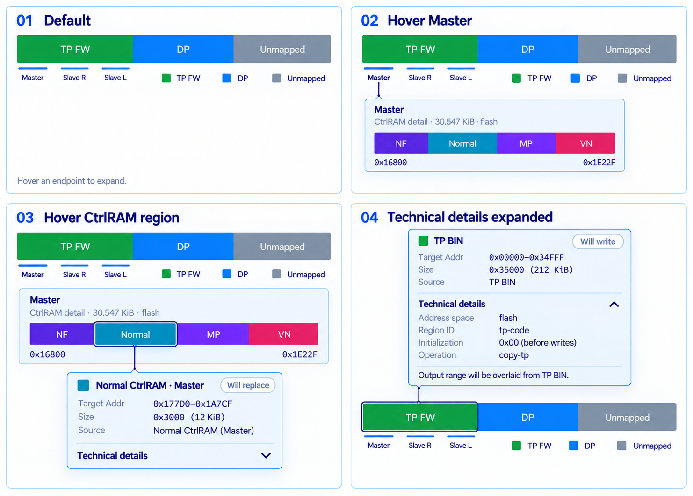

# Memory Layout hover hierarchy

Owner-approved implementation reference, 2026-09-13; local development on
`1.1.6`, base `6aa14b4f44bbe0aaaeeb993f269ff948e8b13b6c`.



The reference is a light-theme English interaction board, not a full-window
screenshot or an authoritative IC address map. Its four panels show separate
states. Match the information hierarchy, compact cards, seamless colors,
endpoint strokes, aligned labels, short connectors and disclosure style.
Actual IC ranges, address scales, support and source facts remain unchanged.
The 2026-09-14 approved follow-up below supersedes the board's footer placement:
the legend now belongs in the upper-right header, wrapping below its heading
when necessary, and outer addresses sit above the main rail. Address-proportional
markers remain unchanged. Dark theme and localized text retain equivalent
geometry with the existing theme resources.

## Accepted behavior and scope

- Rest: main rail, Master/Slave endpoint strokes when declared, and compact
  legend only; no persistent region-card list or expanded technical content.
- Hover an endpoint: open only its own CtrlRAM local rail. Hover a leaf:
  display its nearby card, not another disconnected region from the same file.
- A direct TP/DP leaf opens its card without a CtrlRAM intermediate view.
- Pointer clicks do not pin or activate focus-based exploration. Keyboard
  navigation remains an accessible equivalent; Escape unwinds a level.
- Pointer transit through the connector/card retains the current hierarchy;
  leaving the complete interaction surface closes it after the existing grace.
- Cards contain colored marker/title, state badge, Target Addr, Size and Source
  (or the typed initialization field). Technical details starts collapsed for
  each newly opened card, can be expanded inside it, and retains actual facts.
- Choose upper/lower placement within the viewport. No clipped text, stretched
  glyphs or white seams, including the local rail and hovered slice.
- Selector slots, firmware/profile contracts, bytes and release policy are out
  of scope. This reference does not initiate a release.

## Local R1 admission and verification

The existing owners are `Views/MemoryCoverageBar.cs` (hover/overlay lifecycle),
`Behaviors/MemoryCoverageInteractionBehavior.cs` (correlated emphasis),
`Styles/MemoryCoverageStyles.axaml`, the two `MainWindow*Templates.axaml`
resource dictionaries, and `MemoryFocusLaneViewModel`/`ShellTextResources`
for endpoint and localized labels. Extend these shared owners, not individual
workflows or a second firmware projector. A local legend/layout partial of the
same control may separate rendering from the overlay lifecycle.

Mutable scope: those Presentation files, focused UiSmoke regressions, this
handoff and its reference. Tests exercise rendered controls, pointer versus
keyboard focus, actual bounds and disclosure reset in both themes. Production
captures cover NT51927 three-chip CtrlRAM, NT51950 and Standard/AB shared
consumers. Preserve dynamic/unknown input states and firmware Golden authority.

The legend replaces the obsolete three-row disclosure UI. Remove its unused
`MemoryCoverageListViewModel`, `CoverageDetails` bindings and expansion-reset
plumbing in Merge/Replace presentation, with corresponding behavioral tests.
Typed coverage, pending/error state, relocalization and report facts remain
owned by the existing projection; this cleanup changes no firmware decision.

Status: locally implemented and verified on 2026-09-14; not integrated or released.
Run affected UiSmoke tests and scoped Polytail for each coherent unit. Full
candidate verification, integration records and release Golden execution remain
at their normal future boundary, not per local UI commit.

### Unit 1 — seamless slices and pointer focus

Removed the explicit one-pixel local-slice divider and white inset hover
outline. Pointer-origin focus no longer opens overlays or keeps correlated
emphasis active. Tunnel input handlers preserve the keyboard equivalent even
when a child disclosure handles Space.

Red evidence: both themes rendered a `0,0,1,0` local border instead of zero;
pointer-origin focus opened a card without hover. Review additionally exposed
a handled-Space case that retained the card but lost correlated emphasis;
its added assertion failed before the tunnel correction.

Green: `dotnet test tests/NvtFwCombiner.UiSmoke.Tests/NvtFwCombiner.UiSmoke.Tests.csproj
--no-restore --filter "FullyQualifiedName~MemoryCoveragePopupTests|FullyQualifiedName~MemoryCoverageInteraction"`
passed 62, failed/skipped 0 (22 seconds test execution, compilation additional),
with the fixed user test-area environment. Scoped read-only Polytail review
closed its one P2 after correction and the green run: local R1 PASS.
Endpoint/legend/card visual fidelity was completed by Unit 2 below.

### Unit 2 — approved hierarchy and card layout

Implemented on 2026-09-13/14, with the existing shared MemoryCoverageBar and
templates; no selector or firmware change:

- The main rail retains exact geometry and seamless fills. Endpoint strokes
  sit above full names; a short Cascade interval no longer constrains glyph
  width. Labels keep address order, readable spacing and rail boundaries.
- A wrapping compact legend replaces persistent supporting cards and Plan
  rows. Every primary range retains its original object/facts, including
  disconnected same-source ranges and pending/unknown inputs. Unmapped stays
  last in the legend, not in the address-scaled rail.
- Endpoint hover opens only its own local rail; a terminal hover opens the
  card. Fresh technical disclosures start collapsed. Direct cards anchor above
  the track or below the footer, preserving every legend row. Local cards
  retain the established transit, keyboard, Escape and exit behavior.
- Cards use explicit Target Addr / Address space labels, an aligned summary,
  source and state, and existing processing facts. DiffDLM per-IC block,
  artifact/flash ranges and dispositions remain inside technical details.
- Removed the unused three-row list ViewModel and expansion-reset plumbing.
  Accepted projection, input health, Build admission and report data remain
  unchanged. Earlier list-specific tests now exercise the live legend/card
  path; physical-range and behavior assertions remain.

Red evidence includes full names versus M/R/L, absent explicit card labels,
NT51950 Cascade text beyond the rail edge, NT51951 Common/Cascade collision,
direct Standard cards covering the legend, and a later legend row opening an
upward card over earlier legend rows. Each received a geometry/interaction
regression. Existing old-height/background/list-binding assertions were updated
only where superseded by this accepted reference.

Full affected verification before the final Base/Other label correction
(fixed user test-area TEMP/TMP/TMPDIR):

```text
dotnet test tests/NvtFwCombiner.UiSmoke.Tests/NvtFwCombiner.UiSmoke.Tests.csproj --no-restore --filter "FullyQualifiedName~MemoryCoverage|FullyQualifiedName~CtrlRamMemory|FullyQualifiedName~CtrlRamCascadeMemory|FullyQualifiedName~AbMemoryLayoutControl|FullyQualifiedName~StandardMemoryLayoutControl"
```

141 passed, 0 failed/skipped; 2 minutes 24 seconds test execution, compilation
additional. That run also captured full production MainWindow renders
using the existing public Golden input loaders. It covers Standard NT51928,
AB NT51929, CtrlRAM NT51927 / 3 IC, NT51950 single and NT51950/951 Cascade,
Light/Dark and English/Traditional Chinese, plus 240/620px shared-control
geometry and supported 980/1180/1440px application viewports. These are UI/input
tests, not a newly executed firmware output-Golden release run.

Final visual review identified that Base/Other context had inherited an
unnecessarily long full label. These are not IC endpoints: restore their
previous neutral `•` while retaining the full title/range in accessibility and
the local view. Base/Other red cases failed 2/5 before correction. The latest
source passed all 7 tests selected by
`FullyQualifiedName~EndpointHasFullNameBelowItsStroke|FullyQualifiedName~ProductionCtrlRamWindowShowsReferenceAlignedLocalCard`
(18 seconds), covering the five endpoint/context cases and real NT51950 in
both themes. Other behavior reuses the preceding 141-test evidence; this is
not represented as a second complete affected run. Final NT51950 captures were
visually checked after the correction.

Scoped read-only Polytail review (`/root/memory_ui_review`) closed the Cascade
label and wrapped-legend placement P2 findings after their red regressions and
corrections; the final 7-test label verification, preceding 141-test evidence
and `git diff --check`: local R1 PASS. No
integration or release claim. Selector slots and base product version string
(1.1.5) are deliberately unchanged on this 1.1.6 development branch.

## Unit 2 actual render comparison (before the header follow-up)

Full-window Avalonia production renders, not generated mockups. The primary
agent compared hierarchy, seams, endpoint labels, glyph scale, title/badge
alignment, collapsed/expanded disclosure and popup/legend geometry against the
approved board. Real NT51927 addresses naturally place endpoints inside TP,
and the narrow application rail wraps its legend. Standard NT51928 includes
LDC and disconnected gaps; those actual ranges are not replaced with the
board's schematic three-segment proportions. The compact card expands upward
when space permits; no selector redesign or firmware-output change is implied.

| Reference state | Actual full-window render |
| --- | --- |
| Default, legend only | [NT51927 / 3 IC](references/v1.1.6-memory-actual-rest.png) |
| Hover Master, local rail only | [Master](references/v1.1.6-memory-actual-master.png) |
| Hover terminal Normal, collapsed details | [Normal CtrlRAM](references/v1.1.6-memory-actual-normal.png) |
| Technical details expanded | [NT51928 Standard TP](references/v1.1.6-memory-actual-technical.png) |

The complete local capture set and final TRX are in
`D:/NvtFwCombiner-TestArea/evidence/v116-memory-approved/`.

## 2026-09-14 approved header / connector correction (local R1)

Owner approved the follow-up to screenshot `codex-clipboard-81133ed9-dd2b-4728-b524-172ee2e93221.png`:
move legend to the upper right beside the overview heading (wrap onto its own
right-aligned row when necessary), put capacity beside the heading and the
outer addresses above the main rail, and replace the Master/local-view thorn
with one continuous thin connector without an arrow or endpoint dot. Preserve
the leaf/card connector and the accepted hover hierarchy.

Base: `ff4d2dad41d1d4512c445317f237e89f0f0a8d2f`, existing `1.1.6` branch;
clean worktree. Existing owners: `Views/MemoryCoverageBar.cs` and its `.Legend.cs`
partial own shared presentation geometry/interaction;
`MemoryCoverageConnectorVisuals.cs` owns decorative connectors;
`Resources/MainWindowWorkflowTemplates.axaml` supplies already projected
CtrlRAM heading/capacity/end address. No new firmware classifier or projection.
Mutable scope is those four Presentation files, related UI-smoke regressions,
this handoff and actual render evidence. Selector slots, firmware semantics,
profiles, output bytes, CI and release are non-goals.

Before production changes, add measured legend/address/connector regressions
to `MemoryCoveragePopupTests.Hierarchy.cs` and `CtrlRamMemoryLayoutTests.cs`.
Run these red, then green; include existing shared popup/interaction and real
Standard, AB, NT51927 / 3 IC and NT51950/951 CtrlRAM coverage. Compare actual
full-window Light/Dark and narrow renders. Finish with scoped Polytail and one
local commit; no full release run or integration/publication claim.

### Implemented result and verification

- Shared header keeps legend right-aligned, on the heading row when it fits
  and on its own row otherwise. Capacity stays beside the localized heading.
  The old endpoint/legend shared-footer calculation is removed, not duplicated.
- The existing formatted CtrlRAM outer addresses now sit immediately above
  the rail. Presentation only forwards the existing strings; ranges, byte
  proportions and firmware logic are unchanged.
- Master/local view is joined by one 10px, one-pixel-wide contrasting stem,
  centered on the actual endpoint. The previous dot and triangular notch are
  absent at this level. Its source end sits below the endpoint label to avoid
  drawing through text; its other end touches the local-view boundary.
  Terminal leaf/card connectors remain unchanged.
- Direct cards opening above the rail anchor above the whole control so they
  do not cover the relocated legend. Pointer transit, keyboard navigation,
  leave dismissal, reduced motion and exact disconnected-range identity remain.

Red: 4/4 tests demonstrated the old lower legend/address placement. Initial
shared run: 144 passed, 3 failed because its viewport helper still required
legend Y >= 34 (below the rail). That superseded assertion is now measured
upper placement/right alignment; viewport, IC identity, ranges and input-button
geometry assertions were retained. Header measurement also includes the
heading/legend gap when reporting its desired width.

Final source verification (fixed user test-area TEMP/TMP/TMPDIR):

```text
dotnet test tests/NvtFwCombiner.UiSmoke.Tests/NvtFwCombiner.UiSmoke.Tests.csproj --no-restore --filter "FullyQualifiedName~MemoryCoverage|FullyQualifiedName~CtrlRamMemory|FullyQualifiedName~CtrlRamCascadeMemory|FullyQualifiedName~AbMemoryLayoutControl|FullyQualifiedName~StandardMemoryLayoutControl"
```

147 passed, 0 failed/skipped; 2 minutes 23 seconds test execution, compilation
additional. Includes 240/620px responsive-header geometry in Light/English and
Dark/Traditional Chinese, address updates, continuous-connector endpoints,
popup/legend non-overlap, and the existing real-input workflow/viewport checks.
TRX and complete local captures:
`D:/NvtFwCombiner-TestArea/evidence/v116-memory-header/v116-memory-header-final.trx`.

The primary agent performed scoped Polytail against the above base: shared
geometry retains one owner, no firmware semantics or independent expected bytes
changed, no hidden suppression or disabled tests, no open correctness findings;
`git diff --check` and affected tests pass. **Local R1 PASS**, not an integration
or release verdict. No full verifier/release-Golden run was performed.

Actual production MainWindow headless renders, inspected by the primary agent
against the approved follow-up (not generated mockups):

| State | Actual render |
| --- | --- |
| NT51927 / 3 IC, Master hover, 1180px Light/English | [Master connector and header](references/v1.1.6-memory-header-master.png) |
| NT51951 Cascade hover, 980px Light/English | [Narrow Cascade](references/v1.1.6-memory-header-cascade.png) |
| NT51950 single, 1440px Dark/Traditional Chinese | [Dark overview](references/v1.1.6-memory-header-dark.png) |

Header/legend alignment, address placement, continuous local connector and
unchanged terminal-card hierarchy were compared in the full-window captures.
The small 240px control captures additionally confirm right-aligned wrapping.
