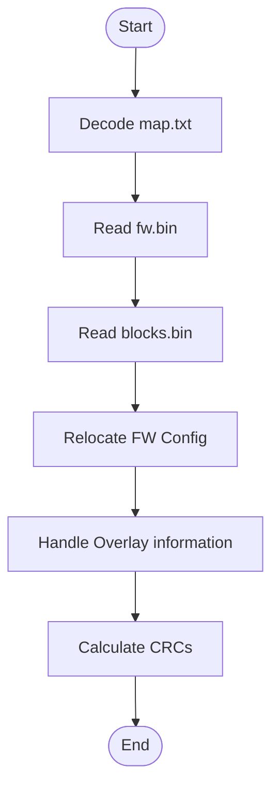

# NT51928BBASED_NORMAL_MODE

## Summary
This command performs a normal merge for NT51928B-based firmware binaries and produces a complete firmware binary file. The process includes:
 1. Reading the base firmware binary produced by the Andes compiler.
 2. Reading multiple user-provided block.bin files.
 3. Relocating the FwConfig section.
 4. Processing Overlay information.
 5. Calculating and writing the CRC.

## Parameters
- argv[0]: executable name (provided by the OS; do not supply)
- argv[1]: command name (fixed: NT51928BBASED_NORMAL_MODE)
- argv[2]: CRC_method — CRC8 or CRC32
- argv[3]: output_bin - path for merged firmware binary (output)
- argv[4]: fw_bin - path to firmware binary (input)
- argv[5]: block1_bin - path to block1.bin (input)
- argv[6]: block1_source_address - source offset inside block1_bin to start copying (**must be hex with 0x**)
- argv[7]: block1_destination_address - destination offset in the output image where block1 should be placed (**must be hex with 0x**)
- argv[8]: block1_length - number of bytes to copy from block1_bin starting at source_address (**must be dec**)
- argv[9]: block2_bin
- argv[10]: block2_source_address
- argv[11]: block2_destination_address
- argv[12]: block2_length
- ...

maximum block file number: 20

## Usage

Basic syntax:
```
./Combiner.exe NT51928BBASED_NORMAL_MODE <CRC_method> <output_bin> <fw_bin> <block1_bin> <block1_source_address> <block1_destination_address> <block1_length> <block2_bin> <block2_source_address> <block2_destination_address> <block2_length> ...
```

Example:
```
./Combiner.exe NT51928BBASED_NORMAL_MODE CRC8 "output.bin" "fw.bin" "block1.bin" 0x0 0x100 16 "block2.bin" 0x0 0x200 64 "block3.bin" 0x0 0x1000 32
```

## Flow Chart
