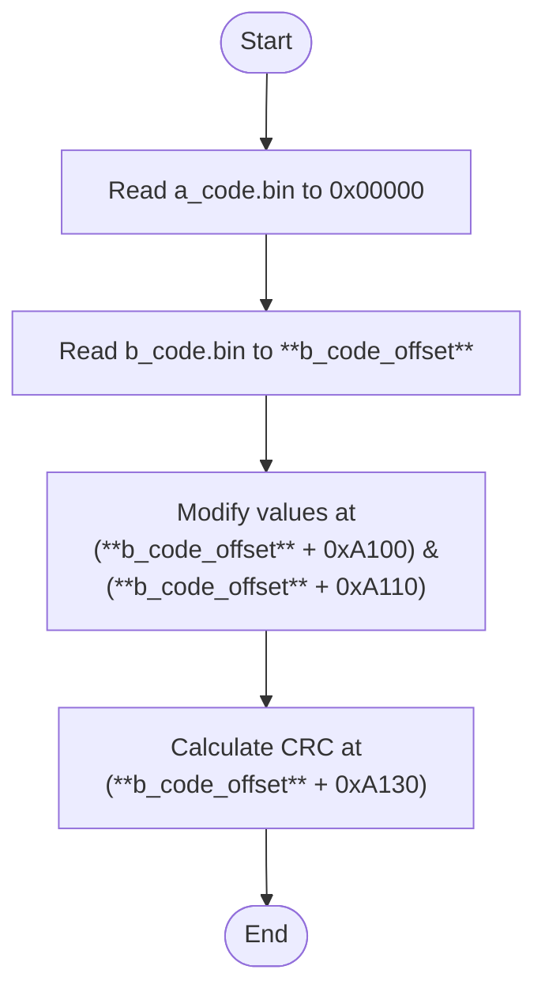

# NT51950BASED_MERGE_AB_MODE

## Summary
This command performs an A/B code merge for NT51950-based firmware binaries. It reads two binary files, updates the **ILM start addr in bin**, the **DLM start addr in bin**, and the **Header CRC**, and then produces a single merged output file.

## Parameters
- argv[0]: executable name (provided by the OS; do not supply)
- argv[1]: command name (fixed: NT51950BASED_MERGE_AB_MODE)
- argv[2]: CRC_method — CRC8 or CRC32
- argv[3]: a_code_bin — path to A binary (input)
- argv[4]: b_code_bin — path to B binary (input)
- argv[5]: output_bin — path for merged output (output)
- argv[6]: b_code_offset — offset (in bytes) where B is placed in the output

## Usage

Basic syntax:
```
./Combiner.exe NT51950BASED_MERGE_AB_MODE <CRC_method> <a_code_bin> <b_code_bin> <output_bin> <b_code_offset>
```

Example:
```
# Use CRC8, place B at output offset 0x40000
./Combiner.exe NT51950BASED_MERGE_AB_MODE CRC8 "A.bin" "B.bin" "merged.bin" 0x40000
```

## Flow Chart
