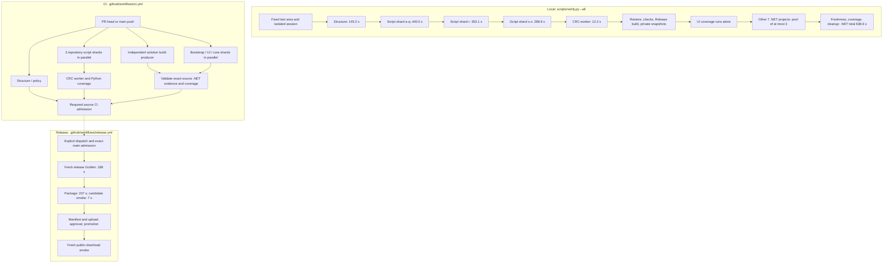

# Test architecture and measured baseline

This is a navigation and measurement summary, not a new verification policy.
The scheduling snapshot below was inspected on 2026-09-06 at
`6c8552af6b5b497065a5b24867cc0e349de03e83` (`1.1.4`). Historical timings are
explicitly **v1.1.3**, not fresh measurements of the current UI changes.

## Execution map

Arrows mean prerequisites; sibling branches may overlap. Local verification,
CI and release are separate invocations, not one pool of parallel processes.
All current CI jobs use Windows. The diagram shows the current v1.x release
route; the future-version parity branch is not part of v1.1.3 execution.



Source owners: [`selected_lanes` / `execute_verification` / `collect_local_dotnet_coverage`](../scripts/verify.py),
[`ci.yml`](../.github/workflows/ci.yml), [`release.yml`](../.github/workflows/release.yml).
The local top-level loop submits **one lane at a time** even when the displayed
`--jobs` value is three. UI coverage is exclusive; the remaining project pool
is partially parallel. Infrastructure additionally disables test-collection
parallelism inside its own process. CI test shards do not wait for the separate
build producer: each restores/builds its own projects, then the finalizer checks
both producers. Within `core`, its six projects execute in declared order.

[`main-package.yml`](../.github/workflows/main-package.yml) is a separate manual
workflow: full `--all` → package → `-SkipUiLaunch` smoke → artifact upload.
It is not an extra job automatically appended to every `ci.yml` run.
For releases from v1.1.3, admitted exact-source CI is reused and the candidate
executes `--release-golden`, not another complete `--all`.

## Test inventory and locations

Counts below are **static test-method declarations at the snapshot above**,
not discovered or passed cases. xUnit theories and Python parameterization can
expand one method into many cases. No tests were rerun to write this README.
Project paths are also the navigation links; their `.csproj` has the same name.

| Major item / location | Scope | Method declarations | CI placement |
| --- | --- | ---: | --- |
| [Domain](NvtFwCombiner.Domain.Tests/) | Range math, planner/executor invariants | 378 | core |
| [Application](NvtFwCombiner.Application.Tests/) | Typed use cases, admission, output/report decisions | 874 | core |
| [Infrastructure](NvtFwCombiner.Infrastructure.Tests/) | Files/processes, worker adapters, packaging/managed lifetime | 716 | core; collection parallelism disabled |
| [ProfileContract](NvtFwCombiner.ProfileContract.Tests/) | Profile compilation, mappings and declared facts | 332 | core |
| [GoldenRegression](NvtFwCombiner.GoldenRegression.Tests/) | Certified output byte/hash regressions | 9 | core; also fresh release Golden |
| [Architecture](NvtFwCombiner.Architecture.Tests/) | Layer/dependency and source-contract checks | 238 | core |
| [Bootstrap](NvtFwCombiner.Bootstrap.Tests/) | Assembled routes, real fixtures and supported workflow execution | 666 | bootstrap; also fresh release Golden |
| [UiSmoke](NvtFwCombiner.UiSmoke.Tests/) | Headless real controls, layout, bindings and shell workflows | 749 | ui; exclusive in local coverage |
| [Repository scripts](scripts/), `test_[a-q]*.py` | Policy, automation and verifier contracts | 418 | repository-scripts-a-q |
| [Repository scripts](scripts/), `test_r*.py` | Release/repository policy regressions | 165 | repository-scripts-r |
| [Repository scripts](scripts/), `test_[s-z]*.py` | Sync, verification, process ownership and remaining contracts | 413 | repository-scripts-s-z |
| [CRC worker](../tools/crc-worker/tests/) | CRC/header protocol and worker behavior | 28 | python-worker |

The eight .NET projects total **3,962 declarations**; scripts total **996**.
Reproduce the static inventory without building or executing tests using
`rg -n '^\s*\[(Fact|Theory|AvaloniaFact|AvaloniaTheory)(\(|\])' tests -g '*.cs'`
and `rg -n '^\s*(async )?def test_' tests/scripts tools/crc-worker/tests -g '*.py'`.
These are counts under that explicit textual convention, not a test-discovery
engine. [`TestSupport`](NvtFwCombiner.TestSupport/) and
[`ReadyProbe`](NvtFwCombiner.ReadyProbe/) are support projects, not additional
test suites. Golden coverage also exists outside the GoldenRegression project;
its name alone is not proof of complete certified-case execution.

Non-test checks remain part of the elapsed time: structure executes derived-data
sync, repository validation, Polytail and sentinel dry-run; the worker lane also
runs Ruff format/check, Pyright, Pylint and coverage policy. The .NET lane includes
restore/build checks, shadow preparation, freshness verification and coverage
aggregation. These are not counted as xUnit/Python cases.

## Retained v1.1.3 results

Reviewed head: `8afe0d03b216138571ea910d0fe4795984803a96`; published source:
`e5202e2707d272076d24216222188d478314a07d`, same tree
`8f8577878956fe24d264b97685cd3e95f937a817`.
The [verification report](../docs/references/verification-report.md#113-published-release-closure)
owns the historical verdicts; the
[roadmap baseline](../docs/architecture/nfc_roadmap.md#local-full-verifier-parallelization)
retains the local lane times.

| Local full-verifier item | v1.1.3 measured time | Retained result |
| --- | ---: | --- |
| Structure | 145.2 s | PASS |
| Scripts a-q | 440.0 s | PASS |
| Scripts r | 353.1 s | PASS |
| Scripts s-z | 288.9 s | PASS |
| CRC worker | 12.2 s | PASS |
| .NET, all eight projects including preparation/cleanup | 638.6 s | 5,570 passed; 0 failed; 0 skipped |
| Full local command | **1,879.6 s (31 min 19.6 s)** | PASS on reviewed head |

Rounded lane values sum to 1,878.0 s; the remaining 1.6 s is outside those
rounded lane totals. Do not label it as a measured specific subprocess.
The retained repository summary does **not** provide individual local .NET
project seconds or per-shard Python executed-case counts. Those values are
unavailable here, not zero. The static current-source counts above must not be
used to fill historical execution-count gaps.

| CI / release item | v1.1.3 measured time | Result / boundary |
| --- | ---: | --- |
| [PR CI 33972121851](https://github.com/Dennis40816/nvt_fw_combiner/actions/runs/33972121851) | 419 s | PASS; parallel job wall time |
| [Main CI 33973838733](https://github.com/Dennis40816/nvt_fw_combiner/actions/runs/33973838733) | 416 s | PASS; separate actual-source admission |
| Fresh candidate Golden | 188 s | 1,172 Bootstrap + 25 GoldenRegression cases passed, no skips/failures; 25 Direct Golden IDs exactly once |
| Package | 237 s | PASS |
| Candidate package smoke | 7 s | PASS with `-SkipUiLaunch` |
| Successful candidate including setup/upload | 545 s | Includes the three preceding rows; do not add them twice |
| Promotion | 52 s | PASS |
| Public-smoke queue / job | 5 s / 30 s | PASS; actual smoke step 8 s, included in job |
| Successful release path excluding failed attempt/triage/approval wait | **632 s (10 min 32 s)** | Includes five-second public-smoke queue |
| Actual original release dispatch to public-smoke completion | **4,641 s (77 min 21 s)** | Includes first failure 52 s, retry interval 737 s, approval/queue 3,220 s |

Adding the separately executed main CI to the adjusted successful release path
gives **1,048 s (17 min 28 s)**. Adding the retained reviewed-head local full run
gives **2,927.6 s (48 min 47.6 s)** of those successive stages; this is arithmetic
over recorded stages, not a newly measured end-to-end run or the actual delayed
dispatch duration. Do not sum parallel CI jobs to infer CI wall time.

Full-output Golden comparison is mandatory for each release candidate. Fixture
hash validation is not output execution; input-only evidence is not output
Golden. `-SkipUiLaunch` smoke does not establish visible startup, a clean Windows
machine, signing or separate owner/legal evidence. See the
[release contract](../docs/ci/release-package.md) for those boundaries.

## v1.1.4 display-evidence boundary — 2026-09-08

This assessment is separate from the historical `v1.1.3` measurements above.
The UI test host uses `UseHeadless` with Skia drawing
(`AvaloniaHeadlessTestApplication.cs:14-19`), not the native Windows window
backend. Reference screenshots are now accompanied by actual `RenderScaling`,
logical client size, pixel size, theme and language in test output. The
CtrlRAM/Settings reference tests assert their declared 100% scale and image
dimensions instead of implying that a compact viewport is a DPI test.

| Current scoped run | Actual result | What it establishes |
| --- | --- | --- |
| CtrlRAM reference matrix | 16/16 passed; actual scale `1`, pixels match `980x640` / `1440x900` | Existing Light/Dark, EN/zh-TW, empty/selected layout and interaction checks at 100% headless scale |
| Settings Version reference | 2/2 passed; actual scale `1`, pixels `1584x997` | Approved Light/Dark full-page reference geometry at 100% headless scale |
| Shared palette / non-color template cues | 2/2 passed | Existing Light/Dark color-ratio checks and textual/shape template cues, not native accessibility certification |

Evidence is under `D:/NvtFwCombiner-TestArea/evidence/v114-display-assessment/`:
`display-reference-scale.trx` contains the 16 CtrlRAM plus two palette/template
cases (18 total, about 25 seconds), and `settings-reference-scale.trx` contains
the two Settings cases (about seven seconds). The production source is
`463cc339` plus only the test-output/assertion and test-name changes in this
unit; no product theme, geometry or firmware code changed.

The misleadingly broad test name `ReportHexDiffHighContrastCuesDoNotDependOnColor`
is now `ReportHexDiffTemplatesRetainNonColorCues`; all its assertions remain.
It reads templates and does not render Windows High Contrast.

A read-only Windows query at 09:25 Asia/Taipei found one display at **100%**
and High Contrast **off** (`native-display-state.json` and retained
`read-display-state.ps1` in the same evidence directory). No OS preference was
changed and no visible helper window was opened. The application exposes
System/Light/Dark (`SettingsViewModel.cs:49-54`), maps those to
Default/Light/Dark (`MainWindow.axaml.cs:690-698`), and its custom palette has
only Light/Dark dictionaries (`Styles/ThemeTokens.axaml:5,102`). No custom
High Contrast palette/contrast-preference handler was found in Presentation.
System theme following must not be reported as full High Contrast support.

**Still open:** actual Windows 125% rendering/input/focus and monitor-scale
transitions, OS High Contrast behavior across custom controls, and native
screen-reader acceptance. A resized image, a 120-DPI bitmap export, or a new
theme name with Light/Dark fallback cannot close these gaps. Use an explicitly
arranged native 125%/High Contrast test session for that acceptance; this
assessment neither adds a theme nor waives the existing visual contract.

## Current Home and Settings inventory — 2026-09-08

`ShellScreenInventoryTests` renders the real MainWindow over isolated preference
and history files with production capability policy (no retained DP Replace
regression override). It checks Home/Settings navigation isolation, bounded
modal placement, actual Light/Dark theme and 100% scale at 1440x900. The primary
inspected all eight English full-shell captures. Existing compact Preferences
tests supply two zh-TW template captures at 980x640; their isolated host does
not certify full-shell theme-choice synchronization.

After the standard external test-area environment initialization:

```text
dotnet test tests/NvtFwCombiner.UiSmoke.Tests --no-restore --filter "FullyQualifiedName~ShellScreenInventoryTests|FullyQualifiedName~SettingsPreferencesFitsMinimumTraditionalChineseWindow|FullyQualifiedName~ReportImportOutcomeControlTests"
```

Result: **7/7 passed, zero skipped, 13 seconds test time** on production
`c3c81ba2` plus only the inventory/test-host changes. This includes two new
shell cases, one existing compact Preferences case (both themes internally),
and four existing Report controls to check the shared host's unchanged default.
TRX and PNG evidence is under
`D:/NvtFwCombiner-TestArea/evidence/v114-shell-inventory/product-policy/`;
set `NFC_VISUAL_OUTPUT_DIR` to an external evidence directory to reproduce.
Earlier parent/verified-directory captures used the historical DP test policy
or a theme assignment not synchronized with shell preferences; they are not
the final inventory. No full-suite/native DPI/High Contrast claim is made.
Findings and next actions belong to the
[roadmap inventory](../docs/architecture/nfc_roadmap.md#current-home-and-settings-inventory-follow-up).

## Support Matrix layout — 2026-09-08

`SupportMatrixInteractionTests` now checks the approved redesign at 1440×900
and 980×640, English Light and Traditional Chinese Dark. The real MainWindow
tests measure 46 px rows, workflow/header alignment, neutral cell backgrounds,
fixed IC bounds during horizontal scrolling and same-window resizing. Keyboard
disclosure tests bring catalog values into the viewport and check uncollapsed
text; existing tooltip accessibility, focus restoration and two-stage Escape
checks remain. Typed support facts are unchanged.

After the standard external test-area environment initialization:

```text
dotnet test tests/NvtFwCombiner.UiSmoke.Tests --no-restore --filter "FullyQualifiedName~SupportMatrix|FullyQualifiedName~SettingsModalSupportsKeyboardModalLifecycle|FullyQualifiedName~FocusTool|FullyQualifiedName~IssueCard|FullyQualifiedName~IcDetail"
```

Result: **35/35 passed, zero skipped, 12 seconds test time**. Original red
cases and the superseded localized-expectation failure remain separately
retained. Final TRX and sixteen full-window PNGs:
`D:/NvtFwCombiner-TestArea/evidence/v114-support-matrix-layout/green/`.
Reference, actual-state differences and review evidence are recorded in the
[Settings handoff](../docs/ui/v1.1.x-settings-version-handoff.md#support-matrix-layout--approved-2026-09-08).
These headless results do not certify native DPI, High Contrast, screen readers
or full release readiness.

## Running and maintaining this view

Use [`CONTRIBUTING.md`](../CONTRIBUTING.md) to initialize the existing fixed
`NFC_TEST_AREA_ROOT`. Before local tests/verifiers, load its user-level value and
set `TEMP`, `TMP`, and `TMPDIR` to its existing `temp` child. Use
`python scripts/verify.py --all` at the applicable full integration boundary;
select affected tests for ordinary bounded changes under [`AGENTS.md`](../AGENTS.md).
This README neither changes scheduling nor adds a test gate.

The approximately ten-minute **local** critical-path target belongs to v1.1.5;
it is not achieved by the current serial top-level loop. When that scheduling
changes, update this diagram and retain new source-specific lane and full-wall
measurements alongside, not instead of, the v1.1.3 historical baseline.
