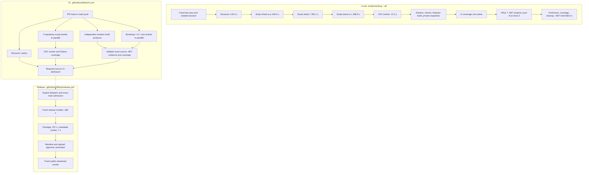

# Test architecture and measured baseline

This is a navigation and measurement summary, not a new verification policy.
The scheduling snapshot below was inspected on 2026-09-06 at
`6c8552af6b5b497065a5b24867cc0e349de03e83` (`1.1.4`). Historical timings are
explicitly **v1.1.3**, not fresh measurements of the current UI changes.

## v1.1.5 local scheduling change

The local implementation now finishes structure checks and the existing
checkout restore/build before submitting the test workloads together to the
existing `--jobs` pool. The coverage-only workload is submitted first, followed
by complete script test modules and the CRC worker. Each module retains its
original shard's shared deadline, beginning at that shard's first module start;
queued modules consume the remaining budget and fail without launching if it
expires. The validated CI shard inventory remains the source of membership.
`--jobs=1` remains serial. SDK
cleanup runs after the workload pool terminates, including failure paths.
CI and release-Golden entry points retain their existing execution paths.

The shared script runner uses the existing pytest dependency for both unittest
classes and pytest functions. Local modules and CI shards pass explicit files
from the same validated inventory; empty selections and the existing Python
environment overrides (`PYTEST_ADDOPTS`, `COVERAGE_RCFILE`,
`COVERAGE_PROCESS_START`) fail. Each invocation owns separate temporary storage and disables
pytest's cache provider. Nonzero exits, including zero collected tests, fail.

UI exclusivity remains within the .NET collector: UI finishes before the other
.NET projects start. It is not global exclusivity against Python subprocesses.
The complete local run still needs measured contention, coverage and wall-clock
validation; no ten-minute result is claimed by the scheduling change alone.

The diagram and timings below preserve the pre-change v1.1.3/v1.1.4 baseline.
Replace no historical timings with projected parallel durations.

### First parallel measurement — 2026-09-10 (failed candidate)

Source: `a20051d6805f548a6935b86867db1b791d7af19f`, Windows, SDK 10.0.301,
20 logical processors, approximately 32 GiB RAM; `python scripts/verify.py --all`
with the default three worker slots. Complete command wall clock, including
setup and cleanup: **992.35 s (16 min 32 s), exit 1**.

| Phase/lane | Seconds | Observed result |
| --- | ---: | --- |
| Structure | 219.7 | PASS |
| Shared .NET restore/build | 81.0 | PASS |
| .NET coverage lane | 505.2 | FAIL; UI 1,264 passed, 1 failed, 0 skipped |
| Script shard a-q | 546.3 | PASS; 432 tests |
| Script shard r | 415.0 | PASS; 162 tests |
| Script shard s-z | 273.8 | PASS; 374 tests |
| CRC Python worker | 11.2 | PASS; 30 tests, 100% line/branch coverage |

Lane durations overlap and must not be summed as wall clock. The UI failure was
`ReportImportOutcomeTests.StoredSuccessMetadataIsReassessedForUnknownRaw(chinese: True)`:
the first imported history row retained `成功` instead of `未知`. Later .NET
projects did not run after this exclusive UI batch failed; this measurement is
neither complete coverage evidence nor proof of the ten-minute target. Isolated
case (2 tests), class (14 tests), and class with coverage (14 tests) passed on the
same binaries; retries do not establish a fix or invalidate the original failure.
Local raw evidence is under `NFC_TEST_AREA_ROOT/evidence/v115-parallel-first`
(`verify-all.log`, `timing.json`) and `evidence/v115-report-import-repro` (TRX).
No successful complete-run reduction percentage is claimed from this result.

Follow-up diagnostic profiling of `scripts/validate_repository.py` at
`c835d441` completed successfully in 248.41 s under `cProfile`. Governance
validation accounted for 215.53 s; 2,905 `subprocess.run` calls accounted for
214.75 s cumulatively. Selected nested costs were 63.54 s for post-final
record-change checks, 50.03 s for 258 index-blob reads, and 27.42 s for 190
path-state digests. These nested durations overlap and must not be added.
The profile (`validator-profile.pstats` beside the first-run log) identifies
optimization candidates, not a fresh wall-clock baseline: instrumentation and
overlapping narrow UI diagnostics differ from the original full-run conditions.
The follow-up profile at `a4cbc558` (`validator-profile-batched.pstats`) took
194.68 s with 2,429 subprocess calls and 161.23 s in governance validation.
Compared with the earlier diagnostic profile, this is 53.73 s less total time
(21.6%), not a controlled full-verifier speedup. This profiled invocation reported
the expected unfinished `design-active` record error and is not a validation
PASS; final evidence was subsequently validated separately and committed in
`abd26b2b`.

### Module-pool measurement — 2026-09-11 (failed candidate)

Source: `39e017dce3fbc2186bef1764236e15ea584135f6`, same Windows host,
SDK 10.0.301, default three worker slots, `python scripts/verify.py --all`.
Complete command wall clock including cleanup: **988.40 s (16 min 28 s), exit 1**.
Structure passed in 192.2 s; shared restore/build passed in 82.5 s; the .NET
coverage lane passed in 711.1 s, including all 1,265 UI cases with no skips.
CRC worker passed all 30 cases with 100% line/branch coverage in 11.3 s.
These overlapping lane durations must not be summed.

Three individual script modules failed with unittest's zero-test result:
`test_managed_installation_lab.py`, `test_release_smoke_policy.py`, and
`test_version_update_lab.py`. They contain pytest functions. Independent
collection compared IDs: pytest retained all 978 unittest cases and collected
61 additional cases (2, 5, and 54 respectively) across these three modules.
The earlier coarse-shard runner also used unittest and silently omitted them;
the module pool exposed that existing coverage gap. Collection is not execution
evidence. The runner correction must execute these cases, not accept a no-tests
exit code. Raw evidence is in
`NFC_TEST_AREA_ROOT/evidence/v115-module-pool-first/verify-all.log` and
`timing.json`. Neither this failed run nor the earlier incomplete .NET run proves
a successful full-run speedup or the ten-minute target.

The subsequent runner correction executed the previously omitted 61 cases
through `verify_repository_scripts` and its managed lane/session owners:
2/2, 5/5 and 54/54 passed (3.0 s, 1.0 s and 3.3 s lane durations). This is
targeted working-tree evidence, not a fresh complete verifier pass.
The orchestration module passed 206/206 cases in 28.222 s, including five new
collection/isolation regressions and the existing real-process timeout and
cancellation checks. The new regressions first failed against the old runner.

## Historical execution map

Arrows mean prerequisites; sibling branches may overlap. Local verification,
CI and release are separate invocations, not one pool of parallel processes.
All current CI jobs use Windows. The diagram shows the current v1.x release
route; the future-version parity branch is not part of v1.1.3 execution.



Source owners: [`selected_lanes` / `execute_verification` / `collect_local_dotnet_coverage`](../scripts/verify.py),
[`ci.yml`](../.github/workflows/ci.yml), [`release.yml`](../.github/workflows/release.yml).
At the historical baseline, the local top-level loop submits **one lane at a time** even when the displayed
`--jobs` value is three. UI coverage is exclusive; the remaining project pool
is partially parallel. Infrastructure additionally disables test-collection
parallelism inside its own process. CI test shards do not wait for the separate
build producer: each restores/builds its own projects, then the finalizer checks
both producers. Within `core`, its six projects execute in declared order.

[`main-package.yml`](../.github/workflows/main-package.yml) is a separate manual
workflow: full `--all` → package → `-SkipUiLaunch` smoke → artifact upload.
It is not an extra job automatically appended to every `ci.yml` run.
For releases from v1.1.3, admitted exact-source CI is reused and the candidate
executes `--release-golden`, not another complete `--all`.

## Test inventory and locations

Counts below are **static test-method declarations at the snapshot above**,
not discovered or passed cases. xUnit theories and Python parameterization can
expand one method into many cases. No tests were rerun to write this README.
Project paths are also the navigation links; their `.csproj` has the same name.

| Major item / location | Scope | Method declarations | CI placement |
| --- | --- | ---: | --- |
| [Domain](NvtFwCombiner.Domain.Tests/) | Range math, planner/executor invariants | 378 | core |
| [Application](NvtFwCombiner.Application.Tests/) | Typed use cases, admission, output/report decisions | 874 | core |
| [Infrastructure](NvtFwCombiner.Infrastructure.Tests/) | Files/processes, worker adapters, packaging/managed lifetime | 716 | core; collection parallelism disabled |
| [ProfileContract](NvtFwCombiner.ProfileContract.Tests/) | Profile compilation, mappings and declared facts | 332 | core |
| [GoldenRegression](NvtFwCombiner.GoldenRegression.Tests/) | Certified output byte/hash regressions | 9 | core; also fresh release Golden |
| [Architecture](NvtFwCombiner.Architecture.Tests/) | Layer/dependency and source-contract checks | 238 | core |
| [Bootstrap](NvtFwCombiner.Bootstrap.Tests/) | Assembled routes, real fixtures and supported workflow execution | 666 | bootstrap; also fresh release Golden |
| [UiSmoke](NvtFwCombiner.UiSmoke.Tests/) | Headless real controls, layout, bindings and shell workflows | 749 | ui; exclusive in local coverage |
| [Repository scripts](scripts/), `test_[a-q]*.py` | Policy, automation and verifier contracts | 418 | repository-scripts-a-q |
| [Repository scripts](scripts/), `test_r*.py` | Release/repository policy regressions | 165 | repository-scripts-r |
| [Repository scripts](scripts/), `test_[s-z]*.py` | Sync, verification, process ownership and remaining contracts | 413 | repository-scripts-s-z |
| [CRC worker](../tools/crc-worker/tests/) | CRC/header protocol and worker behavior | 28 | python-worker |

The eight .NET projects total **3,962 declarations**; scripts total **996**.
Reproduce the static inventory without building or executing tests using
`rg -n '^\s*\[(Fact|Theory|AvaloniaFact|AvaloniaTheory)(\(|\])' tests -g '*.cs'`
and `rg -n '^\s*(async )?def test_' tests/scripts tools/crc-worker/tests -g '*.py'`.
These are counts under that explicit textual convention, not a test-discovery
engine. [`TestSupport`](NvtFwCombiner.TestSupport/) and
[`ReadyProbe`](NvtFwCombiner.ReadyProbe/) are support projects, not additional
test suites. Golden coverage also exists outside the GoldenRegression project;
its name alone is not proof of complete certified-case execution.

Non-test checks remain part of the elapsed time: structure executes derived-data
sync, repository validation, Polytail and sentinel dry-run; the worker lane also
runs Ruff format/check, Pyright, Pylint and coverage policy. The .NET lane includes
restore/build checks, shadow preparation, freshness verification and coverage
aggregation. These are not counted as xUnit/Python cases.

## Retained v1.1.3 results

Reviewed head: `8afe0d03b216138571ea910d0fe4795984803a96`; published source:
`e5202e2707d272076d24216222188d478314a07d`, same tree
`8f8577878956fe24d264b97685cd3e95f937a817`.
The [verification report](../docs/references/verification-report.md#113-published-release-closure)
owns the historical verdicts; the
[roadmap baseline](../docs/architecture/nfc_roadmap.md#local-full-verifier-parallelization)
retains the local lane times.

| Local full-verifier item | v1.1.3 measured time | Retained result |
| --- | ---: | --- |
| Structure | 145.2 s | PASS |
| Scripts a-q | 440.0 s | PASS |
| Scripts r | 353.1 s | PASS |
| Scripts s-z | 288.9 s | PASS |
| CRC worker | 12.2 s | PASS |
| .NET, all eight projects including preparation/cleanup | 638.6 s | 5,570 passed; 0 failed; 0 skipped |
| Full local command | **1,879.6 s (31 min 19.6 s)** | PASS on reviewed head |

Rounded lane values sum to 1,878.0 s; the remaining 1.6 s is outside those
rounded lane totals. Do not label it as a measured specific subprocess.
The retained repository summary does **not** provide individual local .NET
project seconds or per-shard Python executed-case counts. Those values are
unavailable here, not zero. The static current-source counts above must not be
used to fill historical execution-count gaps.

| CI / release item | v1.1.3 measured time | Result / boundary |
| --- | ---: | --- |
| [PR CI 33972121851](https://github.com/Dennis40816/nvt_fw_combiner/actions/runs/33972121851) | 419 s | PASS; parallel job wall time |
| [Main CI 33973838733](https://github.com/Dennis40816/nvt_fw_combiner/actions/runs/33973838733) | 416 s | PASS; separate actual-source admission |
| Fresh candidate Golden | 188 s | 1,172 Bootstrap + 25 GoldenRegression cases passed, no skips/failures; 25 Direct Golden IDs exactly once |
| Package | 237 s | PASS |
| Candidate package smoke | 7 s | PASS with `-SkipUiLaunch` |
| Successful candidate including setup/upload | 545 s | Includes the three preceding rows; do not add them twice |
| Promotion | 52 s | PASS |
| Public-smoke queue / job | 5 s / 30 s | PASS; actual smoke step 8 s, included in job |
| Successful release path excluding failed attempt/triage/approval wait | **632 s (10 min 32 s)** | Includes five-second public-smoke queue |
| Actual original release dispatch to public-smoke completion | **4,641 s (77 min 21 s)** | Includes first failure 52 s, retry interval 737 s, approval/queue 3,220 s |

Adding the separately executed main CI to the adjusted successful release path
gives **1,048 s (17 min 28 s)**. Adding the retained reviewed-head local full run
gives **2,927.6 s (48 min 47.6 s)** of those successive stages; this is arithmetic
over recorded stages, not a newly measured end-to-end run or the actual delayed
dispatch duration. Do not sum parallel CI jobs to infer CI wall time.

Full-output Golden comparison is mandatory for each release candidate. Fixture
hash validation is not output execution; input-only evidence is not output
Golden. `-SkipUiLaunch` smoke does not establish visible startup, a clean Windows
machine, signing or separate owner/legal evidence. See the
[release contract](../docs/ci/release-package.md) for those boundaries.

## v1.1.4 display-evidence boundary — 2026-09-08

This assessment is separate from the historical `v1.1.3` measurements above.
The UI test host uses `UseHeadless` with Skia drawing
(`AvaloniaHeadlessTestApplication.cs:14-19`), not the native Windows window
backend. Reference screenshots are now accompanied by actual `RenderScaling`,
logical client size, pixel size, theme and language in test output. The
CtrlRAM/Settings reference tests assert their declared 100% scale and image
dimensions instead of implying that a compact viewport is a DPI test.

| Current scoped run | Actual result | What it establishes |
| --- | --- | --- |
| CtrlRAM reference matrix | 16/16 passed; actual scale `1`, pixels match `980x640` / `1440x900` | Existing Light/Dark, EN/zh-TW, empty/selected layout and interaction checks at 100% headless scale |
| Settings Version reference | 2/2 passed; actual scale `1`, pixels `1584x997` | Approved Light/Dark full-page reference geometry at 100% headless scale |
| Shared palette / non-color template cues | 2/2 passed | Existing Light/Dark color-ratio checks and textual/shape template cues, not native accessibility certification |

Evidence is under `D:/NvtFwCombiner-TestArea/evidence/v114-display-assessment/`:
`display-reference-scale.trx` contains the 16 CtrlRAM plus two palette/template
cases (18 total, about 25 seconds), and `settings-reference-scale.trx` contains
the two Settings cases (about seven seconds). The production source is
`463cc339` plus only the test-output/assertion and test-name changes in this
unit; no product theme, geometry or firmware code changed.

The misleadingly broad test name `ReportHexDiffHighContrastCuesDoNotDependOnColor`
is now `ReportHexDiffTemplatesRetainNonColorCues`; all its assertions remain.
It reads templates and does not render Windows High Contrast.

A read-only Windows query at 09:25 Asia/Taipei found one display at **100%**
and High Contrast **off** (`native-display-state.json` and retained
`read-display-state.ps1` in the same evidence directory). No OS preference was
changed and no visible helper window was opened. The application exposes
System/Light/Dark (`SettingsViewModel.cs:49-54`), maps those to
Default/Light/Dark (`MainWindow.axaml.cs:690-698`), and its custom palette has
only Light/Dark dictionaries (`Styles/ThemeTokens.axaml:5,102`). No custom
High Contrast palette/contrast-preference handler was found in Presentation.
System theme following must not be reported as full High Contrast support.

**Still open:** actual Windows 125% rendering/input/focus and monitor-scale
transitions, OS High Contrast behavior across custom controls, and native
screen-reader acceptance. A resized image, a 120-DPI bitmap export, or a new
theme name with Light/Dark fallback cannot close these gaps. Use an explicitly
arranged native 125%/High Contrast test session for that acceptance; this
assessment neither adds a theme nor waives the existing visual contract.

## Memory Layout responsive checkpoint — 2026-09-09

The real MainWindow fixture loaders now exercise NT51927 / 3 IC CtrlRAM,
NT51950 CtrlRAM and NT51928 Standard Merge at 980x640, 1180x760 and 1440x900,
each in English Light and Traditional Chinese Dark: **18 captured states**.
The scoped filter `FullyQualifiedName~CtrlRamMemoryLayoutTests|FullyQualifiedName~ProductionCtrlRamWindowShowsReferenceAlignedLocalCard`
passed **4/4 test cases**, zero skipped, in about **30 seconds** (test execution,
not build time), against `ace0ad98` plus this test-only extension.

Assertions cover actual client dimensions, positive rail widths, horizontal
containment, the existing 34-pixel rail height, unchanged IC/count and typed
range/role/write-selection data through every size and language change.
Existing endpoint, partial-input, DP/TP/LDC and hover checks remain. The primary
inspected all 18 full-window captures; vertical scrolling at smaller heights
is expected, not rail clipping. NT51950's neutral overview remains the declared
missing-context limitation, not a newly certified DP/TP binding.

Evidence: `D:/NvtFwCombiner-TestArea/evidence/v114-memory-responsive-20260909/`,
including `responsive.trx` and the scenario-size-language/theme PNGs. These are
100% headless renders from actual fixture inputs, not native DPI/accessibility
acceptance, fresh Golden output execution, or whole-release verification.
No production layout or firmware behavior changed in this checkpoint.

## Selected input facts regression — 2026-09-10

The shared CtrlRAM lifecycle regression (`68697976`) checks NF/VN Max Size and
every Master/Slave Target Addr after load, clear and reselection in EN/zh-TW
and Light/Dark. The complete NF input limit is 12,112 B, not a single target's
4,048 B. The Standard/AB regression (`3bc1e03f`) checks actual selected-file
metadata and removes stale filename/version text on clear; it does not add
CtrlRAM-only fields to those workflows. The two scoped runs passed **14/14**
(24 s) and **10/10** (27 s), zero skipped. Evidence is under
`D:/NvtFwCombiner-TestArea/evidence/v114-shared-guidance-lifecycle65/reviewed.trx`
and `v114-merge-slot-persistence66/reviewed.trx` in the same evidence root.
These are separate local runs, not one full-suite execution.

## Loaded AB memory cards — 2026-09-10

`AbMemoryLayoutControlTests` loads canonical NT51929 DP_AB/TPA/TPB artifacts
through the real product-policy MainWindow. Its four cases cover 1440x900
Light EN / Dark zh-TW and 980x640 Light zh-TW / Dark EN. They verify each
direct card's range, size and source, rail/window containment, no CtrlRAM
endpoint tier, Escape dismissal and pointer-exit dismissal, with unchanged
typed ranges and selected inputs. TPB is located by its canonical output
range `[0x47000, 0x80000)`: its source is the relocated work buffer, not the
original input slot. The initial four failures exposed that test assumption,
not a product defect; `initial.trx` is retained.

On `3bc1e03f` plus this test-only extension, the filter
`FullyQualifiedName~AbMemoryLayoutControlTests|FullyQualifiedName~AbDummyDpControlTests`
passed **8/8**, zero skipped, in **31 s** (test execution, excluding build).
Evidence: `D:/NvtFwCombiner-TestArea/evidence/v114-ab-memory67/reviewed.trx`;
`reviewed/ab-memory-*.png` contains twelve full-window, settled renders.
Existing UI CI includes these tests; no new test lane is introduced. These
100% headless observations do not certify native DPI/High Contrast, other ICs,
Golden output bytes, integration or release. No production code changed.

## Shared slot action alignment — 2026-09-09

The follow-up whole-card Browse/clear correction reuses `FirmwareSlotCard`.
`v114-slot-center54/red.trx` records eight intended failures: the old actions
were 19 px above the complete wide-card center, or 40–55 px in compact cases.
`green.trx` passes 17/17 cases (30 seconds), including the three actual-window
loaders above and action-center checks within 0.5 px for every visible card.
`shared-final.trx` passes 117/117 (35 seconds), covering shared card geometry,
long filenames/titles, CtrlRAM selection, AB metadata, issue cards, Browse/drop
and clear behavior. These sets overlap; their counts are not additive.

All paths are under `D:/NvtFwCombiner-TestArea/evidence/`. Retain the earlier
`shared.trx` 115/117 result: two old tests measured actions against their former
parent grid; they now assert non-overlap and containment in common card
coordinates. No production correction followed that test-only change; the
final XAML cleanup only adjusts indentation. Actual 927/950/928 captures are
in `v114-slot-center54/`; native and release boundaries remain unchanged.

## Primary memory rail separator — 2026-09-09

`UI-114-MEMORY-SEAM-55` limits the shared one-pixel separator to the expanded
local strip. Primary plain/rich rails and CtrlRAM endpoint lanes retain exact
weights without decorative seams; linked/keyboard accent outlines remain.
Evidence: `D:/NvtFwCombiner-TestArea/evidence/v114-memory-seam55/`.
`red.trx`: six intended main-border failures, two existing local/focus cases
passed. `green.trx`: **39/39 passed**, zero skipped, **37 seconds**, using
`MemoryCoverageBarGeometryTests`, `MemoryCoveragePopupTests`,
`CtrlRamMemoryLayoutTests` and `ProductionCtrlRamWindowShowsReferenceAlignedLocalCard`.
The actual-window loaders retain the 18 viewport states; primary inspection
compared NT51928 at 1180x760 Light/EN and Dark/zh-TW against the prior slot-center
captures, plus NT51927 three-IC Light and NT51950 Dark at 1440x900.
No range, classification, grouping, profile or firmware-output behavior changed.
This is scoped headless evidence, not native or release certification.

## CtrlRAM physical Diff envelope — 2026-09-09

`UI-114-CTRLRAM-ENVELOPE-56` restores the full policy-owned active DiffDLM
record in discovery display; writable prefixes and preserved Diff NF tails
remain independent execution facts. Bootstrap coverage checks950/951 and
51919/51929/51932, exact canonical-map identity, unchanged input footprint,
and the existing certified950-family Cascade complete-output difference case.
`D:/NvtFwCombiner-TestArea/evidence/v114-ctrlram-envelope56/` records five
intended red geometry failures; Application **31/31** (0.42s), Bootstrap
**15/15** (6s), and real MainWindow **5/5** (28s), all with zero skipped.
Both950-family Cascade views now finish inspection and retain Build readiness;
the screenshots retain neutral TP/DP context pending its separate binding work.
NT51950 Cascade uses the declared NT51951 TP-work geometry alias, not a950
full-Flash Golden claim. Single950 and three-chip927 UI are regression controls.
These are scoped headless/byte-case results, not a release-wide Golden pass.

## CtrlRAM preview failure isolation — 2026-09-09

`UI-114-CTRLRAM-PREVIEW-57` makes only the typed exact CtrlRAM display-binding
failure non-blocking. Input validation, identity, capacity, compilation and
execution checks retain their existing authority.

| Scoped run | Result | Measured test duration |
| --- | --- | --- |
| Application `MemoryLayoutProjector*` | 31/31, zero skipped; typed display failure and unchanged identity guards | 0.38 s |
| Architecture `ProjectDependencyTests` | 10/10, zero skipped | 1 s |
| UI `CtrlRamMemoryDisplayFailureTests` + `CtrlRamCascadeMemoryLayoutTests` | 4/4, zero skipped | 18 s |

Evidence: `D:/NvtFwCombiner-TestArea/evidence/v114-ctrlram-preview57/`.
`red.trx` reproduces inspection failure from display-only fault injection.
`ui-green-complete.trx` covers valid Build with missing preview, localized
visible warning, stale clearing, reinspection recovery, Base clearing, and
invalid Base still blocking Build. Fault injection changes only typed display
Regions, not inspection health, stamps, accepted catalogs, or firmware bytes.
Light uses shipped policy; Dark uses the existing test-only retained DP policy
for mode-exit cleanup because shipped951 has no alternate Replace mode.

Actual headless MainWindow captures cover Light/Dark and EN/zh. Normal951
Cascade PNG is byte-identical to Unit56 (SHA-256
`de017837d1de7daf81e9f25047b818b67945e21bb53b921a7b2dd048ac45eb3c`).
The950 capture now dismisses each expected fixture-alias hint via Keep-current-IC.
Intermediate `green.trx` and `green-final.trx` preserve harness failures (reused
startup in a loaded window; requested unavailable General mode), not passing
evidence. No UI Build output, native acceptance, full suite or all-Golden claim.

## CtrlRAM reportless overview completion — 2026-09-09

`UI-114-CTRLRAM-CONTEXT-58` adds exact display-only Standard counterparts for
NT51919/50/51, keeping their Report plans empty. NT51919 uses existing family
facts. NT51950/51 show DP image / TP FW overlay by declared ancestry, not a new
DP Code map. Short TP-work images have no complete DP-container claim.

| Scoped run | Result | Measured test duration |
| --- | --- | --- |
| Application MemoryLayout + canonical catalog tests | 85/85; neutral fallback and capability guards | 0.33 s |
| Bootstrap context/admission/Report/envelope + selected 19/29/50/51 byte cases | 81/81; six exact bindings, ten fingerprint pins, full/TP-only partitions and locked Golden contracts | 7 s |
| Infrastructure trust-index loader + capability-policy tests | 40/40 | 0.38 s |
| Architecture package materializer/admission + dependency tests | 28/28 | 3 s |
| Actual headless MainWindow Single19/50/51 + Cascade50/51 + preview-error isolation | 7/7; Light EN and Dark zh, valid Build and no invented Report | 23 s |
| Python reviewed-source pins + mutated trust-index rejection + release-manifest fixture | 5 + 1 + 1 passed | 1.31 + 3.15 + 5.11 s |

All listed tests have zero skips. Evidence is under
`D:/NvtFwCombiner-TestArea/evidence/v114-ctrlram-context58/`:
`application.trx`, `bootstrap-bytes.trx`, `infrastructure-green.trx`,
`architecture-green.trx`, `ui-final.trx`, `derived-pins.xml`, `python-pins.xml`,
`release-manifest-fixture.xml`.
`red-complete.trx` reproduces the three neutral overviews before implementation;
earlier intermediate failures are retained, not counted as passes. The new
context initially exposed a missing runtime-binding transport, now exercised
through exact publication/rebinding checks. An existing Architecture assertion
still expected trust-index schema1.1 (the starting source was1.2); it now pins1.3.
No expected Golden bytes, profile/family map geometry, operation or processor
definition changed. Existing CRC-only difference contracts stay bounded and
are executed, not broadened. The six package registrations affect ten dynamic
fingerprints; source hashes were mechanically synchronized with `sync_derived`.

Primary inspected actual captures in `green/`, including EN19/50 and Dark-zh51.
These are Avalonia headless renders, not native Windows/DPI acceptance or an
all-IC/full-release Golden pass. The implementation remains a local R3 candidate
pending exact-head external owner attestation; it is not integrated/published.

## Current Home and Settings inventory — 2026-09-08

`ShellScreenInventoryTests` renders the real MainWindow over isolated preference
and history files with production capability policy (no retained DP Replace
regression override). It checks Home/Settings navigation isolation, bounded
modal placement, actual Light/Dark theme and 100% scale at 1440x900. The primary
inspected all eight English full-shell captures. Existing compact Preferences
tests supply two zh-TW template captures at 980x640; their isolated host does
not certify full-shell theme-choice synchronization.

After the standard external test-area environment initialization:

```text
dotnet test tests/NvtFwCombiner.UiSmoke.Tests --no-restore --filter "FullyQualifiedName~ShellScreenInventoryTests|FullyQualifiedName~SettingsPreferencesFitsMinimumTraditionalChineseWindow|FullyQualifiedName~ReportImportOutcomeControlTests"
```

Result: **7/7 passed, zero skipped, 13 seconds test time** on production
`c3c81ba2` plus only the inventory/test-host changes. This includes two new
shell cases, one existing compact Preferences case (both themes internally),
and four existing Report controls to check the shared host's unchanged default.
TRX and PNG evidence is under
`D:/NvtFwCombiner-TestArea/evidence/v114-shell-inventory/product-policy/`;
set `NFC_VISUAL_OUTPUT_DIR` to an external evidence directory to reproduce.
Earlier parent/verified-directory captures used the historical DP test policy
or a theme assignment not synchronized with shell preferences; they are not
the final inventory. No full-suite/native DPI/High Contrast claim is made.
Findings and next actions belong to the
[roadmap inventory](../docs/architecture/nfc_roadmap.md#current-home-and-settings-inventory-follow-up).

## Support Matrix layout — 2026-09-08

`SupportMatrixInteractionTests` now checks the approved redesign at 1440×900
and 980×640, English Light and Traditional Chinese Dark. The real MainWindow
tests measure 46 px rows, workflow/header alignment, neutral cell backgrounds,
fixed IC bounds during horizontal scrolling and same-window resizing. Keyboard
disclosure tests bring catalog values into the viewport and check uncollapsed
text; existing tooltip accessibility, focus restoration and two-stage Escape
checks remain. Typed support facts are unchanged.

After the standard external test-area environment initialization:

```text
dotnet test tests/NvtFwCombiner.UiSmoke.Tests --no-restore --filter "FullyQualifiedName~SupportMatrix|FullyQualifiedName~SettingsModalSupportsKeyboardModalLifecycle|FullyQualifiedName~FocusTool|FullyQualifiedName~IssueCard|FullyQualifiedName~IcDetail"
```

Result: **35/35 passed, zero skipped, 12 seconds test time**. Original red
cases and the superseded localized-expectation failure remain separately
retained. Final TRX and sixteen full-window PNGs:
`D:/NvtFwCombiner-TestArea/evidence/v114-support-matrix-layout/green/`.
Reference, actual-state differences and review evidence are recorded in the
[Settings handoff](../docs/ui/v1.1.x-settings-version-handoff.md#support-matrix-layout--approved-2026-09-08).
These headless results do not certify native DPI, High Contrast, screen readers
or full release readiness.

## Hover-only CtrlRAM hierarchy and restored lift — 2026-09-09

`UI-114-MEMORY-HOVER-60` replaces the always-visible CtrlRAM detail lanes with
the shared `MemoryCoverageBar` local-view/card hierarchy. The owner's accepted
reference is the six-step interaction in the
[roadmap](../docs/architecture/nfc_roadmap.md#hover-only-ctrlram-endpoint-hierarchy--2026-09-09),
with `v1.1.3`'s 118% vertical scale and existing shadow as the lift baseline.
The earlier MP/Master screenshot depicts the problem state, not an instruction
to keep all lanes permanently visible.

Evidence root: `D:/NvtFwCombiner-TestArea/evidence/v114-memory-hover60/`.

- `red.trx`: the actual NT51927 three-IC window fails the initial-collapsed
  regression because three detail lanes appear without hovering a position.
- `green-fourth.trx`: 66/67 pass. The remaining regression exposes a final
  animated return to rest when Reduced Motion is toggled; the subsequent
  diagnostic confirms the class and null transition while motion persists.
  The fix disables transitions before changing the style class. The following
  run passes that assertion, then exposes a test-helper focus setup issue:
  focusing the already-focused marker is not a new keyboard entry. The helper
  now explicitly transfers focus before re-entering, without clicking a button.
- `ui-final.trx`: **67/67 pass, zero skipped, 72 seconds test execution**.
  This runs `CtrlRamMemoryLayoutTests`, `CtrlRamOverviewCompletionTests`,
  `CtrlRamCascadeMemoryLayoutTests`, `MemoryCoveragePopupTests`,
  `MemoryCoverageExplorerTests`, `MemoryCoverageBarGeometryTests`,
  `MemoryCoverageBarProjectionTests`, and `MemoryCoverageLogicalGroupingTests`.
  Compiler/analyzer corrections before executable runs are not behavioral passes.

Coverage includes initial collapse, exactly one original contiguous lane,
local-to-leaf-to-card pointer transit, exit after hover/click, no mouse pin,
keyboard/Escape, disconnected-range independence, edge lift containment,
immediate Reduced Motion, relocalization and the existing 18 viewport states.
Real NT51919/950/951 overview DP and TP leaves directly open cards without a
CtrlRAM secondary tier; input groups, exact ranges and Build readiness remain
unchanged. NT51927 three-IC and 950/951 Cascade use the existing fixture loaders;
NT51928 Standard and the shared grouped explorer remain regression controls.

Actual production MainWindow headless captures are in `final/`, including
`nt51927-hover60-collapsed.png`, `nt51927-hover60-master.png`,
`nt51927-hover60-master-mp.png`, `memory-ctrlram-False-Normal-leaf.png`, and
`NT51950-single-master-hover-dark-zh.png`. The 927 sequence uses 1180x1040
Light/English; single-IC context uses 1440x1040 in Light/English and
Dark/Traditional Chinese. Whole-window renders were inspected, retaining main
DP/TP/gap geometry while replacing the permanent lane stack with anchored
overlays. Native Windows DPI/High Contrast/screen-reader acceptance remains open.

`dotnet build src/NvtFwCombiner.Desktop/NvtFwCombiner.Desktop.csproj --no-restore`
succeeds with zero warnings/errors (6.65 seconds reported build time).
No firmware outputs, Golden expectations, profiles or release payloads changed;
no full-suite or release Golden run was claimed. The owner permitted this local
continuation/commit only; Unit58/59 lifecycle and external-authority integration
gates remain unresolved and are not turned into passes by these UI results.

## Memory endpoint markers and expanded surfaces — 2026-09-09

`UI-114-MEMORY-MARKERS-61` follows the owner's R-marker screenshot and
expanded-border/card feedback. Position markers use aligned semibold labels,
quiet tint and a thin underline, without the memory leaf's scale or shadow.
The shared local view and card reuse the existing Light/Dark interaction
surface, accent border and row shadow; the connector frame stays transparent.
The leaf's 118% lift and the existing interaction lifecycle are unchanged.

Evidence root: `D:/NvtFwCombiner-TestArea/evidence/v114-memory-markers61/`.
`red.trx` contains three intended failures (boxed marker and borderless local
view in both themes). The first green run was 38/42: two new assertions needed
theme-aware resource lookup, and two old borderless assertions were updated
for the owner-requested border. `final.trx` passes **42/42, zero skipped, 55 s**.
The exact `dotnet test ... --no-restore --filter` selection is
`CtrlRamMemoryLayoutTests|MemoryCoveragePopupTests|ProductionCtrlRamWindowShowsReferenceAlignedLocalCard|MemoryCoverageBarGeometryTests`
(each alternative prefixed with `FullyQualifiedName~`).

Full production-window captures under `final/` include
`nt51927-hover60-endpoint-1.png`, `nt51927-hover60-master-mp.png`
(1180x1040, Light/English) and `memory-ctrlram-True-Normal-leaf.png`
(1440x900, Dark/Traditional Chinese). Whole-window comparison confirms aligned
markers, visible overlay boundaries and unchanged overview geometry. Tests
also retain keyboard/Escape, exit, motion, pointer transit and viewport checks.
Scoped Polytail by GPT-5.6 Terra/high passes with no P0–P3 findings against
production/test tree `f6b9739198820017c0d6c1ad2abef845b0359940`.
No full-suite, release Golden or native DPI/accessibility pass is claimed.
The owner renewed the local continuation/commit exception for this unit only;
Unit58/59/60 lifecycle and integration/release gates remain separate.

## Memory lift typography — 2026-09-10

The shared `MemoryCoverageBar` retains its 118% decorative lift while its
main/local labels and aggregated marker cancel the current animated vertical
scale. Font size, layout bounds, focus targets and Reduced Motion stay intact.

Evidence: `D:/NvtFwCombiner-TestArea/evidence/v114-memory-label68/`.
`red.trx` has four expected glyph-transform failures before the fix;
`green.trx` passes **16/16, zero skipped**, including six Light/Dark typography
cases, actual NT51927 three-IC and NT51950 local-card windows, and the existing
soft-lift contracts. The narrow filter combines
`LiftKeepsLabelScaleUnchangedDuringAndAfterAnimation`,
`ThreeChipWindowShowsFirmwareOverviewAndSeparatePhysicalLanes`,
`ProductionCtrlRamWindowShowsReferenceAlignedLocalCard`, and
`MemoryCoverageSoftLift` (each prefixed with `FullyQualifiedName~`).
Scoped Polytail by GPT-5.6 Terra/high reports no P0–P3 findings against
production/test blobs `76f85495` / `60e1ebb8`; it reused this exact-source run.
These are UI regressions, not firmware Golden execution or a release pass.

## Memory hover transit grace — 2026-09-10

The same shared overlay owner now allows 320 ms, previously 160 ms, for pointer
transit. Entering the destination keeps the current overlay; leaving every
surface still dismisses it. Keyboard/Escape, scroll/detach and Reduced Motion
retain their existing behavior. No new popup owner or workflow-specific path
is introduced.

Evidence: `D:/NvtFwCombiner-TestArea/evidence/v114-memory-hover-grace69/`.
`red.trx` has six expected failures: after a 220 ms excursion the previous
overlay has already closed. `green.trx` passes **57/58, zero skipped, 94 s**
using `MemoryCoveragePopupTests`, `CtrlRamMemoryLayoutTests`,
`AbMemoryLayoutControlTests`, and
`ProductionCtrlRamWindowShowsReferenceAlignedLocalCard`
(each prefixed with `FullyQualifiedName~`). All six new transit cases pass.
The one failed real-window test still used its 220 ms animation-settle helper
for hover exit. Its keep-open and two exit checks now explicitly wait 400 ms;
ordinary animation checks keep their 220 ms default. The affected test alone,
`LoadedCtrlRamWindowStartsWithOnlyTheOverview`, then passes **1/1, 12 s** in
`final.trx`. Production did not change between those runs; the earlier 57
passes are reused, not presented as a fresh all-58 run.
Scoped Polytail by GPT-5.6 Terra/high found no P0–P3 issues, including the
final test-only wait correction; the primary verified the final TRX result.

Actual NT51927 three-IC captures in `final/` retain the collapsed overview,
Master local strip and MP leaf card. The earlier `green/` captures also cover
NT51950 local cards and loaded AB windows. These scoped checks do not certify
native DPI/accessibility, firmware Golden outputs, integration or release.

## Compact local-card spacing — 2026-09-10

Owner reference: `C:/Users/liusx/AppData/Local/Temp/codex-clipboard-5f61e320-f77d-4e40-b612-67043d699cfd.png`
(cropped Light/English NT51927 Master/Normal state). The shared local card's
extra outer gap is 4 px instead of 12 px; the header, address row, direct main
cards, lift and 320 ms transit grace stay unchanged.

Evidence: `D:/NvtFwCombiner-TestArea/evidence/v114-memory-card-gap70/`.
`red.trx` records four expected measured-gap failures (12 px);
`green.trx` passes **53/53, zero skipped, 41 s**, filtered to
`MemoryCoveragePopupTests|LoadedCtrlRamWindowStartsWithOnlyTheOverview`
(each prefixed with `FullyQualifiedName~`). It covers upward/downward spacing
in both themes, containment, label/anchor clearance and existing hover/focus
behavior; the real NT51927 case now exercises both MP and Normal.
The primary inspected the full 1180x1040 Light/English Normal capture
`green/nt51927-master-normal-compact-gap.png` against the reference's same
388 px local view, plus the upward Dark/Chinese render. The Normal card is
8 px closer without covering the address row. Scoped Polytail by GPT-5.6
Terra/high found no P0–P3 issues against production/test blobs `5b5e1bee`,
`9ac286af`, `86c85c2a`. No firmware, release or native DPI pass is claimed.

The next owner-requested adjustment extends the contrasting stem from at most
10 to 18 px, retaining label avoidance and the 4 px card gap. Evidence under
`D:/NvtFwCombiner-TestArea/evidence/v114-memory-stem71/` records four expected
10 px failures in `red.trx`, then **18/18 passed, zero skipped, 33 s** in
`green.trx` (stem, edge-clearance, compact-gap, real NT51927 MP/Normal and AB
memory tests). The primary inspected the same full-window Normal capture;
GPT-5.6 Terra/high scoped Polytail found no P0–P3 issues against blobs
`c74f0bdf` / `d091c174`. Geometry and firmware boundaries above still apply.

The owner then requested a direct leaf-to-notch connection. The 18 px cap is
removed; the existing text-clearance gaps remain. On base `7fff038b`, four
rendered endpoint checks fail before the fix (16–35 px still disconnected).
`D:/NvtFwCombiner-TestArea/evidence/v114-memory-connector72/green.trx` passes
**18/18, zero skipped, 34 s** with the same edge/gap/NT51927/AB coverage above
and the renamed `CardAnchorConnectsTheLeafDirectlyToTheNotch`. The full Normal
capture shows the continuous line, unchanged card position and readable text.
Primary scoped Polytail passes with no P0–P3 findings; this is local UI
evidence, not an integration or release pass.

## Shared input-card column — 2026-09-10

Owner reference: `C:/Users/liusx/AppData/Local/Temp/codex-clipboard-9d397696-a694-44ac-9b4a-4f448bed6590.png`
(cropped Light/English loaded CtrlRAM). Five standalone hosts now use a 32 px
horizontal inset: CtrlRAM Base, structured Replace, Standard Merge, AB Merge,
and Dummy DP. Their card edges match grouped CtrlRAM children; the shared card
itself and General's existing two-column/mapping-table layout remain unchanged.

Evidence: `D:/NvtFwCombiner-TestArea/evidence/v114-input-columns73/`.
`red.trx` records 20 expected alignment failures. The first 30 px correction
in `green.trx` passes 12/28; all 16 CtrlRAM cases expose a remaining 2 px offset.
After calibrating the inset to 32 px, `final.trx` passes **28/28, zero skipped,
49 s**, retaining the 0.5 px edge tolerance. The filter combines
`CtrlRamSelectorLayoutTests`, `FirmwareSlotPersistenceControlTests`,
`AbDummyDpControlTests`, and `LoadedCtrlRamWindowStartsWithOnlyTheOverview`
(each prefixed with `FullyQualifiedName~`). It covers selection/clear/reselect,
resize, both themes/languages, Dummy DP and real NT51927 MP/Normal windows.
The retained DP Replace fixture is test-only, not new product admission.

The primary inspected full-window NT51927, Standard Merge and narrow AB renders
in `final/`. GPT-5.6 Terra/high scoped Polytail found no P0–P3 issues against
final blobs `90198e1c`, `22ac025b`, `eda58854`, `9094931a`; the primary verified
the final TRX. These are local UI checks, not firmware Golden execution,
native DPI/accessibility certification, integration or release evidence.

## Memory context disclosure — 2026-09-10

On base `f982a294`, the shared card, legacy tooltip and accessible description
now omit Detail only when it exactly repeats the preservation summary. Distinct
details, processing facts and address-space identity remain; no firmware or
interaction authority changes. Evidence: `D:/NvtFwCombiner-TestArea/evidence/v114-memory-context74/`.
After fixing test setup (unused assertion results and a layout flush after
language change), `red-settled.trx` reproduces four duplicate-text failures.
`green.trx` passes **84/84, zero skipped, 83 s**: `MemoryCoveragePopupTests`,
`MemorySourcePresentationTests`, `MemoryInitializationTextTests`,
`CtrlRamMemoryLayoutTests`, `AbMemoryLayoutControlTests` (each
`FullyQualifiedName~`). Only the new capture test then adds an animation-settle
wait; `final.trx` passes its **4/4, zero skipped, 3 s**. The other 80 checks are
reused, not a fresh final all-84 run. Final isolated Light/English and
Dark/Chinese renders show one summary and retain different details; actual
NT51927/NT51950 and AB window checks are in the preceding green run.
Primary scoped Polytail found no correctness or firmware-authority change in
this local unit. No full-suite, native accessibility or release Golden pass is claimed.

## Session activity inventory — 2026-09-10

Base `8e914a48`; this unit adds characterization, not another diagnostics owner.
`D:/NvtFwCombiner-TestArea/evidence/v114-session-inventory75/` retains:
UI **6/6, 13 s** (`SystemActivityFiltersKeepReportsAndWorkflowUntouched`,
`ActivityHistoryUsesTwoDisclosureLevels`, `MessageCenterKeepsSystemLifecycleSeparateFromRunReports`),
Application **11/11, 158 ms** (`SystemInformationServiceTests`), export
**1/1, 166 ms** (`JsonSystemDiagnosticsExporterTests`), and architecture
**2/2, 253 ms** (`PresentationUsesFocusedApplicationContractsInsteadOfConcreteAdapters`,
`DesktopHostOwnsBootstrapWiringOutsidePresentation`), all zero skipped.
Commands use `dotnet test <project> --no-restore --filter` with each name
prefixed `FullyQualifiedName~`; TRX names are `ui`, `application`, `export`,
and `architecture`. Initial new-test compilation errors were corrected before
execution; they are not product failures.

The real 1440x900 MainWindow captures cover EN/zh-TW x Light/Dark, Important,
empty Errors and Debug states, keyboard entry/filter activation and return to
empty Run reports without changing workflow context. They do not demonstrate
nonempty warning/error rows, persisted history replay, native scaling or a
complete privacy audit. Existing service checks cover bounded activity,
path-token rejection, diagnostic lifecycle and report-free export.
Primary visual inspection found two follow-ups: reactivating a selected
navigation toggle removes its checked appearance without navigating, and
keyboard-focused activity filters retain a default rectangular black adorner.
These remain separate corrections, not a whole-screen acceptance claim.

## Activity selection and focus correction — 2026-09-10

Base `12c4f922`; `MessageCenterModal` now uses two RadioButton groups instead
of deselectable toggles. Existing semantic-button theme, palette, dimensions
and command owners are retained. This fixes repeat activation losing the
selected appearance and replaces the default black focus adorner with the
existing visible accent border, without hiding keyboard focus.

Evidence: `D:/NvtFwCombiner-TestArea/evidence/v114-activity-selection76/`.
`red.trx`: four real-window selected-state failures. `green.trx`: 20/24 pass;
four new assertions resolved a theme resource without an explicit theme.
After fixing that test lookup only, `final.trx` passes **6/6, zero skipped,
10 s**: `SystemActivitySelectionsPreserveNavigationAndHistory`,
`EveryButtonDeclaresAnOwnedVisualRole`, `SemanticButtonFocusUsesFocusVisibleWithoutAPlainFocusSelector`
(each `FullyQualifiedName~`). The 20 unchanged passes cover Home/Settings,
Run reports, Support Matrix and existing activity lifecycle checks; no fresh
all-26 run is claimed. Tests now explicitly check empty Warning/Error results,
Debug adding records, and repeated activation retaining checked state.
Full 1440x900 Light/English and Dark/Chinese captures were compared with unit75:
layout remains intact, the selected sidebar item stays highlighted and the
filter focus has no default rectangular adorner. GPT-5.6 Terra/high scoped
Polytail passes against blobs `3f195e6e`, `f066dfec`, `a22183f9`, `bc427e06`;
primary verified the TRX and full-frame comparisons. Native accessibility/scaling,
nonempty warning/error rendering and release gates remain separate.

## Nonempty activity and compact navigation — 2026-09-10

Base `8139d976`; the existing real System Information service is seeded with
Important and Debug Warning/Error entries (including long, path-free identifiers).
Real MainWindow keyboard interactions check nonempty filters, newest-first
order, Debug disclosure, retained session entries after returning from Run reports,
and measured text/control bounds at 980x640 and 1440x900 across EN/zh-TW and
Light/Dark (four combinations, not the full Cartesian matrix).

The first captures exposed clipped English sidebar labels at 980x640. The
existing compact layout now reduces only navigation-rail horizontal padding;
wide layout, font weights, commands and diagnostics semantics are unchanged.
`D:/NvtFwCombiner-TestArea/evidence/v114-activity-content77/red/content-red.trx`
retains the failing text-width assertion (1 failed, 3 passed). After correction,
`green/content-green.trx` passes **22/22, zero skipped, 23 s**, using:

```text
dotnet test tests/NvtFwCombiner.UiSmoke.Tests --no-restore --filter "FullyQualifiedName~ShellScreenInventoryTests|FullyQualifiedName~RunReportsList" --verbosity quiet
```

Primary compared the compact Light/English warning and Dark/Chinese Debug-error
frames: navigation labels are complete, long details wrap, and timestamps/status
remain separate. Scoped local R1 Polytail: **PASS**; one existing layout owner,
no additional state or semantic path. This is not native DPI/accessibility,
persisted report replay, full-suite, integration or release Golden certification.

## Memory connector responsibility and test coupling — 2026-09-10

Base `fa85c3b7`. `MemoryCoverageBar` retains input origin, subscriptions,
focus, popup lifecycle and placement. Internal `MemoryCoverageConnectorVisuals`
only creates decorative shapes from screen coordinates and label rectangles;
the extracted method bodies are unchanged, without firmware state or a new
public contract. Removed three whole-file occurrence counts (transform origin
and two shadow keys), retaining actual theme/shadow/lift/label-scale tests and
the other wiring assertions whose replacement has not been demonstrated.

Baseline popup/geometry: **61/61, zero skipped, 25 s**, retained in
`D:/NvtFwCombiner-TestArea/evidence/v114-memory-responsibility78/baseline.trx`.
Post-change popup/geometry/soft-lift plus four Standard cases: **72/72, zero
skipped, 47 s**, in `D:/NvtFwCombiner-TestArea/evidence/v114-standard-memory79/final.trx`.
Command: `dotnet test tests/NvtFwCombiner.UiSmoke.Tests --no-restore --filter`
with `FullyQualifiedName~MemoryCoveragePopupTests|FullyQualifiedName~MemoryCoverageBarGeometryTests|FullyQualifiedName~MemoryCoverageSoftLift|FullyQualifiedName~StandardMemoryLayoutControlTests`.
Independent scoped review found no findings; primary combined that fixed-diff
review with passing tests for local R1 Polytail **PASS**. No firmware contract,
Golden expectation, release admission or native acceptance changed.

## Loaded Standard memory cards — 2026-09-10

`StandardMemoryLayoutControlTests` uses the existing NT51928 Standard Golden
inputs and real MainWindow, with public capability policy, at 1440x900 and
980x640 across four theme/language combinations. DP, TP and LDC are required
nonempty targets. Keyboard/hover cards show the selected range, size and source
inside the viewport/rail; Escape and pointer exit close them without creating
a CtrlRAM tier or changing IC, mode, input paths or ranges. This is presentation
verification, not output Golden certification.

All four cases pass within the preceding **72/72** run. Twelve full-window
captures are retained under `D:/NvtFwCombiner-TestArea/evidence/v114-standard-memory79/`.
Primary inspected `standard-memory-980-640-False-True-Ldc.png`; the local card is
connected, bounded and readable. Independent scoped review found no findings.
Existing AB and CtrlRAM tests retain their separate evidence; retained-only
DP Replace/General tests do not authorize new public workflow support.

Shared-consumer follow-up on source `e5057718`: **33/33, zero skipped, 75 s**,
`D:/NvtFwCombiner-TestArea/evidence/v114-memory-responsibility78/consumers.trx`.
The `dotnet test ... --no-restore --filter` selection was
`AbMemoryLayoutControlTests|CtrlRamMemoryLayoutTests|CtrlRamCascadeMemoryLayoutTests|MemoryCoverageExplorerTests|MemoryCoverageListTests|AbDummyDpControlTests|CtrlRamMemoryDisplayFailureTests`
(each prefixed `FullyQualifiedName~`). Together with the preceding 72 cases,
this is **105 scoped passing cases**, not one full-suite or all-IC run.
It covers the existing AB/Dummy, CtrlRAM single/cascade, display-failure,
supporting-list and explorer consumers without reopening their accepted design.
Native DPI/high-contrast/screen-reader acceptance is separately allocated to
`1.1.7`; required release validation remains required for the actual candidate.

## v1.1.4 CtrlRAM reference package preparation — 2026-09-10

Source base `32e7a073`, R3 admission `RELEASE-114-CTRLRAM-REFERENCE-64`.
Red: the new selected-input-only alias acceptance assertion fails under the
old Direct-Golden-only source rule. Green: canonical and derived-sync tests
**103/103, zero skipped, 3.86 s** in
`D:/NvtFwCombiner-TestArea/evidence/v114-release-reference80/canonical-sync.xml`:
`python -m pytest tests/scripts/test_canonical_golden_validation.py tests/scripts/test_sync_derived.py -q`.
The real 40-case selection separately passes `validate_canonical_release_allowlist`.

Package tests **7/7, zero skipped, 41.82 s** in
`D:/NvtFwCombiner-TestArea/evidence/v114-release-reference64/package-policy.xml`:
`python -m pytest tests/scripts/test_release_package_policy.py -q -k "canonical_release_allowlist or canonical_fixture or input_only_alias_source or omitted_allowlisted or self_consistent_canonical or self_consistent_private or packager_dry_run_enforces"`.
They exercise the production policy dry-run, source-closed input-only alias
acceptance, missing source/artifact, alias chain, cross-workflow source and
ambiguous classification rejection. The complete fake reference package
reaches the expected SBOM-sidecar gate; this is not a real application package
or full package smoke pass. All bytes and original output contracts are retained.

Independent scoped R3 review: PASS-WITH-HUMAN-GATE. Actual candidate Golden
execution/CI/packaging/visible startup and release-owner evidence are pending.
The existing record63 classifier conflict remains a separate integration
blocker; neither test success nor the new admission waives it.

## Running and maintaining this view

Use [`CONTRIBUTING.md`](../CONTRIBUTING.md) to initialize the existing fixed
`NFC_TEST_AREA_ROOT`. Before local tests/verifiers, load its user-level value and
set `TEMP`, `TMP`, and `TMPDIR` to its existing `temp` child. Use
`python scripts/verify.py --all` at the applicable full integration boundary;
select affected tests for ordinary bounded changes under [`AGENTS.md`](../AGENTS.md).
This README neither changes scheduling nor adds a test gate.

The approximately ten-minute **local** critical-path target belongs to v1.1.5;
it is not achieved by the current serial top-level loop. When that scheduling
changes, update this diagram and retain new source-specific lane and full-wall
measurements alongside, not instead of, the v1.1.3 historical baseline.
